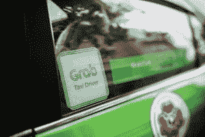

# 谷歌地图已经准备好改变超级应用的世界:一次深度潜水

> 原文：<https://skift.com/2019/04/16/google-maps-is-ready-to-transform-the-world-of-superapps-a-skift-deep-dive/?utm_source=wanqu.co&utm_campaign=Wanqu+Daily&utm_medium=website>

如果你生活在西方以及亚洲和非洲的部分地区，无论你去哪里，你都会带着谷歌地图(Google Maps)应用，把它塞在口袋里或者握在手中。它的用途确实很明确:需要开车、坐火车或步行去上班或其他地方？只要拿出谷歌地图，让它把你从 A 点带到 B 点和 c 点。

同样，如果你拥有一家餐馆、酒吧、水疗中心、美容用品店、旅游景点、活动场所或酒店，或者为这些行业提供服务，你会希望有一个谷歌企业名录，它可以让你进入谷歌地图应用程序进行发现。毕竟，谷歌母公司 Alphabet 的首席财务官露丝·波拉特(Ruth M. Porat)在 2018 年初的一次投资者会议上表示，考虑到谷歌地图上“我附近”的搜索量比上一年增长了 150%。

就像腾讯旗下的微信，中国的美团，以及东南亚的 Grab 一样，许多人都将拥有超过 10 亿用户的谷歌地图视为下一个无处不在、包罗万象的 superapp。换句话说，相对而言，superapp 可以做所有事情，或者几乎所有事情，并且不需要调用专业应用来执行特定任务。

需要你的芝加哥运输、优步或 Yelp 应用程序来查看你的火车是否晚点，预订拼车服务，或预订周六晚上的餐桌吗？不完全是。谷歌地图基本上涵盖了所有这些方面，甚至更多。

我们的报道发现，Alphabet 每年已经从谷歌地图中获得了数十亿美元的收入，这个数字对该公司的财务结果来说还不是很重要。尽管官员们表示，他们正在采取一种从容的方式来实现谷歌地图的货币化，这是 Alphabet 搜索业务的核心部分，但随着谷歌在谷歌地图内试验新的本地广告格式，收入正在以健康的速度增长。随着谷歌地图开始瞄准更多的垂直市场，唯一可能阻碍其成为无处不在的超级应用的可能是用户的移动行为和监管机构寻求拆分大型技术。

超级应用正在经历一个标志性的时刻，尽管主要是在亚洲。例如，微信应用程序在中国已经发展成为一个准操作系统，主导着信息和文件共享，其迷你程序——目前超过 100 万个——每天为 2 亿用户提供更广泛经济的门户，[几乎每个主要品牌](https://skift.com/2018/01/30/china-super-app-wechat-is-essential-for-travel-brands-breaking-into-the-market/)都有存在。

在新加坡的 Grab 出租车上使用微信应用程序接受电话采访时，中国数字机构 [Mailman Group](https://mailmangroup.com/) 的首席执行官安德鲁·柯林斯(Andrew Collins)表示，理解微信对中国消费者意味着什么的最佳方式是“如果不使用该产品，你真的走不了多远。如果你在八点钟起床，你将在八点零五分之前使用它。然后，你就可以在接下来的一天中每五分钟使用一次。”

同样在中国，美团应用程序争夺 superapp 的地位，因为它提供送餐、酒店预订、团购、电影票和无数其他服务，同时与竞争对手阿里巴巴对抗。

例如，美团宣布，在为期三天的假期中，4 月 6 日一天就有 200 万游客前往中国的各个旅游景点。最受欢迎的景点是上海的顾村公园，该公园处理了 4 万张门票，通常是在游客扫描入口处的二维码时。

[

<noscript></noscript>](https://skift.com/wp-content/uploads/2018/10/thumbnail-683dadd47a09319b3334bdff7d5dafea-e1539082494178.jpeg) 

A Grab taxi. Photo courtesy Bloomberg.

与此同时，东南亚的 Grab 有一个明确的 superapp 战略，该公司专注于在该地区的八个国家提供本地化服务。它提供你能想象到的各种交通方式，从出租车到自行车共享和 tuk-tuk 三轮车(仅限菲律宾、柬埔寨和缅甸)，以及食品、杂货和包裹递送、支付、小额贷款服务和汽车保险。在菲律宾，顾客甚至可以雇一名司机排队进入活动现场或进行一些个人购物。

[Grab 在 2018 年收购优步的东南亚业务](https://skift.com/2018/03/25/uber-is-said-to-reach-agreement-on-southeast-asian-sale-to-grab/)是一次战略变革。

Grab 驻新加坡的女发言人李京恬说:“所以我认为，在收购优步之前，我们会把自己更多地视为一家传统的拼车公司，比如 Lyft、优步或[滴滴、](https://www.didiglobal.com)滴滴，但在与优步合并之后，我们能够迅速转向我们所谓的 superapp 战略。”。“这就是我们使用 ridehailing 作为基础服务来发展其他垂直市场的地方。所以从 ridehailing，你可以做包裹递送，你可以做食品递送，你可以做杂货递送。与此同时，我想，这也给了我们双倍的带宽来发展金融服务，这在东南亚是一个巨大的市场。”

### 谷歌地图机会

那么谷歌地图应用呢？它是否也走上了成为必不可少的、无所不在的实用程序的道路，或者取得了 superapp 的地位？

谷歌理所当然地看到了协同工作的本地搜索和谷歌地图的巨大机会，但你不会听到 Alphabet 官员阐明谷歌地图的 superapp 战略。对谷歌来说，一些人认为它通常是一家工程驱动的公司，重点是缓解消费者的痛点。

谷歌地图产品副总裁 Dane Glasgow 告诉 Skift:“我们仍然非常关注帮助人们以最佳方式从一个地方到另一个地方的核心用户需求。”。“例如，去年 10 月，我们推出了一套新功能，帮助人们更好地计划、准备和导航他们的日常通勤。但我们也看到，我们的用户不仅仅是为了导航而使用谷歌地图。他们用它来探索周围的世界。为了满足这一需求，我们最近改进了我们的“探索”选项卡，并引入了一些新方法来帮助人们更容易地找到要做的事情和要吃饭的地方，无论他们在世界的哪个角落。”

关于谷歌地图战略的更多信息，请看下面我们对谷歌地图产品副总裁 Dane Glasgow 的电子邮件问答采访。]

在旅游和相关领域，通过谷歌地图应用，你现在可以搜索和预订酒店；查找旅游、景点和活动；获取步行和驾驶方向，以及早上通勤时的火车晚点通知；预订一个优步；[通过 OpenTable、Resy 或其他几十种服务预订餐厅](https://table.skift.com/2018/10/25/reservation-platforms-are-testing-google-integrations/)；让包括 DoorDash 在内的公司给你送肉丸帕尔马干酪。(机票预订是一个不同于面向我附近的任务的用例，在谷歌地图中只支持桌面。)

对于那些通过谷歌商务清单选择入住的企业，比如 SLS 拉斯维加斯酒店&赌场，用户现在可以给他们发信息，例如，找出酒店是否靠近拉斯维加斯大道，或者获得预订房间的最佳方式的信息。在这两种情况下，在一个周二的早上给酒店发了这样的问题后，我在三分钟内收到了回复，第二次是七分钟。然而，一个小问题是，酒店有一次用荷兰语回答了我，而不是我的母语英语。

但除了导航和旅行，谷歌地图应用也变得相当全面。通过它的“探索”标签，你手机上的谷歌地图应用程序提供了从杂货店和干洗到健康和保健、汽车经销商、电子产品和几十个其他类别的所有信息。

需要预约美甲或水疗吗？谷歌地图有当地按摩或水疗业务的概况，使你能够阅读评论和评级，给公司打电话，获取方向，或保存列表供进一步考虑。一个给你的标签可能会显示你初次约会的浪漫餐厅和酒吧，或者提供租赁服务的当地汽车经销商。您可以浏览您所在位置附近的顶级电子商店进行计算机检修，按相关性或距离排序，聚焦于您以前访问过的机构，或者过滤以仅查看当前营业的企业。

简而言之，尽管存在一些明显的漏洞，如点对点消息和支付选项——例如微信都有——谷歌地图有可能成为永不放弃的超级应用，因为它在学习消费者行为的同时，不断侵入消费者的日常习惯。

可以说，谷歌凭借其庞大的资源，包括计算能力、工程实力、对搜索习惯的控制和数据分析，似乎有足够的时间来增加和完善更多服务，为其日益普及的谷歌地图应用赢得市场份额，除非受到监管干预。

说到资源，谷歌地图在 2018 年上半年增加了 1.1 亿栋建筑，都是用算法绘制的。对于竞争对手来说，这是一个艰难的城市景观。

### 下一个 SuperApp 还是不是？

我们采访的各行各业的专家对谷歌地图是否已经是 superapp，或者正在成为 superapp 的路上，或者正在中国和东南亚扎根的全方位服务 superapp 模式是否会在西方奏效存在分歧。

然而，每个人都同意谷歌地图提供了大量的服务，并有潜力增加更多目前缺失的拼图。

携程旗下 Skyscanner 的产品副总裁特拉维斯·卡茨(Travis Katz)表示，谷歌地图应用程序正在“朝着 superapp 的方向发展”，它提供各种各样的服务，包括景点预订、餐厅预订和通过元搜索提供的酒店价格，但“还没有实现”

“移动领域的真正战斗是建立习惯和行为频率，”卡茨说，他补充说，谷歌正在走向 superapp 的地位，因为人们“一直”打开谷歌地图。

谷歌非常清楚其谷歌地图应用的潜在价值。

毕竟， [Think With Google 去年年底发现](https://www.thinkwithgoogle.com/consumer-insights/consumer-habits/)“84%的美国人在任何给定的时间都在购物，”这些使用手机购物的消费者中，有 90%在开始购买某件商品时不确定他们在寻找什么品牌。

“我一直觉得地图是我们拥有的巨大资产，”谷歌首席执行官桑德尔·皮帅在 7 月份的分析师电话会议上说。“我们真的专注于用户方面的事情，我们将继续这样做，因为增长非常非常快。所以我们看到了很大的上升空间。而且——但根据他们的经验——我们对它有了更好的理解，我们正在发展我们如何带来货币化体验的观点。所以这些都是朝着那个方向的步骤。但我们会慢慢来，我们会在这里继续发展。”

本地发现和移动设备使用的结合非常强大。皮查伊说:“对我们来说，本地移动搜索的增长速度快于移动搜索，仅去年一年就增长了近 50%。”“我们将继续投资建设有利于商家、用户和广告商的本地体验。”

皮查伊指出，谷歌正在测试新的广告形式，如谷歌地图中的推广地点和地点页面广告，作为探索“围绕地图的商业机会”的一种方式。

但是，尽管谷歌地图的商业化进程缓慢，Alphabet 可能已经从这个平台上赚了不少钱。虽然对于 Alphabet 来说，收入可能还不算实质性。

事实上，与搜索、Android、Google Play 和 YouTube 等平台一样，Alphabet 也将谷歌地图视为核心产品。当你看到第三方公司在他们自己的消费者网站上使用谷歌地图时，你就会意识到，自 2005 年推出谷歌地图应用程序接口(T1)以来，[谷歌一直在利用它赚钱。根据其定价表，在 200 美元的初始信用额度后，谷歌在第一个 10 万个电话中每 1000 次收费 7 美元，然后当数量达到 10 万到 50 万时，每 1000 次收费 5.6 美元。对于使用谷歌地图的企业来说，这些费用会很快增加。](https://cloud.google.com/maps-platform/pricing/sheet/)

例如，在优步上周发布的首次公开募股招股说明书中，该公司披露，在截至 2018 年 12 月 31 日的三年中，它向谷歌支付了 5800 万美元的地图服务费用，谷歌的母公司 Alphabet 是这家拼车公司的主要投资者。

“我们依赖某些第三方为我们的产品和服务提供软件，包括谷歌地图的地图功能，这对我们平台的功能至关重要，”优步写道。“我们不认为存在一种替代的地图解决方案，可以提供我们在所有运营市场中提供平台所需的全球功能。”

谷歌没有披露其来自谷歌地图的收入。但该公司确实表示，2018 年，谷歌 70.7%的谷歌部门收入来自谷歌资产，包括 Google.com、Gmail、Google Play、YouTube 和谷歌地图，尽管该公司没有披露谷歌地图的贡献。但是，正如皮查伊指出的那样，谷歌一直在慢慢享受美好时光，仍然没有以严格的方式在谷歌地图中推出更多广告。尽管谷歌地图中出现了本地搜索广告，但该公司并没有全力推进可能会干扰用户体验的额外商业化。

一位不愿透露姓名的分析师猜测，Alphabet 来自谷歌地图的广告收入——不包括来自谷歌地图 API 的类似分销的收入——在 2018 年可能为 30 亿至 40 亿美元，并在未来三年内每年增长 25%至 30%。

该分析师表示，谷歌地图正在从当地企业产生大量基于位置的广告，到 2021 年，谷歌地图广告的收入可能达到 80 亿美元左右。

无论是否是潜在的 superapp，新兴的谷歌地图商业模式与美团和 Grab 略有不同，美团和 Grab 运营着自己的许多业务。例如，美团依靠约 60 万名司机提供餐厅用餐和杂货配送、团购、酒店预订、电影票和其他本地服务。虽然谷歌在很大程度上是一家广告公司，依赖第三方来完成业务，但美团自己运营其中一些业务。

“我认为，如果谷歌是由运营微信或阿里巴巴的人来运营，他们会说‘让我们把所有这些东西的创收机会挑选出来，让他们自己来做’，”Skyscanner 的卡茨说。

中国黑龙江省的一名美团食品快递员。由 Imaginechina 提供

但是在广告和交易模式之间需要考虑权衡。广告可以是一项高利润的业务，没有电子商务通常具有的所有基础设施、客户支持要求和责任。谷歌经营着一项酒店元搜索业务，可以在谷歌地图上找到，但它不经营任何酒店，也不需要为拼车服务雇佣司机。另一方面，尽管交易模式可能引发更高的成本，但它也使公司能够控制整个客户体验，并可能涉及高交易量和更大的市场份额。

许多现有的和新兴的超级应用程序无疑将会发展，并以商业模式的混合为特征。

尤其是旅游业的一些人担心，谷歌会通过其航班和酒店价格比较业务，挑选并击败旅游业的竞争对手，其中许多都是谷歌的大型广告合作伙伴。

“我认为它将成为一个旅行超级应用，”旅游和活动公司 Viator 的创始人罗德·库斯伯特在提到谷歌地图时说。“这是不可避免的。它的航班和酒店，以及对交通选择的搜索都非常棒。”

库斯伯特是 Rome2Rio 的前首席执行官，该公司专门向消费者展示如何结合飞机、火车和渡轮等多种交通方式到达目的地。有趣的是，谷歌去年开始在谷歌地图应用中加入类似的“混合模式通勤”。

虽然谷歌地图应用程序可能会做得很好，因为它专注于导航等关键领域，包括人们的公共交通通勤，但它不一定会在其他领域做得一样好。你可以提出一个论点，例如，Foursquare、Yelp、SeatGuru 或你当地的交通应用程序可能有一些内容或功能比谷歌地图更适合特定的事情。

库斯伯特说:“专家可能会做得更全面，但普通大众可能无法分辨其中的差异。”。

为包括凯悦在内的酒店提供短信解决方案的 Zingle 公司的高级销售副总裁埃利斯·康诺利认为谷歌地图已经是“西方的超级应用”，并承认如果它能捕捉到企业和消费者之间更多的交流，它会更加强大。Zingle 的软件使其酒店客户能够在 Zingle 平台中处理消息，前提是此类消息在谷歌的企业名录中启用。

“我认为谷歌多年来一直在慢慢地做旅游方面的事情，”康诺利说。“他们拥有成为 superapp 的所有内容，可以将酒店与地图和零售联系起来。”

并非所有人都同意谷歌地图将成为超级应用，或者即使这些在亚洲表现如此出色的全能平台可以移植到西方。

Grab 的李京恬解释说，superapps 最初在中国和东南亚兴起是因为大多数人没有智能手机，而是使用内存较低的手机，无法灵活处理多个应用程序。她补充说，一个单独的应用程序，如中国的微信或东南亚的 Grab，更有意义。

“东南亚和中国的区别在于，东南亚是 11 个不同的国家，”Lee 说，并指出 Grab 目前在其中的 8 个国家开展业务。“这是不同的语言和不同的文化，所以我们必须超本地化或真正为每个市场量身定制服务。”

因此，Grab 应用程序在菲律宾、柬埔寨和缅甸提供嘟嘟三轮汽车，而在新加坡，用户可能会预订 40 个座位的公共汽车。印度尼西亚和泰国的 Grab 提供按需杂货配送，顾客可以雇人为他们排队的 GrabAssistant 目前只在菲律宾提供。

GrabBike 已经在越南和印度尼西亚上线运行，“但你在新加坡、泰国或菲律宾等地找不到它，”Lee 说。“所以它非常本地化。所以我们称自己为区域超级应用程序。”

Lee 说，Grab 计划在与一家中国供应商建立合资企业后，于明年推出医疗保健服务。

李并不认为 superapps 一定会翻译到西方。

“中国人的一个特点是他们喜欢杂乱的网站，”李开复说。“如果你去中国的任何一个网站，一个新闻网站，都是满满的文字。但对西方观众来说，这是丑陋的。对吗？但那还是老样子。这一点没有改变。所以我认为用户行为很难改变，而且根深蒂固。如果你看看澳大利亚，情况也是如此，在那里，金融科技还没有流行起来，因为信用卡太普遍了。所以我认为在你的手机上安装多个应用程序并使用它们来提供不同服务的概念，比如 DoorDash 的食物，Uber 的外卖，我认为这是如此根深蒂固。我真的不认为这种情况会改变。”

今年 7 月，谷歌披露，谷歌地图增长最快的市场是印度尼西亚、印度和尼日利亚，每个国家的用户年增长率都超过了 50%。

Lee 说，Grab 在该地区没有感受到谷歌地图的任何压力，事实上，这两家公司是合作伙伴，所以你可以从谷歌地图上预订 Grab。

“谷歌地图是一个完全不同的命题，”李说。“我们与谷歌合作。他们是很好的搭档。我们实际上并不认为他们是竞争对手。因为人们将谷歌地图作为应用程序打开的原因与人们打开 Grab 应用程序的原因截然不同。”

Mailman Group 的 Andrew Collins 是另一个对超级应用转化为西方行为的怀疑者，他指出，例如，当考虑中国和美国时，消费者的期望是如此不同。

“在中国，每个人都在这些更大的生态系统中掷骰子，”柯林斯说。“人们对你想从产品中得到的东西有着如此不同的期望。”

柯林斯认为，就巨大的消费市场而言，趋同是中国压倒一切的趋势。“与西方相反，中国有一种趋同的趋势，”柯林斯说。“这就是它进化的地方。在中国，你有球棒。主导格局的百度、阿里巴巴和腾讯生态系统。如今用于任何大众消费的任何产品都属于这三家公司中的一家。”

*一名消费者使用微信钱包扫描二维码。*

关于腾讯微信的力量和影响力，柯林斯指出了中国自行车共享公司摩拜单车，该公司有一个受欢迎的独立应用程序，并成为微信小程序的早期采用者。

“他们有一个独立的应用程序，非常受欢迎，”柯林斯说，他指的是摩拜单车。“大家都用过。你说的是上亿人。当他们在微信系统中推出他们的迷你程序来取代他们的另一个应用程序——或者提供一种替代——时，这个程序成为访问这些自行车的主导应用程序。它实际上离开了单机 app，主 app，大家都去微信小程序 app 做了。”

### 平台趋势

成为一个全方位服务的平台或应用程序，无论是在旅游领域还是在 it 领域之外，肯定会成为一些品牌的雄心，如果不是一种趋势的话。这种方式的最新倡导者之一是总部位于马来西亚的亚洲航空公司，它已经提供航班、活动、签证、旅游保险和其他服务，并发誓要成为一家提供全面服务的在线旅行社。通过其应用程序，该航空公司还可以提供来自竞争对手航空公司的航班、通过 Expedia 合作关系提供的酒店以及物流服务，以开始其雄心勃勃的愿景。

亚航能否实现目标是另一回事，亚航首席执行官托尼·费尔南德斯承认，结果将取决于该公司的执行质量。

已经提供了一整套社交分享、新闻和广告服务的脸书，正计划增加其 WhatsApp 和脸书消息服务以及 Instagram 和脸书平台的整合，以成为更多的点对点私人消息平台。[与微信](https://www.theverge.com/2019/3/8/18256226/facebook-wechat-messaging-zuckerberg-strategy)的比较已经流传开来，但还不清楚改造后的脸书将走向何方。

然而，根据 Mailman Group 的 Andrew Collins 的说法，与微信的比较只能到此为止。“我会告诉你，我总是和其他美国人辩论，特别是关于 WhatsApp，”柯林斯说。“他们大肆宣扬 WhatsApp 有多好。它是如此糟糕的产品。很慢。往往不靠谱。它的功能非常有限。微信还有很多其他更丰富的元素，让你可以做更多的事情。”

此外，还有一些成熟的在线旅行社，如中国的携程旅行网(Ctrip)和总部位于华盛顿的 Expedia，它们提供全方位的旅游服务，包括航班、住宿、铁路、汽车租赁、包价度假、旅游和活动、邮轮和旅游保险。携程、猫途鹰和 Booking Holdings 提供餐饮和预订服务，并有可能扩大业务范围。

### 谷歌的看法是

虽然一些应用程序，如东南亚的 Grab，直截了当地谈论他们的 superapp 战略，但谷歌并没有以这种方式讨论自己的使命。相反，谷歌认为自己专注于为用户解决巨大而复杂的问题。尽管 Alphabet 的市值约为 8330 亿美元，并且知道如何将网页或小屏幕上的几乎每一个栏目商业化，但该公司在许多方面仍然是工程驱动的，因为它部署了庞大而复杂的技术资源，“组织世界上的信息，使其普遍可用和有用，”正如 Alphabet 首席财务官波拉特去年对该公司使命的描述。

在解决问题方面，考虑一下谷歌地图在过去一年左右推出或测试的一些举措。

使用谷歌地图或其他导航解决方案寻找步行路线时，最棘手的问题之一是弄清楚用户的确切位置以及开始步行的方向。尤其是在城市地区，GPS 数据的准确性会被建筑物反射的信号扭曲。

使用视觉定位服务、街景、机器学习和增强现实的组合，[谷歌地图应用程序正在测试在蓝点上覆盖大箭头，这些蓝点绘制了前往所需目的地的步行方向](https://ai.googleblog.com/2019/02/using-global-localization-to-improve.html)，如博物馆或餐馆。箭头清楚地告诉用户从哪个方向开始行走。

公共交通信息是谷歌地图的一个重点，去年 10 月，通勤标签开始提供替代路线和关于延误和其他阻碍按时上班或回家的通知。用户可以个性化“通勤”选项卡，指定交通模式、一天中的时间以及他们是否希望收到关于延误和中断的通知。

谷歌从其历史地图数据中发现，北美通勤者平均每月相当于一整天的通勤时间；25 个北美城市的通勤者告诉谷歌，当事情出错时，他们在高峰时间的通勤时间可能比预期长 60%。因此，缓解这个问题的痛苦是谷歌地图应用背后的大脑的首要任务。

在通勤过程中，无论是在汽车、公共交通还是步行，谷歌地图现在都可以访问 Spotify、Apple Music 和 Google Play 音乐，因此消费者不必打开新的应用程序来听 Billie Eilish 或观看他们最喜欢的播客。

谷歌地图应用程序中经过改进的“探索”标签不仅显示餐饮地点，还有景点和活动，有时还会弹出一个美食列表，突出显示知情人正在参观的最时尚的餐厅。

当然，个性化是关键，一个名为“看你的匹配”的餐馆评级功能会向你抛出一个百分比，根据你之前对餐馆的评级计算出你喜欢这家餐馆的可能性是 70%还是 30%。

当然，从谷歌地图应用程序订购食品交付甚至从餐馆预购也有很多选择。

对于位于曼哈顿公园大道南的汉堡店 Big Daddy's 餐厅，顾客可以通过谷歌地图应用程序使用 OpenTable 进行预订，也可以选择预订外卖或餐厅内用餐。据 Allset 首席执行官斯塔斯·马特维延科称，这项服务来自于已经与谷歌地图整合的 [Allset，](https://allsetnow.com/)。

Matviyenko 说，使用该功能的顾客需要提前付款，餐厅员工通常会在预计到达前五分钟左右开始处理他们的订单。客户可以使用主要的信用卡、Google Pay 或 Apple Pay 支付服务费用，但必须在谷歌地图应用程序体验之外导航才能完成订单。

他说，这项服务在美国 11 个城市的约 2000 家餐厅提供。

### 这是一张地图

谷歌地图应用程序当然具备推行 superapp 战略的所有要素，其广泛的服务，从导航和餐馆，到酒店和购物，可以让消费者从黎明到黄昏不停地购物。

而且，谷歌地图应用程序无疑是谷歌的一个巨大的赚钱机器，因为它将地图分发给第三方，并慢慢开始通过图钉、位置和服务将更多的地图房地产货币化。

但是一个内在的限制，尽管机会巨大，却是谷歌地图是基于地图和位置的。它主要是关于“在我附近”的发现和服务，或者从这里到那里。例如，航班搜索尚未成为谷歌地图应用的一部分，这并不意外，因为除非你在机场，否则当你试图确定从纽约飞往伦敦的航班时，你可能不需要总是查阅地图。尽管有时如果用户不熟悉地理，地图确实会有用。

在这方面，有太多的服务不是从地图上起飞的理想位置。谷歌地图应用会像 Grab 应用一样支持小额贷款服务吗？房主保险呢？消费者不会想到求助于谷歌地图上的这些服务，除非他们在提供这种商务的零售店附近。

虽然中国或菲律宾的消费者可能会期待并喜欢一款几乎可以为他们做任何事情的应用程序，但西方消费者是否在寻找一款类似的全能应用程序仍有争议——特别是在一些地方对大型科技公司有强烈反对意见的时候。由于手机屏幕相对较小，并且由于 superapp 必须分散注意力，专业应用程序可能会更加丰富，因此 superapp 可能不会有普遍的吸引力。

但这不会阻止谷歌从一个精致的工具中赚到大量的钱，这个工具的吸引力和便利性会让人养成习惯，而且可能难以抗拒。

另一方面，地图公司 Rand McNally 的前数字战略和业务发展总经理 John Peters 认为，谷歌地图已经是人们生活中不可或缺的一部分。

“我确实认为它已经是一个 superapp，”Peters 说，并补充说 Rand McNally 的地图绘制计划主要集中在卡车司机、休闲车和危险物质位置等方面。“如果谷歌地图明天就消失了，我认为会出现无政府状态，”彼得斯说。

彼得斯说，谷歌地图让生活“更容易”和“压力更小”，给用户一个关于交通困境的提示，或者通知他们商店是开门还是关门。

“谷歌地图已经成为超级应用的另一个标志是人们使用它的频率，”彼得斯说彼得斯说:“如果你一天需要两次或更多，它就像牙刷一样重要。”。

彼得斯称其为第三方公司广泛使用谷歌地图的“事实上的标准”，并对其“前端的简单性与难以置信的复杂后端相结合”感到惊叹

Alphabet 认为谷歌地图是一项巨大的资产，也是该公司的核心搜索产品，尽管官员们强调，在测试各种新的广告形式时，他们正在采取一种审慎的方法来实现额外的货币化。

“这是谷歌，所以不要认为他们没有从这些数据中受益，”彼得斯说。

* * *

### 谷歌地图产品副总裁 Dane Glasgow 的问答

你能告诉我你在构建谷歌地图方面的理念吗？你打算让它成为一个超级应用程序，让消费者可以做任何事情，还是你的视野仅限于人们在地图上自然会做的功能？你对谷歌地图的关注点是什么？

Dane Glasgow: 每当开发新产品时，我们总是问自己这样一个问题:“这如何帮助人们完成工作？”我们定期听取用户的意见——无论是在我们的 UX 研究中，在社交媒体上，还是从我们充满激情的当地导游社区——从这些对话中，我们能够确定谷歌地图在解决日常问题方面可以发挥最大影响的地方。

我们仍然致力于帮助人们以最好的方式从一个地方到另一个地方的核心用户需求。例如，去年 10 月，我们推出了一套新功能，帮助人们更好地计划、准备和导航他们的日常通勤。但我们也看到，我们的用户不仅仅是为了导航而使用谷歌地图。他们用它来探索周围的世界。为了满足这一需求，我们最近改进了“探索”选项卡，并引入了一些新方法来帮助人们更容易地找到要做的事情和要吃饭的地方，无论他们在世界的哪个角落。

你是如何考虑在谷歌地图上连接用户和企业的？

格拉斯哥:这是一个很好的问题。从消费者的角度来看，我们专注于帮助人们更快、更明智地决定访问哪个企业，并最终帮助他们完成他们开始的任何旅程或任务。我们的企业简介显示了各种有用的信息，从您期望看到的基本信息(如企业名称、地址、网站和电话号码)到重要的细节，如一个地方何时最拥挤或在任何给定时间排队有多长。另一个很好的例子是你的匹配，这是一个数字分数，显示你根据自己独特的口味和偏好喜欢某个特定餐厅的可能性，因此你可以迅速决定去哪里。

为了帮助商家接触更多的客户，他们可以使用谷歌我的业务，这是一个免费的工具，可以管理他们在搜索和地图上的在线存在。他们可以编辑自己的业务信息，发布帖子以推广特殊活动或优惠，并回复评论。他们甚至可以直接从 Google My Business 应用程序向客户发送信息。

看来你已经采取了一种深思熟虑的方式在谷歌地图中添加广告。然而，有没有其他人们可能不知道的谷歌地图赚钱的方法？

**格拉斯哥:**自从我们推出谷歌地图 API(现在的谷歌地图平台)并在地图中引入本地搜索广告以来，谷歌地图一直是一个货币化的产品。我们一直在寻找展示优秀企业和品牌的方式，以增强用户的整体体验。

*斯基夫特的艾萨克·凯里在这个故事中为排行榜做出了贡献。高级设计师陈平设计了照片插图和图表。*