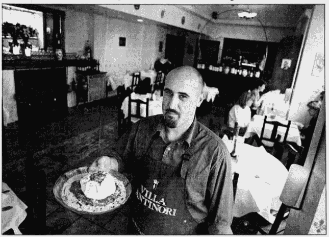
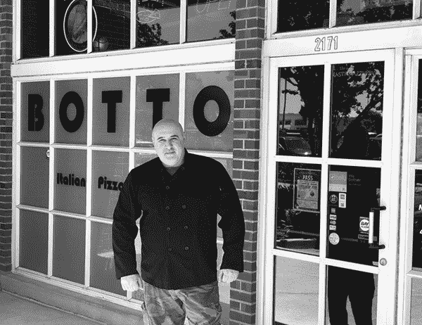
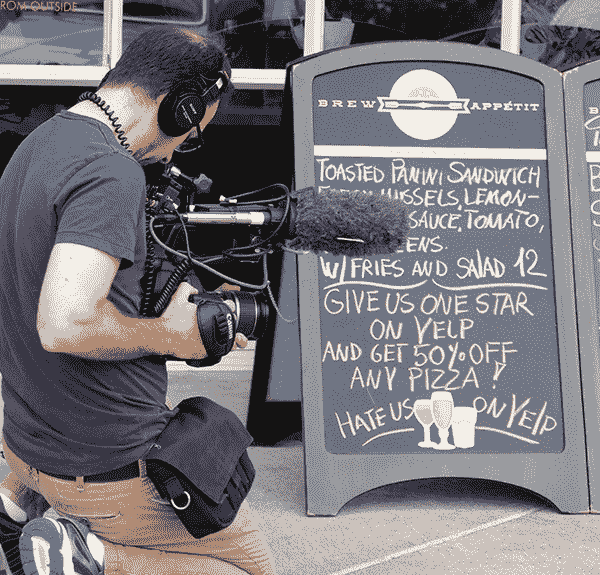
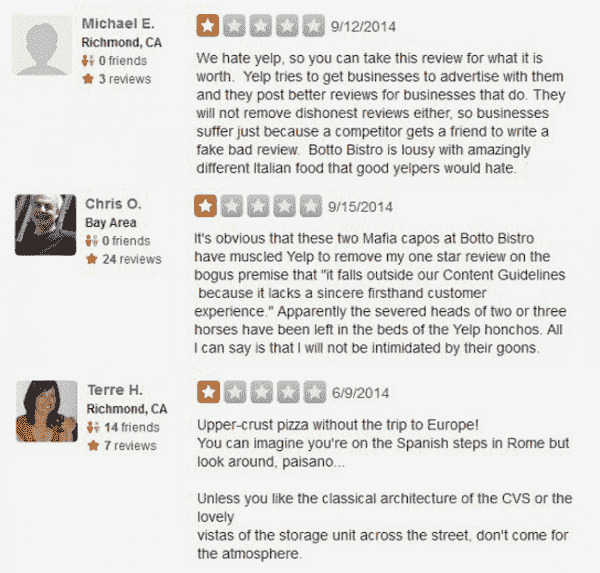
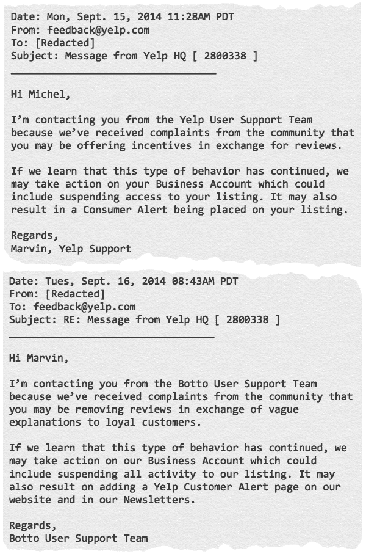
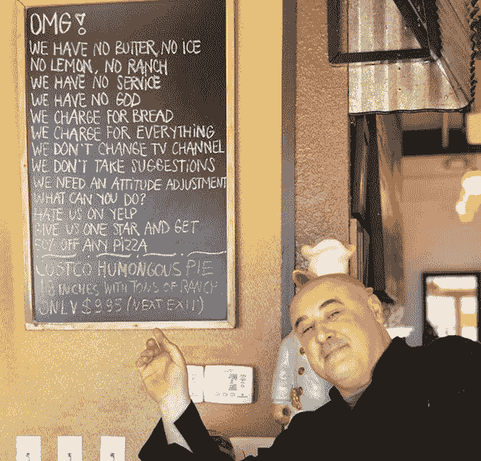

# 餐馆老板要求 1 星 Yelp 评论-骗局

> 原文：<https://thehustle.co/botto-bistro-1-star-yelp/?utm_source=wanqu.co&utm_campaign=Wanqu+Daily&utm_medium=website>

2014 年，厨师 Davide Cerretini 宣传了一个将永远改变他命运的特价商品:任何人在 Yelp 上给自己的餐厅一星评价，就可以享受披萨七五折优惠。

他在海湾地区的意大利餐馆 Botto Bistro 正处于十字路口。像许多小企业一样，它受制于在线评论者的突发奇想，这些评论者的公开报道可能成就也可能毁掉它的声誉。

他受够了:是时候从“夜行者冰冷肮脏的手中”撬起星星，掌握自己的命运了。

但此举将使 Cerretini 处于 Yelp 和心怀不满的企业主之间长期斗争的中心——这场斗争包括“勒索”、评论操纵和掠夺性广告策略的呼声。

## **一个年轻厨师的旅程**

Cerretini 出生于意大利 Collemontanino 的葡萄园经营者家庭，从小就享受烹饪的乐趣——家常菜、纯食材和简单的菜肴。

90 年代中期，他移民到美国，试图涉足餐饮业。

在幕后厨房辛苦工作多年后，他和一个合伙人在加州索萨利托开了他的第一家餐馆 Cacciucco Cucina Toscana。凭借其合群的个性和“意大利魅力”，Cerretini 成为了社区的常客，并与忠诚的客户建立了牢固的关系。生意蒸蒸日上。

<noscript></noscript>

*A young Cerretini takes a drink with his grandfather in Italy (via Davide Cerretini)*

然后，经济衰退来袭。

到 2008 年底，Cerretini 失去了一切，并被迫卖掉他的餐馆以获得一小笔现金。“我以为一切都结束了，”他说。"然后，我在加利福尼亚的里士满找到了这个小地方."

这个新地点正是他想要的一切:便宜，靠近他的忠实顾客，最重要的是，朴实无华。他称之为 Botto Bistro。

## **Botto goes digital**

作为一名餐馆老板，Cerretini 是 Yelp 的早期用户。

PayPal 前雇员杰里米·斯托佩尔曼于 2004 年推出了该平台的用户提交的[五星评级系统](https://www.youtube.com/watch?v=RPRDZgYSZ_c)，该系统迅速成为每个小企业在线足迹的一个组成部分。正如 Cerretini 所知道的，一家餐馆的评级仅仅半星的差异就能使高峰时段的客流量增加 19%之多。

Botto Bistro 在 2009 年开业时，Yelp 以每月约 2600 万独立访客而自豪。不管是有意还是无意，这个平台已经牢牢地控制了每个小企业的网络声誉和命运。

<noscript></noscript>

*Cerretini in his early restauranting days (Craig Lee / San Francisco Examiner)*

在 Botto Bistro 盛大开业后的几个月里，Cerretini 开始接到 Yelp 销售人员打来的几十个电话，恳求他购买广告。

根据 Cerretini 的说法，当他拒绝这些提议时，他经常会注意到新发布的五星评论会从他的页面上删除——通常在与 Yelp 代表通完电话后不到 24 小时。

“我来自意大利，非常了解黑手党勒索的样子，”他说。“Yelp 操纵评论，希望我支付保护费。我来美国工作了 25 年，不是为了被硅谷的某个傻逼敲诈。”

面对起伏不定的星级评定，塞雷尼采取了一种不正当的手段。

“我给自己写了 5 星评价，”他承认道。“我不是什么好人。我写的是假的来代替他们去掉的真的。

Yelp 发言人与 The Hustle 分享的记录更全面地讲述了 Cerretini 的行为。

在别名“Babghanoush I”下，Cerretini 发布了 13 条对 Botto Bistro 的虚假正面评论，以及对邻近餐馆的虚假批评——有时甚至贬低其他老板。

Yelp 拒绝了 Cerretini 的勒索指控，而是将积极的 Botto Bistro 评论的删除归因于该平台的算法，该算法根据一些标准(不公开)定期过滤评论。这些“过滤”的评论对客户仍然可见，但不会计入企业的总体星级。

<noscript></noscript>

*Cerretini poses in front of his Richmond, California restaurant (via Davide Cerretini)*

最终，Cerretini 让步了，每月花 270 美元在 Yelp 上做广告。但 6 个月后，他发现这项服务“没用”，就取消了。他的星级又一次直线下降。

2014 年春天，在拒绝了另一名 Yelp 销售人员后，Cerretini 声称，他的页面上过滤了四个 5 星评论，三个 1 星评论突然被弹射到页面顶部。对于厨师来说，这是最后一根稻草。

Cerretini 说:“那些一星的评价来自那些从来没有来过我的餐馆的人。“有人抱怨我们的服务员……我们甚至没有服务员！”

Cerretini 开始意识到 Yelp“完全控制了(他的)声誉。”经过深思熟虑，他决定是时候采取更极端的措施了。

## **好饭？在 Yelp 上给我们留一颗星吧！**

当时，塞雷尼以刻薄著称。

与埃德塞尔·福特·方(Edsel Ford Fong)一样(他在 20 世纪 60 年代因“世界上最粗鲁的服务员”而闻名)，他对食客无礼的态度是他吸引力的一部分。

他维持着一个以滑稽的 Yelp 精英(或“乡村白痴”)为特色的耻辱堂。他收集了一些愚蠢的顾客询问(例如，“你们卖汉堡吗？”)并发出了“本月最愚蠢问题”的简讯。他在自己的网站上发布了一个[常见问题解答](http://www.bottobistro.com/FAQ.html),声明顾客事实上并不总是对的。

对忠诚的食客来说，大卫就是大卫；对于短暂的 Yelpers，这是一星级服务。

很快，他恍然大悟:“如果我一点也不在乎名声呢？如果我通过让事情变得更糟来剥夺他们的权力呢？”

2014 年 9 月的一天早上，他在 Botto Bistro 前放了一个简单的标志:*在 Yelp 上给我们一星评价，任何披萨都可以享受 25%的折扣！在 Yelp 上恨我们。*(后来折扣提高到了 5 折。)

<noscript></noscript>

*A news producer films Botto Bistro’s ad in 2014 (via Davide Cerretini)*

“我知道 Yelp 的人会恨我，但这正是我想要的，”Cerretini 说。“反正我也不想让他们在那里。”

他的抗议来得正是时候。几天前，美国第九巡回上诉法院[裁定【Yelp 有权操纵评论，其广告策略是一种“硬讨价还价”——而不是敲诈。](https://www.businessinsider.com/court-rules-yelp-can-manipulate-reviews-2014-9)

小企业主怒不可遏，他们正在寻找一个治安英雄。

## **“价格公道的美味佳肴。一星。”**

第二天早上，Cerretini 把车开进了他的停车场，迎接他的是一大群记者、餐馆老板和支持者。他们都想知道同样的事情:*不在乎评论是什么感觉？*

那个星期五，Cerretini 做的生意比他通常一整个月做的都多。

“我不得不向餐饮业寻求帮助，额外的比萨饼面团，”他笑着说。“这是一个绝对的疯人院。我从未见过这样的事情。”

大多数支持者拒绝接受折扣，但很兴奋地写了一篇评论，并参与了他们认为是草根的反 Yelp 起义。

几天之内，Botto Bistro 的 Yelp 页面吸引了超过 2，300 个一星评级(占其总评论的 95%)，称赞其美食、适当的服务和乡村氛围。“Botto Bistro 糟透了，”一位评论家写道。“价格公道的美味佳肴。一星。”

这让这家餐厅赢得了 Yelp 上最差餐厅的称号。

<noscript></noscript>

*Botto Bistro attracted more than 2,300 1-star reviews (Botto Bistro Yelp page, via Wayback Machine)*

“我一天收到成千上万封信，成千上万封电子邮件，”Cerretini 说。“人们寄给我一盒盒巧克力、现金和支票。全国各地的企业主都过来感谢我，写差评。”

Yelp 对 Cerretini 的新名声不太满意。

这位厨师很快就收到了一封来自 Yelp 支持成员的威胁邮件，声称他正在用评论换取“奖励”(比萨饼的折扣)——这显然违反了该平台的服务条款。Cerretini 用嘲讽的语言回复，然后在社交媒体上公开发布了这两封邮件，进一步激起了他的追随者的仇恨。

<noscript></noscript>

*Emails between Yelp and Cerretini, edited for brevity (via Davide Cerretini)*

随着媒体的继续，Cerretini 将自己定位为反 Yelp 的发言人。

“这不是关于折扣，或比萨饼，甚至评论，”他说。“这是关于公众说够了。他们不再想被 Yelpers 的废话包围。"

## **起义**

Cerretini 不是唯一一个对这种情绪采取行动的人。

为了规避在线评论的“压迫”，企业主们在他们的窗户上挂上了“禁止叫喊”的标志，T2 在 Instagram 上羞辱了粗鲁的评论者，并推出了 T4 的反叫喊网站。

丹·内维斯(Dan Neves)是得克萨斯州奥斯丁一家高级餐厅的服务员，他创建了一个名为“YELP BULLIES EXPOSED”的脸书私人组织，该组织追踪粗鲁的 YELP，并向他们发送一袋从 poopsenders.com 的 T2 采购的一磅重的动物粪便。在一个多月的时间里，这个小组已经吸引了 278 名成员。

“我有朋友因为糟糕的 Yelp 评论而被解雇，即使评论是不真实的，”Neves 说。“如果你让某人丢了工作，我至少可以给你寄一磅屎……大象屎、犀牛屎、狗屎——任何我能弄到的其他类型的屎。”

虽然企业主说 Yelp 是一个通过操纵明星收视率来敲诈他们的"[黑手党](https://www.facebook.com/groups/265587273598721/?ref=bookmarks)"，但 Yelp 对“边缘评论员”抛出的“阴谋论”不予理会。

几周前，随着人们期待已久的纪录片《十亿美元恶霸 》的上映，这个传奇故事公开上演了。作为对这部电影的回应，Yelp 购买了 billiondollarbully.com，并将其定向到一个登陆页面([yelp.com/extortion](https://www.yelp.com/extortion))，断然否认了这一说法。

<noscript></noscript>

*Cerretini poses with a list of Botto Bistro’s rules (via Davide Cerretini)*

我们采访的 Yelp 发言人表示，勒索指控实际上只是对 Yelp 的[推荐软件](https://www.yelp-support.com/article/What-is-Yelp-s-recommendation-software?l=en_US)如何工作的一种“误解”。为了支持这种说法，该公司经常指出，每一起针对他们的[集体诉讼](https://www.wired.com/2015/11/people-keep-suing-yelp-over-its-reviews-and-keep-losing/)和 FTC 调查都被判有利或撤销。

真相可能介于两者之间。不可否认，Yelp 的销售策略非常激进(根据收益报告，其 85%的广告收入来自小企业)，并且平台上的评论确实经常波动。

尽管有来自企业主的大量轶事证据，但如果 Yelp 的过滤算法不透明，这两件事之间的联系最终无法得到证明。

## **一星厨师**

如今，Cerretini 已经从他的一星知名度中打造出了一份职业:他参加私人烹饪课程和活动，每次费用高达 3000 美元。

在他的新闻发布会之后，他成了餐馆界的名人——一个与科技巨人对抗并获得自我授权的大卫。

“我是唯一一个在他们自己的游戏中打败他们的人，”他说。“我给那家公司留下了污点。我钓了他们。我羞辱了他们。现在，他们像躲瘟疫一样躲着我。”

Yelp 说 Cerretini 给了自己太多的信任。Botto Bistro 是包含 1.85 亿条评论的生态系统中的一个原子粒子。该公司的一名成员称这种挑衅行为是一种宣传噱头，对平台运营的影响微不足道。

但厨师仍然享有豁免权:有时，他会改变营业时间，或将 Botto Bistro 改名为“世界上最糟糕的中国菜”

“大多数人不准备停止关心评论——这是一个很大的风险，”他说。"但是我宁愿一个人坐在我的餐馆里，然后从 Yelpers 那里得到生意."

## 获取你将在收件箱中实际阅读的 5 分钟综述

5 分钟或更短时间内发布商业和科技新闻