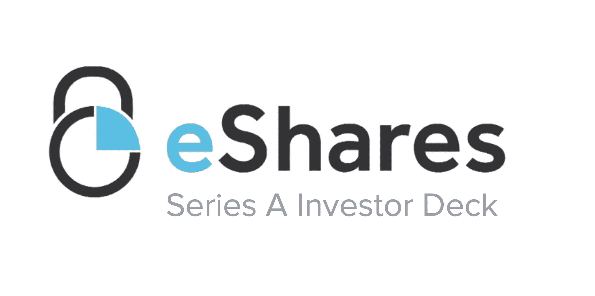

# 我们如何提出我们的系列 A | Carta

> 原文：<https://carta.com/blog/carta-series-a/?utm_source=wanqu.co&utm_campaign=Wanqu+Daily&utm_medium=website>

很抱歉这个博客晚了 6 个月。但我还是会分享它，希望它能帮助目前正在筹集 a 轮融资的创业者。

去年 11 月 [Carta](/) (前身为 eShares)完成了一笔 700 万美元的 a 轮融资。下面是我们过去常常这么做的平台，以及我们在这个过程中学到的一些经验。

### 下载我们的 A 系列幻灯片

以下是五条经验教训(特别是对 fintech 创业公司)。

## TL；速度三角形定位法(dead reckoning)

1.  筹款是一项过滤活动，而不是人气竞赛。

2.  如果你是一家金融科技初创公司，去东方吧！

3.  寻求反馈，而不是“市场规模不够大”

4.  避开要求单位经济学的风投。

5.  成功比失败更难。

## 1.筹款是一项过滤活动，而不是人气竞赛。

我可以在与投资者会面的 5 分钟内判断出他们是否会投资。在我们见面之前，投资者对《卡塔》感到兴奋。他们要么看到了幻象，喜欢它。或者他们没有。

大多数人没有，但还是遇到了我。他们整个会议都希望我能说服他们 Carta 是个好主意。我从来没有。

兴奋的投资者(和投资的人)是不同的。他们不让我投球。相反，他们通过提问来评估风险。他们试图找到不投资的理由。这就是音高悖论。不愿投资的投资人会问你为什么要投资。愿意投资的投资者会问你他们为什么不应该投资。你的工作是确保你没有他们不应该有的理由。

筹资很简单:找到对你的公司感兴趣的投资者。这是一个过滤练习。太多的创始人认为他们有错误的定位，而不是意识到他们有错误的观众。关于这一点…

## 2.金融科技公司——向东走！

我们与硅谷风投的合作是 21 比 0。我从未接近过。大多数大公司都不会见面。有些人让同事打 Skype 电话，尽管我们相距 20 分钟。

在 SV 开了 21 次会后，我去了东海岸，见了 3 个基金。三个都投了。

按照硅谷的标准，我们是一家奇怪的公司。我们在小市场建立网络垄断，作为进入其他市场的大本营(彼得·泰尔方法，与大多数风险投资的策略相反)。有人称之为“土地和扩张”,我们计划一次又一次地这样做。

一个投资人告诉我，“我不喜欢有阶段的公司。”另一个人说，“我们喜欢能让我们看到 1B 收入的想法(如数据库)。”

我们的公司文化也被证明是不匹配的。在我们的推介中，我们对我们的战略非常开放:

*“我们永远不会‘赌公司’Carta 对我们的客户有太多的责任。我们永远不会消失。我们将始终优先保护不利因素，而不是最大化有利因素。"*

这并不符合大多数风险投资的“骑墙”策略。

东海岸的一切都变了。没有人问市场规模(这是硅谷的普遍反对意见)、定价(风投希望 SaaS 定价，而不是交易定价)或愿景。投资者不会指出漏洞，而是会说“然后你可以做 X！”“这将解决一个巨大的问题！”

我在东西海岸发表了同样的演说。不同之处在于观众。东海岸投资者似乎更喜欢金融科技。

我说过，筹款就是牵线搭桥。你必须找到合适的观众。如果你在金融科技行业，往东走。(除非你在付款。PayPal 已经为你铺平了道路。)

## 3.寻求反馈，而不是“市场不够大”

许多风投会以“市场不够大”来搪塞过去这是一个简单的解释，因为它(1)没有侮辱创始人或企业，(2)足够抽象，不容争辩，以及(3)把投资者描绘成只做“真正大”事情的人。

完全没有帮助。市场规模完全不受创始人的控制。这对初创公司面临的挑战没有影响。投资者对市场规模的判断通常是错误的。最好的公司创造新的市场，顾名思义，这些市场起初看起来很小(或者不存在)。

在你结束一次会议之前，试着获得至少一条有用的反馈。在我们的种子期，一位天使投资人解释说，“我不认为你能说服律师事务所接受 Carta。”当时，我们卖给律师事务所，没有人买。他的反馈促使我们改变销售策略，直接向公司销售。这导致律师事务所接受 Carta，因为他们的客户也在推动他们。这一评论改变了我们的业务。虽然他从未投资 Carta，但我们欠他一份情。

如果你得到一个“市场规模”的解释，请投资者提供更多有用的反馈。

## 4.小心那些要求单位经济学的投资者

在融资时，我遇到了许多伪装成早期投资者的成长期投资者。你会知道，因为他们问你“单位经济学”或金融模型。

我曾经试图解释说，20 美元的股票是进入更大市场的起点。从来没成功过。事后看来，我应该说，“我们现在考虑这些事情还为时过早，对你来说可能也为时过早。但我很乐意在我们更进一步的时候再谈。”

除非你的业务适合电子表格，否则避开那些认为你应该避开的投资者。

## 5.成功比失败更难

Carta 的两届创始人兼产品负责人乔希·梅里尔经常说，“成功比失败更难。”他是对的。筹款失败太糟糕了。但是在抑郁和自我反省之后，你收拾残局，继续你的下一件事。我上一家公司倒闭了。它让我遇见了马努·库马尔并创立了卡塔。事后看来，失败从来没有看起来那么糟糕。

然而，成功并没有带来解脱。恰恰相反。问题越来越难，风险也越来越高。在 Carta，我们没有庆祝我们的[系列 A](#jumpto) 。而是谈到了 10 倍返还的责任。然后我们继续工作。

在 Carta，我们帮助初创公司进行融资、薪酬、估值、股权管理等等。 [**与我们**](/requestdemo/) **交谈，了解我们如何帮助您成长。**

披露: 本通信代表 eShares Inc .，d/b/a Carta Inc .(“Carta”)。此信息仅供参考，仅包含一般信息。Carta 不会通过这种通信方式提供会计、商业、金融、投资、法律、税务或其他专业建议或服务。本出版物不能替代此类专业建议或服务，也不应用作任何可能影响您的业务或利益的决策或行动的依据。在做出任何可能影响您的业务或利益的决定或采取任何可能影响您的业务或利益的行动之前，您应该咨询合格的专业顾问。T 他的通信无意作为购买或出售任何证券的建议、要约或邀约。Carta 对依赖此处提供的信息不承担任何责任。2015–21 eShares，Inc. d/b/a Carta，Inc .(简称“Carta”)。保留所有权利。禁止复制。