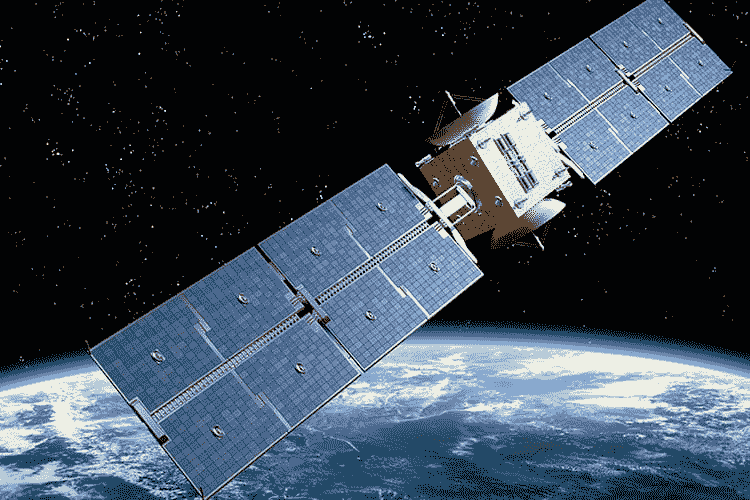

# 对冲基金如何利用卫星图像击败华尔街和主街|哈斯新闻|伯克利哈斯

> 原文：<http://newsroom.haas.berkeley.edu/how-hedge-funds-use-satellite-images-to-beat-wall-street-and-main-street/?utm_source=wanqu.co&utm_campaign=Wanqu+Daily&utm_medium=website>

伯克利哈斯研究发现资本市场“另类数据”的兴起可能有其黑暗的一面

而 Assoc。Panos Patatoukas 教授去年在他的财务信息分析课程中讨论沃尔玛时，一名学生提到了公司创始人萨姆·沃尔顿过去如何在商店停车场清点汽车以衡量销售情况的故事。

Patatoukas 知道，通过分析零售商停车场的卫星图像，老练的投资者已经开始大规模地这样做了，他开始想知道这给了他们多大的优势。因此，他给开创卫星图像汽车计数的公司打电话，向首席执行官提出让一名学者分析数据的想法。在费舍尔商业分析中心 资金的帮助下，他在美国 44 家主要零售商(包括沃尔玛)的 67，000 家个体商店中获得了 480 万张停车场图像。

*Berkeley Haas Assoc. Prof. Panos Patatoukas*

Patatoukas 和 [Assoc 的分析结果。佐尔特·考托瑙教授](https://haas.berkeley.edu/faculty/katona-zsolt/)——第一个详细量化基于停车场交通卫星图像的交易优势的人——发现这种策略确实可以为足够精明的投资者带来显著的推动。交易者可以根据停车场的交易量准确预测收益消息，并获得比典型基准回报高得多的收益。

“信息优势在季度收益公布前后的三天内产生 4%到 5%的收益，这在这么短的时间内是一个很大的回报，”Patatoukas 说。"如果按年计算，这个数字是惊人的."

研究人员还发现，尽管这种类型的卫星数据自 2011 年以来就已经可以在商业上获得，但这种信息并没有传播到少数大型投资者之外，其中大多数是对冲基金。帕塔图卡斯表示，这导致对冲基金采取了以牺牲个人投资者利益为代价的持续盈利策略:特别是，能够获得卫星图像数据的投资者可以领先于市场其他人，将当季坏消息锁定在零售商身上。这种投资优势使他们能够做空这些零售商的股票，即使个人投资者仍在买入。

“我们发现，这是大型成熟投资者的收益，他们能够以普通投资者为代价，承担获取和处理大型替代数据的巨额成本，”Patatoukas 说。“如果只是对冲基金之间的财富转移，那就另当别论了，但交易的另一方往往是散户投资者。”

他的[工作论文](https://papers.ssrn.com/sol3/papers.cfm?abstract_id=3222741)——由肯塔基大学的马库斯·佩因特和伯克利哈斯的博士生曾洁音共同撰写——提出了在新的“替代数据”来源时代保护个人投资者的问题。尽管技术让大众更容易进行交易，但大数据的兴起正在创造所谓的替代数据，只有那些拥有优势资源的人才能利用这些数据。

#### **大数据的“阴暗面”**

有经验的投资者总是争夺信息优势，这种优势让他们的表现超过市场一个百分点——这就是华尔街的运作方式。然而，直到最近，这些交易员还能像其他人一样获得相同的报告、盈利电话、SEC 文件和其他公共信息来源。毕竟，利用重要的非公开信息进行交易是违法的，SEC 将发现和起诉内幕交易作为其执法的重中之重。

但技术正在日益模糊公共信息和私人信息之间的界限，创造了合法但昂贵的数据机会，而且往往需要特殊的专业知识才能访问。

帕塔图卡斯表示:“技术本应创造公平的竞争环境，但我看到的是，将老练和不老练的投资者隔开的栅栏越来越高。”他热衷于教授学生分析公开的金融信息来源，并发现这种趋势令人不安。“这就是大数据的黑暗面。我们的证据表明，对替代数据的不平等访问将个人投资者排除在信息圈之外。”

#### **如何从外太空制定交易策略**

RS Metrics 在 2011 年率先分析了停车场的卫星图像，其主要客户是对冲基金。Orbital Insight 等其他公司也纷纷效仿，从卫星公司获取图像，并用软件和人工分析师对其进行处理。Patatoukas 说，不仅数据昂贵，而且需要大量的技能来分析和结合其他信息来源以产生结果。“你必须有合适的人，而这些人往往很贵。”

Patatoukas 的论文详细阐述了投资者如何从外太空制定交易策略。使用 2011 年至 2017 年 RS metrics 的图像，涵盖了 44 家美国主要零售商，包括沃尔玛、塔吉特、好市多和全食超市，研究人员证实，各个商店停车场汽车数量的逐年变化是季度销售的可靠预测指标，这是一种广泛用于衡量零售商业绩的指标。研究人员后来添加了竞争公司 Orbital Insight 的更多图像，这些图像覆盖了相同的公司，他们发现结合这两个数据集可以实现更准确的预测，以及更有利可图的战略。

事实上，停车场数量是零售销售的一个非常可靠的指标，它可以用来识别商店季度收益公布后三周内分析师预测的错误。利用跟踪日常机构贷款活动的服务 Markit 的数据，他们发现，在收益公布前五天，股票贷款有所增加。这是一种“知情卖空活动”的迹象，针对的是当季有坏消息的零售商(这种策略对多头和空头头寸都有效，但研究人员发现卖空最有利可图)。

与此同时，他们研究了同一时期个人投资者的交易数据，发现个人投资者是对冲基金做空的同一批零售商的净买家。由于卖空市场不透明，普通投资者无法了解对冲基金的动向:普通投资者每月只能看到两次短期利率数据，而且会有明显的延迟。

就市场对收益公告的反应而言，他们发现卫星图像公司覆盖的零售商和没有覆盖的零售商之间没有区别。帕塔图卡斯说，显然，停车场智能并没有增加整个市场的价格发现。

“在过去 7 年里，对对冲基金来说，这是一个相当有利可图的策略，停车场信号的价值尚未被竞争夺走。他说:“部分原因在于，获取卫星图像数据的渠道一直非常封闭。”。“一旦信号的不确定性被消除，人们知道有价值可提取，更多的投资者将开始使用它，这种优势将会消失。”

在这方面，Patatoukas 说，工作文件本身的传播将在短期内影响卫星停车场数据的市场，因为它提供了第一个独立的分析，表明外层空间交易是否以及如何工作。

#### **监管利益**

在金融危机之后，监管机构越来越关注知情交易和披露要求在保护资本市场的公平性和完整性方面的作用。考虑到这一点，Patatoukas 希望这篇论文能够引起监管机构的注意。“在公开信息和重大非公开信息之间的界限变得越来越模糊的市场环境下，监管者需要回答的问题是:在为个人投资者创造公平的竞争环境方面，他们的角色是什么？”

虽然停车场数据的价值将随着技术的进步和变得更容易获得而消失，但投资者无疑会发现新的数据源，这些数据源将产生曾经只有公司内部人士才能获得的见解。Patatoukas 说，例如，当消费者带着智能手机在商店里走动时，投资者可能已经从他们的口袋里收集了地理位置数据。

“这只是冰山一角，”Patatoukas 说。“尽管到目前为止，人们的注意力主要集中在大数据和另类数据的光明面上，但资本市场中此类数据的增加可能有不那么吉利的一面。”