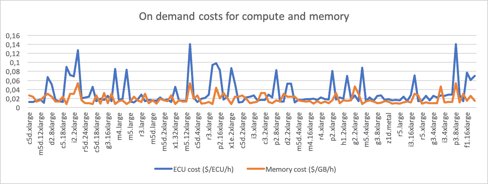
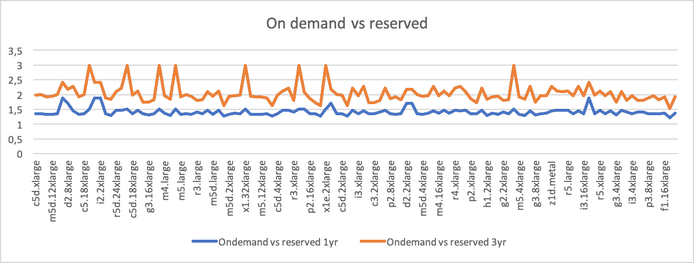

# 每个程序员都应该知道 AWS 的成本

> 原文：<https://david-codes.hatanian.com/2019/06/09/aws-costs-every-programmer-should-now.html?utm_source=wanqu.co&utm_campaign=Wanqu+Daily&utm_medium=website>

这篇博文的标题直接引用了每个程序员都应该知道的[延迟数字](https://people.eecs.berkeley.edu/~rcs/research/interactive_latency.html)。这些数字现在有好几个版本，我无法确定找到最初的作者。一些人把最初的数字归功于[杰夫·迪恩](https://twitter.com/jeffdean)。

当从事一个将达到一定规模的项目时，您需要平衡几个关注点。我在做什么假设，我如何确认它们？怎样才能快速上市？我的设计能支持预期的规模吗？

与规模相关的一个问题是基础架构的成本。云提供商允许您配置数千个 CPU，并在弹指间存储数万亿字节的数据。但是这是有代价的，对于几千个用户来说可以忽略不计的东西，当你接触到数百万个用户时，可能会成为你预算中的一个烧钱的窟窿。

在本文中，我将列出一些我认为在考虑架构时需要牢记的参考数字。这些数字并不意味着准确的预算估计。他们在这里帮助你决定你的设计是否有意义或者超出了你的支付能力。所以考虑数量级和相对值，而不是绝对值。

还要考虑到你的公司可能会从 AWS 那里获得折扣，而这些折扣会带来巨大的不同。

# 计算

现在一个 CPU 的成本是多少？我使用精彩的 [ec2instances.info](https://www.ec2instances.info/) 接口来提取 vCPU 的中间价格。

你可以从[他们的 Github repo](https://github.com/powdahound/ec2instances.info/blob/master/www/instances.json) 中获取源数据。我复制了它，并用 python 脚本[进行了处理，你可以在 Github](https://github.com/dhatanian/aws-ec2-costs) 上找到它。所有价格均适用于欧盟-西方-1 地区。

|   | 每月费用中位数 |
| --- | --- |
| 1 个现代 vCPU (4 个 AWS ECUs) | 58 美元/月 |
| 带 1 年可兑换预订(全部预付) | 43 美元/月 |
| 3 年可兑换预订(全部预付) | 每月 30 美元 |
| 现货定价(估计) | 每月 30 美元 |

我根据从各种渠道获得的轶事数据估算了现货价格。由于价格在一天之内变化，我找不到可靠的数据来源。

AWS 以弹性计算单位表示其机器的计算能力，4 个 ECU 或多或少代表一个现代 CPU 的能力。所以上面的价格是针对一个 CPU 或内核，而不是一个实例。

以下是我所研究的所有实例类型中每小时 1 个 ECU 的价格，单位为美元:

下面是按需服务与 1 年期和 3 年期预订的对比(均为可兑换、预付):

# 储存；储备

所以您想要低延迟、高吞吐量，并计划将所有内容存储在 Redis 中？那么除了这些 CPU 成本之外，您还需要为 RAM 付费。

我用同样的方法计算了 EC2 上 1GB RAM 的中间价格。Elasticache 的按需价格大约是它的两倍，但是在预订的实例中，价格下降得非常快。

|   | 每月费用中位数 |
| --- | --- |
| 1 GB 内存 | 10 美元/月 |
| 1 GB RAM 1 年可兑换预订(全部预付) | 8 美元/月 |
| 1 GB RAM 3 年可兑换预订(全部预付) | 每月 5 美元 |
| （同 solid-statedisk）固态（磁）盘 | 每月 0.11 美元 |
| 硬盘 | 0.05 美元/月 |
| S3 | 0.02 美元/月 |
| S3 冰川 | 0.004 美元/月 |

虽然这是纯粹的存储成本，但您还需要考虑数据的使用模式。全天候运行内存数据库需要多少 CPU？

S3 也一样:你会为写作/阅读请求支付多少钱？我见过这样的工作负载，其中 S3 上的存储成本可以忽略不计，但是在 S3 编写大量对象的成本使得团队在 S3 上编写他们自己的文件系统。

# 带宽

黑客新闻上的一些评论指出我没有考虑带宽成本。事实上，如果您向最终用户提供数据，或者需要跨区域复制，您也需要考虑这些成本。

| 数据传输的类型 | 传输 1GB 的成本 |
| --- | --- |
| 欧盟/美国地区到任何其他地区 | 0.02 美元/GB |
| APAC 地区到任何其他地区 | 0.09 美元/GB |
| 欧盟/美国地区到互联网 | 0.05 美元/GB |
| APAC 地区至互联网 | 0.08 美元/GB |
| 在同一地区的两个 az 之间 | 0.01 美元/GB |
| 在同一个 AZ 内 | 自由的 |

