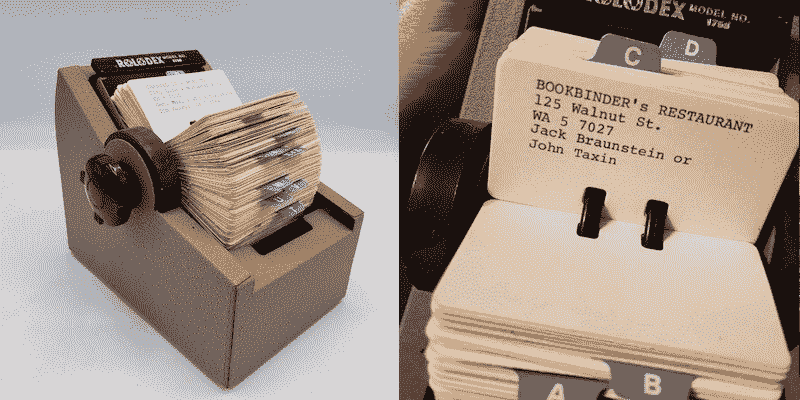
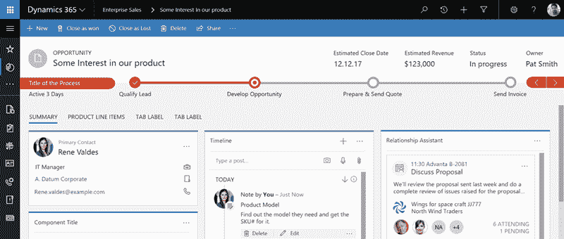
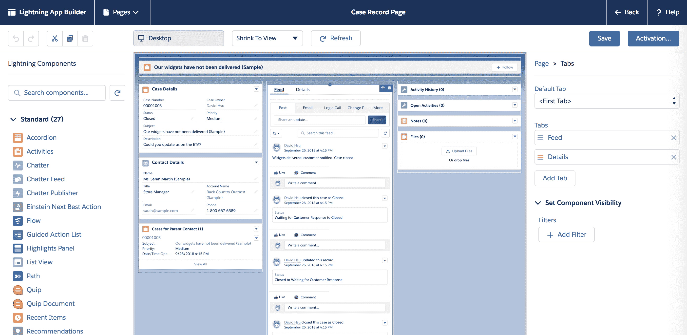
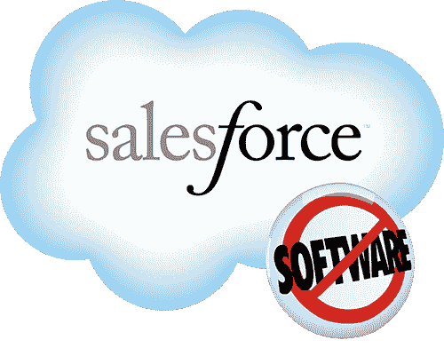
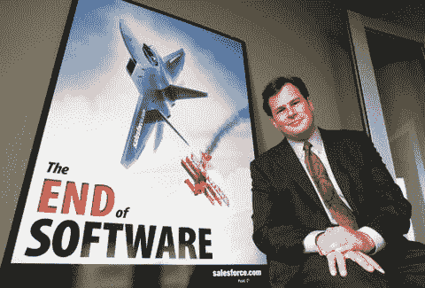
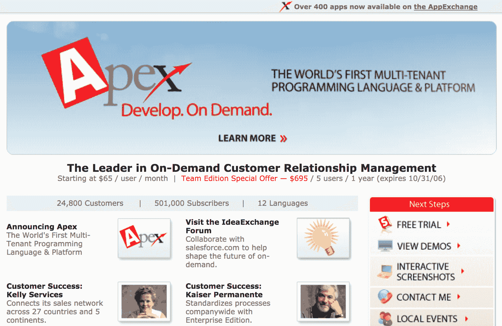

# 什么是 Salesforce？

> 原文：<https://tryretool.com/blog/salesforce-for-engineers/?utm_source=wanqu.co&utm_campaign=Wanqu+Daily&utm_medium=website>

客户关系管理(CRM)是世界上最大、增长最快的软件市场。每年在客户关系管理系统上花费 400 亿美元，几乎所有公司都有一个。但是对于我们这些不直接使用 CRM 的人来说…这有什么大不了的？

CRM 是所有客户数据和互动的真实来源。需要知道你的销售人员承诺了什么功能，什么时候承诺的？每个客户给你带来了多少收入？或者说过去一年哪个销售人员卖的最多？查看客户关系管理。你的客户关系管理是了解你公司业务的关键。你可以在这篇文章中[了解 Retool 如何使用 CRM。](https://retool.com/blog/retool-for-critical-sales-processes/)

[Salesforce](https://www.salesforce.com/) 是业内最流行的 CRM。它价值 1200 亿美元，拥有 20%的 CRM 市场，并被 83%的财富 500 强企业使用。该公司拥有 30，000 多名员工，Salesforce Tower 是旧金山最高的摩天大楼。

整个经济是围绕销售力量建立的。Salesforce 每赚 1 美元，其生态系统就能产生 4 美元。数百万开发人员为 Salesforce 的平台开发应用程序，Salesforce 开发本身就是软件工程中利润丰厚的领域。IDC 估计，到 2022 年，Salesforce 将创造 330 万个新工作岗位，以及 8000 亿美元的新业务收入。

今天，企业软件以笨重、乏味和缓慢而闻名。但是，企业软件的原型 Salesforce 实际上开创了许多我们现在在技术领域认为理所当然的东西，包括销售软件即服务(=> SaaS)和在云中托管软件(=> AWS)，同时创造了一家极具价值的公司。

* * *

要理解 Salesforce 是如何接管世界的，了解 Salesforce 之前销售是如何工作的会有所帮助。

过去，销售曾经是一个完全手工的过程。公司将联系人储存在实体索引卡上(一种“名片夹”)，通过直邮或电话营销锁定他们的目标。随着 20 世纪 80 年代个人电脑的出现，“联系管理服务”开始出现，将销售人员的通讯录数字化。“数据库营销”成为下一个热点，公司开始以电子方式存储客户和线索。这使他们能够细分其销售线索，并以定制营销信息为目标。



在 20 世纪 90 年代，市场转向了一个单一的理念:所有客户数据的统一存储，并具有自动化销售流程的功能，包括联系人管理、任务跟踪和报告。不同的公司给它起了不同的名字——SFA(销售力量自动化)，CIS(客户交互软件)，ECM(企业客户管理)，以及一系列其他的 tla(三个字母的缩写)。

其中一个最终被卡住了——CRM(客户关系管理)。

## 为什么要使用 CRM？

存储销售详情是经营任何业务的基本要求。您每天都要与各种实体互动——现有公司内部的个人联系人(Salesforce 行话中的`Contacts`)、可能成为客户的个人联系人(`Leads`)、公司本身(`Accounts`)、与公司的交易(`Opportunities`)等。每次你和他们互动时，你要么写下笔记，要么参考以前的笔记。例如，当一个销售线索进来并对购买感兴趣时，你会想知道背景:你以前给他们打过电话吗？他们的用例是什么？你应该什么时候跟进？

当你刚开始的时候，电子表格很好用。您有多个表(`Contacts`、`Companies`、`Opportunities`、`Leads`等)。).当然，在输入每一行之前手工检查(重复、验证输入、验证外键等。)需要努力，但无论如何你都没有那么多顾客。

但是随着客户越来越多，您将需要各种特性(各种验证、创建行的触发器、重复数据删除逻辑等。)，这些电子表格并不总是提供。这就是 CRM 的用武之地。

CRM 是您所有业务关键数据的唯一来源。这是您跟踪销售线索数据的地方—它们值多少钱，进展到什么程度，以及完成的可能性有多大。它[与你的电子邮件](https://help.salesforce.com/articleView?id=email_my_email_2_sfdc_landing_page.htm&type=5)(有时还有[甚至你的手机](https://www.outreach.io/blog/understand-your-sales-performance-with-updated-call-analytics-pr))连接，自动与它们同步互动。与电子表格不同，它旨在自动输入数据，并最大限度地减少错误。



一旦你所有的数据都在 CRM 中，你就可以运行报告了。例如，您可以按负责销售的销售人员(找到您表现最好的销售人员)、行业+公司规模(找到您的最佳点:100 - 1000 名员工之间的 CPG 公司)或任何其他方式对交易进行分组。比如 Salesforce，甚至允许你编写`SOQL`(“sales force 对象查询语言”，和 SQL 很像)来运行报表。哦，力量！

到目前为止，你可能认为 CRM 很有价值，但是很无聊。只是一个 CRUD 应用程序，加上一些自动化的电子邮件+通话记录，对不对？嗯……大多数 CRM 就是这样——自动化的 CRUD 应用程序。

但不是 Salesforce。

**订阅每月更新简讯**
我们每月发布一次头条新闻(就像这篇)以及更新教程、模板和产品发布。

## 输入销售力量

每个行业都是独一无二的。不同的领域有不同的实体——您可能需要跟踪“大学”中向学术界销售的“教师”。不同的组织有不同的流程—如果您的团队有专门的销售开发代表，您可能需要一个特定的“销售线索资格”视图。CRM 如何处理这些不同的需求？

而这还只是模型。也许您还需要自定义视图和控制器！许多 SaaS 应用程序比内部构建的更糟糕，这通常是因为你不能自定义用户界面。例如，我们使用对讲机，而简单、平凡的任务(例如，现在就给这个销售线索发电子邮件)是不可能的，这常常令人恼火。如果我们能在视图中添加一个按钮就太好了…但是当然，我们不能编辑它，因为它是我们买的 SaaS 产品，我们无法控制它！(这与帕特里克·科利森关于终端用户应用程序编程的问题有关。)

一些客户关系管理迫使所有公司都采用一种通用的设置。Salesforce 如此成功，很大程度上是因为它没有。相反，它的杀手锏是它的灵活性。

像数据库一样，Salesforce 允许您创建具有自定义列和关系的新表，并完成数据类型和约束。为了销售给学术界，您可以创建新的“大学”和“教师”对象，它们可以相互链接并附加到每个“领导”对象。与数据库不同，Salesforce 让您无需编写任何代码即可完成此操作。


像前端框架一样，Salesforce 允许您使用自定义布局和 ui 创建新视图。对于销售线索资格认定流程，您可以创建一个仪表板，仅显示不合格的销售线索以及批准/拒绝它们所需的信息。与前端框架不同，Salesforce 让您无需编写任何代码即可实现这一点。



像 AWS Lambda 一样，您可以编写任意代码，并通过`POST`调用 Salesforce API 来触发它。然而，与 Lambda 不同，这段代码可以由数据库事件自动触发——在编辑了一个`Lead`或创建了一个`Opportunity`之后。

借助 Salesforce 的自定义数据模型和界面，每个公司的设置都是独一无二的。从这个角度来看，Salesforce 不仅仅是一个 CRM——它是一个用于构建类似 CRM 的应用程序的平台，但具有相同的默认设置。

Salesforce 的点击式数据库编辑器和拖放式用户界面构建器本身就使其不仅仅是一个 CRM。但是当你加入其他应用程序和第三方 API 时，它就接近于无代码编程:一种构建软件的新方法。

自定义数据模型和用户界面使得普通的 Salesforce 平台具有足够的可配置性(非工程师！)来满足大部分业务需求。然后，AppExchange 通过“即插即用”的应用程序启用了许多新功能，允许更多的自定义设置。最后，Apex 填补了最后的空白，让开发人员为真正定制的功能编写定制代码。

Salesforce 是怎么过来的？

## Salesforce 简史

90 年代末的某个时候，一位经验丰富的企业软件高管坐在夏威夷的一个小屋里思考未来。(这是在硅谷的[第三集里模仿的)。](https://youtu.be/Gj0o8m5lBbk)

10 年来，他一直从事甲骨文公司的业务；数百万美元的前期成本、长达数年的内部实施以及持续的维护开销。他也看到了由网上书店 Amazon.com 引领的消费软件趋向简单易用的趋势。他想知道如何对企业软件做同样的事情。

这位高管就是马克·贝尼奥夫。从夏威夷回来后，他开始为一家名为 Salesforce 的新公司简化企业软件。

Salesforce 的第一个创新不是它的功能，而是它的商业模式。贝尼奥夫希望软件像电力一样成为一种公用事业。因此，他为 Salesforce 提供了简单的订阅价格，根据使用情况进行调整。[1999 年，每月 50 美元/用户](https://web.archive.org/web/20000303134956/http://www.salesforce.com/info/products.html)。软件即服务(SaaS)诞生了。

当时，软件是复杂性和成本的同义词。凭借其反文化理念，Salesforce 需要与众不同。他们这样做了，而且并不巧妙——该公司的第一个营销口号是“无软件”,而且，方便的是，他们的电话号码变成了 1-800-无软件。公司的大部分人都反对这种做法——负面广告通常是个坏主意。但是对于 Salesforce 来说，[它成功了](https://www.salesforce.com/blog/2013/07/marc-benioff-logo-brand-advice.html)。

<center> </center>

对于一家想要终结软件的公司来说，Salesforce 无疑为其进步做出了很大贡献。6 年后，他们推出了第一个“应用商店”，创造了一种全新的软件分发方式。这甚至比苹果公司的还要早，但这并非巧合—

早在 1984 年，史蒂夫·乔布斯就给了贝尼奥夫他的第一份编程工作(编写汇编)。贝尼奥夫称他是他有过的最伟大的导师之一。在 21 世纪初的一次会面中，乔布斯给出了一条改变 Salesforce 发展轨迹的建议:

“你必须建立一个应用经济。”

“什么是应用经济？”，贝尼奥夫问道。

"马克，你会想出办法的"

Salesforce *搞清楚了*。2005 年，他们推出了 AppExchange，这是一个在线市场，任何人都可以开发和分发与 Salesforce 连接的应用程序。因为这些应用程序位于 Salesforce 中，并且可以读取/写入 Salesforce 数据，所以它们非常强大。例如，Mailchimp 应用程序允许您将 Salesforce 内部的人员直接订阅到 Mailchimp。但它还包括一个前端，允许您查看销售线索与之前发送的电子邮件的交互(例如，Alice 查看了您的营销电子邮件 5 次，并点击了 Foo 功能 3 次)。

一些 AppExchange 应用程序集成到 Salesforce 的 web 应用程序中，而其他应用程序是后端集成的独立应用程序。现在每年都有数十亿美元花在数千个 AppExchange 应用上，整个公司都建立在它的基础上——例如，[FinancialForce.com](https://financialforce.com)让你在 Salesforce 中建立一个企业资源规划系统(ERP)，拥有 750 多名员工，自 2009 年成立以来已经筹集了 2 亿美元。

贝尼奥夫原本计划将其命名为“应用商店”——他甚至注册了“appstore.com”域名——但市场研究表明，“交换”是更好的比喻。然而，这个域名并没有被浪费——贝尼奥夫在 iOS 应用商店发布会上把它和“应用商店”商标一起赠送给了乔布斯。它仍然是苹果品牌的重要组成部分。

在 AppExchange 之后的几年里，Salesforce 推出了一系列更忠实于其“无软件”目标的产品。

第一个是 Apex，类似 Lambda 的服务允许 Salesforce 用户编写任意代码。Apex 应用程序一旦通过 AppExchange 安装，就可以访问用户的数据库和 Salesforce 的客户端-服务器界面，因此几乎任何自定义功能都成为可能。

第二个是 Visualforce，这是一个基于组件的 UI 框架，可以轻松地为 Salesforce 构建自定义界面。其简单的标记使开发人员可以构建与 Salesforce 应用程序的其余部分一致的 ui，并且可以轻松地与 Salesforce 的服务器进行对话。

此 Visualforce 代码将生成一个带有对象下拉列表的表单:

```
<apex:page controller="objectList" >
  <apex:form >
    <apex:SelectList value="{!val}" size="1">
      <apex:selectOptions value="{!Name}"></apex:selectOptions>
    </apex:SelectList>
  </apex:form>
</apex:page> 
```

这个 Apex 控制器代码将从组织的模式中获取对象列表:

```
public class objectList{
  public String val {get;set;}

  public List<SelectOption> getName()
  {
    List<Schema.SObjectType> gd = Schema.getGlobalDescribe().Values();     
    List<SelectOption> options = new List<SelectOption>();

    for(Schema.SObjectType f : gd)
    {
       options.add(new SelectOption(f.getDescribe().getLabel(),f.getDescribe().getLabel()));
    }
    return options;
   }
} 
```



2008 年，它们被整合到 Force.com——一个让开发者构建和运行应用程序而不用担心基础设施的平台。这是第一个平台即服务(PaaS)。

Force.com 向开发人员开放了 Salesforce 的服务和架构，开发人员蜂拥而至在其上构建定制的 Salesforce 应用。这不仅仅是开发速度更快，Force.com 还大大简化了发布过程。该平台上的应用受益于 Salesforce 自己的安全性，IT 部门已经认可了这一点，因此 Force.com 应用更容易向企业销售。

Salesforce 每年都会继续推出新产品来增强其产品。2012 年，价值 36 亿美元的收购变成了 Salesforce 营销云，这是一套数字营销自动化工具。Einstein Analytics 于 2016 年推出，在整个 Salesforce 堆栈中添加了一层“人工智能驱动的”分析。2018 年，该公司进入了一个新的垂直领域，推出了专门针对医疗保健的 CRM-sales force Health Cloud。

当 Salesforce 呼吁“软件的终结”时，Salesforce 指的是企业软件的遗留模式:盒装、臃肿、通过销售人员销售。今天，他们已经成功地改变了软件在企业间构建、购买和部署的方式。像 Retool [这样的技术正在为内部应用和操作软件做着同样的事情](https://www.youtube.com/watch?v=TJV_2LdOxkI)。