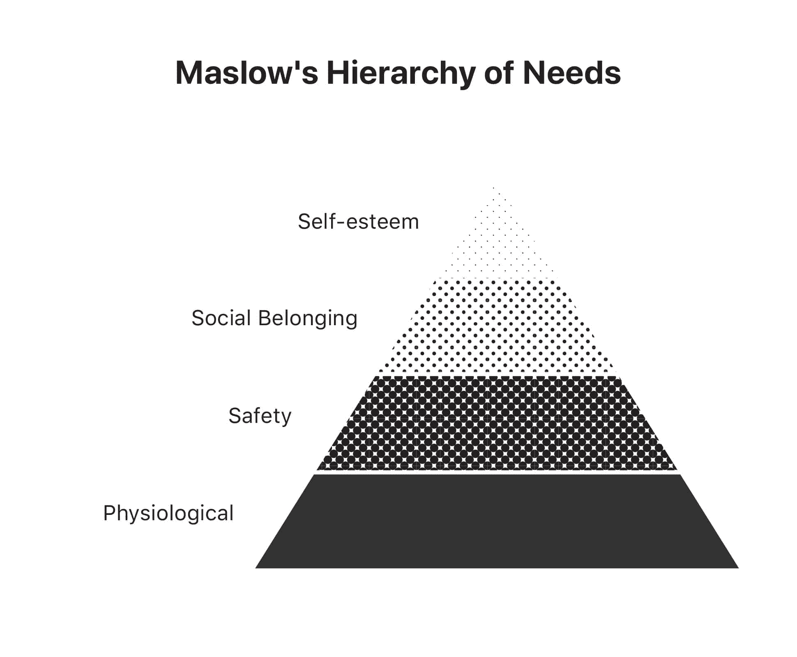
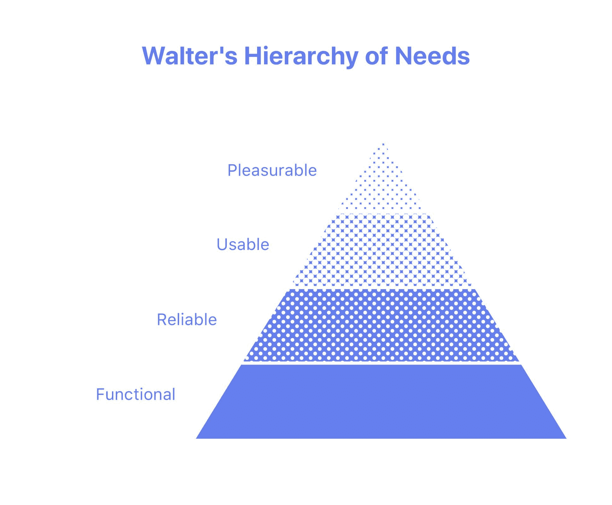
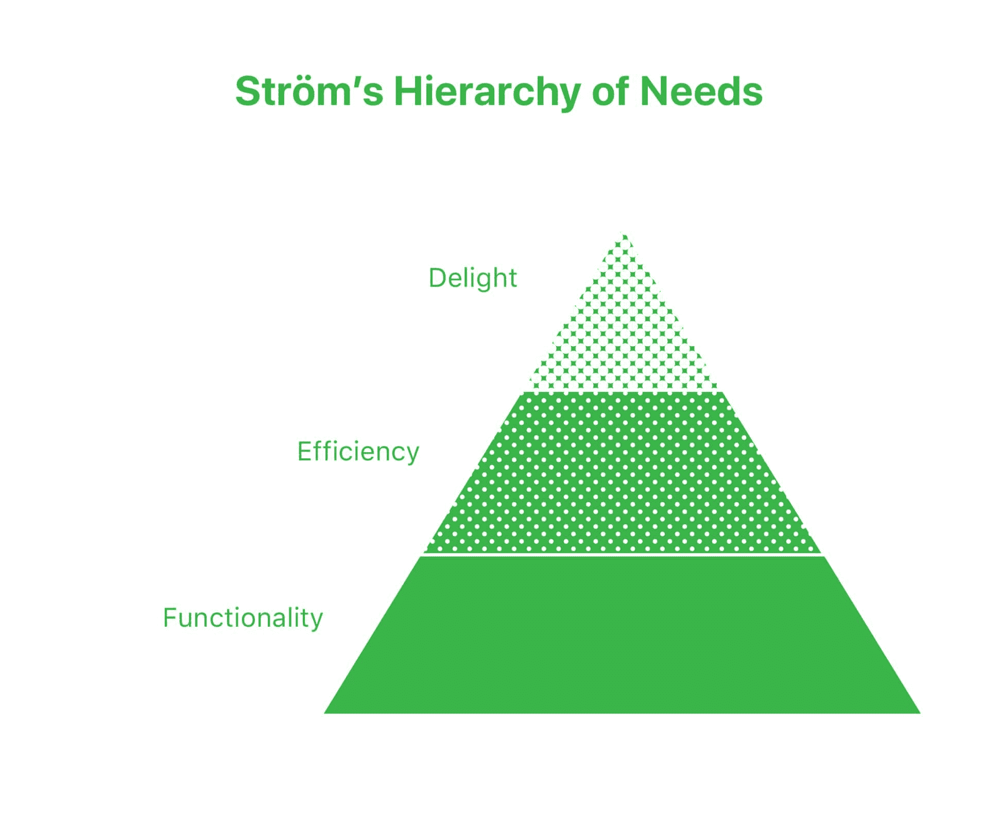
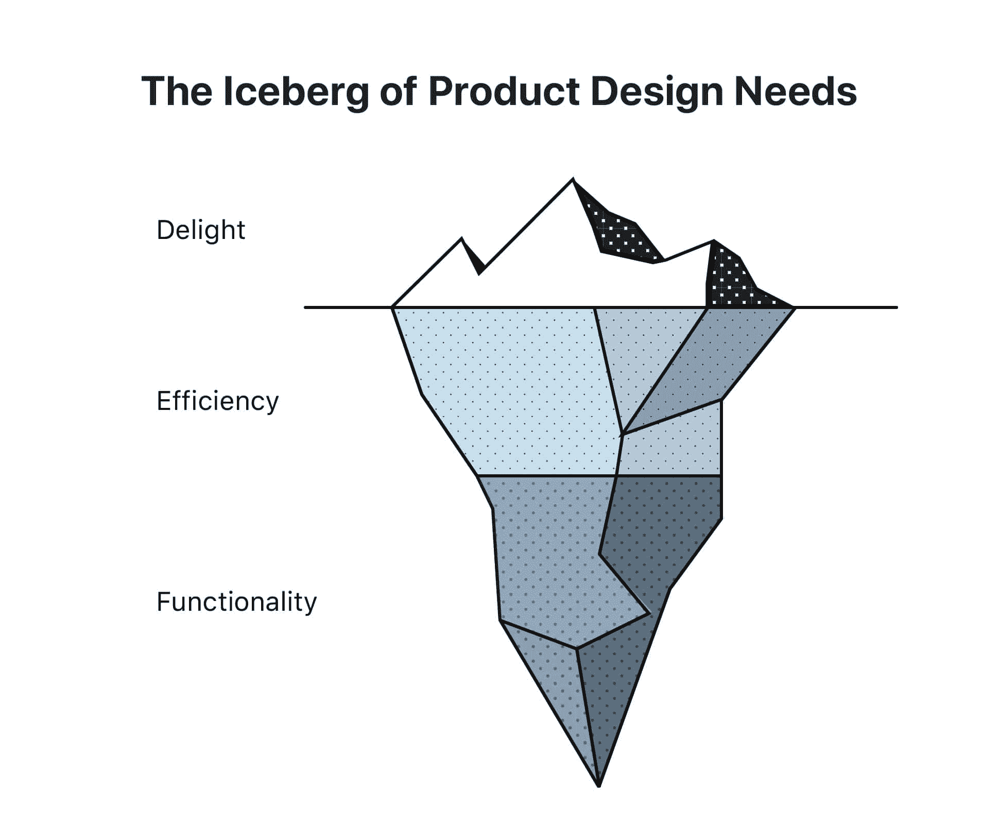

# 快乐排在最后| | Matthew Strö，设计师领袖

> 原文：<https://matthewstrom.com/writing/delight-comes-last/?utm_source=wanqu.co&utm_campaign=Wanqu+Daily&utm_medium=website>

保罗·亚当斯直截了当地说:

> “如果(结果)没有首先得到解决，网格、字体、颜色和美学风格就无关紧要……(但)有时候，画漂亮的画、埋头于像素比处理复杂的商业决策和与不同意见的人打交道更有趣。”
> —保罗·亚当斯， *[设计的酝酿](https://www.intercom.com/blog/the-dribbblisation-of-design/)*

这被称为属性替代:当面对一个困难的问题(复杂的商业决策)时，我们下意识地用一个更容易的问题(字体和颜色)来替代它，并解决那个问题。

愉悦——通过动画、文案和插图创造情感印象——是易访问性和可用性等较难问题的常见替代品。越来越多的设计师和他们的利益相关者以牺牲基本效用为代价，把快乐作为成功的代名词。

为了扭转这种趋势，我们必须理解为什么愉悦比可用性更容易成为问题。有了这些知识，我们可以通过把快乐放在最后来努力制造更好的产品。

## 三个层次

数字产品设计中的所有问题都可以组织成一个层次结构，底层是难的问题，顶层是容易的问题。亚伯拉罕·马斯洛在 1943 年探索了这个心理模型，它是理解我们偏见的关键。

### 马斯洛的等级制度

在《人类动机理论》中，马斯洛描述了解释人类行为和动机的需求层次。马斯洛的需求层次包括以下几类，从最低到最高:

1.  **生理需求:**生存所需的最根本需求。例子:食物、水、睡眠和性。
2.  **安全需求:**与基本心理健康相关的需求。例如:免受身体伤害的安全、免受情感伤害的安全和财务安全。
3.  **社会归属感:**对社区和与他人情感联系的需求。这些包括友谊、亲密关系和家庭。
4.  自尊:提供个人成就感和被尊重感的需求。包括认可、关注和接受。

Maslow’s Hierarchy of Needs

根据该理论，人们的动机是高于他们当前满足水平一级的需求。如果人们的低层次需求得到满足，他们只会寻求更高层次的需求——社区需求、尊重需求和接纳需求。

这一理论有其批评者，但直到今天它仍在引起共鸣。

> “马斯洛的理论在大众想象中的持续共鸣，不管它看起来多么不科学，可能是其意义的唯一最有力的证据:它将人性解释为大多数人立即在自己和他人身上认识到的东西。”
> —乌列尔·阿布洛夫， *[二十一世纪我们为什么需要马斯洛](https://link.springer.com/article/10.1007%2Fs12115-017-0198-6)*

### 沃尔特的等级制度

2011 年，亚伦·沃尔特出版了《为情感而设计》。在书中，沃尔特采用了马斯洛的需求层次理论来描述数字产品用户的需求。沃尔特的需求层次如下:

1.  **功能性:**用户应该能够完成任务。
2.  **可靠:**产品不应该“间歇性地退出，或者不可靠。”
3.  **可用:**用户应该能够“快速学习执行基本任务。”
4.  令人愉快:使用一种产品应该“让你脸上带着微笑”

Walter’s Hierarchy of Needs

沃尔特认为，在 2011 年，大多数产品满足于仅仅是可用。更多的网站和应用程序应该“超越可用性，创造真正非凡的体验。”

### 斯特罗姆的等级制度(那就是我)

自从 Walter 发表他的层次结构以来的 8 年里，支持网站和应用程序的技术已经相当成熟。推特让[失败的鲸鱼](https://www.theatlantic.com/technology/archive/2015/01/the-story-behind-twitters-fail-whale/384313/)退役。脸书介绍了时间表。即使您没有连接到互联网,“谷歌文档”也能工作。沃尔特的层级需要一些更新:

1.  **功能:**用户应该能够可靠地完成任务。这包括可靠性和可用性；这些品质是桌面赌注。
2.  **效率:**用户应该通过使用产品来提高工作效率。锤子是有用的。射钉枪效率很高。
3.  **愉悦:**用户在使用产品时应该有一种满足感、享受感、喜悦感或惊喜感。

Ström’s Hierarchy of Needs

产品需求层次的关键是 Walter 只是间接提到的:你的产品必须满足每个层次的需求**，然后才能进入下一个层次**。如果一个产品没有功能性，它就不会有效率。如果一个产品没有效率*和*功能，它就不会令人愉快。

## 可用=可食用

沃尔特将使用软件和吃食物进行了类比:

> 回想一下你吃过的最好的一顿饭。不是一顿美餐，我的意思是一顿令人兴奋、挑战味觉、爱上食物的美餐……你曾经想过这顿饭的营养价值吗？
> —亚伦·沃特，*为情感而设计*

我们不应该满足于构建仅仅是可用的软件，就像厨师不应该满足于烹饪仅仅是可食用的食物。

但是这个类比也有黑暗的一面。一顿饭最令人难忘的方面是那些引起情绪反应的方面:味道、质地、视觉呈现。制作你的食物的配料和过程的细节不是那么令人难忘。事实上，餐馆努力把所有这些东西藏回厨房。

我尝过很棒的牛排。我很容易记起这让我感觉有多好。所以当我试着做牛排时，很明显味道和质地不对。但是不清楚为什么不正确:我不能毫不费力地回忆起牛排最好煮的温度，或者问我的屠夫正确的问题，或者正确的盐调味。

伟大的产品不会因为它们的可用性和效率而被人们记住。当一个产品满足了我们对功能和效率的需求时，我们会记住使用它们时的情感印象。然后，作为设计师或利益相关者，我们试图重现这种情感共鸣。但是我们不记得更基本的元素:熟悉的模式、可靠的信息架构、反应性和响应性输入。

The Iceberg of Product Design Needs

## 对抗偏见

很难避免属性替换偏差，因为它几乎是瞬间发生的。在编辑时，我经常发现自己在纠正标点符号和语法，而不是实际阅读我所写的内容。在设计时，我有时会在整合用户流和旅程地图之前构建组件和样式。这看起来像是拖延症。但这是一种尝试，为了更容易、更熟悉的挑战，避免更多未知的困难问题。

为快乐而设计也是一样。

为了解决效率和可用性的难题，我们必须走出去，在我们每天使用的产品中寻找这些品质。越容易记住是什么让谷歌如此有用，我们就越容易开发自己应用的搜索功能。

最终，消除偏见需要意识和专注。正如美国大兵所说，知道是成功的一半。

* * *

感谢[乔希·彼德塞尔](http://joshpetersel.com/)、[洛根·亚力山大](https://twitter.com/loganalexander)和[蒂姆·卡萨索拉](http://www.timcasasola.com/)对本文早期草稿的帮助。此外，特别感谢[莉齐·梅](http://www.iamlizzie.com/)对冰山插图的评论。

* * *

