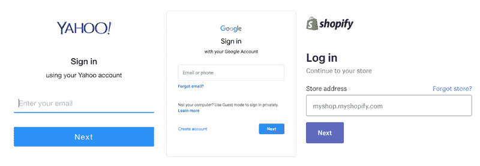
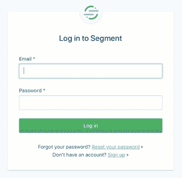
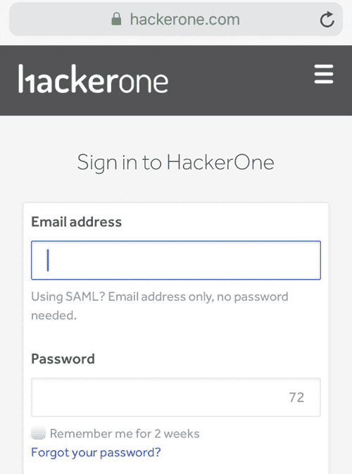
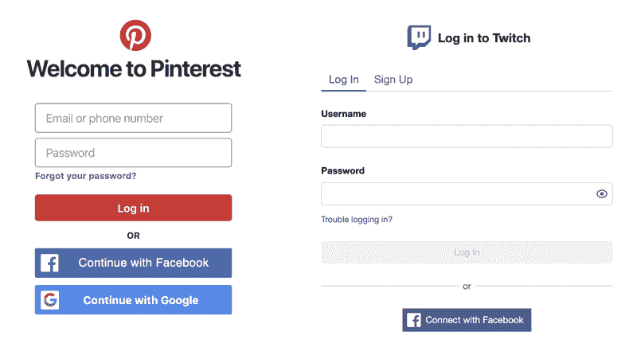

# 为什么用户名和密码在两个不同的页面上？

> 原文：<https://www.twilio.com/blog/why-username-and-password-on-two-different-pages?utm_source=wanqu.co&utm_campaign=Wanqu+Daily&utm_medium=website>

将用户名和密码放在两个不同的页面上的最常见原因是为了同时支持这两个页面:

1.  [单点登录](https://en.wikipedia.org/wiki/Single_sign-on) (SSO)(即登录 Google 或 Okta 等服务)
2.  用户名/密码登录

然而，这个登录流程[让](https://twitter.com/gr8thepeter/status/705401415011803136)人感到困惑，这可能就是你阅读这篇文章的原因！网站通常在同一个视图中显示用户名和密码字段，供我们登录。因此，如果您想知道为什么密码字段丢失或在另一个页面上，您并不孤单。

这篇文章着眼于这个设计决策的安全性，并给出了设计支持多路径身份验证的登录表单的选项。

### 将用户名和密码字段分离到不同的页面上是否更安全？

这种分离可能会使[凭证填充](https://www.owasp.org/index.php/Credential_stuffing)攻击[更加麻烦](https://security.stackexchange.com/a/85180/165675)。它还允许平台执行有条件的安全检查。例如，该网站可以检查帐户是否启用了双因素认证，如果没有，则需要一个[验证码](https://en.wikipedia.org/wiki/CAPTCHA)才能登录。两页设计也使得不良行为者更难创建带有相似登录页面的钓鱼网站(当涉及页面重定向时)。然而，除非您也有 SSO 用例，否则这可能不值得额外的步骤。

如果您想深入了解，在[开发到](https://dev.to/oscherler/are-login-forms-that-ask-for-your-username-and-password-on-two-different-pages-more-secure-4jjf)和[安全堆栈交换](https://security.stackexchange.com/questions/85160/is-having-the-username-and-password-fields-on-different-pages-more-secure?atw=1)上有一些关于此主题的精彩讨论。

### 用于处理 SSO 和用户名/密码登录的选项

**1。用户名和密码的单独页面**

这种设计为用户在任何情况下都提供了一条清晰的路径。同步电子邮件查找和不同的操作步骤(“下一步”)也可以简化幕后的代码实现。这种分离还支持上述的条件安全检查。

时至今日，Shopify、雅虎、谷歌和 Twilio 等网站都是这样做的。坏处是[人](https://twitter.com/angelacraft/status/90473064244060160) [有](https://twitter.com/zacharytamas/status/618965251795591169) [注意到](https://twitter.com/yvesmancera/status/747829914632499200)[抱怨](https://twitter.com/dmnyc/status/334311331366834176)。此外，这一流程并不总是与[密码管理器](https://en.wikipedia.org/wiki/Password_manager)的自动填充功能配合良好，但主要功能(LastPass，1Password)已经适应。

**2。单页应用程序查找**

像 [Dropbox](https://www.dropbox.com/) 和 [Segment](https://segment.com/) 这样的网站有一个很好的界面来做这件事。Segment 的一名安全工程师[向我展示了](https://twitter.com/search?q=from%3Aleifdreizler%20app.segment.com&src=typd&lang=en)它是如何工作的:如果你去[https://app.segment.com/](https://app.segment.com/)并输入[foobar@segment.com](mailto:foobar@segment.com)，一个单点登录的选项就会出现。它识别电子邮件域，并进行查找，以查看该组织是否正在使用带 Segment 的 SSO。这类似于选项 1，但不涉及两个单独的视图。该选项优先处理用户名/密码登录，可能与密码管理器配合得更好，但是需要一些 Javascript 处理，而[可能是易变的。](https://news.ycombinator.com/item?id=19175288)

**3。可选密码字段**

另一种选择是将密码字段设为可选。一个 bug 赏金平台 Hackerone 在他们的登录视图中就是这么做的。它简化了页面，不需要查找域名，但是对于平台的 [SAML](https://en.wikipedia.org/wiki/Security_Assertion_Markup_Language) 用户来说可能很笨拙。

在单个页面上显示字段(选项 2 或 3)还允许其他身份验证选项，如添加社交登录按钮。像 Pinterest 和 Twitch 这样的网站为此提供了选择。

### 

### 如何设计完美的登录表单

布拉德·弗罗斯特在他的文章[“不要在登录表单上耍小聪明”](http://bradfrost.com/blog/post/dont-get-clever-with-login-forms/)中有一些值得讨论的好建议。你也可以关注[黑客新闻](https://news.ycombinator.com/item?id=19172225)上的讨论，了解更多想法。当然，用户名和密码并不是登录屏幕唯一要考虑的东西。您可以使用 Twilio 的[双因素认证](http://twilio.com/authy)或[电话号码查找](https://www.twilio.com/lookup)来加强您的认证流程的安全性。

你的公司用不同的方法解决了这个问题吗？还是有我没有提到的分开用户名和登录页面的另一个原因？请在 Twitter 上告诉我 [@kelleyrobinson](https://twitter.com/kelleyrobinson) 或者查看黑客新闻上这篇文章的[讨论。](https://news.ycombinator.com/item?id=20294523)