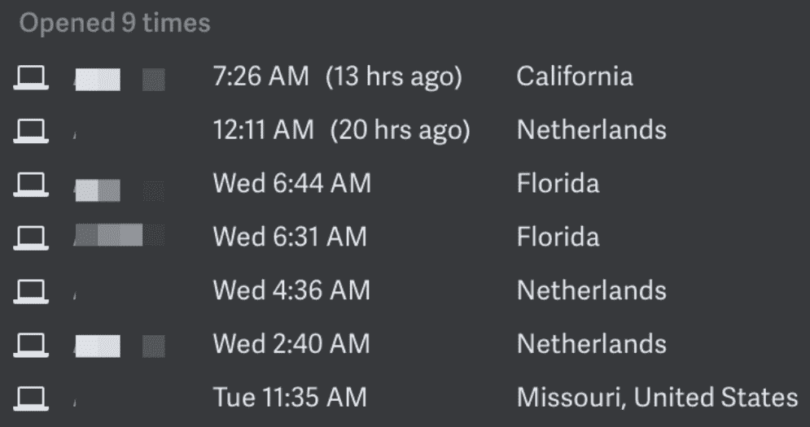
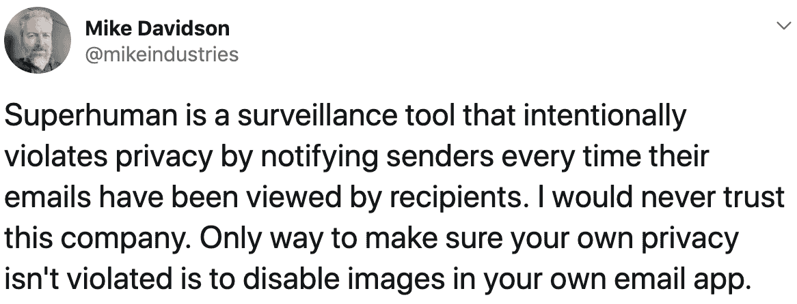
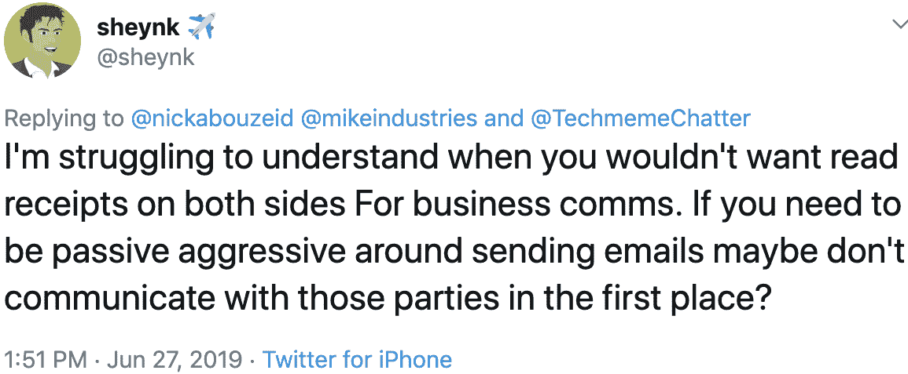
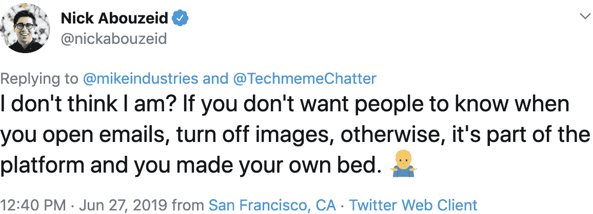

# 超人在监视你迈克工业

> 原文：<https://mikeindustries.com/blog/archive/2019/06/superhuman-is-spying-on-you?utm_source=wanqu.co&utm_campaign=Wanqu+Daily&utm_medium=website>

# 超人在监视你

在过去的 25 年里，电子邮件已经融入了我们的日常生活。我们的收件箱包含从非常私人的信件，到工作信件，再到不请自来的内部推销。在许多方面，它们是我们家的延伸:私人空间，在这里我们可以自由地以我们认为合适的任何方式处理生活抛给我们的事情。有零收件箱政策吗？这取决于你。让你的收件箱堆积成千上万，只处理那些你能放在最上面的东西？那也是你的事。

令人失望的是，被大肆宣传的新电子邮件客户端之一——super human，已经决定在其客户发送的电子邮件中嵌入隐藏的跟踪像素。Superhuman 将这一功能称为“阅读收据”，并在未经收件人同意的情况下，默认为其客户打开该功能。你以前听说过“已读回执”这个术语，所以你很可能习惯于认为这是一种简单的“已读/未读”状态，人们可以选择退出。**拥有超人，就不是**。如果我用超人给你发邮件(不管你用什么邮件客户端*，你打开 [9 次](https://www.youtube.com/watch?v=Hh_vLKlz2Mc)，我看到的是这样的:*

没错。你每次打开我的邮件的运行日志，包括你打开邮件时的位置。在我们继续之前，问问你自己，你是否**期望**这些信息会在你每次阅读电子邮件时被收集到你身上，并反馈给你的父母、孩子、配偶、同事、销售人员、前任、陌生人或跟踪者。虽然一些一对多的邮件爆破软件已经使用了类似的技术来跟踪打开率，但答案是否定的；大多数人不会想到这一点。人们有理由认为，他们何时——尤其是在哪里——阅读电子邮件是他们自己的事。

当我上周第一次发推文时，这条推文受到了各种各样的人的喜爱，包括脸书、苹果和 Twitter 等公司的现任和前任员工和首席执行官:

[T2】](https://twitter.com/mikeindustries/status/1144288602001571840)

几个超人用户以及一些超人投资者(他们从未透露自己是投资者，甚至在过去与我的私下交谈中)也对它持批评态度。我想谈谈这个问题，因为我认为它对我们如何建立具有道德和责任感的产品和公司具有指导意义。我认为超人在这里的所作所为表明了对这两者的漠视。

首先，有几点需要注意:

1.  几个月前我被邀请加入超人服务。我开始了他们的入职流程，很兴奋地尝试用它作为我的主要电子邮件客户端，并在我发现这个间谍软件功能时退出了。
2.  这篇文章并没有评价超人服务的其他方面。我不是来告诉你它不快，不好看，或者不节省你的时间。事实上，我怀疑是所有这些事情。所以如果你对这个帖子的回应是*“但是我喜欢！”*，我相信你有喜欢的地方。这不是本文的主题。
3.  我认识一些我认为有道德的人，他们使用在电子邮件中嵌入追踪像素的工作场所软件。

其次，我想谈谈*为什么*这个问题如此重要。不是为什么隐私很重要；我们都经历了惨痛的教训。相反，为什么在公司的早期阶段做出道德决策是重要的。

当一家公司刚成立时，没有规范或原则来指导员工如何决策。基本上就是创始人脑子里想的东西。随着公司做出的每一个决策，它的“决策基因组”被建立并随后被强化。你在第一个月就决定只雇佣前 10 名工程学院的工程师？这是你基因组的一部分，将决定你公司的组成。你决定放弃额外的利润，对消费者保持低价？这是你基因组的一部分。你决定使用一种单一的黑色图案来欺骗用户往他们的购物车里添加更多的东西？你基因组的一部分。

这很重要的原因是，早期看起来很小的决定会成为以后更多决定的基础。这些决定会影响你作为一家公司的道德轨迹。让我们用深色图案的例子。也许购物车的事情很小，你可以用各种方式在内部合理化它，包括用户购物车中的额外物品很便宜，并且提供了价值(例如，像产品保修)。接下来，当员工想要雇佣更多的黑暗模式时，对话会这样进行:

格雷格:“嘿，我们没有足够的人在注册时选择加入我们的邮件列表。我们能不能试着在默认情况下不选这个框，但是使用这样的语言，不选它就可以让人们加入进来？”

Desi:“如果我们这样做，难道不是在故意欺骗用户吗？”

格雷格:“嗯，我们已经在你的购物车里放了一些你甚至没有要求的东西！”

*德西:“真的。这似乎没什么大不了的。我想我可以接受。”*

如果你以前从未在科技公司工作过，事情就是这样的。当面临做出一个甚至有点不舒服的产品决策时，员工通常会首先考虑明确的公司原则，比如“永远把客户放在第一位”，但接下来他们会寻找*先例*。我们还做了哪些类似这个的决定？设计师就是这么做的。工程师做这个。产品经理就是这样做的。高管都这样。这是告知你当前决定的一个简单方法，也是*掩护你的屁股*的一个简单方法。想象一下，上面的决定是由一个产品经理做出的，后来公司被公开点名。首席执行官或产品负责人走到产品经理面前说:“你在想什么？！?"产品经理只需要指出购物车行为，就可以摆脱困境。

这里的要点是，公司很早就决定他们最终会成为什么样的公司。他们可能*希望*成为的公司通常写在诸如“核心价值观”之类的东西中，这些东西展示在午餐室和员工手册上，但是他们*将*成为的公司是他们做出的实际决定的产物——尤其是艰难的决定。

所以回到超人。在这里，我们有一家公司，声称主要通过更好的设计和工程来创造更好的电子邮件体验。到目前为止一切顺利！认识我的人都知道，我会是第一批注册此类活动的人之一，也是最积极宣传此类活动的人之一。见鬼，我太喜欢某个喷头了，以至于我:

1.  在过去的几年里，我已经为我住过的每个地方的每个淋浴间都买了一个。
2.  圣诞节的时候，我在 Twitter 上给我的领导团队的每个成员都买了一个。
3.  我经常在后备箱里放一个全新的备用的，每次提到这个话题就送给朋友。
4.  将推特上该死的淋浴喷头表情符号变成了另一面。事实上，我的团队做到了这一点，但作为对我热爱它的敬意。

换句话说，当我看到伟大的设计时，我会主动尝试尽可能广泛地传播它。

不过，我在 Superhuman 中看到的是一家错误地利用人们进行好的设计的公司。他们发现了一个为他们的一些客户提供价值的功能(例如，查看是否有人打开了你的电子邮件)，为了实现这个功能，他们践踏了他们发送电子邮件的每个人的隐私。超人从不询问对方是否同意发送已读回执(包括时间戳和地理位置)。超人从不提供选择退出的途径。同样令人烦恼的是，超人默认教它的用户监视。我想象许多用户注册了这个，看到这个特性，然后对自己说“酷！看收据！我想这是我每月 30 美元能买到的东西之一。”

当有这样行为的产品被引入市场时，顾客被训练成认为它们不仅是合法的，而且是道德的。他们不会总是采取下一步并问自己“等等，*我应该做这件事吗？”这有点像你晚上走过某人的窗户，看到他们一丝不挂。你可以做两件事之一:a)移开视线，离开那里，意识到你看到了那个人不想让你看到的东西，或者 b)继续盯着看，因为如果他们真的不想让任何人看到他们，他们应该关上百叶窗。这是看待世界的两种方式，超人不仅仅是允许选项 B，而是*主动促使它发生*。这几乎就像超人正在将一台运动敏感相机对准人们窗外，并在有运动时发出警报。它是自动化的，旨在在你的家人、朋友、同事或受害者不知情的情况下捕捉信息。你可能认为在这里用“受害者”这个词太过苛刻，但是请记住，我们不是在谈论*你*。我们在谈论任何可能使用超人的人。*

尽管我得到的关于提出这个问题的大多数反馈都是支持的，但这里是我在 Twitter 上得到的一组回复，所以我们可以在一个地方解决它们:

1.  “电子邮件客户端这么做已经很多年了。就连苹果用 iMessage 也是这么做的。” —多人。这种说法往好里说是幼稚，往坏里说是虚伪。Superhuman 的竞争对手是 Apple Mail、Gmail 和 Outlook。这些公司中没有一家在电子邮件中插入追踪像素。此外，Outlook 和 iMessage 都使用阅读回执，默认情况下阅读回执是关闭的，完全由接收用户控制。换句话说，当你买了一部新 iPhone 或开始使用 Outlook 时，没有你的明确许可，任何要求 Outlook 或 iMessage 已读回执的人都不能收到。此外，即使你*真的*打开了这些功能，那也只是一个简单的一次性收据……而不是收件人每次查看信息的时间和地理位置的记录。微软和苹果，以及 Twitter、LinkedIn 和 Signal 等其他消息平台，都以道德的方式设计了阅读回执。超人没有。也问问自己，如果一家公司以某种方式在 iMessage 上改进这些间谍功能，会有什么样的反弹。如果你每次查看某人的短信，你的手机都会发送一个时间戳和位置信息给发件人，创建一个你的移动地图，会怎么样？苹果不允许这样是有原因的。
2.  其他工具如 MailChimp、PersistIQ、SendGrid 和 MailTrack 都可以做到这一点 —多人。Superhuman 是一个电子邮件客户端，很像 Gmail、Outlook 和 Apple Mail。它不是邮件自动化软件。大部分群发邮件公司使用这种技术来跟踪打开率，并停止向数月未打开邮件的人发送邮件。确实有一些销售支持公司使用这种技术来跟踪单个的打开，我发现这同样令人毛骨悚然。这里的要点是:仅仅因为技术被他人不道德地使用并不意味着你自己应该不道德地使用它。有害杀虫剂也已经存在多年了。这并不意味着你应该自己使用它们。
3.  [T2】](https://twitter.com/sheynk/status/1144347611148771329?ref_src=twsrc%5Etfw)

    从加里·谢克曼的这个开始。*你*，发送者，不要决定*我*，接收者，如何回应你。不马上回你的邮件不是消极攻击。通常只是忙或者分清主次。正如 Erica 指出的那样,“保持阅读状态”可能会发送意想不到的有害信息。此外，在工作场所，这可以被用作监控或强制昼夜工作的工具。

4.  [T2】](https://twitter.com/nickabouzeid/status/1144329661209407489?ref_src=twsrc%5Etfw)

    这是尼克·阿布泽德(Nick Abouzeid)的话，他是一位超人投资者(他没有透露，但我是通过访问他的网站得到的)，来自名副其实的“耸肩资本”。这个评论抓住了我们在这里谈论的道德问题的关键。当你在制作软件时，你可以说“让我们利用世界上一切对我们有利的东西”，或者说“让我们为这个世界做点好事”。此人将所有使用电子邮件的人视为潜在的剥削对象。有多少人使用电子邮件？20 亿左右？有多少关了图像？可能只有百分之几。有多少人希望每次打开朋友的电子邮件时，他们的朋友会收到他们的地理位置通知？我猜几乎是零。所以这个人本质上说的是，由于大多数人晚上都开着窗帘，他资助的公司拍摄里面发生的事情是合乎道德的。此外， **Superhuman 甚至不让自己的用户关掉图像。因此，仅仅通过使用超人，你就容易受到与超人让你对其他人所做的完全相同的间谍活动的攻击。不过有一点他是对的:*因为*像超人这样的间谍软件公司，你应该不幸地关掉你电子邮件客户端的所有图片加载。**

当你开始思考超人可以被用来侵犯隐私的所有方式时，你真的想知道为什么《纽约时报》花了[1200 字](https://www.nytimes.com/2019/06/27/technology/superhuman-email.html)在一场舌战上，甚至根本没有有意义地谈论隐私问题。我们不需要新闻来告诉我们风险资本家把别人的钱投到了哪里。我们需要它来检查我们正在推向世界的技术的分支，以及它可能以何种方式以有益或有害的方式将伦理的[转移到](https://en.wikipedia.org/wiki/Overton_window)之上。

外面有一些坏人，那么人们可以用这样的技术做些什么坏事呢？以下是几个例子:

*   前男友是写绝望邮件的超人用户。主题:*“我一直在想我们”*。他把它寄给了他的前搭档。她早上 9 点到洛杉矶市中心上班的时候就会读这本书。她会在晚上 7 点和朋友在帕萨迪纳吃晚饭前再读一遍。她凌晨 1 点在圣莫尼卡的家里又读了一遍。周末，她去了趟纽约，又读了一遍。两次。她决定不回复这封邮件，因为她的前任曾经跟踪过她，她不想再进一步交流了。但是由于跟踪像素，她的电子邮件是*一直在交流*，并且是她不想发送的共享信息，甚至不知道她在发送。她没有回复，但她的前任仍然知道她看了他的邮件五次，包括很可能在她的床上。他知道她去了纽约。
*   一个恋童癖利用超人给你的孩子发邮件。主题:*“在《我的世界》获得成功的十大秘诀”*。您的孩子将邮件保存在收件箱中，并在一年中经常查阅。有时当他们在佛蒙特州的家里。有时当他们在新罕布什尔州上学时。有时当他们和他们在马萨诸塞州的祖父母在一起时。每次你的孩子打开电子邮件，这个人通常知道他们在哪里(或者具体地说，如果他们有其他信息可以三角测量)。
*   Superhuman 认为他们可以通过数据许可协议来补充订阅费，从而赚更多的钱。也许他们决定不提供来自付费超人客户的数据，但是他们包括你曾经通过电子邮件发送的每个人的位置历史，因为他们与那些人没有合同。带有时间戳的位置地图，关于工作时间和位置、设备类型以及他们收集的任何其他信息的其他见解。这些数据随后被用来以各种方式锁定这些人。如果超人真的愿意承诺*绝不以任何理由*将任何数据许可给任何人，他们现在应该能够清楚地这样说。但是他们可能不会，因为他们想保留他们的选择。

我理解想要报道一个新产品，但像《纽约时报》这样受人尊敬的机构需要在这方面做得更深入。见鬼，我已经有 4000 字了——关于一个单一的主题——这是我周末心血来潮写的。

尽管我希望公司不要做出超人所做的那种产品决策，但我很高兴他们至少早早亮出了底牌(并让袖手旁观看到了他们)，这样我就可以避开他们的服务。不仅仅是原则上，而是因为我没有理由相信他们会给我任何数据。记住，他们需要对你的 Gmail 有完全的访问权限才能做他们的事情。一两年后，我可以看到他们出于各种令人不快的目的，将自己的客户或非客户的位置数据授权给第三方。[他们说](https://twitter.com/vsodera/status/1145027988053823488)他们有隐私政策禁止这样做，但是我不这么理解[他们的政策](https://superhuman.com/privacy)在*所有*。它允许甚至规定了他们可以做的各种事情。以下是摘录(重点是我的):

> **我们如何使用追踪技术收集信息**
> 
> **当您访问我们的网站或使用服务时，我们会通过使用跟踪技术自动收集使用信息，包括跟踪像素和类似技术**(统称为“跟踪技术”)。我们可能会使用通过跟踪技术收集的数据来:(a)记住信息，以便您下次访问网站或使用服务时不必重新输入信息；(b) **提供并监控我们服务的有效性**；(c) **提供服务功能，包括阅读回执**；(d) **使用 Google Analytics 等第三方工具**监控和收集分析数据，以帮助衡量服务的流量和使用趋势；(e)诊断或解决技术问题；以及(f) **以其他方式规划和加强我们的服务。**

这一段的形式律师都很熟悉。指定一些听起来平淡无奇的东西，然后给自己留各种各样的退路。F 项实质上是一个通用许可证，他们可以做任何他们想做的事情(例如，“我们通过以一种新的方式使用您的位置数据‘增强’了我们的服务！”).现在，我并不是说这个隐私政策不寻常。我只是说，超人的服务条款中没有任何内容阻止他们在未来做出侵犯你隐私的进一步决定。更不用说，公司可以随时改变政策。当你使用一个产品时，你需要信任开发它的人，而不是他们的律师创建的文件。最后，再一次，因为这个间谍软件像素，他们收集信息的大多数人甚至不是超人客户，甚至从来没有签署这项政策。

如果我是拉胡尔·沃赫拉，超人的首席执行官，我会怎么做？

我要做的第一件事是道歉，并删除每个人的这一功能。你不需要在《泰晤士报》上登头版广告。承认错误并禁用特性，除非你能以一种道德的方式设计它。不要在工作的时候坚持一年。把它拿下来。这将显示出对做正确事情的责任感和尊重。一个值得尊敬的公司的标志是当它愿意学习、承担责任和改进的时候。

接下来，我会重新审视提供阅读收据有多重要。超人似乎在客户满意度方面做得很好。我知道有些人喜欢这种功能，但超人事业的成功有赖于此吗？我想不会。

第三，如果 Superhuman 真的关心保护用户的隐私，他们实际上会提供与此完全相反的功能。*保护*所有超人类用户免受加载了监控像素的邮件，默认这样做，绝不在自己的出站邮件中嵌入监控像素。有几个[浏览器扩展](https://chrome.google.com/webstore/detail/pixelblock/jmpmfcjnflbcoidlgapblgpgbilinlem)可以体面地做到这一点，同时保持大多数良性图像打开，但这将是一个很好的功能，可以嵌入到电子邮件客户端。利用这一时刻作为一个转折点，尊重公司正在进行的所有其他工作，并将这一消极转变为积极。

最后，如果我仍然不同意跟踪不知情的人的地理位置和阅读行为是欺骗性的，我会把它放在我的袖子上:

许多 Superhuman 的客户——我想是它的大多数员工和高管——已经在使用带有 Superhuman 签名的“*发送。如果你确信每次收件人阅读你的电子邮件时自动接收他们的地理位置是可以的，你应该在给他们发邮件时告诉他们这一点。事实上，既然这是一个你引以为豪的功能，你应该*非常乐意将它如此清晰地推向市场*，对吗？(如果你想知道，确切地说，没有人站出来做这件事。没有拉胡尔·沃赫拉，没有员工，没有投资者，也没有顾客。)*

在我结束之前，我想谈谈责备。

我不会自动为此责怪超人设计师，因为我不知道他们是为它而战还是反对它。同样，出于同样的原因，我不会责怪超人工程师、产品经理或其他任何人。据我所知，这是团队极力推后却失败的事情。如果是这样，感谢你为正义而战，你应该因为努力做正确的事情而获得双倍的股权奖励。如果不是，这整篇文章也适用于你。我所知道的唯一对此负有部分或全部责任的人是超人公司的首席执行官拉胡尔·沃赫拉。他是我见过的唯一一个积极维护它的员工(尽管也许其他人也这么做了)，可以说他密切参与了它的开发。

这也很重要:我不认识拉胡尔。我不知道他是好是坏，是好人还是坏人，是喜欢他的牛排五分熟还是全熟，还是喜欢他的其他方面。作为一个人，我对他不做任何价值判断，而且和大多数其他人一样，我试着把他往好的方面想。*这篇文章是关于他的一个非常具体的决定，我认为这个决定是危险和错误的*。每当我看到这样的事情，我总是假定这个人没有意识到他们决定的负面后果。几个月前，我提出了这个问题，但公司没有采取任何措施来解决这个问题。上周我又提起了这件事，但还是没有结果。有鉴于此，以及投资者为超人的监视行为辩护的一些反应，我觉得有理由就此写一篇适当的文章。

最后，如果你是一个想要保护自己不被自动将你的电子邮件行为和地理位置发送给使用超人和其他监视工具的人的用户，你需要做这两件事:

1.  不要用超人自己。如前所述，超人让你不受保护地进行间谍活动，因为他们不允许你阻止这些间谍软件像素。它还会把你变成一台不知情的信息收集机器，收集你发送电子邮件的每一个人的信息。可能包括你的父母、孩子、伴侣和朋友。
2.  关闭你使用的任何电子邮件客户端的远程图像加载。如今，几乎每个客户端都允许你这样做，只有 iOS 版 Gmail 是个奇怪的例外。如果你是 Gmail 用户，我建议在你的 iPhone 上切换到类似 Outlook 的东西。它是免费的，允许你使用现有的 Gmail 帐户。不需要迁移。苹果邮件也可以。

所以总结一下——不管你是邮件提供商还是邮件用户——不要监视，也不要让自己被监视。我希望超人做正确的事情，决定帮助*阻止*这个问题，而不是试图让它正常化。

**Update:**

超人做出了回应，改变了他们提供阅读回执的方式。然而，这就足够了吗？

[My response](https://mikeindustries.com/blog/archive/2019/07/superhumans-superficial-privacy-fixes-do-not-prevent-it-from-spying-on-you)

。