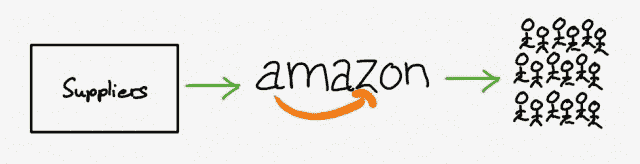
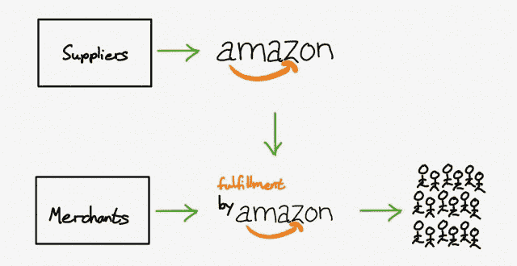
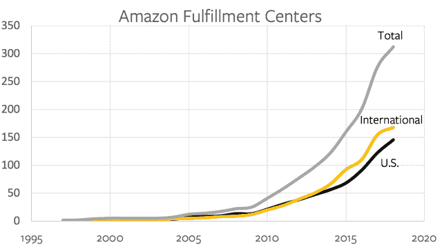
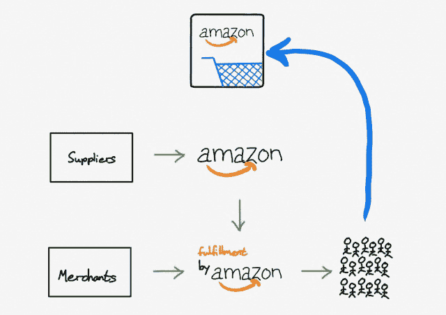
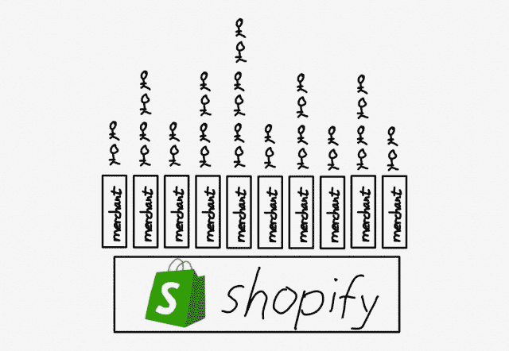
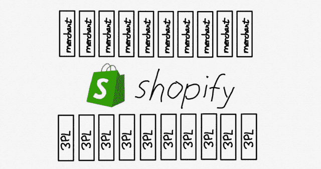
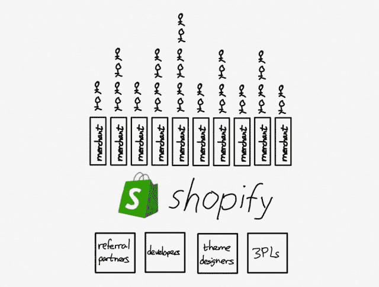

# Shopify 和平台的力量——本·汤普森的战略

> 原文：<https://stratechery.com/2019/shopify-and-the-power-of-platforms/?utm_source=wanqu.co&utm_campaign=Wanqu+Daily&utm_medium=website>

虽然我经常(理所当然地)被取笑我讨论[聚合理论](https://stratechery.com/concept/aggregation-theory/)，但我的疯狂是有原因的，尤其是在去年:越来越多的注意力被放在了像谷歌和脸书这样的聚合者手中，但在我看来，这种语言是完全错误的。

我去年详细讨论过这个问题:

*   [Tech 的两个理念](https://stratechery.com/2018/techs-two-philosophies/)强调了脸书和谷歌想如何为你做事；微软和苹果致力于帮助你把事情做得更好。
*   [护城河图](https://stratechery.com/2018/the-moat-map/)讨论了网络效应和供应商差异化之间的关系:网络效应越内化，供应商越商品化，网络效应越外化，供应商越差异化。
*   Finally, [The Bill Gates Line](https://stratechery.com/2018/the-bill-gates-line/) Formally defined the difference between aggregates and platforms. This is the key paragraph:

    > This is ultimately the most important difference between platforms and aggregators: platforms are powerful because they promote the relationship between third-party suppliers and end users; Aggregator, on the other hand, mediates and controls it.

因此，围绕像谷歌这样使用“平台”一词的公司的辩论，并不奇怪地与 20 年前的微软相提并论，误解了正在发生的事情，并不可避免地导致了会加剧现有问题而不是解决问题的药方。

然而，理解平台和聚合者之间的区别还有另一个原因:平台是聚合者最有效的竞争。

#### 亚马逊的分叉

本周早些时候，我写了一篇关于沃尔玛未能与亚马逊正面竞争的文章。在多年试图在电子商务中利用其商店后，沃尔玛意识到亚马逊正在获胜，因为电子商务需要一个与零售店根本不同的价值链。我在[的每日更新](https://stratechery.com/2019/walmarts-e-commerce-struggles-textbook-disruption-the-benefits-of-not-competing/)的重点是，对这种认识的正确反应不是试图模仿亚马逊，而是专注于商店实际上是优势的领域，比如杂货[，但值得理解的是，为什么正面攻击亚马逊是一个失败的命题。](https://stratechery.com/2019/the-value-chain-constraint/)

当亚马逊开始时，该公司遵循传统的零售模式，只是在线上。也就是说，亚马逊以批发价购买产品，然后卖给顾客:

[T2】](https://i0.wp.com/stratechery.com/wp-content/uploads/2019/07/IMG_272058378EFF-6.jpeg?ssl=1)

亚马逊的销售继续快速增长，不仅是书籍，还有其他媒体产品，如 DVD 和 CD，受益于亚马逊有效的无限货架空间。这种增长使亚马逊得以建立其履行网络，到 1999 年，该公司在美国有 7 个履行中心，在欧洲还有 3 个。

10 个可能看起来不多——亚马逊今天有 300 多个履行中心，加上更多的配送和分拣中心——但作为参考，沃尔玛只有 20 个。换句话说，至少在履行中心方面，亚马逊在 20 年前是沃尔玛目前规模的一半。

最终，亚马逊又花了 9 年时间达到 20 个履行中心(这是沃尔玛做出回应的时候了)，但与此同时，一项重要的公告改变了这些履行中心所代表的意义。2006 年，亚马逊宣布由亚马逊执行[，其中第三方商家也可以使用这些执行中心。他们的产品不仅会在 Amazon.com 上市，还会被亚马逊持有、包装和运输。](https://services.amazon.com/fulfillment-by-amazon/benefits.htm)

简而言之，Amazon.com 实际上将自己分成了零售部门和履行部门:

[T2】](https://i0.wp.com/stratechery.com/wp-content/uploads/2019/07/IMG_272058378EFF-5.jpeg?ssl=1)

旧的价值链仍然存在——Amazon.com 上近一半的产品仍然由亚马逊以批发方式购买并出售给客户——但第三方也可以直接销售给消费者，绕过亚马逊的零售部门，只利用亚马逊的履行部门，该部门发展迅速:

[T2】](https://i0.wp.com/stratechery.com/wp-content/uploads/2019/07/Screen-Shot-2019-07-11-at-8.32.49-AM.png?ssl=1)

沃尔玛和它的 20 个配送中心没有任何机会，特别是因为追赶意味着不仅要与亚马逊争夺消费者，还要与占据所有这些配送中心的所有第三方商家争夺消费者。

#### 亚马逊和聚合

我在上面画的这幅画还有一个更重要的部分:

[T2】](https://i0.wp.com/stratechery.com/wp-content/uploads/2019/07/IMG_272058378EFF-4.jpeg?ssl=1)

尽管事实上亚马逊已经有效地将自己一分为二，以纳入第三方商家，这种分工几乎不会引起顾客的注意。他们仍然去 Amazon.com，他们仍然使用同样的购物车，他们仍然得到带有微笑标志的盒子。基本上，亚马逊已经成功整合了第三方商家，同时从最终用户的角度来看，仍然拥有整个体验。

这听起来应该很熟悉:正如我在上面提到的，聚合者倾向于将他们的网络效应内部化，并将他们的供应商商品化，这正是亚马逊所做的。 [1](#fn1-4277 "While Amazon is not technically an Aggregator — the company deals with physical goods that absolutely have both marginal and transaction costs — one way to understand the company’s dominance is that its massive investments in logistics have driven those costs much lower than its competitors, allowing the company to reap many of the same benefits.") 亚马逊受益于更多的第三方商家在其平台上，因为它可以向消费者提供更多的产品，并证明建立广泛的履行网络是合理的；第三方商家大多沦为价格竞争。

不过，这表明有一个平台替代方案——即一家公司通过让其供应商实现差异化和外部化网络效应来创造一个互利的生态系统，从而取得成功。这种选择就是 Shopify。

#### Shopify 平台

乍一看，Shopify 根本不是亚马逊的竞争对手:毕竟，在 Shopify.com 上什么也买不到。然而，有 2.18 亿人从 Shopify 购买产品，甚至不知道这家公司的存在。

不同之处在于，Shopify 是一个平台:82 万个第三方商家位于 Shopify 之上，负责自己获得所有这些客户，而不是直接与客户互动。

[T2】](https://i0.wp.com/stratechery.com/wp-content/uploads/2019/07/IMG_272058378EFF-3.jpeg?ssl=1)

这意味着他们必须在 Amazon.com 的搜索结果中脱颖而出，或者仅仅提供最低的价格，而是通过差异化的产品、社交媒体广告等赢得客户的关注。可以肯定的是，许多人会在这一点上失败:Shopify 没有具体公布商家流失率，但几乎可以肯定它非常高。

不过，这才是重点。

与沃尔玛不同，Shopify 目前正在权衡是否在已经花费数十亿美元试图正面攻击亚马逊之后再花费数十亿美元，成败在此一举。这就是作为一个平台的美妙之处:你最终会成功(或失败)。

为此，我认为，对于 Shopify 来说，高流失率既是一个积极信号，也是一个消极信号:在该平台上开展电子商务业务越容易，失败就越多。同时，获得和支持成功的可能性也越大。

这就是为什么 Shopify 从长远来看是亚马逊的最大竞争对手，尽管它是亚马逊无法与之竞争的公司:亚马逊正在追求客户，并根据自己的条件将供应商和商家带到它的平台上；Shopify 让商家有机会脱颖而出，同时不承担失败的风险。

#### Shopify 履行网络

这是 Shopify 最近的合作伙伴会议 Shopify Unite 最有趣的公告之一的背景。这个名字听起来应该很熟悉:Shopify *履行*网络。

来自公司的[博客](https://www.shopify.com/enterprise/unite-2019#5):

> 顾客希望他们的网上购物快捷，免运费。现在，由于世界上最大的公司最近制定的标准，这是意料之中的。与第三方物流公司合作可能会很乏味。寻找一个不会掩盖你的客户数据或用包装隐藏你的品牌的合作伙伴是一个挑战。
> 
> 这就是我们建立 Shopify 履行网络的原因，这是一个地理上分散的履行中心网络，采用智能库存分配技术。我们使用机器学习来预测存储和运输您产品的最佳位置，以便它们能够尽快到达您的客户手中。
> 
> 我们已经与不断增长的仓库和物流供应商网络达成了低价协议，然后将节省下来的成本转嫁给你。我们支持多渠道、定制包装和品牌，以及退换货。而且都是在 Shopify 里面管理的。

第一段解释了为什么 Shopify 履行网络是 Shopify 的必要步骤:亚马逊可能会将供应商商品化，从网站到盒子隐藏他们的品牌，但如果它的产品真的很好，供应商就没有太多选择。在履行方面，情况越来越如此，特别是对于对 Shopify 很重要的小规模卖家来说，这不一定是为了短期创收，而是为了长期发展。亚马逊对商家来说更容易，对顾客来说更可靠。

不过，请注意，Shopify 并不是自己做所有的事情:有一个完整的第三方物流公司(被称为“3pl”)世界，提供仓储和运输服务。Shopify 所做的正是平台最擅长的:充当价值链两个模块化部分之间的接口。

[T2】](https://i0.wp.com/stratechery.com/wp-content/uploads/2019/07/IMG_272058378EFF-1.jpeg?ssl=1)

一方面是 Shopify 的数十万商家:对这些第三方物流公司来说，与所有这些商家单独打交道是不可扩展的；然而现在，他们只需要与 Shopify 接口。

同样的好处适用于相反的方向:商家没有办法与多个第三方物流谈判，使他们的库存处于最佳位置，以提供快速和廉价的交付给客户；更糟糕的是，我上面讨论的小规模卖家往往连这些物流公司的观众都找不到。然而现在，Shopify 的客户只需要与 Shopify 进行交互。

#### 平台对聚合器

此外，这也是 Shopify 在推荐合作伙伴(将新商家推上平台)、开发者(开发管理 Shopify 商店的应用)和主题设计师(销售主题以定制商店的外观和感觉)方面已经取得的成就。首席运营官·哈雷·芬克尔斯坦在 Unite 上说:

> 你经常听我说，我们 Shopify 希望为你的合作伙伴创造比我们自己获得的更多的价值，我发现证明这一点的最佳方式是看看我所说的“合作伙伴经济”。“合作伙伴经济”是流向我们所有合作伙伴的收入额……2018 年，Shopify 赚了大约 10 亿美元[ *编辑:in revenue* ]。我们估计你，我们的合作伙伴，赚了超过 12 亿美元。

换句话说，Shopify 清除了*比尔·盖茨线*——它获得了它所创造的生态系统中的一小部分价值——而 Shopify 履行网络应该正好符合:

[T2】](https://i0.wp.com/stratechery.com/wp-content/uploads/2019/07/IMG_272058378EFF-2.jpeg?ssl=1)

这种模式的强大之处在于，它利用了模块化的最佳部分——价值链不同部分的多样性和竞争——并协调了所有这些部分的激励。每一个推荐合作伙伴、开发者、主题设计者以及现在的第三方物流提供商同时受到激励，相互之间进行狭隘的竞争*和*确保了 Shopify 的广泛成功，因为这意味着每个人的蛋糕都更大了。

这是与亚马逊这样的整合型聚合商较量的唯一方式:试图复制亚马逊几十年来建立起来的东西，就像沃尔玛所做的那样，是疯狂的。亚马逊在所有方面都有优势，从更多的客户到更多的供应商，到更低的履约成本，再到更快的交付。

竞争的唯一出路是差异化；诚然，沃尔玛已经尝试购买和推出其商店专属的新品牌，但就电子商务商品而言，差异化并非来自自上而下的规划。更确切地说，它是从广泛的机会中冒出来的(而且还会流失！)，就像 Shopify 创建的那样，由一个完整的生态系统支持。

### *相关*