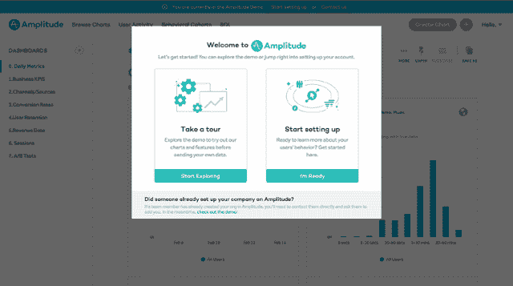
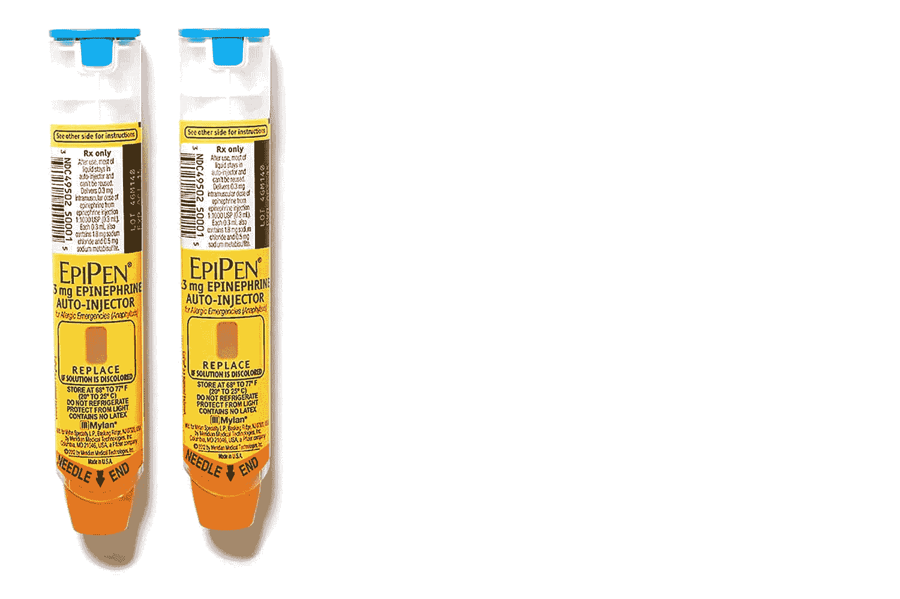

# 产品信息的滑坡||设计师领导者 Matthew Strö

> 原文：<https://matthewstrom.com/writing/wayfinding.html?utm_source=wanqu.co&utm_campaign=Wanqu+Daily&utm_medium=website>

**产品内教育**是一种从用户体验设计、营销策略和产品管理的重叠中出现的模式。一个简单的定义:产品内教育向已经使用产品的人推销产品。想想你从聊天机器人那里收到的信息，当你注册新账户时看到的导游，或者成为专业用户时被邀请参加的网络研讨会。这就是产品内教育。

Dropbox onboarding image by [Useronboard.com](https://www.useronboard.com/how-dropbox-onboards-new-users)

最近，产品内教育领域的产品和服务出现了爆炸式增长。新工具有望增强您的应用程序的用户体验并推动商业价值。诚然，产品内教育可以在短期内提高关键指标。但从长远来看，对产品内教育的投资会限制用户体验。

要了解原因，让我们将应用程序与机场进行比较。

## 机场和应用

机场和应用的用户体验关注点是相似的。旅行者带着待办事项清单通过机场:找到登机口、吃午餐、使用洗手间、取回行李、通过海关、给手机充电。应用程序用户也有一个任务清单:他们需要更新个人资料，阅读电子邮件，创建新的博客帖子，或者报税。但是有时用户找不到完成任务的途径。这也是机场面临的一个问题。

Airport signage photo by [George Kourounis on Unsplash](https://unsplash.com/photos/UxAXiKklRLg?utm_source=unsplash&utm_medium=referral&utm_content=creditCopyText)

对于一个机场来说，乘客流失=收入损失。如果你的乘客找不到美食广场，他们就不会花钱。如果他们找不到登机口，他们就会错过航班。如果他们找不到垃圾桶，你的清洁费会更高。机场通过在繁忙地区放置易读的指路标志来解决这个问题。对于一个机场来说，投资于良好的路标是显而易见的。

这就是产品内教育的论点:失去用户=失去收入。例如，gmail 告诉新用户在哪里可以找到他们的收件箱，这样他们就知道去哪里阅读他们的电子邮件。但是我们软件制造商有一个机场制造商没有的机会。我们可以把美食街搬走。

## 机会成本

基础一旦建立，机场的开发商就不能重新设计建筑。与移动终端和便利设施的成本相比，新标志的成本几乎为零。如果旅行者迷路了，增加更多的标志。这是显而易见的。

当一个应用的用户找不到路时，开发者有更多的选择。用户体验的增量变化既快又便宜。但是产品内教育也可以很便宜。

像 AppCues 和 Intercom 这样的产品已经改变了产品内教育的成本结构。开发者不必自己搭建应用内教育；他们可以安装一个库，并将控制权交给营销团队。

An example of what you can build with AppCues, from the [AppCues blog](https://www.appcues.com/blog/how-amplitude-bypassed-engineering-bottlenecks-by-using-appcues)

有了即插即用的库，产品内教育是一个有吸引力的选择。但是使用产品内教育有一个隐藏的成本:机会成本。这就是滑坡的开始。

当团队使用这些工具为他们的用户指出正确的方向时，他们不知道为什么用户会在第一时间迷路。如果潜在的问题永远得不到解决，指路标志可能会成为风景中的永久固定装置。随着时间的推移，这种循环导致用户体验变得越来越复杂。

## 诺曼门和 EpiPens

诺曼门是这种复杂性螺旋的一个例子。你可能没听过这个术语，但我肯定你经历过诺曼门。这是一扇诺曼门:

An example of a Norman door, by [Cameron Moll](https://twitter.com/cameronmoll/status/1016726780240060416)

在一篇[文章和视频中，](https://99percentinvisible.org/article/norman-doors-dont-know-whether-push-pull-blame-design/) 99%看不见描述了诺曼门:

> 所谓的“诺曼门”的设计元素给了你错误的可用性信号，以至于需要特殊的标志来阐明它们是如何工作的。没有标志，用户只能猜测是推还是拉，造成不必要的挫败感。

诺曼门不是偶然出现的。设计师必须意识到人们没有正确使用门，并添加一个标志。尽管好的门设计无处不在，诺曼门依然坚持。不要让你的 app 成为诺曼门。

* * *

更令人担忧的例子是 EpiPen。与大多数胰岛素笔和普通注射器不同，最初的 EpiPen 的盖子和针头位于相反的两端。在一篇深入的文章中，李乐诗描述了这种设计导致的危机:“[在 1994 年至 2007 年间，]有超过 15000 例意外注射 EpiPen 的报道。”

为了解决意外注射的问题，Mylan(epi pen 的制造商)在笔的针端添加了文字。

The updated EpiPen design

[根据一项研究](https://www.ncbi.nlm.nih.gov/pubmed/25850463)，更新的钢笔的**成功率只有 67%。** ProPublica 写道:

> 同一项研究将 EpiPen 与另一种肾上腺素自动注射器 Auvi-Q 进行了比较……Auvi-Q 的设计是将盖子和针头放在同一端，成功率超过 90%。

不要让你的应用程序成为一个 EpiPen。

## 结论

如果你正在考虑使用产品内教育来指导你的用户，试着去解决潜在的问题。如果你正在介绍一个新产品或新功能，让用户按照他们自己的步调去探索。让功能显而易见。利用你所学到的知识来避免将来的可用性问题。建立强大的反馈回路，让用户在遇到问题时告诉你。不要用发展核心竞争力的机会来换取短期的预算胜利。用与诺曼门同名的唐·诺曼的话说:

“任何时候你看到标志或标签添加到一个设备，这是一个坏设计的迹象。”

* * *

