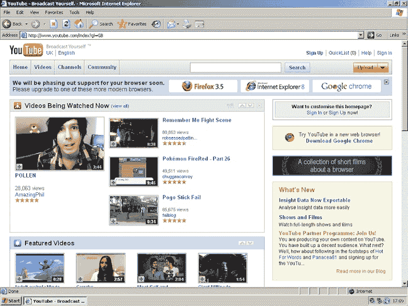
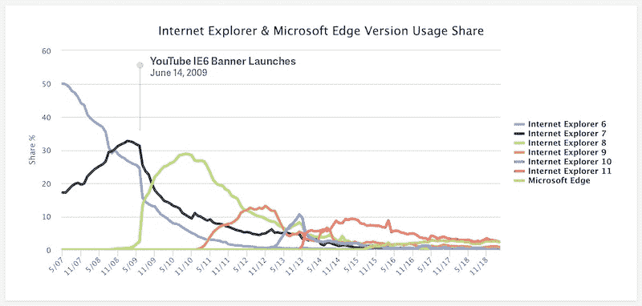

# 杀害 IE6 的阴谋

> 原文：<https://blog.chriszacharias.com/a-conspiracy-to-kill-ie6?utm_source=wanqu.co&utm_campaign=Wanqu+Daily&utm_medium=website>

<time datetime="2019-05-01" class="article_time">May 1, 2019</time>

YouTube 令人难以置信的增长带来了苦乐参半的后果，那就是太多的故事将会被新的油漆层掩盖。这就是为什么我想讲述一个故事，十年前，一个 web 开发人员小组密谋从 YouTube 内部杀死 IE6 并侥幸逃脱。

我不记得是什么确切的触发事件导致我们的 web 开发团队在 YouTube 自助餐厅的午餐上制定了杀死 IE6 的计划。也许是时候推出一个 CSS 样式表了，它在一个半支持的 HTML 元素上包含一个属性选择器。任何一个理性的 web 开发者都会认为这一点会被不能胜任这项任务的浏览器所忽略。旧版本的 IE 就不是这样了。在非常特殊的情况下，IE 中不受支持的 HTML 元素上的属性选择器会创建一个内部递归，这在最好的情况下会导致浏览器崩溃，在最坏的情况下会触发蓝屏死机。或者这可能是我们的软件工程师第一百次无意中推出一个带有空 src 属性的``标签。没有人知道在 IE 的早期版本中，浏览器会为空的 src 属性加载根路径“/”。标签会突然表现得像一个 T2，加载我们的主页和所有依赖它的资源，这可能成为一个指数级扩展的递归循环。每当一个空的图像标签出现在主页上时，在我们把我们的服务器变成镇纸之前，所有人都在紧急寻找和替换违规的代码。

不管当时的事件是什么，它都是残酷的，并且与 IE6 有关。IE6 曾经是我们 web 开发团队的祸根。每个主要的 sprint 周期至少要花一到两周的时间来修复 IE6 中出现的新 UI。尽管有这种痛苦，我们被告知必须继续支持 IE6，因为我们的用户可能无法升级，或者可能在被锁定的公司工作。那时，IE6 用户占我们用户群的 18%。我们知道我们不能放弃对它的支持。然而，坐在那个自助餐厅里，在过去的几天里每个人只睡了几个小时，我们对这些用户的同情已经完全消失了。我们开始集体幻想如何向 IE6 复仇。一个想法浮出水面，很快吸引了所有人的注意力。与其直接放弃对 IE6 的支持，不如我们直接威胁放弃？用户会有什么反应？他们会反抗 YouTube 吗？他们会像过去一样给我们的团队邮寄死亡威胁吗？或者他们会突然成为现代浏览器的大声拥护者吗？我们公开幻想世界各地的办公室职员突然发明出需要升级浏览器的创造性“商业”理由。祖父母会挟持他们精通技术的孙子孙女，要求他们修理他们的“YouTubes”。作为团队治疗会议开始的东西开始具体化为一个实际的计划，一个我们很快意识到我们是唯一能够执行的计划。

这个计划非常简单。我们会在视频播放器上方放一个小横幅，只对 IE6 用户显示。上面会写着“我们将很快停止对你的浏览器的支持。请升级到这些更现代的浏览器之一。”文本旁边是主要浏览器的当前版本链接，包括 Chrome、Firefox、IE8 以及最终的 Opera。文本故意含糊不清，时间表也完全没有定义。我们希望它有足够的威胁来激励最终用户升级，而不强迫我们承诺任何实际的弃用计划。如果用户想忽略它或者以后再处理它，他们可以关闭这个警告。代码被设计得尽可能的微妙，这样就不会引起任何监视我们签到的人的注意。除了 web 开发团队，没有人真正有规律地使用 IE6，所以我们知道不可能有人会注意到我们的横幅出现在 staging 环境中。我们甚至推迟了为国际用户翻译的文本，这样一个要求额外上下文的翻译就不会无意中暴露我们正在做的事情。接下来，我们只需要一种方法，在不被任何人发现的情况下将代码投入生产。

2009 年 YouTube 上的 IE6 反对横幅

事实证明，我们中的一些人是在一个有趣的时间进入 YouTube 的……在 YouTube 被谷歌收购几个月后，但在谷歌开始将 YouTube 深度整合到他们更大的组织之前。早期的 YouTube 工程师理所当然地有自己的地盘，最初对适应谷歌的基础设施和规范犹豫不决。由于他们对灰帽黑客、跑车和烈性威士忌的嗜好，以及罕见的穿孔、纹身和轻微的逮捕记录，许多人在之前的谷歌面试中被拒绝。结果却是在 YouTube 上，他们发现自己竭尽全力地领先于指数级增长的流量，同时不得不不断地反驳那些解释谷歌视频将如何立即杀死他们的批评者。当他们被谷歌收购时，这些工程师中的许多人已经开始将他们被排斥的身份视为他们最终成功的关键因素。

为了在整合到 Google 的过程中巩固他们在 YouTube 代码库上的权威，早期的工程师们创建了一个名为“OldTuber”的专门权限集。OldTuber 赋予了你完全绕过新的面向 Google 的代码执行策略的能力，使得任何持有它的人都可以直接将代码提交到 YouTube 代码库，只需要任何人对代码进行最粗略的审查。不需要代码可读性。不需要详尽的测试。不需要维护代码覆盖率。如果你因为不恰当地使用 OldTuber 的身份而破坏了这个网站，那将是你的责任，你将立即失去这个特权，如果不是你的工作的话。所以你只要做个好公民，永远不要破坏网站。我们的老板是早期的 YouTube 工程师，他竭尽全力讨好 web 开发团队和其他早期的 YouTube 工程师。通过他的努力，我们中的几个人最终发现自己拥有了老块茎的地位，尽管从未成为最初团队的一员。就好像我们正走在街上，有人误以为我们是服务生，把他们法拉利的钥匙递给了我们。不管是好是坏，我们都不是那种会把钥匙还回去然后走开的人。我们看到了一个让 IE6 永久瘫痪的机会，这个机会我们可能再也不会有了。如果出了差错，我们中的一些人肯定会被解雇。我们最叛逆的 web 开发人员，一个说话温和的克罗地亚人，坚持以他的名字签入代码，作为个人荣誉的徽章，而我们其他人利用我们的老同事身份批准了代码审查。代码合并到产品中，几天后我们的横幅就上线了。

第一个来到我们办公桌旁的人是公关团队的领导。他是一个聪明、衣冠楚楚的人，总是充满活力和热情。除了这次。这一次他异乎寻常地易怒。他在平常的一天来到办公室，发现每一个主要科技新闻出版物都发来电子邮件，询问为什么这个地球上第二大网站威胁要切断近五分之一用户群的访问。对我们来说幸运的是，出版物已经确定了这是互联网的一大优势。通过他们的呼吁，YouTube 引领了让网络为所有用户提供更快、更安全体验的潮流。整个公关团队都在苹果电脑上运行 Chrome，甚至看不到我们做了什么，更不用说对媒体发表评论了。他们完全没有意识到。我们急切地告诉他们我们发布的所有内容，并帮助他们构思必要的谈话要点，以扩展媒体已经建立的叙述。公关团队领导对他能够回到故事的前面感到满意，转过身警告我们，在没有告诉他之前，永远不要做这样的事情。他不想再错过这样的公关良机。

接下来是律师。两名资深律师带着一种拘谨的恐慌状态冲向我们的办公桌。他们立即要求我们撤下横幅。我们解释了我们将如何需要 SREs 做一个紧急推动，这将需要至少几个小时。其中一名律师沮丧地问道:“你为什么要把 Chrome 放在第一位？”我很困惑，解释说我们没有给 Chrome 任何优先权。我们的老板知道我们的阴谋，他深思熟虑地建议我们随机排列浏览器的顺序，然后为每个访问者制作随机种子，这样用户界面就不会在页面之间跳来跳去，我们已经这样做了。幸运的是，这两位律师仍然使用 IE6 访问某些遗留系统，并且都以随机种子结束了 Chrome 的排名。他们担心的是，通过对 Chrome 的优惠待遇，我们可能会激怒已经在关注任何反竞争行为的欧洲监管机构。虽然律师们承认，我们所做的一切都不太可能上升到那种犯罪水平，但这是在他们的眼皮底下发生的，他们并不欣赏这一点。我反复清除我的 IE6 版本中的 cookies，并展示了每次刷新时浏览器的重新洗牌。满足于示范，律师们迅速回到他们的办公桌，没有任何进一步的关注。

我预计下一批人会是工程经理，他们会是最愤怒的，因为我们显然滥用了自己的老大地位。可疑的是，那天没有人来过。第二天，一些工程师在阅读了互联网上的文章后，停下来祝贺我们推出了横幅，但仅此而已。我问我的老板，他是否会受到什么负面影响，他耸耸肩，表示还没有人把他拉到一边。似乎目前我们是清白的。对此我感到惊讶和不解，于是我询问了一位经理，看他对推出横幅有何看法。他回应道:“哦，我只是觉得你们抄袭了谷歌文档的横幅。”我很困惑。谷歌文档怎么可能在这一点上抢先我们一步呢？我在 IE6 中打开谷歌文档，果然，一个和我们非常相似的横幅出现在顶部。它恳求他们的用户升级，以避免破坏与我们类似的模糊条款的功能。

在开发一些共享的 Javascript 库时，我遇到了 Google Docs 团队的一些工程师。我联系了其中一位，问他们是如何决定推出自己的横幅的。他向我解释说，他们早就想放弃 IE6 支持，但是他们的经理不同意，原因和我们一直听到的一样。他们在 IE6 测试中的一名工程师在 YouTube 上线后不久就注意到了它的横幅，并立即将它交给他们的经理，作为他们为什么应该这么做的证据。此后不久，谷歌文档的工程师们举起了他们自己的 IE6 旗帜，并将其投入生产，大概是在错误的假设下，我们已经做了我们的努力，并获得了所有必要的批准。许多谷歌人第一次听到关于 IE6 横幅的聊天是从其他团队开始询问他们是否可以像谷歌文档一样反对 IE6 的电子邮件帖子中。幸运的是，这其中包括我们的许多经理。令人惊讶的是，作为谷歌内部 IE6 横幅的发起者，我们以某种方式绕过了检测。

最终，YouTube 的工程管理人员确实问了自己，最终是如何决定放弃 IE6 的，因为这发生得太快，对于我们这样规模的媒体网站和如此广泛的用户群来说，似乎明显为时过早。一旦他们意识到发生了什么，他们就把我们的老板逼到角落里询问细节，努力解决我们行为的后果，并不情愿地得出结论，结果证明了手段的正当性。在 YouTube、Google Docs 和其他几个张贴 IE6 横幅的谷歌网站之间，谷歌已经允许其他网站添加自己的横幅。IE6 横幅突然开始到处出现。在一个月内，我们的 YouTube IE6 用户群减少了一半，全球 IE6 流量下降了 10%以上，而所有其他浏览器的流量都有相应的增长。结果比我们的 web 开发团队预期的要好。

不同 IE 浏览器版本的历史份额(https://www.w3counter.com/trends)

我们以某种方式逃脱了杀死 IE6 的计划，而没有面对任何有意义的纠正措施。很少有人知道我们参与其中，那些知道的人也不想引起注意，或者冒着鼓励类似行为的风险。在旧金山的一个啤酒花园，我们的老板使劲眨着眼睛，让我们发誓再也不做这样的事情。我们同意了，举杯庆祝 IE6 下降到个位数的百分比，并且再也没有偷偷把任何东西投入生产。

Eleven thousand two hundred and fifty-nine

荣誉

Eleven thousand two hundred and fifty-nine

荣誉

