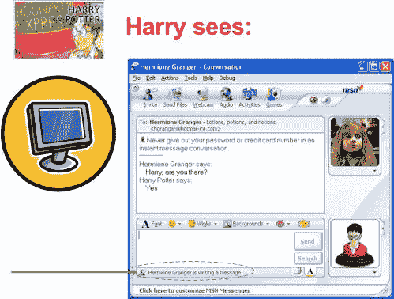

# 丹尼·格拉瑟正在打字……|丹尼·格拉瑟

> 原文：<https://dglasser.wordpress.com/2019/07/22/danny-glasser-is-typing/?utm_source=wanqu.co&utm_campaign=Wanqu+Daily&utm_medium=website>

在我的微软职业生涯中，我有机会参与了许多项目，这些项目产生了我被列为发明人的专利。撇开围绕软件专利和专利钓鱼的问题不谈，我对我名下的任何专利的自豪几乎与专利本身无关，专利的申请和授权主要是律师的工作。这种自豪感来自于刺激专利申请的工作的实用性以及我个人对这项工作的贡献。

我很少关心我和比尔·盖茨一起被列为共同发明人的几项专利——例如， [8，341，405:异地环境中的访问管理](https://patents.google.com/patent/US8341405)——尽管我和他的合作在专利记录中反映了荣耀。这些专利是“前瞻性专利”项目的一部分，我在其中投入了最少的努力，因此我对随后的任何发明几乎没有任何功劳。

相反，我最引以为豪的专利是我负责最初构思和实施的一项发明，这项发明至今仍在广泛使用。在美国专利数据库中，它是 [6，519，639:计算机网络中活动监控和报告的系统和方法](https://patents.google.com/patent/US6519639)，但对其他人来说，它被称为“打字指示器”

最近一直在想这个专利，因为今天是[MSN Messenger 1.0](https://news.microsoft.com/1999/07/21/microsoft-launches-msn-messenger-service)推出二十周年，打字指示灯首次亮相的产品。虽然 [MSN Messenger](https://en.wikipedia.org/wiki/Windows_Live_Messenger) 已经不再使用，但打字指示器[很快被广泛复制](https://www.goodreads.com/quotes/183452-imitation-is-the-sincerest-form-of-flattery)，并且仍然是几乎所有聊天和消息应用的一个功能。无论你使用 Facebook Messenger、iMessage、WhatsApp、Skype 等。、或客户支持网站的聊天插件时，您会遇到动画圆点或“[name] is typing…”消息，该消息可追溯到该作品。

[David Auerbach 五年前在 Slate 中详细解释了打字指标的历史](https://slate.com/technology/2014/02/typing-indicator-in-chat-i-built-it-and-im-not-sorry.html)，这里就不一一赘述了。总结一下，在 MSN Messenger 之前，实时聊天应用程序要么不告诉你对方的用户是否在回复你的消息( [IRC](https://en.wikipedia.org/wiki/Internet_Relay_Chat) 或 [AIM](https://en.wikipedia.org/wiki/AIM_(software)) )，要么实时显示用户输入的每个字符( [Unix talk](https://en.wikipedia.org/wiki/Talk_(software)) 和 [ICQ](https://en.wikipedia.org/wiki/ICQ) )。当我们开发 MSN Messenger 时，我们相信我们可以做得更好；这种东西可以给你实时的反馈，告诉你其他用户是否在打字，同时相对高效地利用网络，给其他用户提供一点隐私，让他们知道自己的想法和打字错误。我为打字指示器的检测和通信设计并编码了实现，并添加了一个粗糙的 UI 来创建一个概念证明。一旦我们确认自托管运行良好，David 和其他人就设计并实现了 MSN Messenger 1.0 中附带的完美 UI。

由于打字指示器专利仅涵盖检测和通信机制，而不包括用户界面，因此 David 和其他从事初始实现的人没有被列为专利的发明人。这并没有减少他们对工作的贡献。MSN Messenger 1.0 因微软与 AOL 的 IM 互操作性之战而变得更为人所知，大卫在他的文章[聊天大战](https://nplusonemag.com/issue-19/essays/chat-wars/)中描述了这一点。

打字指示器专利意义重大*今天*—2019 年 7 月 22 日的原因是，最初的申请是在 1999 年 7 月 21 日提交的，即 Messenger 推出的前一天，而美国专利通常在提交后二十年到期。这应该意味着，除了微软的律师提交了几项延续专利，最近的 [7，418，495](https://patents.google.com/patent/US7418495B2/en) ，原来的专利保护从今天起不再有效，所以打字指示器专利还剩下一点点生命。

也就是说，据我所知(也不远)，微软从未追究过任何人侵犯这项专利。在许多情况下，微软与其他产品的所有者(例如 iMessage 的苹果公司)有专利交叉许可协议，这使得这个问题变得没有实际意义。此外，该功能的新实现可能不会侵犯该专利家族的具体权利，但我不知道是否有人愿意证实这一点。

在 MSN Messenger 首次推出几年后，那时还没有智能手机，当我去我孩子的一年级班级参加一个“你的父母以什么为生”的课程时，我用打字指示器作为一个例子。我创建了这些 IM 会话的模型，向 6 岁的孩子演示它是如何工作的，并把它们打印成海报大小:

* * *

[因为 Messenger 中添加了笔支持，所以打字指示符的文本当时为“正在书写”。]

这些模型的质量应该说明为什么除了我之外的其他人实现了输入指示器 UI 的发布版本。

### 像这样:

像 装...

### *相关*