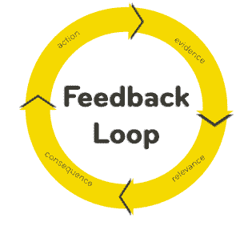

# 在市场营销中，社会证据是国王、王后和皇帝——奥伦·霍夫曼的总结

> 原文：<https://summation.net/2019/07/30/in-marketing-social-proof-is-king-queen-and-emperor/?utm_source=wanqu.co&utm_campaign=Wanqu+Daily&utm_medium=website>

很多营销都是社会证明。你使用产品是因为你看到其他你欣赏的人在使用产品。B2B 营销更是如此。

当社会证明运作良好时，它是一个反馈环。行动创造证据，证据创造相关性，然后创造结果。

这在你个人购买的产品和你为企业购买的产品中都是如此。对家庭、学校、医疗程序，甚至政治候选人都是如此。社会证明是说服你选择任何产品的首要因素。

如果你是一名营销人员，你需要承认社会证明的力量，并利用它为自己服务。

对于对产品进行尽职调查的人来说，社会证明是一个非常好的捷径。他们想了解还有谁在使用某个产品，以及他们对这个产品的看法。

在市场营销中，社会证明是国王、王后和皇帝。

 ## **社交证明在 B2B 软件中显得很重要**

Stripe 是您企业的最佳支付处理器吗？我不知道。但我知道，我尊敬的许多公司都使用 Stripe，也喜欢 Stripe……因此，如果我需要支付处理器，我会选择 Stripe。我可能也会使用 Square，因为我尊敬的许多公司都在使用它。

因为社会证明，我会假设很多关于条纹和正方形的东西。我想他们是有信誉的。我假设他们在技术上是熟练的。我假设他们有很好的防欺诈保护。我会假设这些服务有很多积极的方面(实际上可能不是真的)，因为它们周围有大量的社会证据。

## **审核网站和社会证明**

评论如此重要的原因之一是因为社会证明。在这里，原始评论的数量是社会证明的关键。亚马逊上的充电器评论，G2 Crowd 上的数据库评论，或者 Glassdoor 上的公司文化评论。营销人员花费大量时间管理这些评论，有时还玩弄这些评论。

当然，当这些评论太容易被游戏化时，它们会被大打折扣。

## 明星代言是如此强大。

这就是明星代言如此强大的原因。你可能会崇拜丹泽尔·华盛顿，如果他支持丰田，那你就更有可能买一辆丰田。当然，如果你知道代言人因代言而获得报酬，你可能会对推荐打折扣……但即便如此，代言也可能是强有力的(因为你知道丹泽尔·华盛顿有标准，不只是代言每一种产品)。

目前市场营销中最热门的事情之一是影响者营销(付钱给一个受欢迎的 YouTuber 来宣传你的产品)。越多的认可被认为是真实的，你就越有可能被产品吸引。

我特别喜欢马尔科姆·格拉德威尔在他的播客[修正主义历史](http://revisionisthistory.com/)中所做的背书。他滔滔不绝地谈论他对 ZipRecruiter 的爱。我不知道 ZipRecruiter 是好是坏，但马尔科姆·格拉德威尔的代言(尽管我知道这是一个直接的付费代言交易)让我想去看看。

## **选择一所学校送你的孩子去**

达到相当富裕水平的人有大量的学校可供他们的孩子选择。仅旧金山就有数百所学校(公立和私立)——其中许多学校的评价极高。你应该为你的孩子选择哪一个？

大多数人使用社会证明。他们看着他们崇拜的人，看着那些人把他们的孩子送到哪里…然后他们做出相应的选择。

对 200 所学校进行深入的尽职调查需要太长时间。事实上，即使是对一所学校进行深度尽职调查，也需要太长的时间。一个更容易的捷径是寻找社会证据。

如果你是一家初创企业，从定义上来说，很少有人加入你的公司。这意味着大多数候选人不认识任何已经加入你公司的人(或者甚至没有参加过你公司的面试)。所以获得社会证明是相当困难的)。像谷歌、高盛和麦肯锡这样的大公司没有这个问题——大多数顶尖候选人都认识很多加入这些组织的人。

总结:在营销中，首先关注社会证明。

<noscript></noscript>

这是最初发布在 Quora 上的[。](https://www.quora.com/Are-social-proof-needed-for-online-marketing-strategies/answer/Auren-Hoffman)

### 像这样:

像 装...