# 从 0 到 70%的市场份额:谷歌 Chrome 如何蚕食互联网

> 原文：<https://usefyi.com/chrome-history/?utm_source=wanqu.co&utm_campaign=Wanqu+Daily&utm_medium=website>

2008 年，微软的 IE 浏览器几乎占据了全球 60%的浏览器市场份额。Mozilla 的 Firefox 以大约三分之一的市场份额远远落后于第二名。搜索巨头谷歌于 2008 年 9 月 2 日推出的全新 Chrome 浏览器仅占 0.3%的市场份额。

十年后，Chrome 实际上拥有了浏览器市场，其市场份额几乎达到了 70%。谷歌是如何在短短十年内进入并主导一个全新的领域的？

从根本上改造浏览器。

谷歌从一开始就将 Chrome 视为一个平台。对谷歌来说，浏览器不仅仅是浏览网页的一种方式。它是日益多样化的工具和应用程序之间的纽带，这些工具和应用程序正在改变我们几乎在网上做任何事情的方式。

本文将探讨以下内容:

*   为什么开发者，而不是普通的互联网用户，是谷歌 Chrome 的主要目标
*   谷歌是如何在拥挤的市场中，在短时间内大幅增加 Chrome 的用户群的
*   Chrome 如何让谷歌对更广泛的互联网趋势施加更大的影响

Chrome 不仅仅是一个伟大的浏览器。这也是一个很好的例子，说明一个产品如何挑战传统智慧，重塑我们对日常使用工具的看法。

2008 年，互联网的前景非常不同。我们使用互联网的方式开始改变，谷歌发现了一个为开放网络创建全新操作系统的机会，并利用了微软的自满和 Internet Explorer 的局限性。

谷歌没有浪费时间利用的漏洞。

## 2008-2013:重新思考浏览器

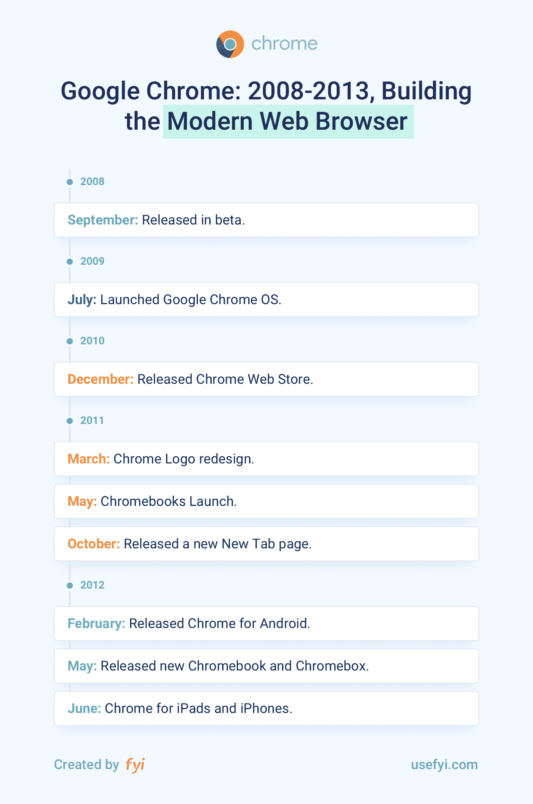

今年是 2008 年。苹果的 iPhone 上市还不到一年。Windows 7 已经推出几个月了，人们仍然对 Windows XP 的命运感到不安。雅虎！刚刚拒绝了微软以每股 31 美元收购该公司的提议。微软的 Internet Explorer 是世界上最流行的网络浏览器。

2008 年，围绕消费技术的生态系统大不相同，不仅仅是从硬件的角度来看。iPhone 的推出是将应用程序推向主流的催化剂。问题是应用程序还不是主流。当然，它们很受欢迎，但远没有像今天这样无处不在。

应用程序在 2008 年就出现了，但网页仍然是大多数人与在线服务互动的方式。

网上银行在那个时候并不新鲜，但你仍然需要登录一个有密码保护的网页来访问你的账户信息。你可以在网上订购商品，但很有可能你是从台式机或笔记本电脑而不是移动设备上订购的。

网络正在迅速变化。另一方面，浏览器则不然。自从 1995 年 IE 浏览器首次亮相以来，微软已经对其进行了一些改进，但在很大程度上，2008 年使用 IE 浏览网页的体验与 1998 年基本相同。

谷歌明白，如果要实现 Web 2.0 的承诺，这个世界需要新的东西。谷歌也明白，如果它动作够快，出牌正确，它面临着在自己的游戏中击败微软的巨大潜在机会。

谷歌 Chrome 于 2008 年 9 月 2 日正式推出测试版。为了宣传 Chrome，谷歌制作了一部简短的漫画，解释了谷歌为什么要开发自己的浏览器。

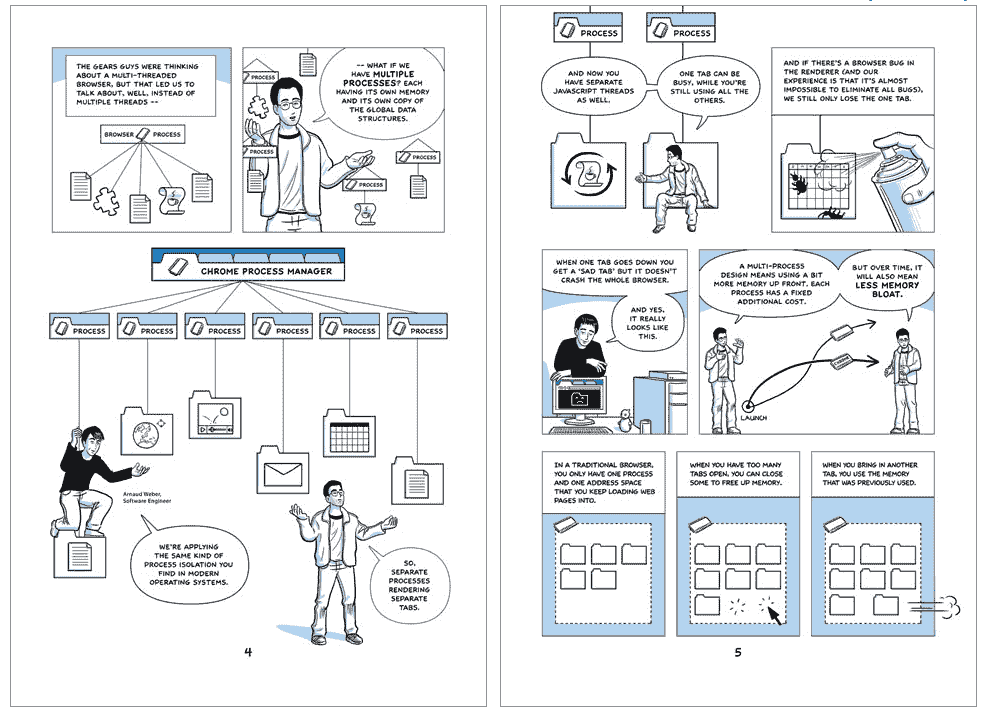

[Source: Google](https://www.google.com/googlebooks/chrome/index.html)

谷歌组建了一个由经验丰富的浏览器开发者组成的团队来开发 Chrome。Ben Goodger 在 2005 年加入谷歌之前曾在网景和火狐工作过，他被任命负责 Chrome 项目，包括招聘。2005 年至 2006 年间，谷歌从火狐挖走了几位杰出的开发人员，包括达林·费舍尔、帕姆·格林和布莱恩·雷纳。他们的工作是在 HTML 布局引擎 WebKit 的基础上创建一种全新的浏览器，它将支持像谷歌地图这样的“永远在线”的网络应用。

尽管创造全新的网络技术存在技术挑战，但 Chrome 团队在竞争中有一个重要优势。他们完全从零开始。虽然开发 IE 和 Firefox 的工程师们也在试图让他们的浏览器适应越来越多样化的任务和应用，但他们不得不使用传统技术。另一方面，谷歌可以专注于构建定制工具，而不用担心过去用于创建浏览器技术的任何模式。

很早以前，Chrome 就决定将每个标签“沙箱化”到自己的进程中。这种方法解决了多个问题。第一，它防止了一个标签页撞上另一个标签页，带来了更稳定的浏览体验。第二，它提高了单个进程的速度，因此多个进程可以并发运行。第三，它更加符合网络的发展方向。应用程序，而不是页面。

> *“我们的网络浏览器应该将浏览器标签分离到自己的进程中，多线程处理与操作系统的所有通信，增加缓存大小，并且在可用时不要害怕要求更多的带宽。Internet Explorer 8、Firefox 3.1 和 Apple Safari 正在为现代机器的网络浏览器采取新的方法，但谷歌 Chrome 有一个新的开始，可以实现一些目前在其他浏览器架构中不可能实现的功能。”——*

谷歌没有乱来。谷歌自己承认，它正在彻底反思浏览器的整个概念。谷歌正在寻找浏览器技术中最困难、最核心的问题，并致力于比任何人都更有效地解决这些问题。

尽管谷歌并不羞于宣布其对网络浏览器未来的打算，但它实际上在 Chrome 上工作的方式绝对是非正统的。谷歌曾依赖苹果的 WebKit 渲染引擎和 Mozilla 的 Firefox 来开发 Chrome，但谷歌不只是想开发一个更好的浏览器。谷歌希望有热情的开发者来帮忙。这就是为什么谷歌在 2008 年 9 月决定开源整个努力，作为其 Chromium 项目的一部分。

这是明智的，原因有二:

1.  开源 Chromium 项目给了谷歌一个更好的方法来持续改进 Chrome 产品。
2.  由于开源社区和 Mozilla 等组织的倡导，它与越来越流行的开放网络标准紧密结合。

当时谷歌最大的目标，微软，正采取完全相反的方法，通过保持封闭来开发 IE，这并没有什么坏处。

到 2009 年 7 月，也就是 Chrome 正式发布 9 个月后，超过 3000 万人使用 Chrome 浏览网页。Chrome 很快，真的很快，人们已经注意到了。2009 年 7 月也是谷歌宣布即将推出 Chrome 操作系统的日子。

> “我们把操作系统设计得又快又轻，几秒钟就能启动并让你上网。用户界面是最小化的，不会妨碍你，大部分用户体验发生在网络上。正如我们对谷歌 Chrome 浏览器所做的那样，我们将回归基础，彻底重新设计操作系统的底层安全架构，以便用户不必处理病毒、恶意软件和安全更新。它应该能正常工作。”——**[谷歌](https://googleblog.blogspot.com/2009/07/introducing-google-chrome-os.html)**T5】

2009 年 12 月，谷歌推出了其[扩展图库](http://www.chromeextensions.org/)。概述了许多第三方插件，用户可以在 Chrome 中安装这些插件来为浏览器提供额外的功能，扩展库展示了 Chrome 的扩展是多么的通用。

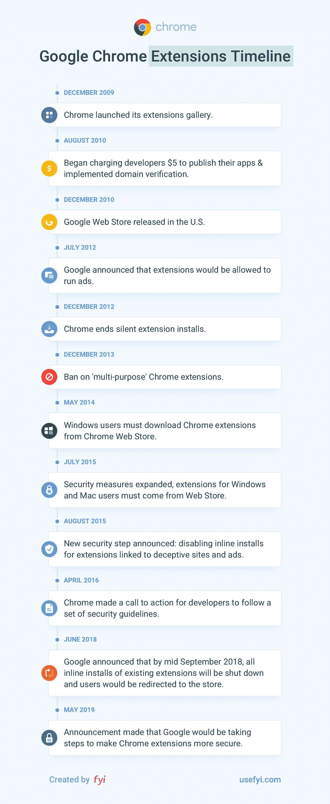

扩展、插件和附加组件在今天可能无处不在，但在 2009 年，这是一个非常激进的概念。除了沙盒标签之外，扩展可以说是 Chrome 作为一个产品的决定性特征。它们也非常受欢迎。到 2010 年 12 月，也就是推出扩展库一年后，通过扩展库已经有超过 8，500 个扩展和 1，500 个浏览器主题。Chrome 的[1.2 亿多用户](https://googleblog.blogspot.com/2010/12/update-on-chrome-web-store-and-chrome.html)中大约有三分之一安装了至少一个扩展，超过 7000 万个扩展和主题已经安装在 Chrome 的整个用户群中。

Chrome 在 2010 年经历了戏剧性的增长，从年初的 4000 万用户增长到 2010 年底的 1.2 亿用户。Chrome 的速度是这一增长背后的主要因素。在此期间，除了用户群，谷歌在浏览器市场的份额也大幅增长。2009 年底，Chrome 的市场份额约为 5%。仅仅一年后，Chrome 拥有了 15%的市场份额。

> “Chrome 让浏览成为一个梦想，而且越来越好。Firefox、Safari、Internet Explorer 和 Opera 的团队应该注意了:Chrome 现在是要击败的对手。”——**[法尔哈德曼珠](https://slate.com/technology/2010/02/why-google-chrome-is-better-than-firefox-and-internet-explorer.html)，沙龙**T5】

人们想要一个更快、更轻的浏览器，Chrome 应运而生。到 2010 年底，ie 浏览器可能仍然是占主导地位的浏览器，但谷歌正在逼近。具有讽刺意味的是，谷歌在自己的游戏中击败了微软。在与联邦政府就将 IE 与 Windows 捆绑销售以有效控制市场的反竞争行为的斗争中受伤后，微软很快发现自己在完全相同的策略中处于下风。通过为 IE 提供一个更快、更轻的替代品，谷歌获得了超越微软的无价优势，让人们可以选择 Chrome 作为他们的默认浏览器。从这里开始，它只是一个跳跃，跳过，让谷歌成为 Chrome 用户的默认搜索引擎。

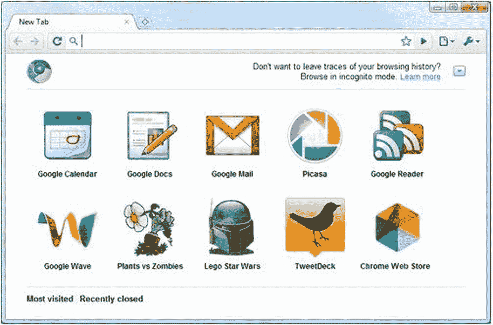

[Source: Mashable](https://mashable.com/2010/05/19/chrome-web-store/)

谷歌推出了 Chrome 网上商店，为 2010 年划上了圆满的句号。最初仅限于美国，Chrome 网上商店是谷歌扩展图库的更大、更好的化身。通过 Chrome 网络商店，用户可以浏览和安装来自数千名独立开发者的扩展、插件和主题。Chrome 网上商店提供的扩展和插件让 Chrome 变得更加通用。它还使扩展成为更广泛的 Chrome 生态系统的重要组成部分，这是一个明智的长期策略，建立在 Chrome 的可扩展性上，并紧紧围绕用户的需求和期望。

像火狐的插件一样，Chrome 的扩展不仅仅是帮助用户用浏览器做更多事情的流行小工具。他们是新一波软件产品的先锋，通过把用户放在第一位最终重塑了整个行业。以 Adblock Plus 为例。

Adblock Plus 是网络上最古老的浏览器扩展之一，自 2007 年就已存在。它已经被下载和安装了数百万次。这是 Chrome 和 Firefox 可用的最简单、最有效的扩展之一。它几乎单枪匹马地改变了人们对传统在线出版的看法，以及某些在线广告商业模式的可行性。有人可能会说，Adblock Plus 是由一家出版商开发的单一扩展，它帮助催生了我们今天随处可见的订阅模式，从流媒体娱乐服务到 SaaS。Adblock 非常受欢迎，以至于它确实帮助改变了互联网的工作方式。这就是扩展如此强大的原因。

2011 年初对谷歌来说很平静。这种情况在 2011 年 3 月发生了变化，当时 Chrome 进行了首次重大设计改造。最初的 Chrome 标志已经过风格化处理，呈现出金属感和立体感，向产品名称致敬。然而，到了 2011 年，Chrome 的 3D 标志已经让人觉得相当过时了。结合苹果开创的“平面设计”的新兴趋势，很明显，更新是必要的。Chrome 新的更简单、更干净的标志反映了使用该产品的“简单而整洁”的体验。开源 Chromium 项目的蓝色 logo 也得到了改头换面。

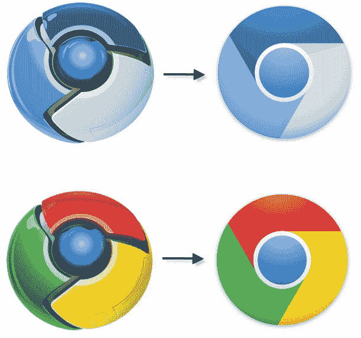

在 Chrome 的标志被彻底修改后不久，谷歌[宣布了其上网本 Chromebook 系列](https://chrome.googleblog.com/2011/05/new-kind-of-computer-chromebook.html)。谷歌将 Chromebook 设想为轻量级便携式计算的未来。这些机器没有传统的硬盘，也不能安装软件。相反，他们将运行 Chrome 操作系统，并依赖 Chrome 本身作为用户访问网络的主要手段。

2011 年 10 月，谷歌悄悄更新了 Chrome，加入了下一个其他浏览器很快会模仿的新功能，新的标签页。标签对许多互联网用户来说是革命性的，让人们体验了真正的在线多任务处理。在选项卡式浏览出现之前，大多数人可能不会为他们想要处理的每个任务打开一个新的浏览器窗口。选项卡不仅使这种在线工作流成为可能，甚至更受欢迎。然而，直到现在，打开一个新标签页已经错过了机会。除了用户预定义的主页之外，新标签是一个空白页面。现在，Chrome 的新标签页让用户可以快速访问他们最常用的扩展、页面和网站，让 Chrome 感觉更像一个应用程序。

谷歌的下一步是将 Chrome 的足迹扩展到 Windows 之外。2012 年 2 月，谷歌[发布了安卓版](https://googleblog.blogspot.com/2012/02/introducing-chrome-for-android.html) Chrome。多年来，谷歌的忠实用户一直在耐心等待安卓版本的浏览器。关于 Chrome 的 Android 发布，唯一真正令人惊讶的是谷歌花了多长时间才发布它。

在 Chrome for Android 最终推出三个月后，谷歌发布了其最新的硬件产品 [Chromebox](https://googleblog.blogspot.com/2012/05/next-step-in-chrome-os-journey.html) ，这是一款旨在像 Chrome OS 驱动的桌面一样运行的紧凑型机器。然而，与之前的 Chromebooks 一样，Chromebox 未能给人留下深刻印象。

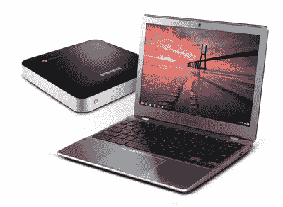

[Source: Google](https://googleblog.blogspot.com/2012/05/next-step-in-chrome-os-journey.html)

Chromebox 最大的问题不一定是产品本身，尽管许多分析师和科技记者指出了 Chromebox 的高价格和低规格。那就是没有足够的需求。

当谷歌第一次提出为云设计和优化的轻型笔记本电脑的想法时，这个概念有很大的前景。这种情况在 2010 年 4 月 3 日一夜之间发生了改变。那是苹果发布第一款 iPad 的时候。突然间，支付高价购买一台没有硬盘、离线功能非常有限的精简笔记本电脑的想法，远不如苹果(Apple)独自重塑消费电子市场格局之前那么有吸引力了。

> *“我们开门见山吧。三星的新 Chromebook 和 Chromebox 对于你得到的东西来说简直太贵了。Chromebox 售价 329 美元——对于一台赛扬驱动的台式机来说，这是一个惊人的价格。面对为办公室配备一套 retina 显示屏 iPads(可以访问 700，000 个 iOS 应用程序并保持高度便携)和在离线时甚至不能存储文件的笔记本电脑的选择，你会选择哪一个？”——**[克里斯蒂娜·沃伦](https://mashable.com/2012/05/29/chrome-os-fail/)，混搭**T5】*

Chromebox 的另一个主要问题是，它表面上是一款为企业设计和营销的台式电脑，而这家公司根本不知道如何为企业设计和营销硬件。谷歌放弃了基于订阅的定价模式，转而采用统一的零售价格，对更多管理工具一次性收取 150 美元的费用，提供硬件保修和终身客户支持，这一事实清楚地表明，谷歌将 Chromebox 视为一台商用机器。

谷歌毫不掩饰其用 Chrome 追赶微软的明确意图。在开发教育应用等工具时，它学到了很多关于机构销售的知识。但是模仿微软在 90 年代用来渗透企业的策略实际上毫无意义。

[Source: iMore](https://www.imore.com/chrome-ios)

次月，2012 年 6 月，谷歌发布了 iOS 版 Chrome。到目前为止，Chrome 增长迅速，全球活跃用户数量几乎翻了一番，从 2011 年 6 月的 1.6 亿增加到 2012 年 6 月的逾 3.1 亿。推出 iOS 版 Chrome 将有助于谷歌进一步扩大其浏览器的覆盖范围。2012 年 6 月，谷歌宣布扩展开发者将被允许使用谷歌的 AdSense 计划在他们的[扩展](https://thenextweb.com/google/2012/07/03/get-ready-chrome-users-youre-about-to-start-seeing-ads-inside-of-extensions/)中包含广告。这与谷歌早期的立场有很大的不同，当时 Chrome 扩展禁止所有广告。这对于许多扩展开发者来说是个好消息，他们终于可以直接将他们的插件货币化了。

到 2012 年夏天，谷歌已经完成了许多人曾经认为不可能的事情。Chrome 获得了 31%的市场份额，最终将微软的 IE 从令人垂涎的世界最流行浏览器的宝座上赶了下来。Chrome 作为一个产品的发展本身就值得肯定。但微软未能拥抱不断变化的网络和 IE 开发的缓慢步伐，使得 Chrome 的提升变得更加容易。

这个重要的里程碑不仅仅是谷歌在用户或潜在覆盖范围方面的胜利。这标志着谷歌对网络未来的愿景即将成为现实。

到目前为止，Chrome 的扩展一直是浏览器最受欢迎和使用最广泛的方面之一。然而，扩展的流行也给谷歌带来了一些持续的挑战性问题，尤其是在 Windows 上。2012 年 12 月，谷歌宣布[禁止](https://blog.chromium.org/2012/12/no-more-silent-extension-installs.html)所谓的“静默扩展安装”，这是指在不通知用户的情况下，将额外的“隐藏”扩展捆绑到一个扩展中的做法。

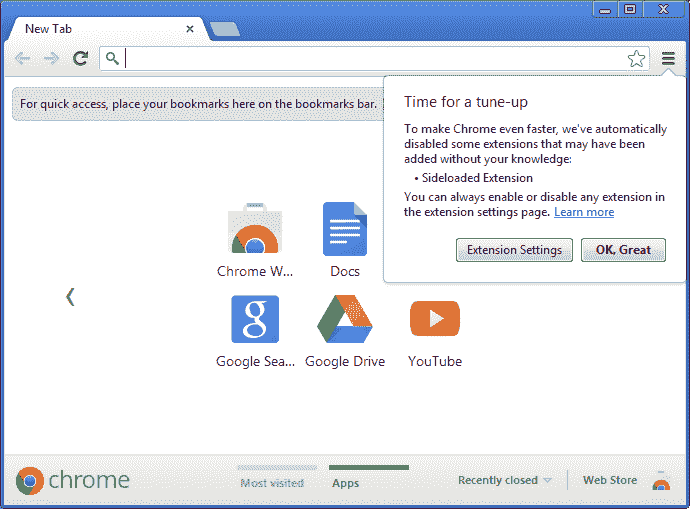

[Source: Google](https://blog.chromium.org/2012/12/no-more-silent-extension-installs.html)

静默扩展安装背后的主要问题是 Windows 如何处理注册表项的漏洞。Windows 注册表机制的目的是允许用户在安装其他扩展时安装对 Chrome 有用的扩展。不幸的是，这个系统被肆无忌惮的扩展开发者广泛滥用，试图规避谷歌的政策限制，迫使谷歌采取行动。

经过几年相当快速的开发和产品发布，谷歌在接下来的一年的大部分时间里停止了对 Chrome 的开发。Chrome 之旅的下一个重大进展发生在 2013 年 9 月，当时谷歌宣布推出 Chrome 应用程序。

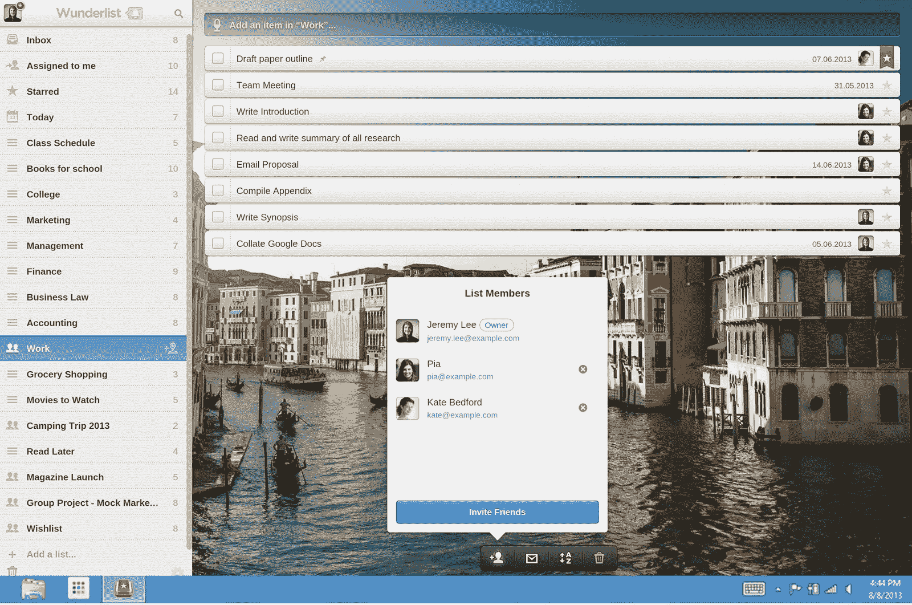

[Source: Google](https://chrome.googleblog.com/2013/09/a-new-breed-of-chrome-apps.html)

Chrome 应用程序看起来和感觉上有点像 Chrome 网络商店中的一些 Chrome 扩展。最大的区别是 Chrome 应用比小工具更接近真实应用。Chrome 应用是原生运行在 Chrome 上的轻量级应用，可以通过 Chrome 网络商店中现已不存在的“For your desktop”集合访问。Chrome 推出时提供了广泛的应用程序，从待办事项列表和计算器等生产力工具到基于浏览器的游戏和拼图等娱乐工具。

应用程序本身并不是 Chrome 应用程序中最有趣的部分，尽管这就是它们的工作方式。首先，Chrome 应用离线时功能齐全。它们可以配置为与支持 USB 的外围设备、相机和打印机等外部设备进行交互。他们可以访问存储在用户本地机器上的文件以及存储在云中的文件。Chrome 应用可以在多个设备间自动同步。也许最重要的是，它们可以直接从谷歌新的 Chrome 应用程序启动器中启动，谷歌与 Chrome 应用程序同时发布了该启动器。这是让 Chrome 感觉像一个真正的计算平台的又一步，就像新的标签页一样。

到 2013 年 11 月，Chrome 的扩展被证明非常受欢迎。然而，谷歌还没有设法控制住恶意第三方扩展的问题。这导致谷歌制定了一项政策，所有的 Chrome 扩展现在[需要](https://blog.chromium.org/2013/11/protecting-windows-users-from-malicious.html)托管在 Chrome 网络商店中。这不会是谷歌扩展困境的终结，但这是朝着正确方向迈出的必要而重要的一步。

> 许多服务捆绑了有用的配套扩展，这导致 Chrome 询问你是否要安装它们。然而，不良行为者滥用了这种机制，绕过提示静默安装恶意扩展，这些扩展覆盖浏览器设置并以不希望的方式改变用户体验，例如未经批准替换新的选项卡页面。事实上，这是 Windows 用户抱怨的一个主要原因。”——**[埃里克·凯](https://blog.chromium.org/2013/11/protecting-windows-users-from-malicious.html)，谷歌**前工程总监 T5】

在短短的几年里，谷歌采取了几个积极的步骤来维护自己在浏览器领域的地位。谷歌的浏览器即平台的愿景对该产品的开发至关重要。然而，尽管事实证明 Chrome 很受欢迎，微软的 IE 和 Mozilla 的 Firefox 仍然占有很大的市场份额，浏览器大战远未结束。事实上，事情刚刚开始升温。

## 2014 年至今:赢得浏览器大战

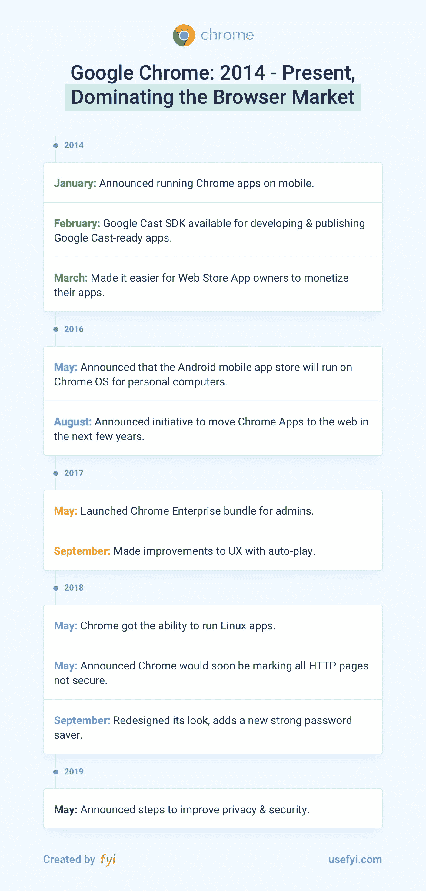

2014 年伊始，谷歌凭借其 Chrome 浏览器处于非常强势的地位。Chrome 现在占据了浏览器市场大约 40%的份额，在短短五年内增长了 155%。超过 3.1 亿人将 Chrome 作为他们的主要浏览器。在接下来的几年里，谷歌将积极利用其地位，通过扩大 Chrome 在世界各地的足迹，从微软那里夺取更多的市场份额，并开发新的工具，以适应人们不断变化的在线生活方式。

谷歌在 2014 年采取的第一个重大举措是在 1 月份推出移动版 Chrome 应用。这不是最大的交易，但很高兴看到 Chrome 应用程序出现在移动设备上，而不是局限于桌面。谷歌将 Chrome 作为一个立足点，来接触在线用户。最初，这意味着追逐桌面用户。谷歌希望将自己融入用户在线生活的几乎每一个方面，而 Chrome 将是一个载体。

为了与 Chromium 项目的精神保持一致，Chrome 移动应用程序是使用 Apache Cordova 构建的，这是一个开源的移动开发框架，仅使用 HTML、CSS 和 JavaScript 构建本地移动应用程序。

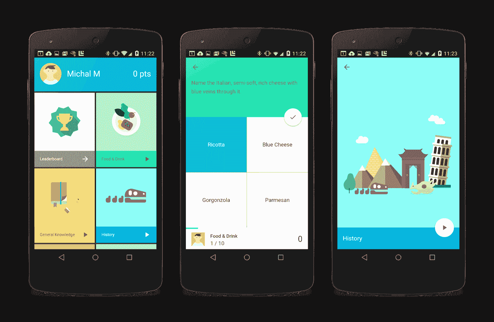

[Source: Google](https://blog.chromium.org/2014/09/now-with-faster-dev-workflow-and-modern.html)

2014 年 3 月，谷歌对 Chrome 应用开发者如何将他们的产品货币化做出了一些重大改变。在更新之前，谷歌托管的应用程序已经可以通过四种方式实现应用程序的盈利:免费试用期、一次性预付、订阅和应用内支付。现在，打包应用、主题和扩展的开发者也可以利用这些灵活的货币化选项。

这次货币化改革值得注意的是，扩展开发者得到了最好的待遇；许多货币化选项不适合主题，打包应用已经可以实现预付和基于订阅的定价。作为更新的一部分，只有扩展被给予所有四个货币化选项。这在当时并没有引起多大反响，但它再次表明，谷歌清楚地看到了扩展和它围绕 Chrome 建立的第三方生态系统是该产品未来的重要组成部分。

当微软、Mozilla 和苹果都在努力让自己的浏览器更有吸引力的时候，谷歌却在继续打破重要的里程碑。在 2015 年 5 月的谷歌年度 I/O 开发者大会上，时任产品部 SVP 桑德尔·皮帅证实，谷歌 Chrome 在全球的用户数量已经超过了 10 亿。

虽然 Chrome 在 2014 年至 2016 年期间没有看到太多重大更新，但 Chrome 的扩展却不能这么说。尤其是 2015 年，对于 Chrome 扩展来说是一个重要的年份。那时，为 Chrome 开发扩展不再被视为有进取心的软件开发人员的副业。延期正在成为一大笔钱。包括 Dropbox 和微软在内的几家主要科技公司发布了 Chrome 扩展，使他们的产品更加有用。在其他创业公司，Chrome 作为浏览器的可扩展性被视为许多产品路线图的关键元素，包括日历和电子邮件工具 [Cirrus Insight](https://chrome.google.com/webstore/detail/cirrus-insight/kohihleiencpadoaakajafdlmcimglea?hl=en) ，销售参与工具 [Tout](https://chrome.google.com/webstore/detail/toutapp-for-chrome/gllmkcahdekdbapmdfnffclacbpnicaj?hl=en) (后来被营销自动化平台 [Marketo](https://www.marketo.com/newsroom/press-releases/2017-04-20-Marketo-Acquires-Sales-Engagement-Platform-ToutApp/) 收购)，以及电子邮件营销工具 [Yesware](https://chrome.google.com/webstore/detail/yesware-email-tracking/gkjnkapjmjfpipfcccnjbjcbgdnahpjp?hl=en) 。这充分说明了 Chrome 如何被视为一种产品，以及它对许多初创公司的增长战略有多么重要。

> “创业公司正在证明，浏览器扩展是他们产品的核心部分，企业可以从中获得动力和资金。大型、成熟的供应商正在发布他们自己的浏览器扩展，并且浏览器本身正在围绕一个标准的方法来开发扩展，以便它们是安全的并且可以以最小的努力跨浏览器工作。这些都是围绕浏览器扩展在我们工作方式中的持续重要性的强烈信号。”——**[里克·努奇](https://techcrunch.com/2016/03/04/why-browser-extensions-change-the-way-we-work/)，TechCrunch**T5】

2015 年，其他浏览器终于开始认真对待自己的扩展了。微软曾在 2015 年 1 月宣布，其新的 Edge 浏览器将支持扩展，该浏览器的外观和感觉仍与 IE 非常相似，当时仍使用其“斯巴达”代号。事实上，微软也证实了 [Edge](https://www.cnet.com/news/meet-microsoft-edge-the-replacement-for-internet-explorer/) 将成为 Windows 10 的默认浏览器，而[对 IE 的支持](https://www.microsoft.com/en-us/WindowsForBusiness/End-of-IE-support)将于 2016 年 1 月 12 日正式结束，这最终预示着这个可能是微软最讨厌的产品的终结。同样，Mozilla 宣布将为扩展开发者发布一个新的 API，名为 [WebExtensions](https://blog.mozilla.org/addons/2015/08/21/the-future-of-developing-firefox-add-ons/) ，这将使开发多种浏览器的插件变得更加容易。

为 Chrome 开发和发布扩展变得容易多了。然而，对于谷歌来说，保护用户免受恶意第三方开发者的攻击仍然是这个搜索巨头最头疼的问题。自 2011 年以来，Chrome 一直提供内嵌安装，即允许从网页上直接“内嵌”下载和安装扩展和应用，即使该扩展或应用是由 Chrome 网络商店托管的。然而，恶意利用[内嵌安装](https://developer.chrome.com/webstore/inline_installation)对谷歌来说是一个相对较小但持续的挑战。[禁用](https://blog.chromium.org/2015/08/protecting-users-from-deceptive-inline.html)内嵌安装是谷歌被迫采取的最新措施，以控制其恶意应用和扩展安装问题。

在此之前，谷歌一直在很大程度上独立开发其 Android 移动操作系统和 Chrome 操作系统。2016 年 5 月，当谷歌宣布其 Android 应用的谷歌 Play 商店现在可以在 Chrome OS 上运行时，人们开始猜测谷歌正计划潜在地合并这两个操作系统。在 Chrome 操作系统上运行 Android 应用程序，使得许多通过谷歌 Play 商店获得的应用程序与其 Chromebooks 系列兼容，在那之前，Chromebooks 缺乏对微软 Skype 等应用程序的支持。

几个月后，谷歌宣布计划将 Chrome 操作系统上的 Chrome 应用迁移到本地网络应用，这又是一个重磅炸弹。

> “随着我们继续努力简化 Chrome，我们认为是时候开始脱离 Chrome 应用程序平台了。Chrome 应用有两种类型:打包应用和托管应用。今天，Windows、Mac 和 Linux 上大约有 1%的用户积极使用 Chrome 打包应用程序，大多数托管应用程序已经作为常规 web 应用程序实现。我们将在未来两年内取消 Windows、Mac 和 Linux 上 Chrome 对打包和托管应用的支持。”— **[拉胡尔·罗伊·乔杜里](https://blog.chromium.org/2016/08/from-chrome-apps-to-web.html)，谷歌**T5 的产品管理副总裁

谷歌对其 Chrome 应用明显 180 度转变的原因很简单。Chrome 的扩展非常受欢迎。Chrome 应用则不然。

然而，按照谷歌的传统方式，许多人立即对这一声明感到困惑，这是可以理解的，尤其是因为谷歌习惯于依赖令人困惑的命名约定。他们最喜欢的扩展真的是一个扩展，还是一个应用程序？那些既有应用又有扩展的产品呢？

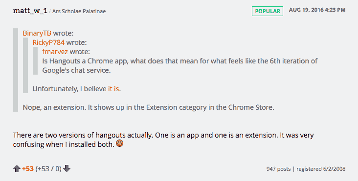

[Source: Arstechnica](https://arstechnica.com/gadgets/2016/08/google-is-killing-chrome-apps-on-windows-mac-and-linux/?comments=1&post=31743635)

在接下来的一年左右的时间里，谷歌对其 Chrome 的工作大多保密。到 2017 年，谷歌 Chrome 拥有 55%的浏览器市场份额。由于其速度和沙盒标签，Chrome 被证明非常受用户欢迎，但浏览器也在悄悄地侵入企业。

2017 年 5 月，谷歌推出了 Chrome Enterprise Bundle。谷歌从未回避在工作场所与微软竞争，但企业捆绑包的推出是谷歌迄今在企业领域采取的最积极的举措之一。

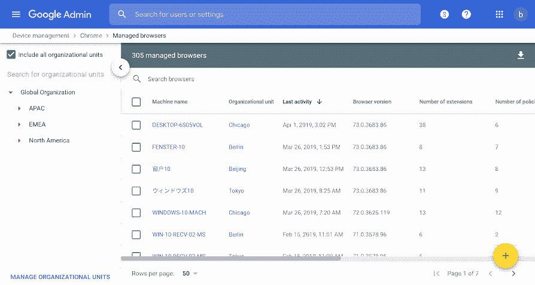

[Source: Google](https://support.google.com/chrome/a/answer/7679408?hl=en)

该捆绑包为系统管理员提供了 Chrome 的单一安装程序，他们可以使用该安装程序将浏览器部署到整个组织中潜在的数千名用户。它还附带了 Chrome 传统浏览器支持扩展，允许企业用户运行旧的、废弃的应用程序以及管理策略模板。当时，谷歌声称使用 Chrome 的企业数量“翻了一番”，但发言人[拒绝提供任何细节。Chrome 现在支持 Citrix 的 XenApp 虚拟化平台和 Windows Server，这两种平台在许多企业环境中广泛使用。Chrome Enterprise 捆绑包的推出再次表明，谷歌是认真对待在其本土挑战微软的。](https://techcrunch.com/2017/05/23/google-launches-the-chrome-enterprise-bundle-for-it-admins/)

Chrome 最受欢迎的更新之一是在 2017 年 9 月，当时谷歌对浏览器处理自动播放媒体(如插播视频广告)的方式进行了改变。这一看似微小的更新被谷歌称为“[统一自动播放](https://blog.chromium.org/2017/09/unified-autoplay.html)”，是对 Chrome UX 的巨大改进，让用户对自己的浏览体验有了更多的控制权。该更新只允许媒体内容自动播放，如果媒体文件不播放声音或用户表示对这种媒体内容感兴趣。此外，用户现在可以选择性地禁用特定网站的音频播放，这对于通过随机自动播放视频广告来先发制人地压制烦人的网站来说是完美的。

引入统一自动播放后，Chrome 沉寂了六个多月。Chrome 的下一次重大更新是在 2018 年 5 月，当时谷歌宣布 Chrome 现在将支持 Linux 应用。

起初，对一些人来说，这似乎不是什么大不了的事情。从消费者的角度来看，Linux 一直是一个小众操作系统。然而，谷歌并不是为其不断增长的用户群支持 Linux 应用程序，而是为了让开发者的生活更轻松。Chrome 的速度和易用性通常被定位为以消费者为中心的优势，但谷歌一直是一家对开发友好的公司。正如谷歌在 2008 年开始让开发者更容易使用新兴互联网技术时所做的那样，谷歌在 Chrome 中支持 Linux 应用程序也是鼓励开发者为不断增长的 Chrome 生态系统开发更多应用程序和扩展的类似步骤。似乎还需要进一步的证明，谷歌宣布 Android Studio 正在为 Chrome OS 开发，这再次表明开发者仍然是其新工具的重要受众。

> 虽然普通用户可能不会对 Linux 软件感到太兴奋，但对于依赖这些工具来创建新应用程序和软件的开发人员和编码人员来说，这是一个大新闻。此外，鉴于谷歌的 Chrome OS 对教育的重大推动，拥有运行开发环境的能力意味着 Chromebooks 刚刚成为学习如何编码的计算机科学和工程学生的一个非常有价值的工具。”——**[查姆·加滕贝格](https://www.theverge.com/circuitbreaker/2018/5/8/17318340/chrome-os-update-new-features-linux-apps-google-io-2018)，The Verge**T5】

2018 年 5 月，谷歌宣布将很快将所有非 HTTPS 页面标记为“[不安全](https://blog.chromium.org/2018/05/evolving-chromes-security-indicators.html)”这是谷歌等待已久的举措。该公司曾希望尽快实施新的安全标签。不幸的是，HTTPS 作为一个标准的广泛采用仍然太低，以至于无法切换到 Chrome 的安全指标。该公司证实，新指标的推出将于 9 月开始，并将随着 2018 年 10 月 Chrome 70 的发布而在各地推广。

2018 年 9 月是 Chrome 推出十周年。到目前为止，全球已有超过 20 亿的 Chrome 安装量，Chrome 拥有大约 62%的市场份额。然而，Chrome 从一个斗志昂扬的失败者成长为主导者并非一帆风顺。随着 Chrome 在全球的扩张，一些用户和安全专家越来越担心谷歌在浏览器领域的主导地位。

Chrome 的流行意味着浏览器实际上已经成为网络开发的事实上的标准。正如开发人员曾经必须确保 IE 中的一切运行顺畅，他们现在必须为 Chrome 做同样的事情。除此之外，这远远超出了针对单一浏览器的优化。由于 Chrome 的统治地位，许多开发者只关注 Chrome，而忽视了其他浏览器。主要为 Chrome 开发的功能可能需要几周甚至几个月才能在 Firefox、Opera 和其他浏览器中实现。

仅仅十年时间，谷歌就从开放网络的冠军变成了当代网络标准的守门人。

> “谷歌通过向消费者免费提供快速、可定制的浏览器，同时拥抱开放的网络标准，赢得了胜利。既然 Chrome 是明显的领导者，它控制着标准的制定。这引发了人们的担忧，谷歌正在利用浏览器及其 Chromium 开源基础设施排挤在线竞争对手，并使整个行业向有利于自己的方向倾斜。——**[格里特·德·维克](https://www.bloomberg.com/news/articles/2019-05-28/google-s-chrome-becomes-web-gatekeeper-and-rivals-complain)，彭博**T5】

一些专家认为谷歌所做的远远不止排挤在线竞争对手。Mozilla 的联合创始人兼 Brave Software 的首席执行官布伦丹·艾希(Brendan Eich)表示，“Chrome 已经成为间谍软件。”一个具有讽刺意味的例子是，谷歌的统治地位是不可避免的，Brave 的同名隐私浏览器是用 Chromium 开发的。其他小份额浏览器，如同样强调隐私和安全的免费软件 Vivaldi 浏览器，也经历了[严重的困难](https://www.bloomberg.com/news/articles/2019-05-28/google-s-chrome-becomes-web-gatekeeper-and-rivals-complain)，因为谷歌对如此多广泛使用的产品和服务的束缚。

正是谷歌最受欢迎的服务之一 Gmail 提醒了一些用户，Chrome 在 2018 年 7 月至 9 月的某个时候发生了重大变化。

一些用户指出，更新后，在 Chrome 中登录 Gmail 也意味着登录 Chrome 本身。同样，退出 Gmail 也意味着退出 Chrome。在更新之前，这两个服务有两个单独的登录。可以登录到一个服务器而不登录到另一个服务器。2018 年 9 月的更新显然取消了这种分离——用户对此非常愤怒。

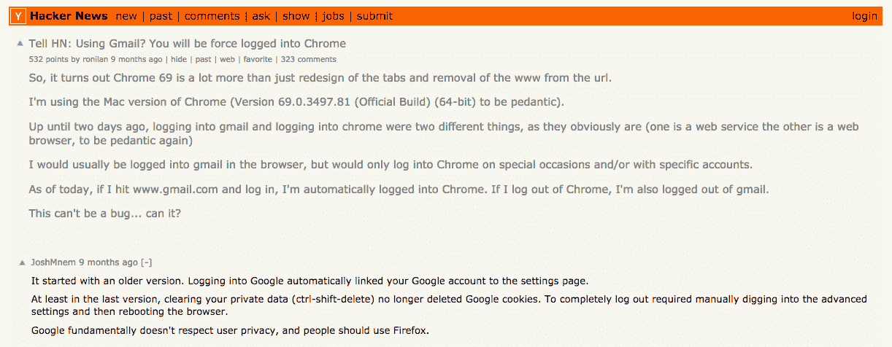

[Source: Hacker News](https://news.ycombinator.com/item?id=17942252)

许多用户，包括 Chrome 的长期支持者，都对谷歌的明显欺骗感到愤怒。一些人发誓永远放弃 Chrome，转而支持更注重隐私的 Firefox。其他人难以相信谷歌会有意实施这样的改变，而是认为这是一个错误。后来得知，一些用户早在 2018 年 7 月就受到了[变更](https://support.google.com/chrome/forum/AAAAP1KN0B0AKyRi76viP8/)的影响。

虽然 Chrome 和 Gmail 之间的双重登录可以被手动禁用，但谷歌实施这一改变的不光彩方式对谷歌的声誉造成了重大损害。

约翰·霍普金斯大学的密码学教授马修·格林对这一转变的隐私影响直言不讳，他在推特上表达了他对谷歌动机的怀疑。

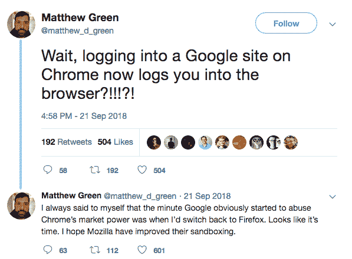

不出所料，谷歌将这一变化定位为对用户有利。Chrome 团队的工程师阿德里安娜·波特·费尔特(Adrienne Porter Felt)试图在一条推文中淡化这一举动，称这一变化更接近于用户登录状态的视觉指示，而不是隐私漏洞。

不出所料，格林并不买账。

谷歌声称，浏览器和 cookie jar 之间的身份一致性将使用户更容易在谷歌服务之间移动文件和数据。在这方面，谷歌是对的——它对一些用户来说更方便。谷歌也更容易对用户的浏览习惯、搜索历史和电子邮件进行数据挖掘，从而获得更完整的用户行为图，然后出售给广告商。谷歌后来收回成命，实现了一个[控件](https://www.blog.google/products/chrome/product-updates-based-your-feedback/)，允许用户更容易地禁用自动 Chrome 登录。

> “即使没有数据上传到谷歌的服务器，这仍然是一个巨大的变化。这是他们制造的一条亮线。他们没有告诉任何人就违反了它，只是在人们吓坏了的情况下更新了他们的隐私政策。”——**[马修·格林](https://www.wired.com/story/google-chrome-login-privacy/)**约翰·霍普金斯大学副教授

到 2019 年 5 月，Chrome 几乎占据了 70%的浏览器市场份额。尽管在困扰谷歌的各种隐私丑闻之后，Mozilla 的 Firefox 在某种程度上受到了关注，但其他浏览器就没有这么幸运了。

特别是微软的 Edge 浏览器，尽管微软为改进浏览器做出了令人钦佩的努力，但它似乎几乎完全停滞了。Edge 经历的大部分增长可以说是由于 Windows 10 的广泛采用。在 2016 年至 2019 年期间，微软对 Edge 进行了数十项改进，使其更快、更可扩展、更稳定。但事实上仍然没有理由在 Firefox 或 Chrome 上使用 Edge。Edge 能做的一切，Chrome 都能做得更好。

这就是为什么微软在 2018 年 12 月将 Edge 迁移到 Chromium 引擎的决定如此令人震惊。

Edge 有许多难以克服的遗留问题。Edge 依赖的渲染引擎与 Chrome 和 Opera 完全不同。这在显示某些网站和页面时会导致严重的兼容性问题。Edge 还严重依赖微软的通用 Windows 平台(UWP) API，这进一步将 Edge 与更广泛的浏览器社区隔离开来。

最初的震惊平息后，许多倡导团体和互联网组织支持微软的决定，尤其是在 Chromium 开发社区内部。但并不是所有人都对微软选择将 Edge 迁移到 Chromium 抱有热情。特别是 Mozilla，对这一举动深表怀疑，声称这给了谷歌更多的权力来决定未来互联网技术的发展。

> 从商业的角度来看，微软的决定可能是有道理的。谷歌几乎完全控制了我们网络生活的基础设施，继续对抗这一点可能无利可图。放弃互联网曾经带给我们的自由和选择，很可能符合微软股东的利益。”——**[Mozilla](https://blog.mozilla.org/blog/2018/12/06/goodbye-edge/)**T5】

在短短十年间，Chrome 单枪匹马地重塑了浏览器的形象，成为世界上最受欢迎的网络浏览器。除了为谷歌创造了几个新的收入来源，Chrome 还帮助谷歌进一步扩大了其已经相当可观的业务范围，并通过其产品和广告吸引了新的受众。

然而，尽管谷歌广受欢迎，但它一直因 Chrome 的隐私和安全功能而遭到激烈批评。Chrome 的统治地位目前似乎是确定的，但正如微软可以证明的那样，如果谷歌不能充分利用它已经建立的势头，这种情况可能会很快改变。

## 谷歌 Chrome 将何去何从？

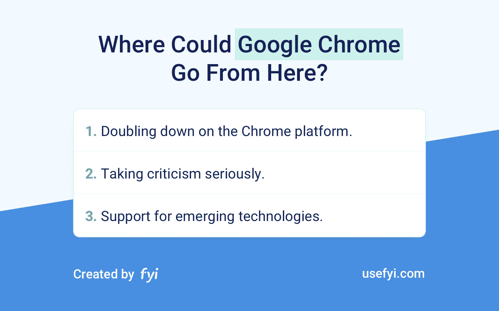

在短短十年内完全统治了浏览器市场，世界上最流行的浏览器的下一步是什么？

1.  在 Chrome 平台上加倍下注。谷歌从一开始就设想 Chrome 是一个平台。随着谷歌寻求保持其对浏览器市场的控制，该公司似乎有可能在 Chrome 作为平台的性质上加倍下注。这可能包括专门的工具，如更多专门针对移动设备的扩展，以及利用 Chrome OS 中的云的附加功能。
2.  认真对待批评。在很大程度上，谷歌已经做了大量工作来推进新兴的互联网技术，让网络变得更好。然而，它也因做出一些有问题的决定而招致批评，尤其是在用户隐私方面。谷歌一直对 Chrome 进行迭代，以更好地服务用户。将来，谷歌也可能开始以一种有意义的方式解决一些针对 Chrome 的更严重的问题。
3.  **支持新兴技术。**如果谷歌要继续其与 Chrome 的平台游戏，不可避免的是，对增强现实(AR)和虚拟现实(VR)等技术的支持将被引入 Chrome 平台。对 AR 和 VR 的支持代表着谷歌再次在技术上领先的一个不可思议的机会，也是一个额外收入的惊人机会。

## 我们能从 Chrome 身上学到什么？

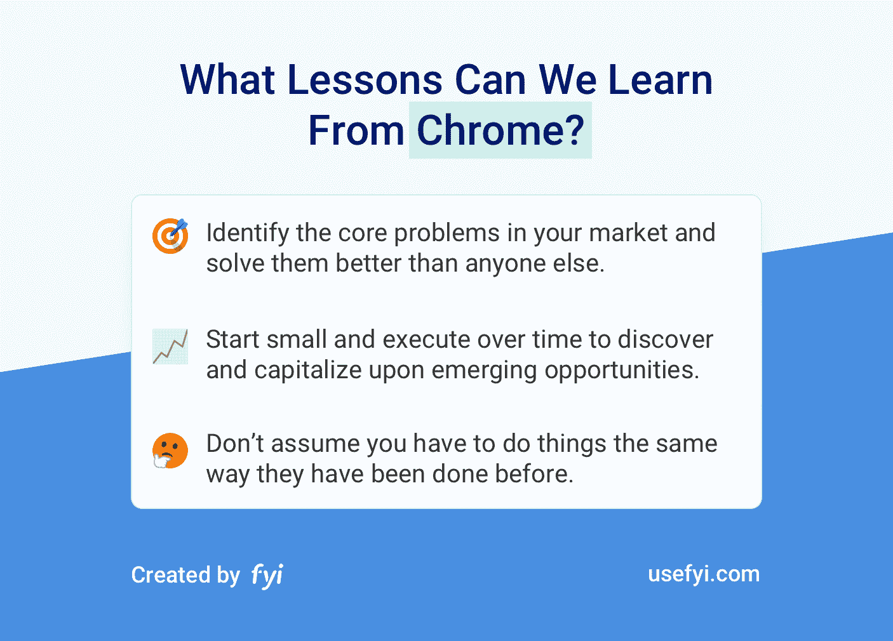

很少有公司能与谷歌的资源、影响力相媲美。也就是说，挑战像微软这样根深蒂固的现有企业，并在短短十年内取得胜利绝非易事，即使对谷歌来说也是如此。Chrome 的异军突起给了我们什么教训？

**1。找出你所在市场的核心问题，比任何人都更好地解决这些问题。**谷歌早期开发 Chrome 的方法揭示了该公司对 2008 年左右互联网行业面临的挑战(技术和其他方面)的深刻理解。谷歌认识到开发者是其新浏览器的关键增长载体，它开发了 Chrome 来满足开发者和用户的需求。

看看你的产品及其在市场中的位置:

*   你所在的行业面临的最大问题是什么？你的产品为其他公司、消费者或者两者解决了这些问题吗？
*   如果你能改变你所在行业的一件事，从现有技术的局限性到用户如何看待你所在行业的产品，你会改变什么？你的产品如何解决你的市场最紧迫的问题，并在你想改变的事情上有所改进？
*   老实说，在你的领域里，有没有其他人在用你没有的方式创新？在接下来的六个月里，你能做些什么来缩小你的产品与竞争对手之间的差距？

**2。从小处着手，逐步执行，发现并利用新出现的机会。**谷歌本可以构建一个更好的浏览器，对其进行迭代，然后就此止步。相反，谷歌建立了一个更好的浏览器，变成了一个占据 70%市场份额的产品，并成为一个拥有蓬勃发展的生态系统的平台。

检查您未来一年左右的产品路线图:

*   你有多大的回旋余地来抓住新出现的机会？你的路线图是否允许一些偏差，或者你是否坚定地致力于一个特定的轨迹？
*   你如何创造机会为你的用户创造额外的价值并为你的企业创造新的收入来源？
*   你的“登月”功能或想法清单上有什么？你如何探索这些想法而不负面影响你目前的成长？

**3。不要认为你必须按照以前的方式做事。**最好的产品带给人们的正是他们对竞争产品的期望，只是方式更好。例如，谷歌本可以避免任何类似浏览器工具栏的东西。相反，谷歌开发了 Chrome 扩展，并一直在调整和改进它们，以完全回避工具栏的问题。

找到你的市场中需要解决的最重要的问题，然后进行创新:

*   在您的市场中，人们对现有产品的最大挑战是什么？
*   你的产品会有什么不同？为什么你的产品会在别人失败的地方成功？
*   查看您的产品路线图，您的产品在哪些领域容易受到竞争产品的影响？换句话说，你的产品最薄弱的地方是什么，另一家公司如何能比你更好地解决你客户的问题？

## 内容，不是 Chrome

除了打造更好的网络浏览器，谷歌几乎单枪匹马地重塑了我们与网络的互动方式。即使是喜欢其他浏览器的用户也从谷歌的浏览器即平台的愿景中受益，因为其他浏览器已经采用了 Chrome 向世界推出的标准。

然而，尽管 Chrome 作为浏览器和软件产品具有优势，谷歌还是犯了一些代价高昂的错误，特别是在收集和使用个人数据方面。在未来几年，谷歌将有更多的机会来塑造网络的未来，唯一真正的问题是它将如何负责任地这样做。

你用 Chrome 吗？*使用 [FYI Chrome 扩展](https://bit.ly/fyichrome)，你可以在新的标签页中找到你的文件。*