# 电子邮件简讯广告:花费 2913 美元。这是我们学到的东西

> 原文：<https://blog.fomo.com/email-newsletter-advertising/?utm_source=wanqu.co&utm_campaign=Wanqu+Daily&utm_medium=website>

2018 年夏天，我们推出了独立广告网络，并以 450 美元的价格收购了 100 多家新出版商，并获得了[战略新闻简报赞助](https://blog.fomo.com/ad-network-launch/)。

几个月后，营销人员丽贝卡·贝克(Rebekah Bek)在 Ahrefs 重新获得了一个价值 51，975 美元的播客广告实验，并激励我们再次尝试更大规模的简讯。

今天我们将公布这些结果。

## 摘要

在过去的 6 个月里，我们在 10 个利基出版物上做了广告，价格为 2，912.75 美元，这在 Fomo 来说是一笔不小的数目。

从长远来看，**我们整个月的营销预算是< $350** :

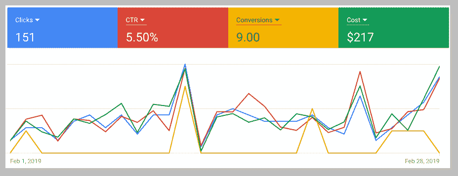

*   100 美元/月，使用 AdRoll 重新定位
*   250 美元/月，谷歌广告(*主要是我们的品牌名称，“Fomo”*)
*   扎皮尔 20 美元
*   发送网格 10 美元
*   零美元的“自动化”，我们在内部构建了我们的营销堆栈

我们还为 Mailchimp (25k+用户范围)支付 165 美元，但我认为这是运营费用。此外，我们正在考虑替代方案，因为我们每月只发送约 1 封电子邮件。

## 方法学

有成千上万的时事通讯赞助可供选择，很容易陷入建立电子表格而不采取行动的困境。

相反，**我在推特上发了**，我们选择的清单中大约有一半来自我信任的人的回复或直接信息。

虽然我们活动中的每一个广告都是独一无二的，但我们的总体目标是提高对 Fomo(产品)以及我们经营方式的认识。

以下是我们赞助的 10 份简讯([电子表格](https://docs.google.com/spreadsheets/d/1JbDv_aj3WWr20jWuaZrLABHeV6iMFFuTwjoeQtp0W1s/edit?usp=sharing)):

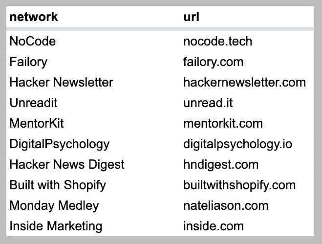

下面，我将详细介绍每个活动的计划和执行，以及我对时事通讯本身的认可(或不认可)。

在这个总结的最底部是一个总结，总结了学到的经验教训，帮助您取得比我们更好的结果。

## 结果

认为我们可以复制去年独立广告网络的成功是天真的，但是我们保持开放的心态，并建立了一个规则:**假设我们会赔钱。**

我们的假设实现了。

为了公平对待所有合作伙伴，我将使用相同的标准评估每项赞助:

*   网络描述(为什么我们发现受众是相关的)
*   点击量(唯一用户，而非会话或页面浏览量)
*   在发布之前，我们是否得到了“预览”或“证明”
*   我们与他们的创造性投入程度
*   链接跟踪功能
*   ROI(电子邮件注册转化)

我们开始吧。

这个有趣的资源是为那些想要少花钱多办事的独立制作人准备的。

创始人 [Nile](https://twitter.com/Nile) ，通过网站和简讯摘要展示产品、工具和交易。

因为 Fomo 经常被称为“酷工具”，我们为自己的[一键式集成](https://blog.fomo.com/lean-towards-sexy/)感到自豪，所以出现在 NoCode 观众面前是有意义的。

**点击次数**

*   超过 19 天的 65 个独立访问者；第一天 45 名游客

**预览/校对**

Nile 写了他自己的社论，但是让我们预览一下他的开场白草稿。

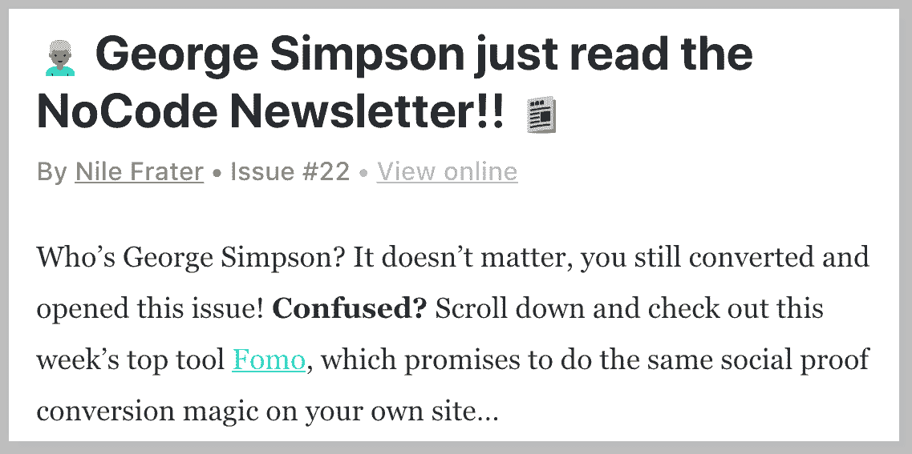

在我们赞助的时事通讯的正文中，他包括了一个截图+ 2 个 Fomo.com 的链接。

**创意投入/灵活性**

我向 Nile 描述了 Fomo，并告诉他我们更喜欢链接我们的主页。

时事通讯的主题本身是“乔治·辛普森刚刚阅读了 NoCode 时事通讯”，这非常聪明，给人留下了 Fomo 共同策划那周综述的良好印象。

**链接归属和测量**

NoCode 时事通讯在我们的链接中包含了这些查询参数:

`?utm_campaign=NoCode_Newsletter&utm_medium=email`

**roi**

0 电子邮件签章。

思考:独立黑客的对立面。失败故事是创始人和创造者分享他们为什么没能实现商业目标的事后故事。

这是一个令人耳目一新的主题，尤其是在初创公司爱乐之城的“粉碎假新闻”中，由于 Fomo 对我们自己的[目标](https://fomo.com/report-card)和[奋斗](https://blog.fomo.com/your-team-is-a-marketing-funnel/)公开[了，所以站在有自我意识的企业家面前是有意义的。](https://fomo.com/open)

**点击次数**

*   超过 67 天的 47 个独立访问者；第一天有 3 名游客

**预览/校对**

我们与 Failory 合作，并确定静态横幅与电子邮件大喊相比将提供最大的曝光率。

**创意投入/灵活性**

我们赞助了 Failory，当时他们已经有了新的所有者，并能够为网站撰写我们自己的广告文案，作为横幅插入故事之间:

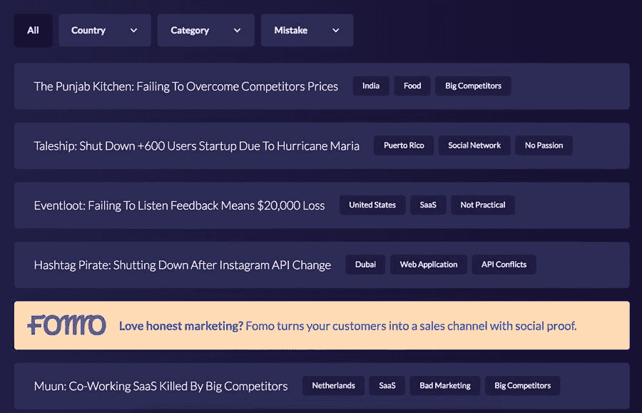

**链接归属和测量**

我不知道为什么这个活动会有一个拖尾广告，但也许如果我们赞助内嵌横幅广告和电子邮件,“媒介”可以被设置为识别哪个更受欢迎。

*   `?utm_campaign=failory1&utm_source=failory`

**roi**

2 封电子邮件签名。

我个人订阅这个资源已经很多年了，因为我讨厌 HN 论坛本身的文化，觉得浏览它是浪费时间。

由于黑客简讯受到近 60，000 名技术人员的信任，并且 Fomo 拥有 API +工程博客内容，因此将 Fomo 定位为黑客友好型是有道理的。

**点击次数**

*   14 天内有 305 个独立访问者；第一天 149 名游客

**预览/校对**

Kale 经营黑客通讯，他是 A+合作者。在我们表达了对他们实验性的“分类广告”功能的兴趣后，他分享了这个:

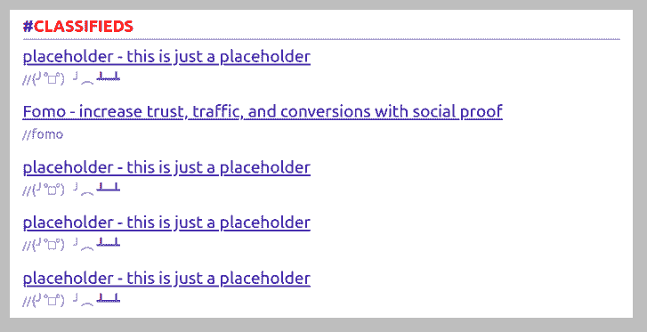

鉴于时事通讯本身的可预测格式，我们可以预测我们的链接美学。

然而，知道我们将伴随着多达 5 个其他分类广告是一个诚实的方式来消除在功能放置方面的模糊性。

**创意投入/灵活性**

Kale 似乎“审查”了每个广告客户，并建议我们保持我们的副本简短。我们写下了最终结果，这后来成为我们主页上的标题。

**链接归属和测量**

黑客不喜欢营销或“跟踪”，所以我们保持简单:

**roi**

0 电子邮件签章。

这是一个全新的资源，有越来越多的时事通讯，本质上是 Inside.com 和黑客时事通讯的混合体，但对于 reddit 来说。

例如，如果你订阅了营销时事通讯，你将会得到几个营销相关的子栏目中投票最高的(+他们最喜欢的)帖子的每周摘要。聪明！

在得到关于 un radiate 的消息并了解到他们早期的吸引力(在推出几周内就有 4 位数的电子邮件订户)后，与这群高效而好奇的营销人员分享 Fomo 是有意义的。

**点击次数**

*   未知的唯一访问者(见下面的“链接归属”)

**预览/校对**

Unreadit 在他们的赞助页面上有一个“点击预览”工具，可以在下面呈现一个示例广告。

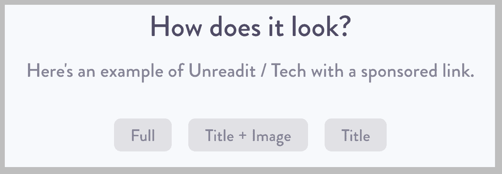

**创意投入/灵活性**

在结帐表单上，我们可以上传我们的头像，写标题，并指定一个点击链接。

Fomo 在《企业家》和《前端通讯》中推广了 2 篇不同的博客文章。

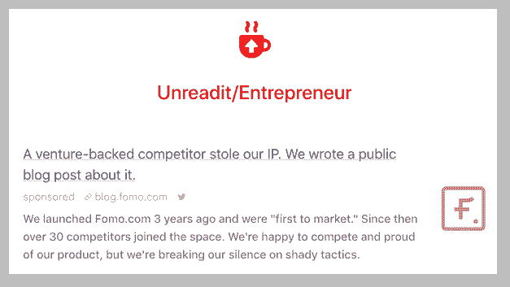

由于 reddit 的文化反对自我推销，我们认为有帮助的内容会赢得更多的参与。

在付款之前，广告商可以从可用日期列表中进行选择。

**链接归属和测量**

这是我第二次错误地认为，如果从广告商那里得到一个干净的网址，供应商会附加他们自己的跟踪。

虽然大多数都这样做，例如 AdWords 要求用户选择取消自动链接标记，但 un radiate 团队在这方面还是新手...哦好吧。

**roi**

未知，让我们假设 0 电子邮件注册。

这是我们尝试过的最具实验性的电子邮件简讯赞助，因为 MentorKit 本质上是一个建议和生活方式专栏。

根据以前时事通讯的内容(我在赞助前订阅了)，MK 的主要受众似乎是营销人员和企业家。

我们做了一个为期数周的赞助，用“长期”策略推广来自 Fomo 和我的个人博客的内容，而不是希望直接归因于销售。

**点击次数**

**预览/校对**

和 NoCode 类似，MentorKit 写自己的故事。

最终，我们不知道我们的广告会是什么样子，直到简讯进入我的收件箱，但 MentorKit 确实跟踪了出站点击，并在活动开始几天后与我联系。

这种跟进是一种很好的接触，其他供应商没有这样做，也许是因为他们对自己的能力驱动流量信心不足。

**创意投入/灵活性**

MentorKit 在谷歌文档中起草了一些推介，我们在发货前提供了澄清细节。就像 unreadit 一样，我们尝试了两种不同的广告:

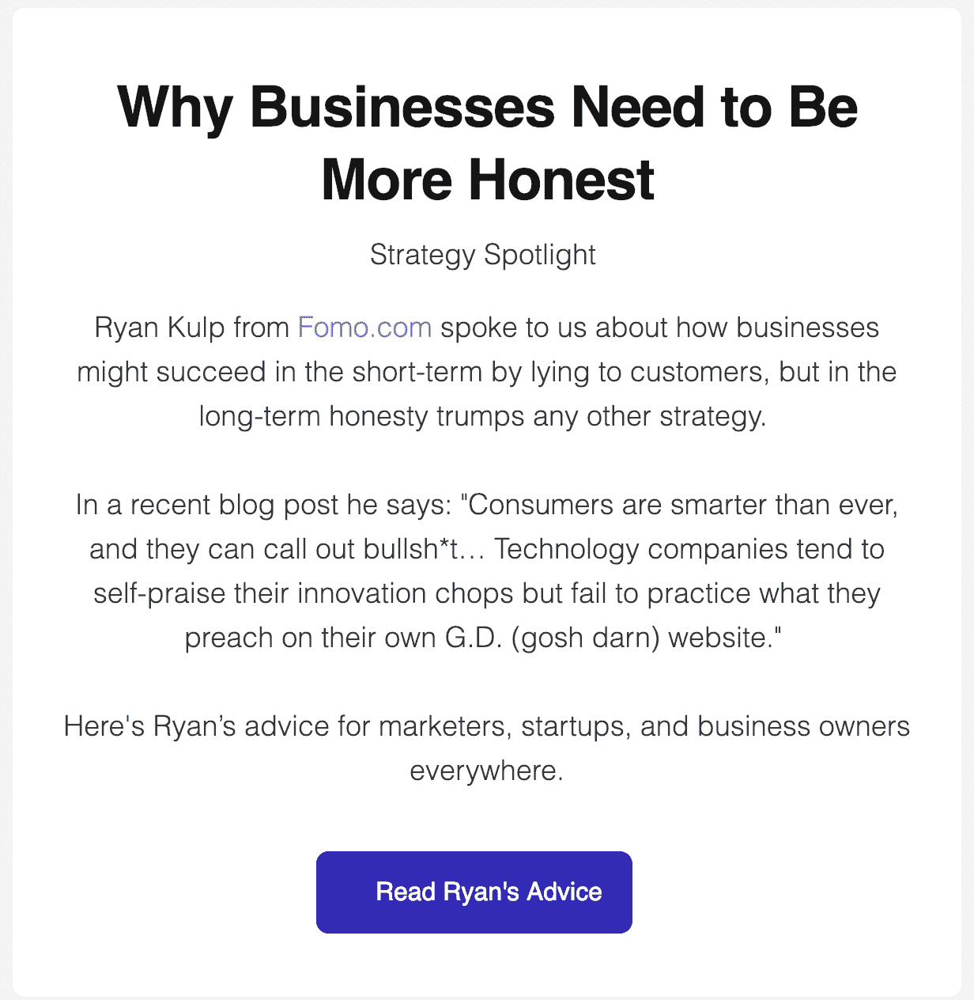

也许这只是我的看法，但是这些广告并不完全清楚...广告。

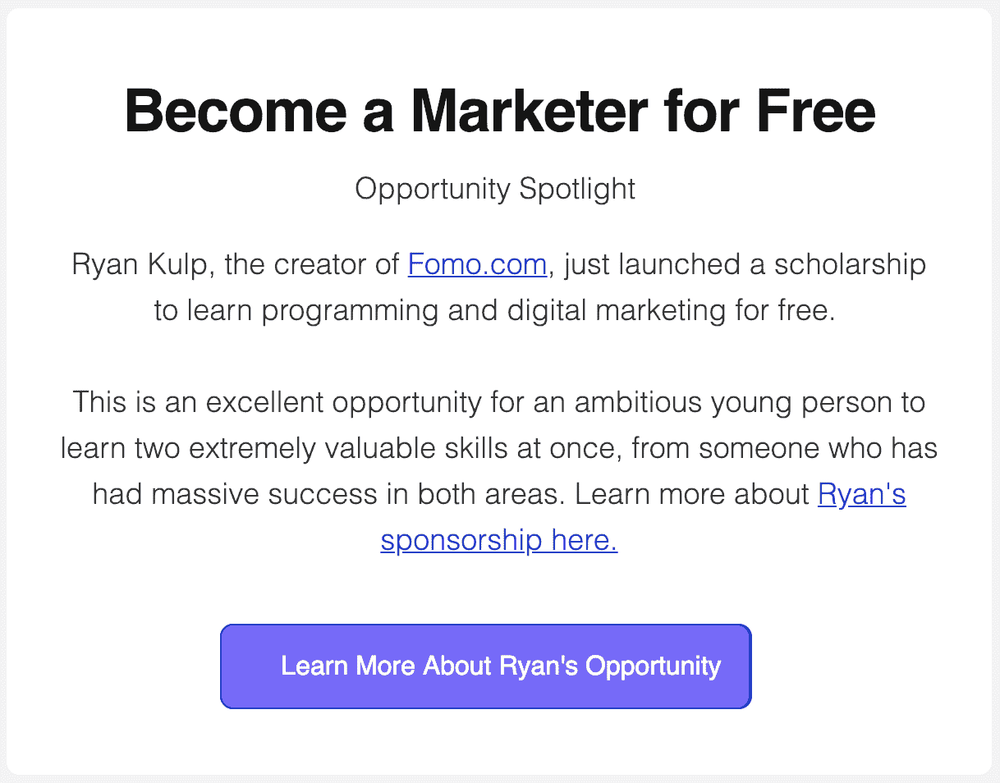

因为每个链接只是一篇博客文章，而不是推荐方案或其他激励链接，我不认为 MentorKit 做了任何“不道德”的事情

相反，这凸显了一场正在进行的辩论，即流量经纪人应该披露付费客户赞助的具体策略。

**链接归属和测量**

因为每个内容都在不同的博客上，有自己独特的 GA 片段，所以不需要指定多个属性参数。

**roi**

*   Fomo 广告:0 电子邮件注册。
*   个人奖学金广告:(0 - 4*申请人)

<small>`*`*the scholarship application was an outbound Google Form link. i could have written JavaScript that appends source page URL parameters to the application form, but it felt like overkill.*</small>

由于在我的申请注册期间(截至 2019 年 1 月 31 日)，有 131 人申请，1，458 名独立访问者查看了该页面，平均每 11 名看到申请的人中有 1 人申请。

因此，MentorKit 可能通过 37 名独立访问者的方式吸引了多达 3 或 4 名申请人。

如果你熟悉罗伯特·恰尔迪尼的《影响力》,你会对数字心理学感到兴奋，这是一个由丹尼尔·斯蒂法诺维奇制作的免费资源。

有 9 个常青网页的内容，深入研究消费者心理及其对购买行为的影响。阅读后的营销人员可以立即将建议落实到他们的电子商务商店或 SaaS 网站上。

由于**社会证明**是数字心理学概述的 9 大影响力支柱之一，因此向那些认同第一原则的读者提供 Fomo 是有意义的。

**点击次数**

*   超过 30 天的 50 个独立访问者；第一天有 7 名游客

**预览/校对**

DigitalPsychology 已经为所有者的另一个项目准备了原生广告，所以我们复制了它的风格(头像、标题、简短描述),在最终的外观和感觉方面没有任何惊喜。

**创意投入/灵活性**

丹尼尔让我们写自己的广告，放在网站每个页面的底部。

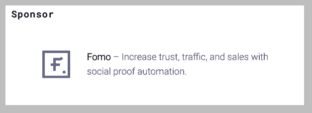

他们还删除了现有的广告，使 Fomo 成为一整月的“唯一赞助商”，这很酷。

**链接归属和测量**

我们写了自己的跟踪参数。可能有些夸张，因为所有的广告都在页脚，但是为什么不呢:

*   `?utm_source=DigitalPsychology&utm_medium=referral&utm_campaign=footer`

**roi**

0 电子邮件签章。

我不会对《HN 文摘》大加赞赏，因为它是黑客时事通讯的翻版。

也就是说，它们确实提供了一个简洁的功能，让用户可以自己选择想要接收多少内容，以及接收的频率。

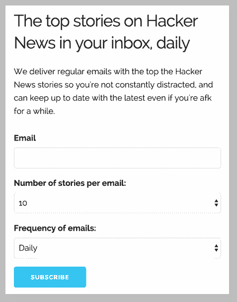

我通过 ThoughtLeaders 发现了 HN 文摘，这是一个将 Fomo 这样的品牌与时事通讯赞助商和有影响力的人联系起来的市场。

**点击次数**

*   38 名独立访客(未经核实)

ThoughtLeaders 有一个交通仪表盘，但我不相信这些工具，你也不应该相信。

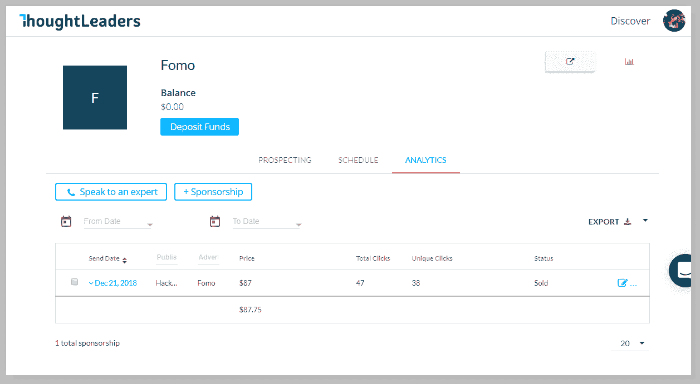

所有出站链接都是“香草”(没有跟踪)，他们没有在广告生成器中清楚地说明这一明显重要的广告技术功能。

在简讯活动之后，我与他们的团队进行了简短的电子邮件讨论，之后他们试图追加销售价值数千美元的 Fomo 服务。我们不会再用思想领袖了。

**预览/校对**

现场广告建设者，1 点击购买后，选择一份通讯赞助。

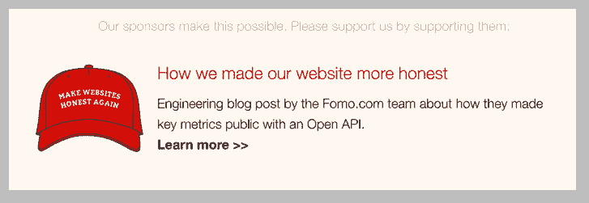

**创意投入/灵活性**

时事通讯本身，在我们的案例《HN 文摘》中，有能力自动或手动批准广告。我们的副本和图像图标被接受。

**链接归属和测量**

不知道。

**roi**

没有线索，但让我们假设 0 电子邮件注册。

*剧透*:我们拥有这个免费资源，它每周采访成功的 Shopify 商店，询问他们是如何开始和发展业务的。

特色店铺的销售额从 10，000 美元/年到[1，500 万美元](https://twitter.com/bwshopify/status/1102948362205179907)不等，因此受众的志向和成长阶段各不相同。

由于 Fomo 在 Shopify 生态系统中很受欢迎(成千上万的安装)，因此在访谈节目中以“卡片”形式展示我们的产品是有意义的。

**点击次数**

*   超过 28 天的 15 个独立访问者

**预览/校对**

不适用，我们经营这个宝贝。:)

**创意投入/灵活性**

以下是 Fomo 广告在博客上的表现:

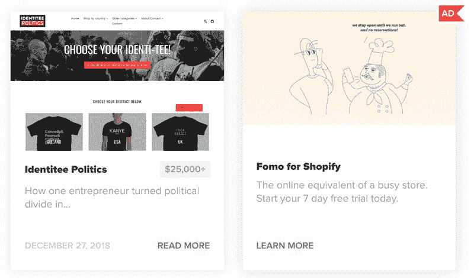

**链接归属和测量**

与 Shopify 一起建立的是一个流量低(但 100%有机)的利基网站。我们在谷歌上对“ [Shopify 案例研究](https://www.builtwithshopify.com)”的排名是第 2-3 位

上个月(2019 年 2 月)，我们的广告为我们的应用程序列表带来了 15 名独立访客，但随着时间的推移，它带来了 100 名高质量的访客。

**roi**

0-2 次应用安装(*我们将 20-30%的唯一列表访问者转化为注册用户*)。

我的朋友 Nat 制作了一份高质量的每周时事通讯，带有轻松的社论和他自己的博客帖子的链接，以及那一周他找到的随机的、有趣的资源。

Nat 的许多用户和我一样:在技术方面，聪明，英俊，并欣赏可以帮助我发展业务的营销工具。把 Fomo 放在 Nat 的观众面前是有意义的，即使只是为了加强对 Fomo 的认识。

**点击次数**

我们从 Nat 的博客中获得了几十个链接，其中提到了我们，所以在这里准确地分配一个数字是很困难的。详见“链接属性”。

**预览/校对**

Nat 写他自己的时事通讯，所以在提供了我们的链接后，我们作为一个普通订户得到了最终结果。

**创意投入/灵活性**

周一 Medley 简讯只有文本+链接，所以没有标志，但我们完成了任务:

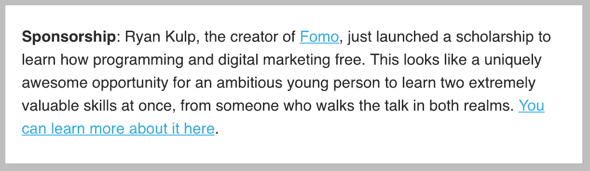

**链接归属和测量**

*   Fomo.com 与`?ref=monday-medley`联系在一起
*   我的个人奖学金帖子是香草/裸体的

**roi**

有几个人在他们的奖学金申请中提到了“我通过 Nat 的博客找到了你”。

Fomo.com 的电子邮件注册总数是未知的，因为在 GA 中查询`ref=?` (vs UTM 参数)是不可靠的，Nat 的网站已经在一个有机的帖子中链接到 Fomo。

让我们假设没有电子邮件注册。

对于经常性的小众话题时事通讯，Inside 是你的地盘。

从《内部特斯拉》(Inside Tesla)到《内部特朗普》(Inside Trump)，再到现在的《内部营销》(Inside Marketing)，有几十种选择，都有自己的编辑团队，当然还有独特的读者群。

因为 Inside 拥有令人印象深刻的新技术和营销类别的参与度和人口统计数据，所以分享 Fomo 是有意义的。

**点击次数**

*   超过 4 天的 106 个独立访问者；第一天 30 名游客

**预览/校对**

在我们的活动上线之前，内部团队发送了一个隐藏的 URL，其中包含我们最终的文本+链接+图像，并包含在一个可点击的实体模型中。

**创意投入/灵活性**

Fomo 团队起草了一个简短的推介，然后 Inside 的编辑团队对其进行了调整，即删除“胡说八道”，代之以“废话”。

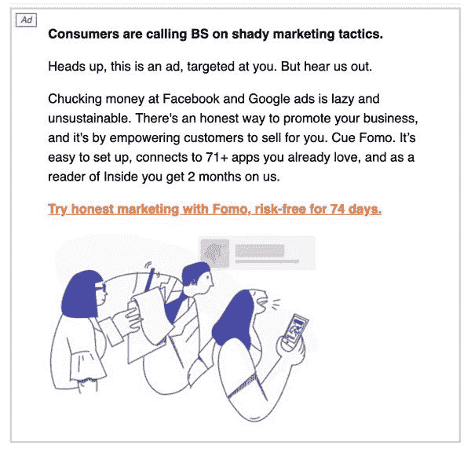

这种变化是完全公平的...大多数 B2B SaaS 工具不像我们这样经常骂人。

<small>`*`*most companies don't curse at all.*</small>

**链接归属和测量**

我们在这次活动中使用了自己的[内部附属产品](https://partners.fomo.com)。

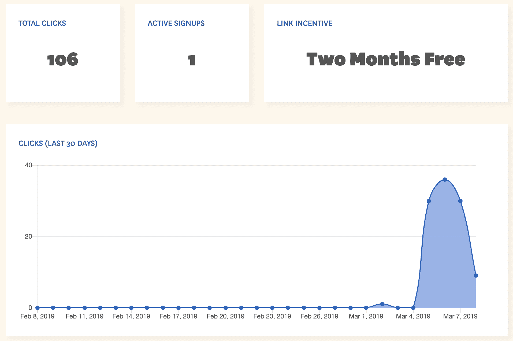

这使得跟踪点击、免费试用转换，甚至是谁具体注册了一个给定链接变得很容易。

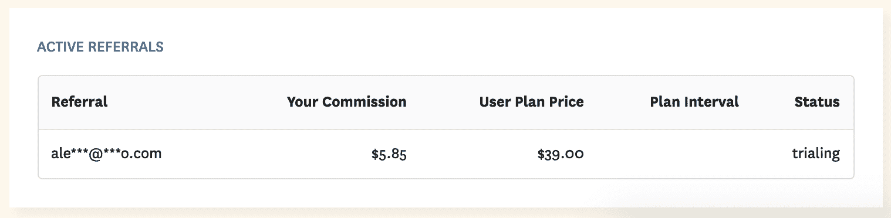

Fomo 还为 Inside readers 提供了 2 个月的免费试用，而在这个实验中的所有其他赞助商都提供了通常的 7 天或 14 天的试用。

**roi**

到目前为止，1 次免费试用注册(需要信用卡输入)。这场运动仍在进行。

## 摘要

这是我们之前介绍的同一张图表，现在填写了所有指标:

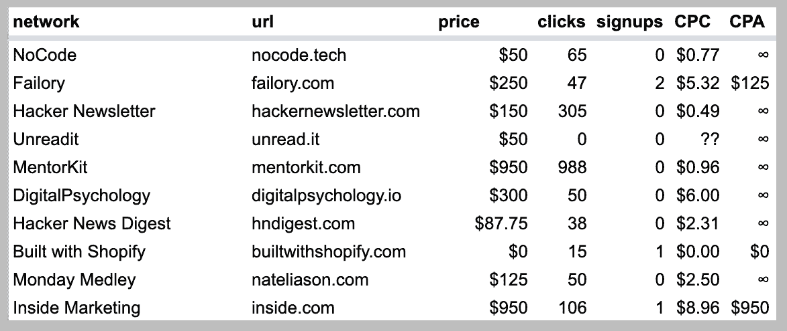

只有 4 个电子邮件注册，花费了 2912.75 美元，电子邮件简讯广告对 Fomo 来说是一个巨大的失败。

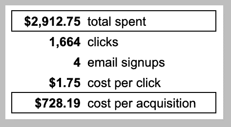

当然，钱只是一种资源。

为了制作内部营销、失败和黑客新闻摘要广告，我还招募了 1-2 名 Fomo 团队成员进行营销和设计协助。

这很容易又让我们损失了 2-4 千美元的“人工”，使我们的全包简讯实验接近 5，000 美元，而不是 2，912 美元。

## 电子邮件简讯广告技巧

从这一反思中可以看出两个明显的问题:

1.  确保你确切地知道*链接是如何被跟踪的*
2.  优化赞助链接目的地，实现转化率最大化

由于我们的转化率很低，即使有正确的受众和链接跟踪(如内部营销)，我不认为这个活动可以用更好的归因来“拯救”。

同样，虽然我们可以使用 PPC 或漏斗式的登陆页面，而不是我们的主页和博客，但即使收集的电子邮件数量增加 10 倍(40 个注册对 4 个)，也不会带来积极的投资回报。请记住，我们[已经用<350 美元的营销支出有机地搭载了](https://fomo.com/open)100 个新客户/月。

第三个也是不太明显的变量，如果我们再做一次，我会改变的是**在谈判价格**时变得更有创造性。

## 电子邮件简讯广告要付多少钱

如上图所示，Fomo 支付的每次点击费用从 0.49 美元到 8.96 美元不等，而受众的质量或转化可能性几乎没有任何差异。

这是因为时事通讯的赞助价格仍然很高。没有标准，没有最佳实践，没有行业规范。

精明的时事通讯会告诉你他们认为的平均价格，但他们可能会将价格与印刷广告进行比较，印刷广告有潜在的固定成本，如...哦...打印机和送货车。

**电子邮件简讯广告定价策略**

1.  大多数时事通讯试图根据订户数量来定价
2.  如果他们更透明一点，每封邮件打开。
3.  另一个流行的策略是 CPM，即“每 1000 次展示的成本”，但即使这样也可能会有偏差。是不是每 1000 个*能*看到广告(发送)，或者*可能*看到广告(打开)，或者*肯定*看到广告(在简讯中向下滚动足够远)的人的成本？

很难找到按点击量收费的时事通讯，因为在所有的技术和参与度统计之下，事实是电子邮件时事通讯的广告点击量并不多。

如果我再次开展这项活动，我会为点击注册制定一个大胆的激励机制，比如说每份免费试用 100 美元。

这也将影响广告单元本身，因为时事通讯可能更喜欢尝试 Fomo，然后用他们的观众期望的语言和语气认可它。

也许我们甚至会给简讯一个 1-2 个月的 Fomo 试用，除了更好的评估，还会让他们的订户看到我们的产品在整个推广过程中的表现。

从本质上来说，这种策略将是一种真正的合作关系，因为它依赖于游戏中的皮肤，并且会便宜 728%(100 美元对 728 美元 CPA)。

## 在广告上花费 2913 美元的其他方式

这次活动的平均每次点击成本是 1.75 美元，考虑到没有一份时事通讯提供保证，这个价格还算不错。

我们的谷歌广告预算(顶部的图表)显示 2019 年 2 月的每次点击费用为 1.43 美元，因此，如果访问者是一名对转化率优化感兴趣的英语营销人员，那么我们同意任何低于 2 美元的金额都是“可以的”。

也就是说，超过 1000 次点击(MentorKit，黑客新闻摘要)直接进入了我们的博客，而不是像我们的主网站一样有明显的转化机会。这意味着我们调整后的点击费为 2.93 美元(1，875 / 638 次点击)。

我们可能会给 50-100 名 Fomo 客户一个月的免费服务(大约 3000 美元的补贴，取决于他们的定价计划)，以换取一个“关于我们的推特”大喊，并推动超过 638 次点击，不是吗？

在线广告的魅力在于它是即时的、可扩展的和可衡量的。有时候这些承诺是正确的，但是对你的度量标准不诚实就像一个上瘾的扑克玩家，他“大部分时间都赢了”,但在他的职业生涯中却遭受净负损失。

## 一线希望

正如营销、讲故事和消费者购买行为中的所有事情一样，增长和意识是非线性的活动。

换句话说:我们有可能获得 2 倍甚至 4 倍于我上面计算的投资回报率。出于这个原因，也因为我穿着塔吉特百货 6 美元的 t 恤，我不后悔花 3000 美元在时事通讯广告上，只是为了写这篇博文。

因此，如果你经营一个利基社区，并想向我推销一个更符合产出而不是投入的赞助机会，[打个招呼](mailto:ryan@fomo.com)。

