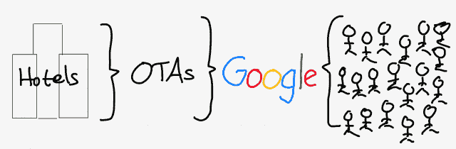
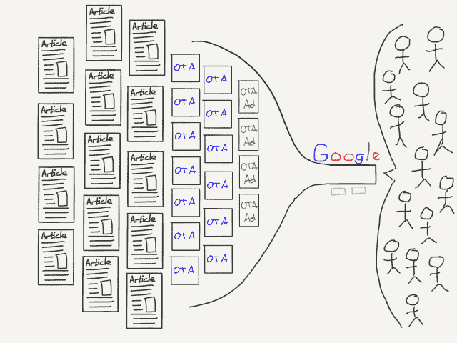
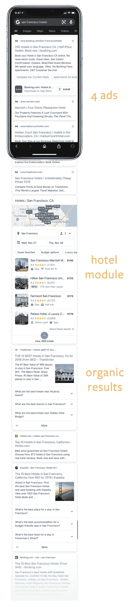
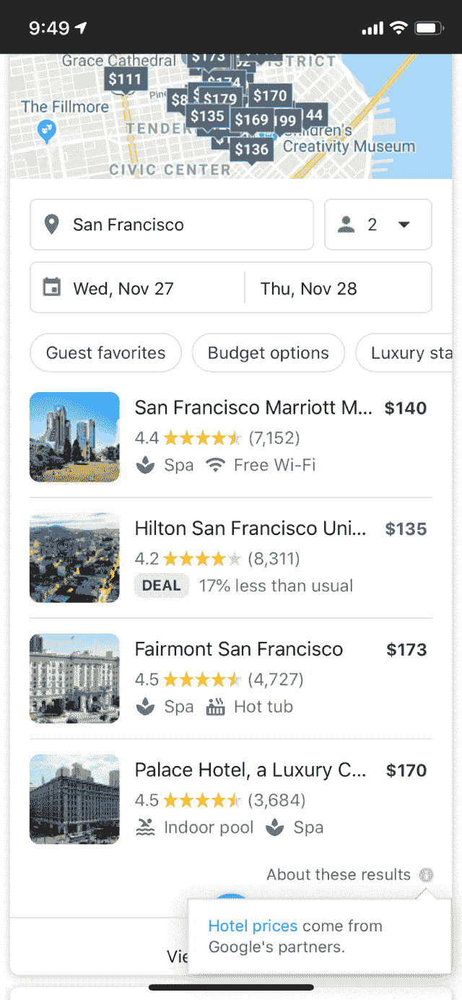
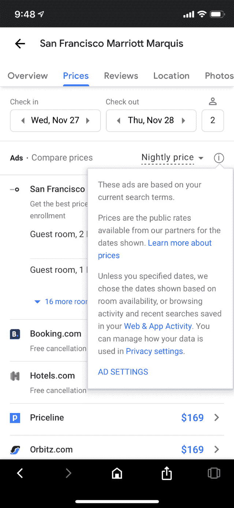
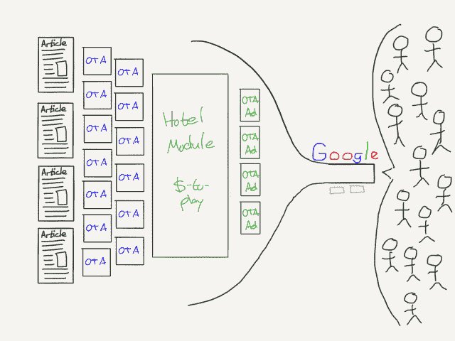

# 本·汤普森的谷歌挤压战略

> 原文：<https://stratechery.com/2019/the-google-squeeze/?utm_source=wanqu.co&utm_campaign=Wanqu+Daily&utm_medium=website>

2014 年第三季度，谷歌的收入为 165 亿美元，利润为 28 亿美元。我接着写了一篇名为[巅峰谷歌](https://stratechery.com/2014/peak-google/)的文章。快进到上个季度，谷歌的收入和利润分别为 360 亿美元和 67 亿美元，同比分别增长 118%和 139%。很难想象还有比这更错误的了！

郑重声明，我的论点并不是谷歌的收入和利润增长已经结束；相反，就像 21 世纪初的微软一样，谷歌将继续增长，但其相关性已经达到顶峰，这在很大程度上是因为品牌营销在网络上将变得更加重要。

坦率地说，这种解释在某种程度上让事情变得更糟:正如我所预测的那样，某些类型的广告在脸书或 Instagram 等平台上的效果要好得多，这当然是事实(脸书放弃了在第三方网站上竞争广告也是事实)；同样值得注意的是，大部分广告不是传统的品牌广告，旨在增加品牌对未来转化的亲和力，而是产生需求的直接广告(与谷歌在搜索中捕捉需求的直接广告相反)。然而，真正没有切中要害的是，谷歌的相关性以任何方式下降了。

#### 五年的增长

我承认在每日更新中弄错了谷歌峰值的文章，特别是 T2 2017 年的这篇文章，但是为了问责，当然也为了这篇文章，快速回顾一下是合适的。

首先，我应该从一开始就清楚这个分析并不适用于 YouTube。YouTube 不仅是传统上基于视频的品牌广告的天然选择，而且当时它几乎没有盈利；很明显，仅这一项就带来了显著的增长。 [1](#fn1-4464 "It remains a big problem that we don’t know exactly what YouTube’s financials are; if Google won’t tell us the SEC should make them")

第二，尽管我在 Stratechery 早期的大部分时间里都在写关于移动的文章，以及它的影响被低估的程度，尤其是被那些已经采用了个人电脑的美国人低估了，但我低估了移动的影响！首先，手机极大地增加了谷歌在发达国家和发展中国家的用户数量。第二，移动电话极大地增加了现有用户的使用，因为互联网现在在人们的口袋或钱包里，而不仅仅是在他们的桌子或背包里。谷歌的市场正在变得更大。

然而，最大的错误是低估了谷歌在向用户展示更多广告方面可以走多远，即使你考虑到更多用户更频繁地使用谷歌。

#### MOAR Ads

谷歌向用户展示更多广告的第一个也是最明显的方式是在移动搜索结果中插入更多广告。这是我密切跟踪的一个发展，我想知道公司会走多远，因为它首先添加了第三个广告，然后是第四个。我在每日更新中写道:

> 不可否认，这一观察在很大程度上是至关重要的:谷歌的收入增长是因为实际参与度的增加，还是仅仅因为屏幕上塞满了越来越多的广告？事实上，恰当的回答是“谁在乎？”我怀疑我的反对态度源于谷歌的巅峰时期:该公司继续违抗我的总体叙述，所以原因肯定是像现代付费包容模式这样的不恰当的东西。嗯，这是一种-一种-它是什么…
> 
> 这当然可能有点令人反感——谷歌辩称，人们仅仅使用互联网就意味着他们赚了更多的钱，这更有启发性，因为他们十年前就这么做了——但这并不意味着它没有效果，坦率地说，我没有给予它足够的信任。

然而，同样重要的是谷歌应对垂直搜索替代方案所带来的威胁的方式。当我写《巅峰谷歌》的时候，有很多人说移动对谷歌来说是一个问题，因为新的应用模式将使最终用户更有可能绕过谷歌。他们会用 Yelp 进行本地搜索，用亚马逊购物，或者用 Expedia 旅游；当然，对于大多数用户来说，URL 和书签管理器可能过于混乱，但是“应用程序革命”意味着垂直搜索引擎只需轻轻一点就可以实现。

然而，事实上，这种威胁最终被夸大了，原因有几个。

首先，事实证明，用户不想同时使用多个应用程序，就像他们不想同时使用多个 URL 一样。内置浏览器中的搜索仍然是最容易和最明显的起点。

其次，谷歌愿意支付任何必要的费用，以确保它是这些内置浏览器的默认搜索引擎，包括持续向苹果支付数十亿美元。

第三，谷歌开始改变移动搜索结果，使其变得更加有用:不再强迫用户点击链接寻找答案——这是移动用户不喜欢的，就像下载新应用一样——谷歌会给他们答案；他们甚至不需要“感到幸运”。不过，最重要的是，当涉及到垂直搜索类别时，谷歌将提供一种全新的结果页面。

#### Expedia 和猫途鹰

现在讨论这个话题是因为 Expedia 和猫途鹰令人失望的收益结果。从[美国消费者新闻与商业频道](https://www.cnbc.com/2019/11/07/expedia-and-tripadvisor-stocks-tank-after-poor-third-quarter-earnings.html):

> 周四午盘，Expedia 和猫途鹰的股价双双创下今年以来的新低，跌幅高达 25%。周三盘后，两家旅游服务类股均公布第三季度收益不及预期，导致股价暴跌。两家公司都指出，谷歌搜索结果的能见度下降是长期的营收逆风。

Expedia 首席执行官 Mark Okerstrom 在 Expedia 的收益电话会议上说:

> 我们看到的是，随着时间的推移，基本上免费链接继续向页面下方转移，被其他模块插入，最终流量从 SEO 渠道转移到其他一些产品，无论是航班元搜索还是酒店元搜索。当然，就酒店产品和住宿产品而言，我们能够获得一些销量，这最终导致我们在销售和营销方面的支出比以往更多。我们对我们在上面看到的回报很满意，但最终，不如我们从 SEO 频道看到的回报好。

猫途鹰首席执行官史蒂夫·考夫在猫途鹰的收益电话会议上说:

> 在本季度的过程中，我们确实看到了一些增量 SEO 逆风。总是很难确切知道谷歌在做什么。我们认为这是我们的有机结果。我认为，随着谷歌变得越来越积极，你会在整个行业看到这一点。当然，在过去的许多年里，我们一直在预测这一点。我们上次通话时谈过了。我们知道这个 SEO 是一个持续的趋势，我们并不预测它会发生逆转。

Expedia 和猫途鹰曾经是同一家公司；他们在紧密相关的空间里玩耍。Expedia 是一家“OTA”——在线旅行社——你可以在那里预订酒店、机票等。；猫途鹰专注于评论，但通过元搜索引擎盈利，即通过将用户推荐给在线旅行社(尽管猫途鹰凭借其“即时预订”产品，离在线旅行社不远了)。

#### OTAs 和聚合理论

谈到[聚合理论](https://stratechery.com/2015/aggregation-theory/)，OTA 们一直是[特例](https://stratechery.com/2017/uber-in-london-a-correction-books-and-blogs-revisited-more-aggregators/)；像聚合者一样，他们以零边际成本为基础为顾客服务，他们通过满足顾客的需求来控制供给(主要是酒店)。对我来说，棘手的问题是他们如何获得这种需求:首先是从谷歌那里。

Expedia 的 Google play 非常简单:对“去东京的机票”或“悉尼的酒店”等常见查询提供排名靠前的答案，并且非常擅长购买搜索广告。与此同时，猫途鹰利用其评论对一系列与旅游相关的术语进行高排名，然后在这些评论的旁边提供预订功能。

然而，在这两种情况下值得注意的是，最终拥有客户关系的是谷歌，这就是为什么我总是不愿意称之为在线旅行社聚合者:

[T2】](https://i0.wp.com/stratechery.com/wp-content/uploads/2019/11/Stratechery-2019-11-12-23.30.18.png?ssl=1)

在线旅行社和谷歌之间的这种安排长期以来对双方都有利。谷歌为在线旅行社带来流量，在线旅行社可以通过从供应商那里抽取佣金来赚钱。与此同时，谷歌不仅收到它可以提供给客户的相关结果，还从在线旅行社购买搜索广告中赚取了数十亿美元。

[T2】](https://i0.wp.com/stratechery.com/wp-content/uploads/2019/11/Paper.stratechery_Year_One_copy.251.png?ssl=1)

改变的是酒店模块，从谷歌的搜索结果开始，然后蔓延到这些公司的财务结果:

[T2】](https://i0.wp.com/stratechery.com/wp-content/uploads/2019/11/googlehotelsearchresults.jpg?ssl=1)

首先，注意你现在需要滚动多少屏幕才能达到有机结果——在 812 磅高的 iPhone 11 Pro 上至少需要 3 个屏幕。再次重申，这并不一定是新的——谷歌已经添加广告有一段时间了——但是使酒店模块引人注目的是，虽然很容易忽略广告，但该模块是真正有用的！你有一张城市地图，上面有各种酒店的价格，有机会指定你的日期，还有几个选项可以点击。

然而，至少从在线旅行社的角度来看，问题就在这里:

[T2】](https://i0.wp.com/stratechery.com/wp-content/uploads/2019/11/IMG_9686-rb.png?ssl=1)

如果你不确定“谷歌合作伙伴”是什么意思，当你点击其中一家酒店并查看价格时，你会看到这样一个屏幕:

[T2】](https://i0.wp.com/stratechery.com/wp-content/uploads/2019/11/IMG_9685-rb.png?ssl=1)

酒店模块中的一切都是广告，或者更准确地说，是付费包含。这个特殊的例子没有 Expedia.com(但它有 Hotels.com，Expedia 拥有)或猫途鹰，但他们在其他地方；奥克斯特罗姆说的就是这个模块:

> 当然，就酒店产品和住宿产品而言，我们能够获得一些销量，这最终导致我们在销售和营销方面的支出比以往更多。我们对我们在上面看到的回报很满意，但最终，不如我们从 SEO 频道看到的回报好。

我认为不会；搜索引擎优化频道是免费的，酒店模块不是。

#### 聚合在线旅行社

在这一点上，结论似乎很容易，不是吗？谷歌又一次变得邪恶。事实上，虽然我理解 Expedia 和猫途鹰的沮丧，但我认为事情有点复杂。

从理论角度开始:聚合者主导的市场的稳定结构是，聚合者控制需求，供应商按照聚合者的条件进入聚合者。换句话说，价值链中有三个参与者:供应商——聚合者——需求者。不过，值得注意的是，旅游业的情况并非如此，谷歌控制了需求，而在线旅行社控制了供应。

实现平衡的一个方法是让谷歌成为统治所有这些公司的 OTA。事实上，这将很难与之竞争(2010 年谷歌收购 ITA 时也存在这种担忧)。然而，事实是，在线旅行社已经付出了巨大的努力来吸引供应商，他们处理所有恼人的支付和客户支持问题，而谷歌喜欢回避这些问题。相反，谷歌已经意识到，它可以让在线旅行社有效地付钱给谷歌，让谷歌为他们处理这些棘手的问题。

[T2】](https://i0.wp.com/stratechery.com/wp-content/uploads/2019/11/Paper.stratechery_Year_One_copy.252.png?ssl=1)

有了酒店模块，谷歌更高效地捕捉需求，不仅让谷歌搜索对终端用户更有吸引力，也让 OTA 转化为供应商，付费提供谷歌不想提供的服务。这是特伦·格里芬所说的批发转移定价的典型例子:

> 批发转移定价= A 公司向 B 公司提供独特产品 XYZ 的议价能力，这可能使 A 公司通过提高 XYZ 的批发价格获取 B 公司的利润。

在这种情况下，独特的产品是需求——用户。这也是我想为谷歌辩护的地方:归根结底，该公司主要通过提供更好的产品，在其价值链中占据主导地位。搜索起步更好，但谷歌没有固步自封:它让移动搜索变得更好，特别是通过这些模块，虽然用户可以下载另一个应用程序或访问不同的网址，但他们只是不想这样做。

与此同时，我特别理解在线旅行社和谷歌所有供应商的失望:如果连四个广告都不能阻止用户，如果谷歌打算不惜一切代价成为默认搜索引擎，那么该公司以这种方式收取租金难道不公平吗？

#### 与谷歌竞争

在这里，至少值得考虑一下最大的在线旅行社——预订控股公司。该公司在 Expedia 发布后一天公布了收益；来自[晨星](https://www.morningstar.com/news/dow-jones/2019110717158/booking-holdings-beats-expectations):

> Booking Holdings Inc .公布了超出预期的第三季度业绩。这家在线旅游网站的利润为 19.5 亿美元，合每股 45.54 美元，高于去年同期的 17.7 亿美元，合每股 37.02 美元。调整后收益为 45.36 美元，同比增长 20%。FactSet 调查的分析师预期为每股 44.50 美元。收入为 50 亿美元，高于去年同期的 48 亿美元。分析师预期为 48.5 亿美元。

Booking Holdings 首席执行官 Glenn Fogel [在公司收益电话会议上辩称，该公司相对不受谷歌行为的影响:](https://seekingalpha.com/article/4304159-booking-holdings-inc-bkng-ceo-glenn-fogel-q3-2019-results-earnings-call-transcript?part=single)

> 关于搜索引擎优化，我们在搜索引擎优化渠道中看到了一些逆风，这确实造成了一些压力，但对我们来说这是一个小渠道。

福格尔后来补充说:

> 最后，让客户直接来找我们对我们来说最重要的是什么。我们过去已经谈过很多次了。这是我认为非常重要的事情之一。对我们来说，拥有自己的未来就是创造一个如此美妙、如此好的服务，人们会自然而然地直接回到我们身边。我们将不再依赖其他交通来源。

这显然是一件好事，不是吗？Booking 知道它不能依赖谷歌渠道，它的未来最好通过创新和建立客户体验来确保，这种体验可以说服用户直接去 Booking。这是为客户利益服务的竞争！

在阅读 Yelp 首席执行官杰里米·斯托佩尔曼的简介时，我也有类似的想法。令 Yelp 惊愕的是，谷歌搜索中的“酒店模块”很久以前就出现在“本地模块”之前了。然而，正如我之前提到的，Yelp 的抱怨总是让我犹豫，因为该公司一度被视为谷歌在移动领域的典型威胁；为什么这家公司没有赚到更多的直接客户，反而花这么多时间和精力抱怨谷歌的搜索结果？这就是为什么我觉得这个简介很吸引人:

> 它还通过推荐软件用算法显示评论。它将软件标记为被请求或有偏见，或因为对用户不够了解的评论分离出来。据 Yelp 称，这意味着它隐藏了近 30%的评论。委婉地说，这种审查过滤器在企业中非常不受欢迎…
> 
> “我敢肯定，如果我们允许自己妥协，只是说:Yelp 上什么都有，我们会赚更多的钱。你想要 5 颗星？告诉你的朋友去为你写一堆评论，他们会在 Yelp 上，然后你可以做广告。这不是很好吗？”斯托佩尔曼说。
> 
> 相反，Yelp 走了另一条路。它对评论保持警惕，并传递了一些从用户数据中赚钱的简单方法。举例来说，它不允许商家瞄准那些碰巧带着广告路过的用户。尽管谣言不断，但很难想象 Yelp 会成为大型科技公司的收购目标——在 BuzzFeed News 的两次采访中，直言不讳的斯托佩尔曼抨击了脸书、亚马逊和谷歌…
> 
> “当我看着其他公司时，”斯托佩尔曼说，“我看到了其他优先事项，即尽可能增加收入。那么，为什么脸书不打击某些类型的内容，或者为什么他们允许耸人听闻的故事或不真实的故事在网络上传播，并被放大这么多？如果他们有先见之明，说‘嘿，这对世界不好’或‘这对我们的长期品牌不好，我们应该关闭它’，这可能不会变成一个最终造成创伤的政治问题。
> 
> “但归根结底，吸引注意力是他们赚钱的方式，他们使用算法——就像 YouTube 和谷歌一样。你知道，这就像谷歌和脸书做了同样的事情:使用算法进行优化，以获得最大的关注。如果你为了最大限度的关注而优化，你就会倾向于人类在火车相撞时东张西望的本性，以及人类所能提供的所有最糟糕的东西。这就是你的归宿。我敢肯定，这对他们的业务来说就像火箭燃料，但现在我们正在为此付出代价。”

这是迄今为止我听到的 Yelp 给自己的最有说服力的推销:“大公司充斥着垃圾邮件和错误信息，而我们却花时间来获得正确的评论。”很难不去想，如果这一信息像其反谷歌的观点一样尖锐地传播，Yelp 的产品会有多受欢迎。

当然，还有亚马逊:[比谷歌](https://www.emarketer.com/content/more-product-searches-start-on-amazon)更多的产品搜索开始于亚马逊，这不是因为亚马逊花费精力抱怨谷歌偏袒自己的购物结果，而是因为亚马逊走出去为用户提供了更好的体验。

#### 垄断问题

我仍然非常担心垄断，特别是在消费技术、数字广告方面；《华尔街日报》的这篇报道很好地概括了谷歌是如何让竞争变得极其困难(对有竞争力的广告技术公司而言)以及让其他地方变得极其困难(对其客户而言)的。

另一方面，让我对搜索犹豫不决的是，对用户移动没有限制。无论是在网络上还是在智能手机上，使用 Yelp、亚马逊或 Booking 都是微不足道的。顾客惯性是需要监管的东西吗，或者它是制造更有吸引力的产品的可能动力吗？

或许，一个答案在于谷歌的行为本身:与传统垄断不同，很难说谷歌的产品没有变得更好。当然，在线旅行社需要付费才能玩酒店模块，但酒店模块是对 10 个蓝色链接的真正改进。谷歌给出答案而不是选项的其他领域也是如此。我完全明白这可能是谷歌搜索优势的不公平延伸，但直接抑制创新及其激励的可能性值得考虑。

*我在[每日更新](https://stratechery.com/2019/the-google-squeeze-follow-up-disney-launch-instagram-influencer-follow-up/)中写了这篇文章的后续。*

### *相关*