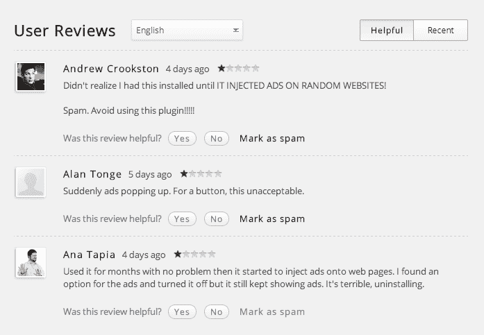

# 我卖了一个 Chrome 扩展，但这是一个糟糕的决定——数字灵感

> 原文：<https://www.labnol.org/internet/sold-chrome-extension/28377/?utm_source=wanqu.co&utm_campaign=Wanqu+Daily&utm_medium=website>

 <ins class="adsbygoogle" data-ad-client="ca-pub-3152670624293746" data-ad-slot="5831652627" data-ad-format="auto" data-full-width-responsive="true">当谷歌决定拔掉谷歌阅读器的插头时，我很快就把[换成了 Feedly](/internet/feedly-tips/28078/ "Things You Can Do With Feedly") ，因为它是(现在仍然是)谷歌 RSS 阅读器的[最佳选择](/internet/google-reader-alternative/27918/ "Google Reader Alternatives")。Feedly 没有提供的一个重要部分是一个 [Chrome 扩展](/topic/google-chrome/)，它可以让用户在任何网页上点击订阅 RSS 源。

因为我自己的工作流程需要这个扩展，所以我写了一个([编写一个 Chrome 扩展](/software/create-chrome-apps-extensions/27958/)很容易)，并把它发布到了 Google Chrome 商店。上次我查看我的 Chrome 开发者仪表盘时，这个扩展已经在 Chrome 上获得了 30000 多个用户。【更新:谷歌已经从 Chrome 商店移除了该扩展。]

## 谷歌 Chrome 扩展——新商业模式

一天早上，我收到一封来自某人的电子邮件(我试图用谷歌搜索她的名字，但没有结果),问我是否有兴趣出售 Feedly Chrome 扩展。这是一个花了一个小时创造的东西的 4 位数的报价，我同意了这笔交易。我不知道买家是谁，也很好奇为什么有人会花这么多钱买这么简单的 Chrome 扩展。

扩展被出售，他们通过贝宝汇款，我将扩展的所有权转移到一个特定的谷歌账户。这是一个平稳的过渡。

一个月后，Feedly 扩展的新主人向 Chrome 商店推送了一个更新。不，这次更新没有给桌面带来任何新功能，也没有包含任何错误修复。相反，他们在扩展中加入了广告。

这些不是你在网页上看到的常规横幅广告，这些是隐形广告，它们在后台工作，取代你访问的每个网站上的链接，成为附属链接。用简单的英语来说，如果在 Chrome 中激活该扩展，它会将广告软件注入所有网页。

Chrome 扩展的用户评分正在南移。

### 满载广告软件的 Chrome 扩展

毫不奇怪，Chrome 商店的扩展评级最近大幅下降，但买家的商业模式很简单——他们购买流行的插件，注入附属链接，大多数用户永远不会注意到这一点，因为 Chrome 浏览器会在后台自动更新插件。也没有变更日志。

该扩展确实提供了一个选择退出广告的选项(默认情况下你是选择加入的)，或者你可以通过在你的[主机文件](/software/browsers/block-websites-from-kids-home-computer/1602/)中屏蔽 superfish.com 和[www.superfish.com](http://www.superfish.com)域名来禁用它们，但悄悄地偷偷投放广告听起来并不是最道德的产品货币化方式。

出售 Chrome 插件可能不是个好主意，如果你是现有用户，我很抱歉。同时，你可以切换到 [Feedly bookmarklet](/software/rss-extensions-bookmarklets/27929/) 获得无广告体验。

更新:这个故事被几个新闻网站选中，包括 [BBC](http://www.bbc.co.uk/news/technology-25808193) 、[、【华尔街日报】T3、](http://blogs.wsj.com/digits/2014/01/19/google-removes-two-chrome-extensions-amid-ad-uproar/) [Wired](http://www.wired.co.uk/news/archive/2014-01/20/chrome-extensions-adware) 、 [USA Today](http://www.usatoday.com/story/tech/2014/01/20/google-pulls-chrome-extensions/4664945/) 和 [Los Angeles Times](http://www.latimes.com/business/technology/la-fi-tn-google-chrome-extensions-malware-20140120,0,2201554.story) ，谷歌现在已经从商店中移除了这个扩展。</ins>