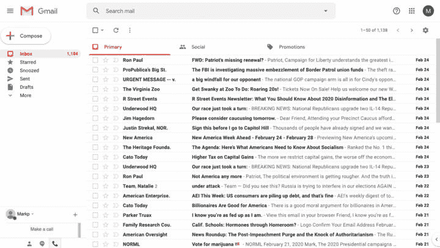

# 左右选票？–加价

> 原文：<https://themarkup.org/google-the-giant/2020/02/26/wheres-my-email?utm_source=wanqu.co&utm_campaign=Wanqu+Daily&utm_medium=website>

### 这篇文章是与...合作出版的

皮特·布蒂吉格以 63%领先。杨安泽以 46%的支持率位居第二。伊丽莎白·沃伦看起来有 0%的麻烦。

这些不是美国 2020 年民主党总统竞选的民调数字。相反，它们反映了哪些候选人能够在一次简单的测试中持续进入 Gmail 的主收件箱。

该标记建立了一个新的 Gmail 帐户，以了解该公司如何过滤来自候选人、智库、倡导团体和非营利组织的政治邮件。

我们发现，我们注册接收的邮件中，很少有人(11%)会进入主收件箱，这是用户打开 Gmail 时看到的第一封邮件，该公司[称](https://www.youtube.com/watch?v=CFf7dlewJus)是“你真正、*真正*想要的邮件”

 [展示你的作品 谷歌巨人

### 我们如何检查 Gmail 对政治邮件的处理

我们对一个新的电子邮件地址进行了实验，试图弄清楚 Gmail 的排序算法在没有用户输入的情况下是如何工作的

<time class="article-card__date" datetime="2020-02-26T06:00:00">February 26, 2020 06:00 ET</time>](https://themarkup.org/google-the-giant/2020/02/26/show-your-work-wheres-my-email)

一半的电子邮件位于一个名为“促销”的标签中，Gmail 称这是“交易、优惠和其他营销电子邮件”Gmail 发送了另外 40%的垃圾邮件。

对于通过电子邮件获得大量捐款的政治事业和候选人来说，将他们的信息转移到不太显眼的标签或垃圾邮件中会产生深远的影响。

“Gmail 对我们的民主以及发生的事情和谁筹集资金有如此大的控制，这一事实令人恐惧，”贝托·奥罗克数字运动的顾问肯尼斯·潘宁顿说。

“可怕的是，如果 Gmail 改变了他们的算法，”他补充道，“他们将有能力影响我们的选举。”

众所周知，脸书和 Twitter 管理人们通过新闻订阅看到的帖子，突出显示一些，而其他的则很少显示。较少受到关注的是，电子邮件如何也成为一个算法策划和货币化的平台——本质上是另一种馈送——以及可能产生的影响。一些非营利组织和政治团体表示，收件箱监管正在减少捐款和请愿签名。

谷歌通讯经理凯蒂·瓦蒂在一封电子邮件中说，这些类别“帮助用户组织他们的电子邮件。”

“邮件分类会自动调整，以符合用户的偏好和行动，”她说用户真的很喜欢选项卡式组织。"

默认情况下，Gmail 会启用这些选项卡，但也可以禁用它们。Wattie 拒绝透露大多数用户是否保留这些标签，但一家电子邮件投递公司表示，2016 年调查中约有 34%的受访者表示他们使用这些标签。

标签还有另一个用途:广告目录。虽然 Gmail 不在主收件箱中销售广告，但广告客户可以在免费账户的社交和推广标签中支付排名靠前的费用。

一些人担心，这样一来，Gmail 会面临与社交网络同样的利益冲突:如果这些平台让免费联系用户变得太容易，就没有人会购买广告。

民主党数字顾问瑞安·亚历山大(Ryan Alexander)说，“令人担忧的是，他们想把 Gmail 变成一个脸书式的新闻源，你必须为收件箱付费。”。

谷歌发言人瓦蒂回答说:“你描述的不在我们的 Gmail 路线图上。”

Gmail 不是唯一一家提供复杂收件箱管理的电子邮件提供商。每月收费 30 美元的电子邮件提供商 Superhuman 将邮件分类为“重要”和“其他”，而微软的 Outlook 将邮件分类为“重点收件箱”。Outlook 和雅虎也在免费账户中出售收件箱中的广告。

但是有着 15 亿活跃的电子邮件地址和大约 27.8%的市场份额，Gmail 日益算法化的收件箱分类有着巨大的影响。

印度 Change.org 主任尼达·哈桑(Nida Hasan)表示，她在 2018 年春天发现，在全球范围内，打开公司电子邮件的 Gmail 用户比例突然大幅下降，导致请愿活动停滞不前。她说，在印度，change . org 90%的用户都使用 Gmail。

哈桑说:“有很多真正好的运动无法动员起来，或者停留在几千个签名上。”

员工们测试了他们自己的 Gmail 账户，发现 Gmail 将 Change.org 的电子邮件发送到了“促销”标签，甚至“忘记密码”的邮件也出现在那里。

大约在同一时间，美国八个进步倡导团体的联盟注意到了类似的变化，并表示它压制了捐款和请愿签名。我们查看了民主美国、CREDO Action 和 SumOfUs 提供的电子邮件数据，发现他们的 Gmail 打开率在那年春天确实下降了，与使用其他电子邮件提供商发送给订户的电子邮件相比，下降了约 50%。

该联盟在 2018 年 11 月给谷歌的一封信中写道:“我们认为，我们通知公众并让公众参与政治行动的能力受到了阻碍，我们认为这是健康民主的基础。”。

> 我们认为，我们让公众了解和参与政治行动的能力受到了阻碍，而我们认为这是健康民主的基础。
> 
> <cite>Coalition of eight political action groups</cite>

在接下来的一个月的电话交谈中，一名 Gmail 官员向他们提出了一个让他们的电子邮件吸引更多眼球的建议:“你可以在促销标签中购买广告，或者提供交易，”李·卡罗西·邓恩(Lee Carosi Dunn)说，他当时负责谷歌的选举销售、政治宣传和政策，根据一名电话会议人员的笔记。“你这种类型的用户可能也在寻找交易，一些涉及融资或参与的交易。”

“听到这个消息，我们感到很震惊，”参加电话会议的 Demand Progress 的活动主管罗伯特·克鲁克香克(Robert Cruickshank)说。“我们不想听起来像营销，因为我们不是营销人员。我们要求人们打电话给国会。”

谷歌发言人瓦蒂没有直接回应有关电话的问题，而是在一封电子邮件中写道，自 2016 年以来，Gmail 不允许广告中出现“政治内容”，这些内容将包括问题宣传和筹款。

为了测试 Gmail 如何处理政治邮件，我们使用新的电话号码和 Tor(一种匿名浏览器)开设了一个新的 Gmail 帐户，以避免根据以前的网络活动发送有关政治倾向的信号。谷歌表示，Gmail 分类是个性化的，这意味着用户活动会影响个人电子邮件的发送地点。

我们注册了 16 位总统候选人的电子邮件名单，包括民主党和共和党。唐纳德·特朗普总统的竞选团队从未给我们发过任何邮件。

我们还为竞争竞选中的国会候选人、来自各政治派别的倡导团体、智库和非营利组织报名。

在四个月的时间里，我们收到了来自 171 个团体的 5000 多封电子邮件。大部分邮件都在寻求捐款。一些发件人坚持不懈——有时一天发不止一封邮件。几乎一半的团体和活动从来没有收到一封电子邮件到主收件箱。

总统候选人的电子邮件比我们注册的其他电子邮件更不容易出现在主收件箱中:平均而言，只有 6%的总统候选人的电子邮件出现在那里，而其他政治和宣传邮件的比例为 9%。

当奥洛克宣布结束竞选活动时，Gmail 将这条消息发送给了垃圾邮件。

在我们的测试中，大多数情况下，总统候选人的电子邮件都出现在“促销”标签中——对他们中的一些人来说，90%的情况都是如此。O'Rourke 数字活动的顾问 Pennington 说，活动的内部数据显示垃圾邮件率比我们在测试中发现的要低。

“我们知道电子邮件会转到 Gmail 的推广标签，我们不担心我们与支持者沟通的能力，”伯尼·桑德斯的通信主管迈克·卡思嘉在一封电子邮件中说。

奥罗克、杨、和的前竞选工作人员也表示，他们不担心电子邮件会被转到“宣传”栏目。其他候选人没有回应置评请求，或者无法联系到他们。

信用: Gmail

<picture><source media="(min-width: 491px)" srcset="https://mrkp-static-production.themarkup.org/uploads/2020/02/gmail-screenshot-1-720x405.jpg, https://mrkp-static-production.themarkup.org/uploads/2020/02/gmail-screenshot-1-1280x720.jpg 2x"> <source media="(max-width: 490px)" srcset="https://mrkp-static-production.themarkup.org/uploads/2020/02/gmail-screenshot-1-720x405.jpg, https://mrkp-static-production.themarkup.org/uploads/2020/02/gmail-screenshot-1-1280x720.jpg 3x"> </picture>

Caption: A screenshot of the tabbed inbox featuring the default categories: Primary, Social, and Promotions.

即使是国会议员通过 House.gov 官方地址发送的电子邮件，也有 25%的时间被转到了促销标签上，而根据法律，这些电子邮件不能用于竞选活动。

在[营销材料](https://gmail.googleblog.com/2013/05/a-new-inbox-that-puts-you-back-in.html)中，Gmail 给出了直截了当的[例子](https://www.youtube.com/watch?v=CFf7dlewJus&feature=youtu.be)，说明哪种电子邮件属于促销标签:“皮划艇冒险五折优惠”、“会员优惠 20 美元”、“7 个必须尝试的浪漫餐厅”

但在我们的测试中，文件夹中的邮件和主收件箱中的邮件之间的区别不太一致。

主题为“新！BernieStore2020 的连帽衫、运动衫、无沿帽”去促销，但另一个宣布“这么多新 t 恤！今天就拿起你的”的邮件发送到主收件箱。

保守派智库克莱尔蒙特研究所(Claremont Institute)的高级研究员迈克尔马丁乌尔曼(Michael Martin Uhlmann)发自内心的讣告，没有包括任何行动呼吁，而是去了促销活动。德克萨斯州年轻共和党人和纽约年轻共和党人俱乐部的注册确认邮件也是如此。

一些政治组织者和倡导者表示，他们对 Gmail 的分类感到失望，并质疑政治邮件与销售有什么关系，正如“促销”的名称所暗示的那样。

纽约青年共和党俱乐部主席加文·瓦克斯这样说:“这只是比垃圾邮件高了一步。”