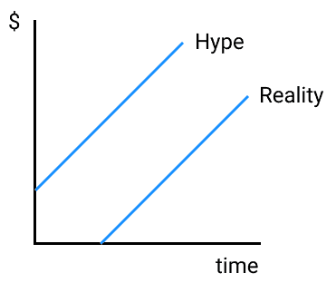
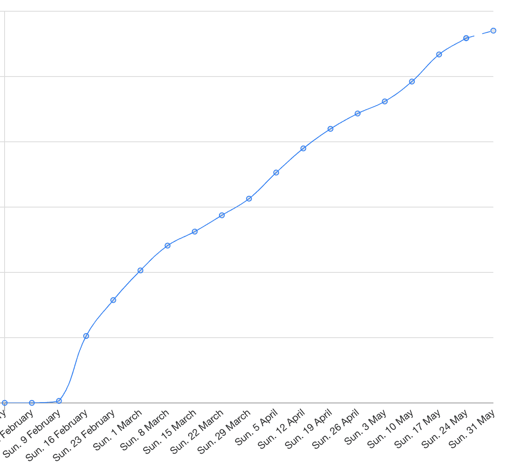

# 我们如何为一个开源项目筹集了 300 万美元

> 原文：<https://posthog.com/blog/raising-3m-for-os?utm_source=wanqu.co&utm_campaign=Wanqu+Daily&utm_medium=website>

开源项目长期以来一直在为如何融资而斗争。幸运的是，我们获得了大量的资金，我们希望分享我们为帮助其他酷项目起飞所做的工作。

对于那些以前没有见过我们的人，PostHog 提供开源产品分析。我们经历了 Y 组合子 [W20 批次](https://www.ycombinator.com/companies?batch=w2020)，发生在 2020 年 1 月到 3 月。我们很快筹集了 302.5 万美元的资金，并希望分享我们所做的事情。我们可能不是一个典型的公司，但我们希望这能给我们一些经验教训。

在你决定是否要筹集资金之前，重要的是要知道你想要达到什么目标，并为此进行优化。

许多项目从来都不想成为商业——如果这只是一个爱好，你不想加快速度，你应该继续做下去:)

我们觉得同时围绕这个项目建立一家公司会让我们建立一些真正雄心勃勃的东西，所以我们这样做了。

那么，你有什么选择呢？

风险投资意味着，如果你明智地花钱，你会有更多的现金来推动项目的发展。这是很大的优势。显然，你必须围绕这个项目建立一家公司，这样至少从长远来看，你有一种赚钱的方式。

在很大程度上依赖于公司，你可能会得到很多支持，比如会见早期客户以在以后产生收入，招聘，免费的风投赠品和你的策略。你可以随时询问他们投资组合中的合伙人和创始人，了解一下与他们一起工作是什么感觉。

我们个人认为，管理加速增长的挑战将会更加激励人心，而且到目前为止情况确实如此！

风投的大肆宣传带来了更大的团队，带来了结果(希望如此)，带来了大肆宣传:

尤其是在早期，风险投资会买入你的潜在价值。这是有道理的——如果围绕你的项目成立的公司有 1%的机会价值 10 亿美元或更多，如果价格合适，人们接受这个赌注是理性的。开源公司真的可以做大——这是以后的事了，但是我们相信开源会在许多产品类别中吃掉 SaaS 的午餐。

向风投推销开源软件的方法是，它更容易投入生产，而且没有厂商束缚感，这让许多开发者不愿尝试 SaaS 的新产品。管理 SaaS 可能“工作量更少”，但你没有理由不提供自己的产品，即托管服务。最终结果是，你的开源回购可以在大公司中使用。他们可能有你的免费产品无法提供的需求(正常运行时间、更好的功能、支持)，你可以通过满足这些需求(通过提供服务、托管或高级功能)来赚钱，并投资到项目中。

这条风险投资路线的不利之处在于，你有夸大宣传与现实不符的风险！

如果你不能用你筹集的资金取得成果，同时增加你的烧钱率，如果你想活下来，你将受到那些资助你的人的支配。不酷，但你走了这条路！

你也有投资者，他们给了你很多钱。不要爱上他们——你必须优先考虑你自己的团队和他们的表现，然后是用户，然后是客户，按照这个顺序。用一个好的策略做到这一点，你的投资者就会自己照顾自己。

哦，如果你成功地把公司的钱拿出来，你就不能给自己一大笔红利，尽管如果你的公司蒸蒸日上，以后可能会出售一些股票(也许是为了帮助你继续冒险)，从短期来看，你现在可能可以给自己一些东西了——为能够全职从事开源工作而欢呼吧！寻求风险投资意味着你承诺退出或者失败——你不能真的改变你的想法，你想更稳定地做事。

把你的项目变成风投支持的公司意味着你将不得不花更多的时间与人打交道。

投资者，更大的团队，可能更多的客户，可能更大的社区。根据你的个性，这可能是一件好事，也可能是一件坏事。如果你最初是为了建造的乐趣而建造这个项目，你应该认真考虑一下这一点。如果你发现将公司本身视为你的产品而不仅仅是回购的概念，那么你会喜欢它！

PostHog 选择了 VC 路线。我们希望建立一家公司，以此来实现我们在产品分析方面的雄心壮志。我们希望帮助每个开发人员更好地理解他们工作的影响。

就个人而言，当我们 80 岁的时候，我们认为我们想要在我们的职业生涯中经历几次大的转变，即使我们没有拥有整个馅饼。在产品方面，我们可以构建一些开源的东西，如果我们做错了，它会比我们存在的时间更长，不管结果如何，它给我们的技能和教训都会在我们未来的生活中帮助我们。

我们的意思是让真正的客户付钱给你，再投资到项目的开发中，并以你认为合适的任何速度推动(或不推动)你自己的增长。

Basecamp 在这方面有很好的哲学。

这样你可以完全控制。这可能会让你更容易做“正确的事情”，或者更有创造力，因为你不必破坏或创造一个数十亿美元的市场作为约束。然而，早期薪资的财务压力可能会使长期决策难以优化。你需要设法养活自己！

人类变得又累又饿。我们认为不放弃是这种工作方式的主要挑战。

我们认为，这是一个类似的高风险，会使你的烧钱速度超过你来自风险投资的收入，特别是在开源的情况下，你必须设法先建立一个免费的产品，然后是付费的版本(除非你走托管=付费的路线)。

如果是一个副业，你没有必要自己养活自己，你可以用 [Patreon](https://www.patreon.com/) 或者类似的向你的粉丝募捐。

这种做法的根本问题是，公司没有强烈的动机去捐款，即使他们捐款，金额通常也只是他们在付费软件上花费的一小部分。这意味着你将很难支持自己全职工作，更不用说组建一个团队来更深入地开展这个项目了。

然而，这可能是一个很酷的方式，可以在将来做 bootstrapping 或 VC 之前开始。有很好的理由将一些事情作为业余项目或爱好——你可以更有创造力，只是为了乐趣而建造东西。

从现在开始，我们将在这篇文章中解释我们是如何筹集风险资本的。

## 将开源项目转化为商业

这是一个有争议的话题，因为它创造了各种各样的激励，但至少对我们的项目来说，它首先从根本上使整个事情成为可能。如果我们在周末或业余时间工作，我们就不会继续下去了。

## 产品`<>`社区 vs 产品`<>`市场契合度

我们主张，建立一个真正雄心勃勃的、可资助的开源项目的最佳方式是在其他任何事情之前让一些东西变得普遍。

在 SaaS，有很多建议，甚至在你有产品之前就要收费。这几乎成为一种标准方法。要实现这一点，你必须一步到位，让产品适应市场——你需要有一个强有力的产品概念，让人们愿意预付。这意味着要让产品`<>`适应市场非常困难，因为有太多的变量，除了通过试错法，不知道如何解决这个难题。但是，到了那里，赚钱就容易了。

开源创造了一条不同的路线。你需要(一)做一些有用的东西，然后(二)想出如何赚钱。你将从开源软件中获得更多的反馈——这是一种对开发者更友好的方法，因此如果你接近一些有用的东西，它将会给你带来更多的成长和应用。这使得为社区构建有用的东西变得容易得多。

然而，赚钱更难。你需要这样做来维持和发展这个项目。你需要有信心，一旦你建立了有用的东西，你就能解决这个问题。即使在我们目前的规模下，PostHog 每周也会收到一到两个付费的查询。我们与这些人交谈，试图了解他们需要什么，以及他们是否愿意为此付费。大多数跑了-我们还在学习！也就是说，在担心收入之前，我们自己仍有工作要做，让我们自己的社区和免费产品变得更强大。

好消息是，集客兴趣非常非常容易达成，你不必浪费时间发送数百封冷冰冰的电子邮件来产生它——你可以专注于免费产品。

这肯定会出错——你可能会在产品适应市场之前就耗尽现金。您可能会意外地构建一个没有可行商业途径的免费产品。你可能会发现，你正在建立的市场太小，风投无法投资进去。

当我们筹集资金时，风投问及商业方面的问题，但投资者通常认为，一旦你获得产品{`<>`}社区契合度，产品`<>`市场契合度就很容易。我们对我们的付费版本很坦率——我们还不知道它将如何工作，但我们有一个如何实现它的计划。

在某些时候，你需要一些赚钱的方法。这将在产品`<>`社区适合之后。

有三种流行的方法可以做到这一点:

1.  服务
2.  款待
3.  开放式核心
4.  或者以上的一些组合(但是不要使它太复杂)

大概还有其他方式(广告？虽然呸)这我们还没有想到。

服务方法非常简单，尽管如果这是长期的唯一计划，它将使产生高估值变得困难，因此融资将更加痛苦。这是因为服务是低利润的——当你变得更大时，销售时间而不是可扩展的产品不会提高你的回报。

所谓托管，我们是指向客户收取开源产品托管版本的费用。风险在于[云提供商决定与你的托管版本](https://www.fastcompany.com/90290754/aws-launches-mongodb-competitor-amid-criticism-over-amazons-in-house-products)竞争。有许可来防止这一点，尽管这将使你在技术上“不”开源，这可能会损害采用和与社区的契合。许多开发人员可以在大企业中使用 MIT 许可软件，但是如果没有他们公司某种形式的批准(如果他们在大公司工作)，他们不能使用阻止商业使用的许可。

对托管使用收费的好处是，除了基本产品之外，你不必构建任何东西，这意味着你对免费版本的所有关注也将有助于付费版本的增长。

从长远来看，开放核心是 PostHog 的首选模式。我们在短期内制作了一个托管版本，只是为了看看我们是否可以被动地赚一些钱来帮助控制我们的烧钱率(尽管付款流程仍在待办事项中……！)，事实证明，大约 60%的用户会尝试这条路线。我们认为这是一个很好的迹象。

对于 open core，您首先要构建一个社区版开源产品，并专注于真正帮助那些愿意尝试或贡献的人。

做好这一点，你会收到大公司里需要更多支持或额外功能的人发来的随机电子邮件。然后，您可以为那些拥有高级功能的人构建一个每月收费的“源代码可用”版本。缺点是你必须构建一些你不能放入开源版本的高级特性——并且在社区中公开什么是免费的什么是付费的非常重要……因为这可能会让一些开发者不去做拉式请求。

*   2019 年 8 月:蒂姆和我辞职了。
*   2020 年 1 月 4 日:我们开始了 YC W20 批次，这意味着我们从 YC 获得了第一笔 15 万美元的投资。我们一开始有一个不同的想法，但很快[改变了](/blog/pivot-to-posthog)。
*   2020 年 1 月 23 日:我们为 PostHog 写了第一行代码
*   2 月 14 日:我们为一些 YC 公司做了一个小型发布，以获得早期反馈
*   2 月 21 日:博客[在黑客新闻](https://news.ycombinator.com/item?id=22376732)上发布
*   3 月 6 日:筹款和第一张支票的第一天(10K！)
*   3 月 12 日:由于 covid 离开旧金山，开始在完全远离英国的地方工作。三周以来，一切似乎都慢了下来。这一天我们的银行余额是 20.5 万美元。
*   3 月 16 日:演示日。
*   3 月 31 日:余额:53 万美元。
*   4 月 24 日:余额:71.9 万美元
*   4 月 26 日:种子轮以 302.5 万美元完成——当你开始兑现更大的支票时，它会非常非常快地结束。

有一件事是我们从未预料到的——我们最终收到了“太多”的报价，本可以筹集 550 万美元。我们努力不去掩饰，但这有点奇怪。我们已经卖掉了相当多的公司股份，不想再卖了——我们觉得筹集的资金已经足够进行一轮真正好的首轮融资了。

我们不得不从向投资者推销自己转变为让投资者失望。在我们已经建立了所有的会议和关系之后，这让我们感到非常内疚，但这是一个很大的问题，我们试图在整个过程中尽可能坦率。

这可能是运气，但我们在整个过程中没有一次负面的互动。人们想了解我们在做什么，他们很鼓舞人心，非常有帮助——即使在很多情况下他们说不。许多会议非常激烈和直接，但这些是最有帮助的。能搞定 QA 就能搞定 VC！

## 冠状病毒的影响

冠状病毒的影响加大了筹款难度。当病毒在中国传播时，我们已经开始饲养，但在它严重影响美国之前。

在加薪的过程中，这种情况发生了变化，禁闭开始了。突然，我们在一个不同的国家向完全陌生的人通过互联网要求数百万美元来资助我们的预收入业务。封锁后的第一个三周，这个过程就停止了——似乎没有人继续前进，我们的一些后期公司也因此退出了。

蒂姆和我一直住在旧金山，一起拍《YC 一批》。当我们看到从欧洲到美国的航班被禁止时，我们都决定回到英国，这样我们就不会被困住了，签证过期了。我们都担心会长期远离家人。很高兴能再次和家人在一起，但折中的办法是在美国西海岸工作几个小时，同时生活在伦敦时区。有时确实感觉筹款周期可能永远不会结束——有点像和熊摔跤，熊完了你就完了。我们向自己承诺，我们不会把病毒作为不提高的理由，不管它有多诱人，停下来，以后用更多的用法回来——这有可能扼杀我们的势头。

然而，几个星期后，风投们似乎已经习惯了这个过程——他们每周都要开几十次会，所以很快就适应了“通过互联网”融资成为新常态。我们不再讨论锁定是如何在通话中相互影响的，而是开始让更多的人更接近投资 PostHog。

这听起来很明显，但是许多最成功的开源公司都是从一个非常受欢迎的开源项目开始的。这意味着，在大多数情况下，你必须先做一些受欢迎的东西，然后再赚钱。

从筹资的角度来看，这意味着你可以(I)从大量收入中筹集资金，这似乎不太可能，或者(ii)从项目的大量增长中筹集资金。

这意味着你可能需要比一家 SaaS 公司更多的资金来起步——你需要首先[找到产品社区契合度](https://a16z.com/2019/10/04/commercializing-open-source/)。你还需要确保与你交谈的潜在投资者同意这一点。在我们的推销过程中，我们越来越坚定地采取这一立场，并意识到它分化了投资者——这是一件好事。起初，我们就像“我们会努力赚钱并获得大量用户”，这是不可信的。

两极分化的人(当然不是无礼！)，那么你会找到那些能分享你激情的人。

## 【筹款作战部】

如果我再做一次，我可能会在设置上投入更多的精力，因为我最终打了多少个视频电话。

“你至少要让自己看起来和****在一起”——一位 YC 合伙人这样描述如何与投资者进行视频通话。我不确定我是否做到了。

实体记事本在通话过程中很有帮助——有时人们会问一些“复杂的”问题，所以它可以帮助记下你想回来的地方。其他时候，你可能会发现自己在电话中“推后”一个话题，以保持更自然的流程，因此你可以确保记得回拨。从某种程度上来说，书写比打字更不粗鲁——它不会让人觉得你在聊天的同时还在浏览社交媒体。

灯是用来帮助照明的，笔记本电脑支架是为了防止视频角度不佳。

快餐碗是这样的，我不会一口气吃掉一整袋薯条。

我创建了一个 [Google Sheet](https://docs.google.com/spreadsheets/u/0/?tgif=d) 来跟踪每个潜在投资者的状态。此存储:

*   商号名称
*   个人合伙人/合伙人
*   潜在支票金额
*   利息/10
*   下一步
*   类型
*   添加到[滑轮](#captable-management)？
*   安全状态(如果适用)？(发送/签署/收到款项)

你可以使用 AirTable 或者一个真正的 CRM，但是 PostHog 默认反对[引入新软件](/handbook/people/spending-money#software)。

这便于存储比电子表格更多的上下文。

格式是一个单独的长文档，有更详细的注释，我以私人回购的形式存储。我只有 5-10 个要点，关于我要见的每个人和他们的公司，这些要点是我在[计划过程](#plan-the-meeting)中产生的。

我们为此使用了[滑轮](https://pulley.com/)。 [Captable.io](https://captable.io/) 是一个众所周知的替代方案。

这个软件可以帮助你模拟出你正在出售的公司的份额。在首轮融资阶段，你可以尝试不同的场景及其影响。

我们尝试在电子表格上这样做，但很快就发现我们不能完全正确地计算。我们发现牌桌很难做。那可能只是我们。

我们用了[克莱基](https://clerky.com)。它会生成你筹集资金和许多其他事情所需的所有法律文书工作。我是你的超级粉丝。

筹资包括几十次或几百次会议。说真的。

如果你不运行一个有组织的过程，你会发现你自己陷入了管理的困境。

他们来自两个地方。要么是(I)我不得不被介绍给某人，要么是(ii)我对内部兴趣做出了回应。

我们只发了一条冷冰冰的信息，被要求提供一堆细节，然后就被忽略了。事实证明，这并不是风投真正的运作方式。也就是说，我相信也有例外，也许我们有偏见，因为我们在三藩市的网络因为通过 YC 而变得强大。

我们是如何被介绍的？我们总是努力与其他创始人成为好朋友——无论是通过帮助他人，与用户成为朋友，还是礼貌地向我们尊敬的其他创始人寻求建议。如果人们相信你正在做的事情，他们会很乐意把你介绍给别人。你的想法越好，你的人际关系越密切，你的吸引力越大，你在这里就越成功。

投资者肯定因此错过了这么多交易，但这是一种奇怪的社会证明形式，我想这一定有效，即使这意味着错过假阳性。我想这对社会是非常有害的——如果你的关系网较弱，远离最果断的风投，你将很难为你的公司筹集资金。

我突然意识到 YC 的申请表格流程根本不是那样的——我们没有匆忙申请。

另一方面，奇怪的是，我们收到的来自希望与我们见面的投资者的一封冷冰冰的外联邮件，没有一封变成了投资。事实证明，那些努力通过另一个投资者联系我们的投资者最终确实提出了报价。

让自己易于联系——在筹款期间，我的 LinkedIn 个人资料浏览量翻了一番。更新您的社交媒体，并将联系方式放在您的网站或自述文件中。在邮件的页脚写上你的电话号码。创建一个 crunchbase 档案，更新你的 LinkedIn 和 Twitter。在创建网站时，我们几乎每周都会收到至少一个风投的入站请求。在 YC 期间，这一数字攀升至每天近 1 起。这些转化很差，但我们确实从他们那里得到了合作伙伴会议，这给了我们宝贵的经验。

你应该找到关于你要见的人的合理数量的信息。除了只看公司的投资组合，还可以看看一些博客文章，试着弄清楚投资者是否是任何公司的董事会成员。这将有助于会议以讨论的形式进行，另外，这将有助于你意识到是否存在利益冲突(如果一位投资者与直接竞争对手竞争，你可能不应该与他们交谈，更不要说与他们合作)。

投资组合本身也是有用的。有没有类似的公司可以和你比较？

感觉应该是你在开车——毕竟是你让它发生的。

从介绍你自己开始，给公司一句俏皮话，让投资者也这样做。努力了解投资者到底是谁——他们可能会和你合作很长时间。

有一些基本的信息，你每次都应该找到，如果你事先不能在网上找到的话。例如，他们是否会跟进(你稍后会需要这些信息)，他们更喜欢使用哪种支票金额，如果他们是公司而不是天使，他们是否有所有权要求，以及他们是否愿意领导一轮融资。

在随后的讨论中，你应该确保了解他们是如何做决定的——天使投资者可能会在电话会议上做出决定，种子公司通常会在与几个合作伙伴进行另外 2-3 次电话会议后做出决定，多阶段公司可能需要召开全体合作伙伴会议。你也可以大致了解一下通常需要多长时间——有些人可以在一天内做出决定，有些人需要几周或几个月。

你可能会被问到在这个过程中你处于什么阶段。如果你在早期就有几个天使投资人，这就是有帮助的地方——他们会帮你定价，至少会展示一些势头。天使要友好得多，许多人愿意支持刚刚开始融资的公司。然而，即使在那个阶段，你也应该对多少钱有一个起码的看法

你如何评价你的公司？外面有很多优秀的导游。值得注意的是*你*设定价格——如果价格太高，你会很快得到反馈。如果你信任与你交谈的天使，问问他们的想法。

我们使用了 [YC 种子甲板](https://blog.ycombinator.com/intro-to-the-yc-seed-deck/)。有些人对质量和设计非常感兴趣。我们的是黑白的，前面贴着商标。如果我们是 B2C，这可能会更重要。

微妙的旁注广告:事实上，我们真的很想将设计更多地融入我们工作的核心。如果你是 UX 人，请[给我发电子邮件](mailto:james@posthog.com)——如果你有作品集，请发过来。

我们没有在会议上展示幻灯片，但我们会在会后发送它们——我们用这种方法来组织我们如何谈论自己——有(很少)几个要点是我们想要表达的。

在会议中，询问投资者的意见——这是从那些能与数百人进行模式匹配的人那里获得关于战略和你的公司的建议的绝佳方式。并非所有的投资者都会给出相同的建议，尤其是对于商业模式还不成熟的开源软件。有些人会告诉你关注收入，有些人会推动采用，有些人会在两者之间做些什么。

你可以积极地这样做，以找出“你希望我们在这一轮中实现什么”的重点，或者帮助改进你的推销“你认为我们最大的风险是什么/什么会阻止你投资我们”。

这通常包括发送幻灯片和演示视频(我们认为这是展示产品的一种很酷的方式)，然后跟进预约另一次会议。我们并不完美，但显而易见的是，如果你能在会后立即做出回应，你将加快自己的筹资进程，而且你已经吸引了投资者的注意力，而不是给他们时间进行下一次通话。

一旦这样做了，花一点时间想一想，如果有任何事情可以更好地为下一次。如果你被拒绝了，我们发现投资者非常乐于助人并乐于给予反馈——只是要记住被拒的原因可能不是真正的原因。他们是带着自己的合伙人从一次糟糕的会议中走出来，还是之前被一家类似的公司炒了鱿鱼？他们有不告诉你这些事情的动机。

不要低估你需要建立多少管道。有很多跑腿的工作。我的投资者电子表格最终有 157 行。

这个数字并没有反映出我们经常和同一个人开 2 - 5 次会。我估计在大约 6 周的时间里，我打了大约 200 个电话，每个电话持续 45 分钟。我们大概有 30 次被拒，通常是因为我们“太早了”，通常来自那些以前没有投资过开源公司的投资者。起初，这些感觉令人沮丧，但过了一段时间后，很明显有些人喜欢我们正在做的事情，有些人不喜欢，所以我们不再关心了！我们最终有可能筹集到 550 万美元，投资者争相进入，超额认购，但起初感觉这不会发生。

在此期间，让产品变得更好，让我们的使用量增长，这一点非常重要。我专注于筹款过程，蒂姆专注于与我们的团队一起打造产品，并帮助社区。如果我们是单枪匹马的创始人，事情会困难得多。一些投资者在和我们交谈的过程中看到我们的用户数量翻了一番。即我们的用户数做到了这一点:

最终，在第一个 4 周之后，我们开始在数据中意识到谁看起来最投入有一个明显的趋势:一般投资者

你可能还需要一些用户做推荐人，经常是重复的。我们有四五个这样做的人，我们将永远感激/事后邮寄几瓶酒。

如果你曾经和一个快乐的用户交谈过，或者你在 Twitter 上获得了很好的反馈，请友好地问他们——大多数人发现和风投交谈是一个有趣的机会。我们试图联系我们认为能够向不太懂技术的观众解释我们的软件的用户，以确保一切顺利。

如果你接近一个投资者，确保你能被介绍给他们认为你的公司可能非常适合的人，这是一个非常好的主意。我们通过这种方式获得了 T2 的大部分投资。如果投资者拒绝了你，你就不应该这么做(虽然这是在我们没有要求的情况下发生的，也导致了一两次投资，但如果投资者说不，我会拒绝把我们介绍给其他人的提议)。

## 在美国生活在不同国家时的养育

PostHog 以远程第一为荣。我们认为这对开源公司来说是一个很大的优势。这意味着你的用户和社区开始了解你，所以更容易和真正喜欢你的东西的人交朋友。我们不是某个办公室里的无名公司。所以我才会写这样的帖子。

我们选择在美国融资并创建一家美国公司的原因是，即使我们是英国居民，我们相信这将为我们提供最好的机会。搬到三藩市参加 YC 那一批意味着我们将成为大大小小公司创始人最集中的地方之一，以便尽可能快地学习。我们不会因为家庭原因永久搬到旧金山，但我们会为此经常去那里旅行。

很明显，至少对我们来说，风险投资方面也是如此。不是所有人，但我们采访的大多数英国投资者都认为估值过高。我大胆猜测，我们在英国的上市后估值为 500 万美元(这意味着我们需要筹集的资金要少得多)，而我们最终的上市后估值为 1500 万美元。我们可以看到为什么投资者会更加厌恶风险——如果每家公司的价格更低，他们就可以进入更多的公司。然而，从公司的角度来看，更多的钱意味着你有更多的资源来打一个全垒打，这是大多数风投成功的必要条件。关于筹集更多的钱如何增加你以后成功的机会(尽管这可能是相关性而不是因果关系)，有一些有趣的(尽管是旧数据)但只是在一定程度上。

## 你需要的文书工作

如果你在美国筹集资金，我们建议你有一家美国母公司。你可以“翻转”你现有的公司，成立一家美国母公司——这要花费 1 万美元，这是一笔令人沮丧的费用，但从财务角度来看，这是一笔必要的费用，在竞争更加激烈的市场中融资远远超过了这笔费用。如果你还没有为你的项目成立公司，我会直接成立一家美国公司，我肯定会付钱给美国律师为你做这件事。你必须要有一些钱才能做到这一点，这意味着你需要一个会计来处理税务。蒂姆和我在开始之前就存了钱，并用我们自己的钱来做这件事。

一旦公司成立(无论如何，我们必须得到 YC 15 万美元的初始投资，所以我们得到了额外的激励)，我们(/我们的律师)创建了一个员工期权池，然后在[保险箱](https://www.ycombinator.com/documents/)上筹集了我们的全部资金。保险箱允许投资者投资，而不需要你创建一个通常至少花费 25K 美元左右的定价回合，除非你使用[系列种子](https://www.seriesseed.com/)文件。他们签约很快，不需要任何法律工作。

我们为投资者设定了一个上限。我们以 1200 万美元的资金上限开始，这意味着我们筹集的第一笔 20 万美元左右的资金向那些投资者保证，如果我们的最终定价超过 1200 万美元的估值，他们将获得更低的价格，作为早期投资的奖励，从而以同样的资金获得更高的公司份额。在此基础上从天使投资者开始，我们认为融资进展顺利，因此我们将上限提高到了 1500 万美元。我们原本打算将其增加到 2000 万美元，使我们能够筹集更多资金，但我们认为，鉴于 covid 来袭时的经济不确定性，我们应该尽快拿钱，以防美国陷入衰退。

重要的是要注意，保险箱的缺点是，如果你在下一阶段的融资中有一轮下跌，你会被稀释(如果价格低于上限)。

我们除了是朋友之外没有其他关系，但是为了模拟你在这个过程中出售了多少公司，我们使用了[滑轮](https://pulley.com)。你把所有的保险箱都放进去，然后你可以模拟出一个 A 系列来检查你卖出了多少。[山姆·奥特曼的建议](https://blog.ycombinator.com/dilution/)是在种子期放弃不超过 10-15%的股份，在首轮融资中放弃不超过 15-25%的股份……尽管“不把钱花光比其他任何事情都重要得多”。我们使用 [Clerky](https://www.clerky.com/) 来生成保险箱并发送给他们进行电子签名。

如果你有号召力或伟大的远见，世界是你在筹款中创造的。如果你表现得温顺，要求投资者弥补价格，你会落到很低的位置。高高在上，你会使人们两极分化——这正是你所需要的……一个明确的是或明确的否！只是要小心，如果你把门槛设得太高，你会想在下一轮跳过它。

我们开始与一些友好的天使投资者交谈。这些人通常都很富有，分为两类。有些人只是单纯的热情，喜欢你正在做的事情。其他天使投资人全职投资，就像一个迷你基金。

为了找到天使投资人，我们考虑了我们已经认识的人，以及其他公司的创始人，这些公司与我们的公司类似，但规模要大得多。在我们创建公司的过程中，我们得到了许多人的建议。我们问过他们。有些人直接投资，有些人给我们指出了正确的方向。当我们寻求具体帮助时，人们反应非常积极，我们将尽最大努力给予帮助。当人们帮助我们时，我们试图让他们知道我们是如何遵循或不遵循他们的建议的，这样他们就能看到我们真的很珍惜他们的时间。

## 找对投资人

许多投资者都不插手，其他人会投入大量资源来帮助你。

如果你有选择的权利，这发生在你已经筹集到足够生存的资金的一轮结束时，那就值得考虑一下。

如果你经验不足，或者你需要有人推你，多拉你的手可能会更好。我们担心一些更支持我们的投资者太支持我们了，我们很难意识到公司/项目的成败最终是我们的责任，而不是他们的。我们是每天与用户对话的人。

享受这个？订阅我们的[时事通讯](/newsletter)，每月两次收到我们的更多消息！