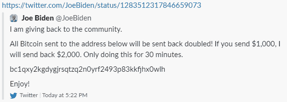

# 福特-福吉公司

> 原文：<https://fortenf.org/e/security/2020/07/15/twitter-hack.html?utm_source=wanqu.co&utm_campaign=Wanqu+Daily&utm_medium=website>

# 不，你不可能比推特黑客赚得更多

Jul 15, 2020

想象一下:你偶然发现了今年的弱点。你知道如何进入任何经过验证的 Twitter 用户的账户:乔·拜登，金·卡戴珊，坎耶·韦斯特，XXXTentacion，苹果，你能想到的。这是你邪恶计划的第一步。第二步应该是什么？

也许你登录了总统的账户，发布了一条关于向朝鲜发射导弹的虚假推文。我不相信你可以仅仅通过发几条虚假的推文就引发一场世界大战，但为了便于讨论，我们假设你可以。但无论如何，你对观看世界燃烧不感兴趣；不，你的目标是尽可能多赚钱。你该怎么办？

实施今天 Twitter 黑客攻击的人有一个答案:在著名账户上发布消息的变体“发送 1 个 BTC 到这个地址，我会发送 2 个 BTC 回来”，然后(这里是关键)*实际上不要发送 2 个 BTC 回来*。

在 Twitter 控制住局面之前，他们设法带着 10 多万美元逃跑了。一些人(在 Twitter 上，在黑客新闻上，真的在任何地方)对此嗤之以鼻，并声称他们会用这种能力做一些更有趣的事情。让我们探讨他们的一些想法，看看我们是否真的可以做得更好。

## 股票市场操纵

这是大多数人首先想到的。这听起来很容易:购买一批特斯拉股票，登录埃隆·马斯克的账户，在推特上发布“以 2000 美元的价格将$TSLA 私有化”，然后在价格上涨和马斯克/推特/整个世界意识到黑客入侵的这段时间内卖出。

这需要相当数量的资金来购买基础股票，黑客可能没有，但还有其他选择:也许你做空股票，然后在推特上发布(虚假)关于特斯拉新系列汽车的破坏性信息。也许你只是做空 Twitter 自己的股票，明天它肯定会在市场上遭受巨大打击(黑客攻击是在交易时间后执行的)。

所有这些的最大问题是匿名参与股票市场非常困难。美国证券交易委员会(SEC)有各种各样的监控措施来捕捉更常见的内幕交易和欺诈形式，你可以保证他们会对一个假设的基于黑客的市场欺诈进行长期、彻底的调查。与比特币交易不同，电汇和股票购买可以在事后撤销，当你实际使用美元时，暴露和风险就会大大增加。

## 勒索

黑客们获得了所有 Twitter 认证账户的完全访问权，这意味着他们应该有权访问他们的直接信息。这肯定比发布一条假推文有价值得多吧？想想由[索尼泄密](https://www.vanityfair.com/news/2019/10/the-untold-story-of-the-sony-hack)造成的不可估量的损失，或者看看这个假想的但仍然令人恐惧的[汤姆·斯科特视频](https://www.youtube.com/watch?v=y4GB_NDU43Q)关于 Gmail 密码检查被关闭一天的世界。

毫无疑问，在经过验证的用户的 DMs 中隐藏着大量有趣的资料，他们不想让这些资料公之于众，但要从中赚钱却有点棘手。最明显的方法是勒索。从最受欢迎的用户那里窃取信息，并威胁说如果他们不把 X BTC 发送到 Y 地址，你就完全释放他们。

这肯定会赚一些钱，但我不认为这值得努力。首先，很难提前判断哪些账户拥有有利可图的 DMs。像乔·拜登(Joe Biden)这样的大型高调账户由整个社交媒体团队运营，可能不会通过 Twitter 交换敏感信息。小账户可能确实有更多有趣的八卦，但结果可能是不太愿意或没有能力支付。

接下来的问题是，实际上要过滤和存储所有数据，向你攻击的每个用户发送单独的消息，跟踪谁付费了，谁没有付费，以及实际上公开发布泄露的材料。这是一笔很大的运营开销，最终可能会比愚蠢的比特币骗局赚得更少。

## 在黑暗网络上出售

抛开真正找到买家的挑战不谈(你不能只在论坛上发帖，联邦调查局也会看暗网)。买家愿意为这个 bug 付你多少钱？要么是买家计划以超过 10 万美元的价格利用漏洞赚钱(这篇文章的全部目的是证明这真的很难！)，或者买方希望将该漏洞用于其他目的，如监视或情报收集。

这不是不可能的。国与国之间一直在互相监视，我敢肯定，中国会很乐意阅读记者或香港活动人士的备忘录。问题在于，这种特殊的利用方式并不十分适合长期监控业务。登录该账户实际上需要相关的电子邮件，并触发密码重置(不知何故也绕过了 2FA)。密码重置触发了一封通知邮件发送到文件上的原始地址，这基本上宣布了帐户接管。在全世界都知道这个漏洞之前，黑客有几个小时的时间。

情报机构想要持续的访问权，他们想在不让目标知道他们被监视的情况下进行监视。这种利用不会做到这一点。

## 虫子赏金

现在我们有所进展……大公司通常会付给白帽黑客大量的钱，让他们报告比这个危害更小的漏洞。即使 Twitter 不会支付通过比特币骗局获得的 100%的钱，bug bounty 程序也有 100%合法的额外好处，这应该会大大改变风险计算。那么为什么我们的黑客不走这条路线呢？

一种理论是，如果黑客已经是一名已知的罪犯，在不向 Twitter 透露他们的身份的情况下收取 bug 奖金是很棘手的，这可能仍然会给他们带来一些麻烦。我不确定我买这个(他们就不能用第三方吗？).

更有可能的是，也许 Twitter 实际上不会支付 10 万美元？

这条推文表明，OAuth 的收购价值 77000 美元(税后你只剩下一点点钱)。如果是这样，这是 Twitter 的 bug 赏金计划的一个大问题！你需要确保激励机制使报道比剥削更有价值。

*更新:更多关于账户接管是如何进行的报道[已经出现](https://www.vice.com/en_us/article/jgxd3d/twitter-insider-access-panel-account-hacks-biden-uber-bezos)，这表明没有任何技术漏洞被利用。在大多数项目中，社会工程和内部风险(这显然是相当有害的)往往没有资格获得奖金。*

## 网络钓鱼

好吧，这样如何:登录比特币基地的推特账户，写一条推文，宣布一些时髦的新功能，并加入一个链接，实际上是一个钓鱼网站。执行一个[中继钓鱼攻击](https://fortenf.org/e/2018/05/29/coinbase-phishing.html)，让你绕过 2FA 进入他们的比特币基地账户，然后把他们所有的比特币、以太币和 Dogecoin 都发到你自己的账户。

有一些缺陷，但大多数是可以克服的一些努力。首先，Twitter 可能会很快删除这条推文，所以你可能会想针对著名加密货币爱好者的几个不同账户(不仅仅是比特币基地)。第二，bit.ly 可能会禁用该特定网址，谷歌肯定会将该钓鱼网站添加到他们的[安全浏览](https://safebrowsing.google.com/)列表中(该列表由所有主要浏览器共享)。这将导致在用户访问你的网站之前出现可怕的红色警告横幅。此外，无论你从哪个注册商那里购买了你的域名，都有可能撤销它。

好的，所以你不应该有一个钓鱼网站、一个域名和一个网址，你应该事先设置好几个，然后从一个跳到另一个，因为每个都会被不同的角色依次拿下。这可能会成功！这会让你净赚 10 万美元以上吗？也许吧？！这很难说，可能很大程度上取决于运气和时机。比特币基地账户中拥有最多加密货币的人可能是最不可能首先陷入这种事情的人，所以不清楚你会比愚蠢的买一送一骗局多赚多少钱，但尽管如此，如果你设法危及一个拥有巨额储备的账户，这可能是值得的。

尽管如此，所有这一切都需要一些合理的困难的软件工程工作，而这一切的目的就是为了轻松赚钱！我知道今天的攻击在执行上几乎是令人痛苦的跛脚，但它确实可能是战术上最聪明的选择。

这并不是说他们做的一切都是正确的:我仍然无法解释为什么他们似乎在整个过程中只使用了一个 BTC 地址(比特币基地和其他交易所很快阻止了这个地址的交易)，他们的一些推文的措辞有些生硬和尴尬(当然他们可以支付语法订阅)。但最终，我认为没有证据表明推特上的帖子只是真正攻击的“幌子”，也没有证据表明这次黑客攻击与外国政府有关。我认为这条推文总结得很好:

感谢阿克谢、金和凡荣阅读本文的草稿。