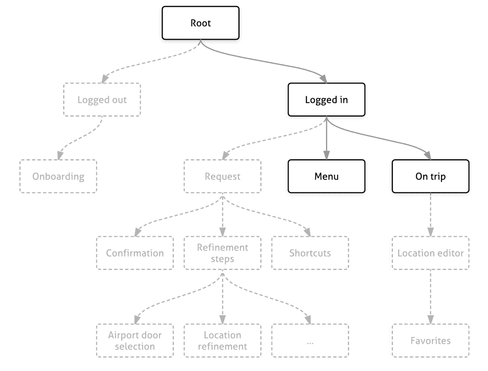
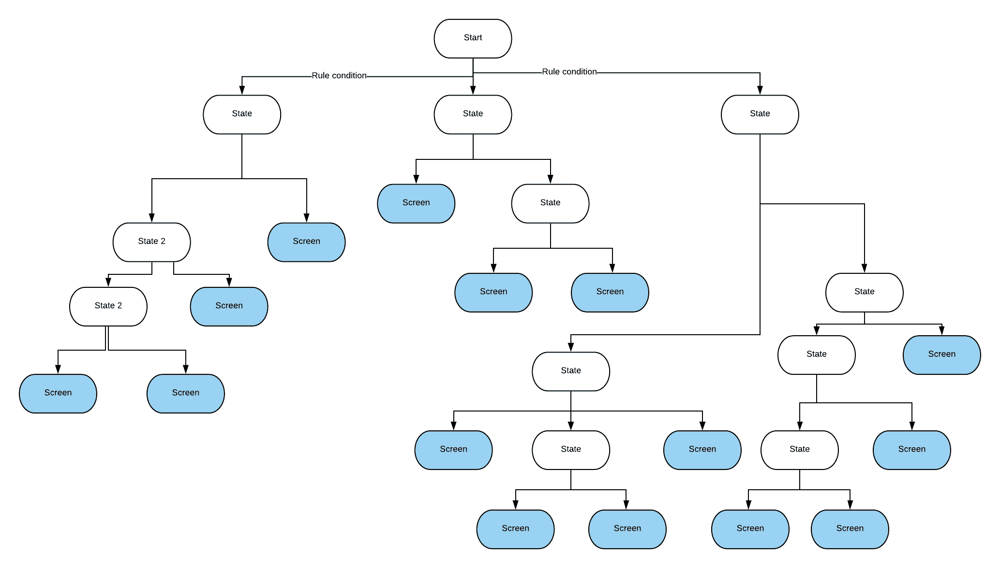
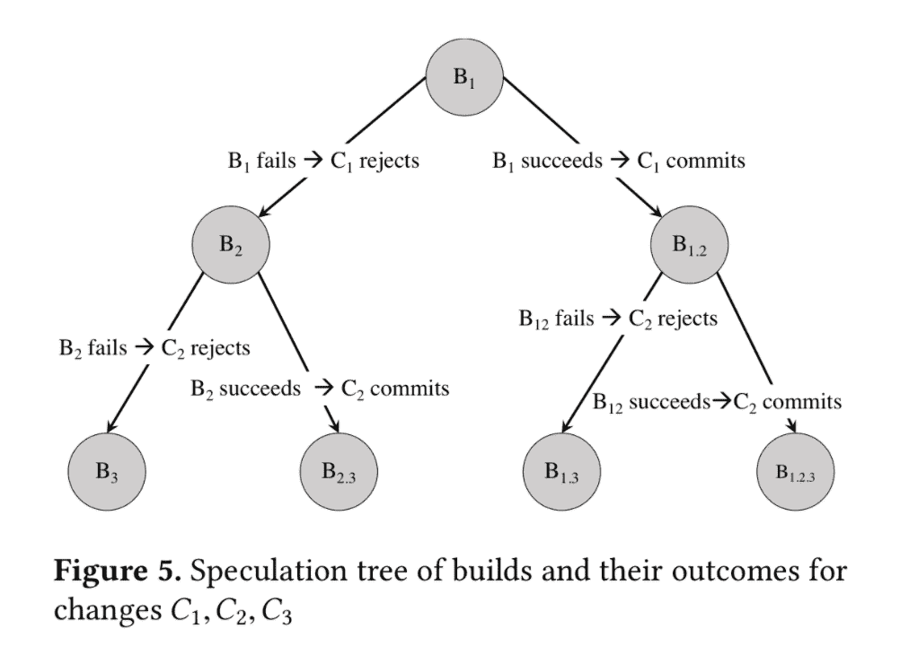

# 我在科技公司工作时使用的数据结构和算法——务实的工程师

> 原文：<https://blog.pragmaticengineer.com/data-structures-and-algorithms-i-actually-used-day-to-day/?utm_source=wanqu.co&utm_campaign=Wanqu+Daily&utm_medium=website>

你在日常工作中真的使用数据结构和算法吗？我注意到，越来越多的人认为算法是毫无意义的问题，是科技公司纯粹作为一种任意的衡量标准提出的。我听到越来越多的人抱怨所有这些都是纯粹的学术活动。在《家酿啤酒》的作者马克斯·豪厄尔发布了他在谷歌上的采访经历后，这种观念无疑得到了普及:

虽然我也从来不需要使用二叉树倒排，但我在 Skype/微软、Skyscanner 和优步工作时遇到过数据结构和算法的日常用例。这包括基于这些概念编写代码和做出决策。但在大多数情况下，我用这些知识来理解一些东西是如何以及为什么被建造的。了解了这些概念，就很容易理解引用这些概念的设计和实现。

**这篇文章是一组真实世界的例子，在这些例子中，树、图和各种算法等数据结构被用于生产**。我希望说明，一般的数据结构和算法知识不仅仅是“为了面试”，而是你在快速增长的创新型科技公司工作时可能会发现自己需要的东西。如果你想买一本书，教你大多数面试需要知道的一切，那么[搜索算法](https://www.manning.com/books/grokking-algorithms)无疑是最好的指南。

请注意，以下链接都不是附属链接或赞助商链接。参见 [*我的伦理陈述*](https://blog.pragmaticengineer.com/ethics-statement/) *就缺少这样的环节。*

我使用了非常小的算法子集，但几乎所有的数据结构。毫不奇怪，我不喜欢算法繁重且不实用的面试问题，这些问题带有奇特的数据类型，如红黑树或 AVL 树。从来没有问过这些，也永远不会。你可以在本文的[结尾读到我对这些采访的看法。尽管如此，了解他们可以选择基本数据类型的哪些选项来解决某些问题还是很有价值的。说到这里，我们来看一些例子。](#interviews-and-algorithms-and-data-structures)

## 树和树遍历:Skype，优步和用户界面框架

当我们开发 Xbox One 的 Skype 时，我们开发的是一个缺少密钥库的准系统 Xbox OS。我们正在该平台上构建首批成熟的应用程序之一。我们需要一个导航解决方案，既可以连接触摸手势，也可以连接语音命令。

我们在 WinJS 之上构建了一个通用导航框架。为此，我们需要维护一个类似 DOM 的图来跟踪可操作的元素。为了找到这些元素，我们遍历了现有的 DOM——基本上是一个**树**遍历。这是 **BFS** 或 **DFS** (广度优先搜索或深度优先搜索)的经典案例。

如果您正在进行 web 开发，那么您已经使用了一种树形结构:DOM。所有 DOM 节点都可以有子节点，浏览器在遍历 DOM 树后会在屏幕上呈现节点。如果您正在搜索一个特定的元素，您可以使用内置的 DOM 方法来查找它——比如 getElementById——或者您可以实现一个 BFS 或 DFS 搜索来遍历所有的节点，类似于本例中的中的[。](https://www.softnami.com/posts_pr/traversing_the_html_dom_using_depth_and_breath_first_search.html)

许多呈现 UI 元素的框架在幕后使用树结构。React 维护一个虚拟 DOM，并使用智能[协调](https://reactjs.org/docs/reconciliation.html)——一种“区分”算法——通过只重新呈现屏幕上发生变化的部分来提供出色的性能。Ryan Bas 在他关于 React 和解的文章中想象了这个过程[。](https://medium.com/@ryanbas21/react-reconciliation-7075e3f07437)

优步的移动架构， [RIBs](https://github.com/uber/RIBs) 也使用了树——类似于大多数以层次结构呈现元素的 UI 框架。RIBs 为状态管理维护了一个肋骨树[，附加和分离需要渲染的肋骨。当使用 rib 时，我们有时会勾画出新 rib 在层次结构中的位置，并讨论所讨论的 rib 是否应该有视图——使其成为视图层次结构的一部分——或者只是管理状态。](https://github.com/uber/RIBs/wiki#state-management)

State transitions in an example RIBs use case. See RIBs documentation and code [here](https://github.com/uber/RIBs/wiki#state-management).

如果您发现自己需要构建层次结构元素的可视化，一种常见的方法是使用类似树的结构，遍历树并呈现您访问的元素。我遇到过许多使用这种方法的内部工具。一个例子是优步移动平台团队开发的肋骨可视化工具，你可以在这个视频的演示[中看到。](https://www.youtube.com/watch?v=FfwZSk6VRVY&feature=youtu.be&t=1635)

## 加权图和最短路径:Skyscanner

Skyscanner 找到最优惠的机票价格。它通过扫描全世界的所有路线，然后将它们放在一起。虽然问题的本质更多的是爬行，而不是缓存——因为航空公司计算中途停留选项——多城市规划选项变成了**最短路径问题**。

多城市是 Skyscanner 花了相当多时间构建的功能之一——平心而论，困难更多的是在产品方面，而不是其他方面。最好的多城市交易是用最短路径算法计算出来的，比如 Dijkstra 或 A*。飞行路线被表示为有向图，每条边具有票价的权重。计算两个城市之间的最便宜价格选项是通过对每条路线实施修改的 [**A*搜索算法**](https://en.wikipedia.org/wiki/A*_search_algorithm) 来完成的。如果你对航班和最短路径感兴趣，Sachin Malhotra 撰写的关于使用 **BFS** [实现最短航班搜索路径的文章是一本好书。](https://medium.com/free-code-camp/exploring-the-applications-and-limits-of-breadth-first-search-to-the-shortest-paths-in-a-weighted-1e7b28b3307)

不过，有了 Skyscanner，实际的算法就没那么重要了。缓存、抓取和处理变化的网站负载要困难得多。尽管如此，最短路径问题的一个变种出现了许多几家旅游公司，它们基于组合来优化价格。不出所料，这个话题也是走廊讨论的一个来源。

## 分类:Skype(有点)

排序是一个算法家族，我很少有理由去实现它或者深入使用它。理解不同类型的排序方式很有趣，从冒泡排序、插入排序、合并排序、选择排序到最复杂的快速排序。尽管如此，我发现很少有理由实现这些，尤其是当你不需要将排序函数作为库的一部分时。

不过，在 Skype 上，我对这方面的知识做了一些练习。另一名工程师决定实现一个用于列出联系人的插入排序。在 2013 年，当 Skype 连接到网络时，联系人会成批到达，所有联系人到达需要一些时间。所以这位工程师认为使用插入排序来构建按姓名组织的联系人列表更有效率。我们就为什么不使用默认的排序算法进行了反复讨论。最后，更多的工作是正确地测试实现，并对其进行基准测试。我个人看不出这样做有什么意义:但我们正处于项目的这个阶段，我们有时间。

在一些真实的用例中，高效的排序非常重要，根据数据控制使用哪种类型的排序会有所不同。当以大块的形式流式传输实时数据并为这些数据源构建实时可视化时，插入排序会很有用。如果涉及到存储在不同节点上的大量数据，合并排序可以很好地与分治方法配合使用。我没有使用过这些方法，所以除了对不同方法的评价之外，我仍然将排序算法标记为日常很少使用的东西。

## 哈希表和哈希:无处不在

我经常使用的最常见的数据结构是**哈希表**和**哈希函数**。这是一个非常方便的工具，从计数，到检测重复，到缓存，一直到[分布式系统用例，比如分片](https://blog.pragmaticengineer.com/distributed-architecture-concepts-i-have-learned-while-building-payments-systems/#sharding-and-quorum)。除了数组，它无疑是我在无数场合使用过的最常见的数据结构。几乎所有的语言都有这种数据结构，如果需要的话，实现起来很简单。

## 堆栈和队列:时不时

任何调试过带有堆栈跟踪的语言的人都会非常熟悉**堆栈**数据结构。作为一种数据结构，我在使用它时遇到了一些问题，但是调试和性能分析让我对它非常熟悉。当深度优先遍历树时，这也是一个显而易见的选择。

我很少不得不选择**队列**作为我代码的数据结构，但是我在代码库、代码弹出或在其中推送值时遇到过很多次。一个常见的用例是实现树的 BFS 遍历，其中队列数据结构适合它自己。您还可以将队列用于各种其他用例。我曾经读过代码调度作业，它们很好地利用了[优先级队列](https://en.wikipedia.org/wiki/Priority_queue)，首先运行最短的作业，使用 [Python 堆队列算法](https://docs.python.org/2/library/heapq.html)。

## 加密:优步

来自移动或 web 客户端的用户输入的敏感信息在通过网络发送之前需要加密，只有在特定的服务上才能解密。为此，需要在客户端和后端实现加密方法。

理解加密很有趣。你没有想出一个新的算法，这可能是最糟糕的想法之一。取而代之的是，您采用一个现有的、记录良好的标准，并使用框架内置的原语。选择的标准通常是 AES 标准的一部分。如果[加密美国机密信息](https://en.wikipedia.org/wiki/Advanced_Encryption_Standard#Security)足够安全，并且没有已知的对协议的攻击，AES192 或 AES256 通常是大多数用例足够安全的选择。

当我加入优步时，移动和网络加密已经在这些基础上实现了，这让我有理由去查找高级加密标准( **AES** )、散列消息认证码( **HMAC** )、 **RSA** 公钥加密等的细节。理解一系列加密步骤如何被证明是安全的是另一个有趣的领域。在 encrypt-and-MAC、MAC-then-encrypt 和 encrypt-then-MAC 之间，只有[其中一个是可证明安全的](http://www.daemonology.net/blog/2009-06-24-encrypt-then-mac.html) -尽管这并不意味着其他的不安全。

除非构建一个全新的核心框架，否则很少需要实现加密原语。然而，决定使用哪些原语，如何组合原语是您可能面临的一个决定——或者必须理解为什么要采用某种方法。

## 决策树:优步

在其中一个项目中，我们必须在移动应用程序中实现复杂的业务逻辑。基于六条规则，我们必须显示几个不同屏幕中的一个。由于我们需要考虑一系列的合规性检查和用户选择，这些规则异常复杂。

构建这个特性的工程师首先试图用一系列 if-else 语句来编写规则，这变得太复杂了。最后，他们决定使用决策树，因为它易于验证产品和合规性，实施合理，并且在需要时易于更改。我们需要为 edges 构建一个执行规则的实现，但这就是它的意义所在。虽然我们可以用不同的方法来实现这个树，但是团队发现这个解决方案更容易维护。下面是决策树的样子——边是执行规则的结果(二进制结果或值范围),叶节点标记要转换到哪个屏幕。

The structure of a decision tree we built to decide what screen to show, following a complex set of rules.

优步的移动构建系统 SubmitQueue 也利用了动态构建的决策树。开发人员体验团队必须解决每天发生的数百个移动合并的难题，每个构建需要大约 30 分钟来运行——编译、运行单元、集成和 UI 测试。并行化构建并不是一个足够好的解决方案，因为两个构建经常会有重叠的变更，并且会发生合并冲突。在实践中，这意味着有时工程师不得不等待 2-3 个小时，重新开始合并过程，并希望不会有冲突。

开发人员体验团队采用了一种创新的方法，通过使用推测图来预测合并冲突并相应地排队构建。推测图非常类似于二元决策树:

SubmitQueue uses a speculation tree - a binary decision tree - annotated with prediction probabilities for each edge. This approach determines which set of builds to to run in parallel, to improve turnaround time and throughput while keeping master green. [Read the full paper here](https://eng.uber.com/research/keeping-master-green-at-scale/).

在这份由开发人员体验团队的工程师撰写的白皮书中有更多的细节，这份白皮书是一份很好的读物。阿德里安·科尔耶对接近也有很好的[视觉分析。结果是一个更快的构建系统，优化了构建时间，并使数百名移动工程师的生活更加愉快。](https://blog.acolyer.org/2019/04/18/keeping-master-green-at-scale/)

## 六边形网格，分层索引:优步

这最后一个项目是我纯粹基于偶然发现的。我了解了一种新的数据结构:带层次索引的六边形网格。

在优步要解决的最困难和最有趣的问题之一是如何优化旅行的定价和合作伙伴的派遣。价格可能是动态的，司机也在不停地移动。 [H3](https://eng.uber.com/h3/) 是一个网格系统，由工程师构建，用于在越来越精细的级别上可视化和分析跨城市的数据。它的数据和可视化结构是一个带有分层索引的六边形网格，在其上构建了一些内部可视化工具。

Subdividing regions with hexagons. Read a thorough article [here](https://eng.uber.com/h3/).

该数据结构具有特定的索引、遍历、分层网格、区域和单向边缘功能，[详见 API 参考](https://h3geo.org/docs/api/indexing)。要更深入地了解，请参阅关于 H3 库的[文章、](https://eng.uber.com/h3/)[源代码](https://github.com/uber/h3)，或者关于如何以及为什么构建这个工具的[演示文稿](https://www.youtube.com/watch?time_continue=768&v=ay2uwtRO3QE&feature=emb_title)。

这次经历让我真正喜欢的是，我了解到创建自己的专用数据结构在利基领域是有意义的。除了将映射与每个单元内的各种数据级别相结合之外，具有分层索引的六边形网格并没有太多的使用案例。尽管如此，如果您熟悉一些数据结构，理解这种新的数据结构就容易得多了——因为对于您来说，为类似的特殊需求设计另一种数据结构也是如此。

## 访谈、算法和数据结构

这些是我多年来在多家公司工作时遇到的实际数据结构和算法的亮点。所以让我们回到最初那条抱怨问诸如在白板上倒置二叉树之类的事情的推文。在这件事上我站在麦克斯一边。

在科技公司工作，你不需要知道复杂的算法或奇特的数据结构是如何工作的。你应该知道什么是算法，并且应该能够自己想出简单的算法，比如贪婪算法、广度优先或深度优先搜索或更简单的排序算法。您还应该了解非常常见的基本数据结构，如哈希表、队列或堆栈。但是像 Quicksort，Dijkstra，A*这样更复杂的算法和更高级的算法不是你需要记忆的东西:你会有一个参考。除了排序，我对算法做的最多的事情就是自己查找和理解它们。像红黑树或 AVL 树这样的外来数据结构也是如此。我从来没有使用过这些数据结构。即使我知道，我也会再去找他们。我从来没有问过需要这种知识来解决的问题，将来也不会。

我完全赞成询问实际的编码练习，那里有许多好的解决方案，从蛮力或贪婪的方法到潜在的更复杂的方法。例如，像这个问题一样要求实现一个 justify text 函数[是一个公平的问题:这是我在 Windows Phone 上构建文本呈现组件时做的事情。您可以通过使用一个数组和一些 if/else 语句来解决这个问题，而不需要任何花哨的数据结构。](https://leetcode.com/problems/text-justification/)

现实是，许多团队和公司都在算法挑战上走极端。我能看到算法题的吸引力:它们在 45 分钟或更短的时间内给你信号，问题可以很容易地在周围交换；因此，如果问题泄露出去，也没什么坏处。它们在招聘时也很容易扩展，因为你可以有一个超过 100 个问题的问题池，任何面试官都可以评估其中的任何一个。尤其是在硅谷，听到针对动态编程或奇异数据结构的问题越来越常见。这些问题将有助于雇佣优秀的工程师，但也会导致那些本可以在不需要高级算法知识的工作中表现出色的人被拒之门外。

任何人读谁的公司有酒吧雇用的人知道一些先进算法的心脏:再想想，如果这是你需要的。我已经在 Skyscanner 伦敦和优步阿姆斯特丹雇佣了出色的团队，没有任何复杂的算法问题，只涉及数据结构和问题解决。你不需要记住算法。你真正需要的是了解最常见的数据结构，并且能够提出简单的算法来解决手头的问题，就像一个工具集一样。

如果你在一家快速发展的创新型科技公司工作，你几乎肯定会在代码库中遇到各种数据结构和不同的算法实现。当您构建新的和创新的解决方案时，您经常会发现自己接触到了正确的数据结构。此时，您需要了解可供选择的选项及其权衡。

**数据结构和算法是你在构建软件时应该放心使用的工具**。了解这些工具，你就会熟悉使用它们的导航代码库。你也会对如何解决难题更有信心。你会知道理论极限，你能做的优化，你会想出和他们一样好的解决方案——所有的权衡都要考虑。

首先，我推荐以下资源:

*   阅读散列表、链表、树、图、堆、队列和栈数据结构。试着在你的语言中使用它们。GeeksforGeeks 对这些有一个[很好的概述。对于编码实践，我推荐](https://www.geeksforgeeks.org/overview-of-data-structures-set-1-linear-data-structures/?ref=lbp) [HackerRank 数据结构集合](https://www.hackerrank.com/domains/data-structures)。
*   [搜索算法](https://www.amazon.com/dp/1617292230) 由[Aditya Bhargava](http://adit.io/) 是从初学者到经验丰富的工程师的最佳算法指南。一个非常平易近人，直观的指南，涵盖了大多数人需要知道的关于这个话题的所有内容。我确信你不需要知道比这本书涵盖的更多的算法。
*   [《算法设计手册》](https://www.amazon.com/gp/product/1848000693)和[算法:第四版](https://www.amazon.com/gp/product/032157351X/)都是我那天拿回来的书，用来刷新我大学算法课上的一些研究。我中途放弃了，发现它们非常枯燥，不适用于我的日常工作。

* * *

### 特色务实的工程师工作

1.  Renterra 的创始工程师。**$ 14-18 万** +股本。远程(全局)。
2.  Akamai Technologies 的高级首席软件工程师 Kubernetes 。远程(美国)。
3.  DevZero 的软件工程师。 **$150-175K** 。华盛顿西雅图。
4.  Founda Health 的高级后端开发人员。荷兰阿姆斯特丹。
5.  Vital 的高级后端工程师。**$ 7-14 万** +股本。远程。
6.  Pento 的主要后端工程。 **120-135K** 。远程。
7.  [在 Playht 创办高级 Fullstack 工程师(JavaScript)](https://pragmatic-engineer.pallet.com/jobs/290b9214-cfa0-4df6-84d6-b6a4cfd38075) 。**$ 15-20 万** +股本。旧金山或偏远地区。
8.  Qualified.com 的软件工程师。旧金山或偏远地区。
9.  Ometria 的基础设施团队负责人。 **90-150K** 。英国或葡萄牙。
10.  [BetterUp 的全栈工程师、视频&消息](https://pragmatic-engineer.pallet.com/jobs/09f54a5f-e330-4855-87d3-07b6a9e0bfa8)。远程(美国)。
11.  BetterUp 的全栈工程师。远程(美国)。

*上述工作在[实用工程师考试](https://blog.pragmaticengineer.com/pragmatic-engineer-test/)中的得分至少为 10/12。浏览更多具有优秀工程文化的高级工程师和工程领导职位，或者在[务实工程师工作论坛](https://pallet.xyz/list/pragmatic-engineer/jobs)上添加您自己的职位，并申请加入[务实工程师人才集体](https://pragmatic-engineer.pallet.com/talent)。*

想从经过审查的科技公司获得有趣的机会吗？报名参加[务实的工程师人才集体](https://pragmatic-engineer.pallet.com/talent)，获得丰厚的机会——类似下面这些，没有任何义务。你可以是公开的，也可以是匿名的，我会整理公司和个人的名单。

你是在招聘高级+工程师还是工程经理？申请加入[务实工程师人才集体](https://pragmatic-engineer.pallet.com/talent)接触世界级高级及以上工程师和工程经理/总监。每月两次接受审查，来自软件工程师(全栈、后端、移动、前端、数据、ML)和目前在大型科技公司、高增长初创公司和具有强大工程文化的地方工作的经理。[申请此处](https://pragmatic-engineer.pallet.com/talent)。

