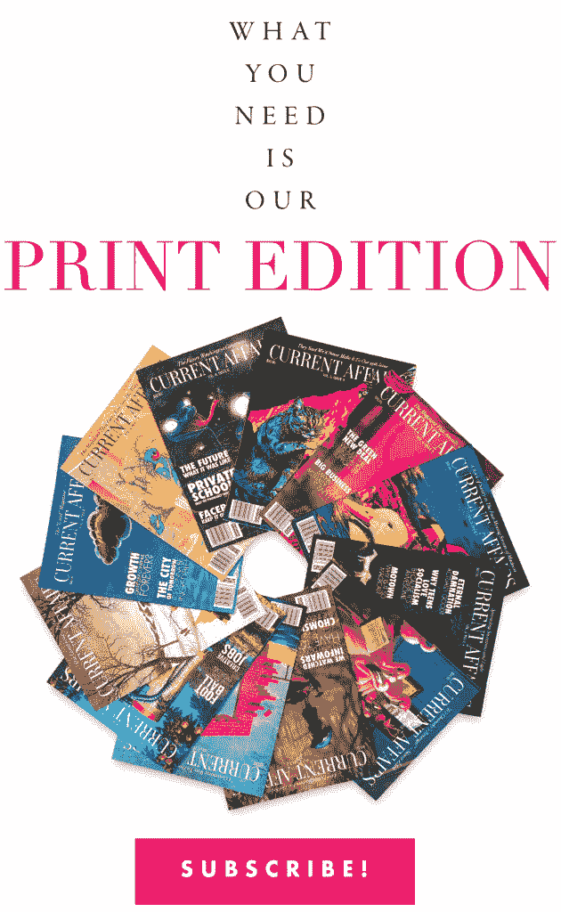

# 真相是付费的，但谎言是免费的❧时事

> 原文：<https://www.currentaffairs.org/2020/08/the-truth-is-paywalled-but-the-lies-are-free/?utm_source=wanqu.co&utm_campaign=Wanqu+Daily&utm_medium=website>

付费墙是合理的，尽管它们很烦人。创作好的作品、运营网站、许可拍摄照片都需要钱。如果你想要质量，就要花很多钱。因此，向人们收取访问内容的费用是非常合理的。你不会期望免费订阅报纸*，为什么网站会不同？我尽量不抱怨不得不为在线内容付费，因为我经营一家杂志，我知道向作者支付他们应得的报酬有多困难。*

 *但是让我们也注意到一些事情:纽约时报、*纽约客*、*华盛顿邮报*、*新共和*、*纽约、哈泼斯、*纽约书评*、*金融时报*和伦敦时报*都有付费墙。*布莱巴特*，*福克斯新闻频道*，*每日电讯*，*联邦党人*，*华盛顿观察家，InfoWars* :免费！你想要“[波特兰抗议者在街上焚烧圣经、美国国旗](https://www.breitbart.com/politics/2020/08/01/portland-protesters-burn-bibles-american-flags-in-the-streets/)”、“[反对口罩强制规定和其他 COVID 限制的道德案例](https://thefederalist.com/2020/07/31/the-moral-case-against-mask-mandates-and-other-covid-restrictions/)”或者一篇文章[暗示美国国家卫生研究院已经承认 5G 手机导致冠状病毒](https://www.infowars.com/nih-admits-5g-can-actually-create-coronavirus-within-human-cells/)——它们是你的了。你想要详细的*时报*关于[新纳粹分子渗透德国机构](https://www.nytimes.com/2020/08/01/world/europe/germany-nazi-infiltration.html)的报道，美国各州联系追踪失败的[原因](https://www.nytimes.com/2020/07/31/health/covid-contact-tracing-tests.html)，或者[特朗普政府削弱美国邮政总局的效力](https://www.nytimes.com/2020/07/31/us/politics/trump-usps-mail-delays.html)——嗯，如果你在网站上点击一下，你会直接进入付费墙。这并不意味着付费墙不应该存在。但这确实意味着，获取大量真实而重要的信息需要花费时间和金钱，而大量的废话却是完全免费的。**

现在，至关重要的是，我并不是说阅读《纽约时报》会让你对现实有一个很好的理解。我已经多次记录了《T2 时报》如何误导人们，例如,[重复了一个可疑的想法，即我们有移民“涌入”这个国家的“边境危机”](https://www.currentaffairs.org/2019/04/how-to-create-a-crisis),或者[俄国正试图“窃取”本应免费的救命疫苗研究](https://www.currentaffairs.org/2020/07/how-anti-russian-propaganda-works)。但是理解《泰晤士报》的问题是很重要的:它报道的事实往往不准确——尽管有时是不准确的——但事实是以误导的方式呈现的。我不同意移民故事或俄罗斯故事中的单一“事实”,我不同意的是从事实中得出的结论。(同样，标题“[美国称侯赛因加紧寻求原子弹部件](https://www.limacharlienews.com/wp-content/uploads/2017/03/Screen-Shot-2017-03-20-at-1.41.20-PM.png)”在技术上是准确的:事实上，美国政府确实这么说了。这不是真的。事实上,《纽约时报》是非常有价值的，如果你以批判的眼光阅读它，并且不看标题。通常真相就在某处，因为有大量优秀的报道，人们几乎可以纯粹从《纽约时报》中挑选材料来构建一份严肃的报纸。我以前写过《泰晤士报》对希特勒和大屠杀的报道:这并不是说报纸忽略了形势的严峻事实，而是它们被掩盖在背后，被视为无关紧要。需要的是重点的改变，因为事实是白纸黑字写在那里的。

这意味着许多最重要的信息将最终被锁在付费墙后面。虽然我也不是《纽约客》的粉丝，但令人担忧的是胡佛研究所会免费给你理查德·爱泼斯坦的臭名昭著的文章[淡化冠状病毒的威胁](https://www.hoover.org/research/coronavirus-pandemic)，但艾萨克·乔丁纳的[采访驳斥爱泼斯坦](https://www.newyorker.com/news/q-and-a/the-contrarian-coronavirus-theory-that-informed-the-trump-administration)需要每月订阅，这意味着谎言比反驳更容易理解。纽约的埃里克·莱维兹是我们最好的、最多产的左翼政治评论家之一。但是除非你是纽约的订户，否则你不会听到他每个月都要说的话。

可能更糟糕的是，如此多的学术著作被藏在成本高得多的付费墙后面。YouTube 上的白人至上主义者会告诉你所有关于种族和智商的事情，但是如果你想仔细阅读学术反驳，从杂志出版商那里获得一份合法的 PDF 文件[会花费你 14.95 美元](https://content.apa.org/record/2005-00117-006)，如果他们不能获得机构访问权，没有一个头脑正常的人会为一篇文章支付这个价格。(我最近放弃了尝试获取一篇学术文章，因为我找不到以低于 39.95 美元的价格获取它的方法，尽管在那种情况下，这篇文章是[垃圾而不是黄金。学术出版是一个噩梦般的拼凑，大量的文章在一个网站上以高昂的费用刊登广告，然后在另一个网站上免费，或者只能通过特定的数据库访问，而你的大学或公共图书馆可能有也可能没有。(图书馆](https://www.currentaffairs.org/2020/07/how-to-pretend-that-you-are-smart)[必须仔细预算](https://www.councilscienceeditors.org/wp-content/uploads/v30n1p015.pdf)，因为订阅价格通常很高。图书馆订阅*配位化学期刊*，[例如](https://blogs.scientificamerican.com/information-culture/why-are-journals-so-expensive/)，每年花费[11，367](http://www.tandfonline.com/action/pricing?journalCode=gcoo20) 美元。)

当然，人们可以找到绕过付费墙的方法。 [SciHub](https://en.wikipedia.org/wiki/Sci-Hub) 是一种完全非法但极其便捷的免费获取学术研究的手段。(我纯粹是描述，不是鼓吹。)你可以在 ResearchGate 上找到一篇揭露种族和智商神话的文章的[免费版](https://www.researchgate.net/publication/8089268_Intelligence_Race_and_Genetics)，ResearchGate 是一个从事[大规模侵犯版权](https://www.insidehighered.com/news/2018/10/04/publishers-accuse-researchgate-mass-copyright-infringement)的网站，目的是让研究变得可访问。通常，由于期刊出版商严格控制对其版权作品的访问，以收取高昂的 pdf 费用，你可以免费获得的文章版本是尚未通过同行审查的草稿，因此受到的审查较少。这意味着一篇文章越可靠，它就越不容易获得。另一方面，伪奖学金很容易找到。卡托研究所、经济教育基金会、胡佛研究所、麦基诺中心、美国企业研究所和传统基金会等右翼智库就世界上的每一个主题都拿出了精心制作的政策文件。他们完全不值得信任——结论总是“让自由市场来解决问题”，不管问题是什么，也不管事实是什么。但它往往被打扮得头脑清醒，没有意识形态色彩。

做一个“独立研究者”不容易，也不便宜。当我写我的第一本书时，我想浏览报纸、杂志和期刊档案，尽我所能找到关于比尔·克林顿的种族记录。我很幸运我有一所大学，因为这给了我访问像 LexisNexis 这样的数据库的机会。如果我没有的话，找到我想知道的东西的成本可能会高达数千美元。

然而，成本之外的一个问题是方便。我发现，即使当我通过数据库和我的大学图书馆做研究时，也经常是一片混乱:这些网站很笨重，并且不断要求登录凭证。在弄清楚如何获得一份研究材料的过程中浪费的时间是实际价格之外的一笔巨大成本。例如，联邦法院文件数据库 PACER 对访问记录收取每页 10 美分的费用，由于法律研究经常涉及浏览数千页，这一费用会迅速增加。如果你是一名研究人员或者负担不起费用，他们[会提供一项豁免](https://pacer.uscourts.gov/sites/default/files/files/MultiCourt%20Exemption%20Request.pdf)，但是要获得豁免，你必须填写一份三页的表格，并提供一份解释，说明你为什么需要每份文件以及为什么你应该得到豁免。这是浪费时间，抑制人们的生产力，限制他们获取知识。

事实上，为了了解“自由市场”分配的知识浪费了多少人的潜力，让我们简单地描绘一下“完全民主和可获取的知识”会是什么样子。让我们想象一下，不用像谷歌学术和 EBSCO 那样使用私有化的研究服务，而是有一个单一的公共搜索数据库，包含每篇报纸文章、每篇杂志文章、每篇学术期刊文章、每份法庭记录、每份政府文件、每个网站、每件软件、每部电影、歌曲、照片、电视节目和视频剪辑，以及现有的每本书。Wayback Machine 的内容，所有的[报纸档案](https://en.wikipedia.org/wiki/Wikipedia:List_of_online_newspaper_archives)，Google Books，Getty Images，Project Gutenberg，Spotify，国会图书馆，WestLaw 和 Lexis 中的所有内容，所有这些内容，每一部分都可以完整地即时访问，并且具有尽可能简单的搜索功能，允许您快速缩小您正在寻找的内容。(例如，“给我:所有马萨诸塞州的报纸文章，波士顿出版的书籍，以及提到威廉·劳埃德·加里森并于 1860 年至 1865 年出版的政府文件。”)真正的*环球搜索，* [两袖清风的付费广告](https://www.cnbc.com/2020/01/24/google-will-iterate-the-design-that-made-it-harder-to-tell-ads-from-search-results.html)。一秒钟之内，你可以调出任何一本书的整个 PDF 文档。两秒钟之内，你就可以搜索到那本书的全部内容。

让我们想象一下，在这个信息乌托邦里将会节省多少时间。我想要 1962 年捷克斯洛伐克电影 [*外太空人*](https://en.wikipedia.org/wiki/Man_in_Outer_Space) *的第 15 分钟吗？从我的想法开始到它开始有四秒钟。我想要 1985 年的《每日镜报》第 17 页吗？甚至更少的时间。艾森豪威尔政府所有关于越南的国防部文件？弗兰克·卡普拉自传的第 150 页？1995 年一本经济学教科书的第 400 页？全部都在我面前，完整地，在不到打出这个句子的时间内。在这种情况下，研究速度会快多少？如果知识不是支离破碎的，并为一千个私人看门人所拥有，还能取得多少成就？*

令人惊奇的是，造成这种“信息完全民主化”局面的困难，完全是经济上的，而不是技术上的。我用书描述的东西，接近谷歌图书和亚马逊已经有的东西。但是，当然，对全部内容的普遍免费访问让出版商感到恐惧，所以我们被禁止使用这些系统来发挥它们的全部潜力。问题在于所有权:没有人被*允许*建立一个巨大的免费数据库，包含人类曾经生产的所有东西。如果你从 Getty Images 的档案中拿走了一张历史照片，并且违反了你和他们的许可协议，Getty Images 将会起诉你。华特·迪士尼公司也一样，如果你用他们所有的电影创造一个免费的竞争对手。Sci-Hub 成立于哈萨克斯坦，因为如果你在这里创建它，他们会迅速把你关进联邦监狱。(当你真正思考这意味着什么时，版权法是对言论自由的难以置信的严格限制，它清晰地划定了信息可以和不可以与其他人分享的界限。)

但不仅仅是暴利公司会誓死捍卫内容的安全。内容的创造者也对盗版感到恐惧。正如我的同事莱塔·戈尔德和陈伶俐·伦尼克斯写的那样，作家、艺术家和电影制作人有理由担心，除非想法、作品和图像可以被视为“财产”，否则他们将会饿死:

> 将想法——尤其是故事——视为一种“财产”有合理的理由吗？这样做的一个显而易见的原因是为了确保作家和其他创作者不会饿死:在我们当今的资本主义乌托邦中，如果一个作家的作品可以被其他人肆无忌惮地复制和获利，他们就不会有任何有意义的能力来靠他们的作品谋生，特别是如果他们是一个没有任何机构从属关系或预先存在的财富的独立创作者。

莱塔和陈伶俐指出，在现实世界中，这种正当理由往往是扯淡，因为版权会持续到实际制作者死后。但这是一个真正的担忧，因为在这个国家，如果一个作家的作品只是在没有人付费的情况下从一个人手中传到另一个人手中，他就没有“普遍基本收入”可以依靠。我承认，当我看到人们分享整期*时事*的 pdf 文件时，我很生气，因为如果这种情况经常发生，我们可以卖出正好 1 份订阅，然后这一期就可以被无限复制。*如果每个人都试图免费获得我们的内容而不是付费，时事*将会彻底崩溃。(这就是为什么你应该[订阅](http://currentaffairs.org/subscribe)！或者[捐](http://currentaffairs.org/donate)！独立媒体需要你的支持！)

去年年底，我出版了一本关于社会主义的书，起初一些保守派认为问我“如果你是一个社会主义者，我能在 T2 免费得到它吗？”然而，当我指出是的，他们确实可以免费得到它时，他们安静了下来。他们所需要做的就是去当地的社会化信息存储库，也就是所谓的[公共图书馆](https://www.currentaffairs.org/2018/07/why-libraries-are-amazing)，在那里他们会得到一本书，而无需支付一分钱。任何人想读我的书，但不能或不想付费，有一个简单的解决办法。

然而，我意识到，当我建议每个人从图书馆而不是在书店买我的书时，我的出版商可能不喜欢我给出这个建议。坦率地说，这让我有点紧张:我靠写作为生，所以如果每个人都从图书馆拿到我的书，它不会卖出任何一本书，然后我的出版商也不会付钱让我写更多的书。当作者依赖资本主义出版业时，我们不能让太多人使用社会化信息仓库！事实上，关于图书馆的一件奇怪的事情是，我们故意保留了不必要的低效率，以保持当前的内容融资模式。你的图书馆*可以*免费给你我的书和每一期*时事*的无数字版权管理的 pdf 文件，但他们却让你去杂志室或借阅这本书的有限数量中的一本，因为虽然我们希望书籍和杂志是免费的，但我们不能让它们尽可能地免费*否则会对出版业造成太大伤害。(图书馆保留着这样一种虚构，即一本数字图书有一定数量的“副本”,尽管这很荒谬，因为放弃这种虚构会伤害出版商。他们可以随时向任何人提供任何一本书。他们只是不能合法地这么做。)*

然而，我也意识到，如果我的报酬运作在不同的结构上，我不会在乎有多少人免费得到我的书，我的报酬是根据阅读它的人数而不是购买它的人数。“不可能！”你说。“钱从哪里来？”不过，我们可以很容易地想象出这样的设置。我们有我们的通用公共知识数据库，任何想要的人都可以输入我的任何一本书的书名，免费阅读。**但阅读这本书的人数是有记录的，每个人阅读这本书我会得到两美元的报酬(虽然微薄，但这是[作者从他们的销售中得到的)。*时事*也同样获得了与其读者数量成比例的预算。从哪里补偿？预算从哪里来？为什么，当然是从通用公共知识数据库。但是他们从哪里得到钱呢？为什么，来自税收。*免费的使用点服务不是什么陌生的概念。NHS 向医生支付报酬，而 T8 不向病人收取任何费用。(当然，在一个拥有普遍基本收入和基本生活保障的社会，对生产者的补偿甚至都不是什么大问题。不管怎样，如果我能体面地生活，我不在乎在我的账本上赚多少钱。)](https://www.thebinderyagency.com/blog/howdopublisherspayauthors)

现在，我确信会有人争辩说，任何这种普遍的知识获取系统都会通过减少人们获得的回报来抑制新作品的创作。但是让我们注意几个事实:首先，死人不能被激励去创造，因此*至少*一个现在已经死了的人曾经创造的一切应该免费提供给所有人。死者制造的智力产品的看门人是寄生虫相当于一个私人个体，他在别人已经建成的路中间设立了一个大门和收费站，并开始向想要通过的人收费。实际上，因为寄生虫附着在活人身上，所以它们比吃尸体的虫子要好。

第二，创作者已经被剥削了:Spotify 非常像音乐的通用可搜索信息数据库，它只是为了利润而不是为了艺术家而运营，版权所有者从 Spotify 的每一次播放中获得一小部分,这笔钱本身必须在唱片公司、制作人、艺术家和词曲作者之间进行分配。Spotify 的首席执行官说[如果艺术家想要更多的钱，他们应该制作更多的音乐](https://consequenceofsound.net/2020/08/spotify-daniel-ek-artist-recording-comments/?fbclid=IwAR03lQoz8kyY61RUne7mFq5MmaarxgESirOTDJeUDePIyQaEXGO9eKm6-Rg)。(他的身价[40 亿美元](https://www.forbes.com/profile/daniel-ek/#6f148f9546ab)。)如果你想逗教授笑，问问他们从发表的学术文章中获得多少版税。正如约翰内斯堡大学负责研究的副校长 Adam Habib 解释的那样，学术出版是一个“完全封建的系统”:

> 研究成果的成本由大学承担，因此，在大多数情况下是由公共资金承担的。然后，私人公司发布研究成果，并向大学和公共机构收取他们所付费的研究成果的费用。这实际上是用公款补贴私营部门。有一种说法认为这是企业家精神的一个例子。在我看来，它所做的只是以公共成本促进致富，给那些最弱势群体带来巨大后果。”

这个问题并没有因为“开放获取”学术的兴起而得到解决，因为它并没有消除盈利动机，所以贫穷的国家仍然被现存的出版模式所困扰。

第三，当考虑免费信息库对内容创建的影响时，你不能只看到等式的一边。国家拒绝执行学术期刊出版商和 Getty Images 的版权会抑制多少生产力，这个问题必须与普遍免费获取所有人类知识将创造的人类生产力的惊人释放进行权衡。你必须把研究人员花在追踪和获取信息上的时间加起来。某样东西不再只存在于某个图书馆，也不能通过馆际互借的请求来获取。图书馆员不再需要花时间管理订阅，而是帮助搜索。发展中国家的研究人员将不再是完全无法与支付得起高额费用的美国图书馆竞争的 T2。(就我个人而言，我可以告诉你，作为一个经常不得不寻找晦涩的二手书籍进行研究的人，然后订购它们，有时需要等待几周才能到达，如果我能在 10 秒钟内看到书的完整内容，我可以更快地完成工作，我经常被谷歌图书的“片段视图”激怒)

此外，我们还必须考虑，在一个真相相对于谎言的相对可及性和成本得到调整的社会里，会发生什么。如果所有在线课程都是免费的，会怎么样？如果教科书不花 200 美元而是什么都不花呢？如果我们尽可能地让发现事物变得容易和便宜，并以创造最大可能的知识获取途径的愿望而不是经济考虑为导向，会怎么样？我不知道会发生什么，但我希望某个不介意惹恼世界上最强大的公司和政府的流氓国家(或微型国家或 T2 国家)会试图强攻信息的巴士底狱，从它的人工监狱中释放每一位每一字节。唯一阻止他们的是法律，除了威胁，法律是什么？

我们这个时代的好消息是，知识民主化的可能性比以往任何时候都大。我们不可能在 1990 年开始关注时事，除非我们的资金比 T2 实际拥有的多十倍。YouTubers 正在努力打击宣传和揭穿不好的论点，有大量伟大的播客，甚至 Twitter 也有它的用途。(除此之外，你还能从哪里对有权有势的人大喊大叫，并亲自责备他们呢？)但福克斯新闻频道、普拉格鲁和美国企业研究所确实有大量资金来尽可能广泛地传播他们的信息。在规模和影响力上，左翼没有任何东西可以与之相比。

但是我们正在努力。我们离所有知识都能平等获取的世界还很远。希望有一天，我们的故意低效的图书馆将变成人类记录的知识和创造力的免费仓库。然而，与此同时，我们需要集中精力让尽可能多的人获得好的、有思想的材料，并尽可能打破障碍。在*时事*我们没有付费墙，尽管这可能会花费我们一些钱，因为我们试图让人们尽可能容易地听到我们要说的话。这就是右翼的所作所为。他们告诉人们该怎么想，给他们提供书籍和小册子以及方便的五分钟 YouTube 视频。在左翼，我们远没有这么圆滑。

我们不能继续接触那些非常喜欢我们的人，他们愿意付钱来听，因为这样免费的废话就赢了。小型媒体机构很难找到依靠广告、付费墙和捐赠的平衡点。毕竟，钱必须来自某个地方。很多时候，这意味着严重依赖广告——杂志的传统模式是基于广告收入，而不是基于订阅——所以付费墙实际上是*较少*腐败的模式；一个播客在 Patreon 上销售他们的产品，而不是免费赠送，而是用床垫和“每月一盒狗屎”的广告来填充，这是一种重要的自由:他们只需要取悦观众，而不是赞助商。在*时事*，我们出售[的订阅，保持](http://currentaffairs.org/subscribe)的正常运作，但是即使一个人本可以阅读一篇文章却没有阅读也是一种损失。(我希望我也能把我的书给每个人，但我的出版商不允许。不过，我确实让另一个人免费了。)守护者*和*向公众免费提供大量有价值的材料，因为他们没有付费墙，但是守护者*由信托基金资助，拦截者*由慈善的亿万富翁[资助。(这样的资金来源让事情简单多了。仁慈的亿万富翁们请注意:我们有一个](https://www.cjr.org/business_of_news/layoffs-the-intercept.php)[捐赠页面](http://currentaffairs.org/subscribe)。)也许付费墙可以帮助像《纽约时报》和《新政治家》这样的出版物免于不得不与壳牌石油和 Cigna 这样的“品牌内容”供应商合作，但代价是限制接触范围。更有理由让中央免费信息图书馆资助出版物，而不是通过订阅或公司赞助。**

创作者必须得到很好的补偿。但与此同时，我们必须努力不让重要而深刻的东西被锁在很少有人会看到的地方。真理需要自由和普遍。

* * *

我不会阅读来自现代货币理论家的愤怒邮件。我假设一个国家没有主权货币，所以。

** *当然，你可以——我相信很多人都想——为通用数据库提供付费墙和类似每月“津贴”的东西(例如，5 本书、100 篇报纸/杂志文章、50 篇学术期刊文章、20 部电影，以及他们喜欢的任何数量的法庭记录),超过这些就会有费用，而低于某一收入水平的任何人都可以免除这笔费用。但这将涉及经济状况调查，* [*这使得一切变得不必要的复杂*](https://www.currentaffairs.org/2019/12/the-importance-of-making-everything-easier) *并且不可避免地意味着一些人将不会访问那些否则会访问的东西。我们没有对公共图书馆进行经济情况调查，我们也不应该对通用公共知识数据库进行经济情况调查。** 