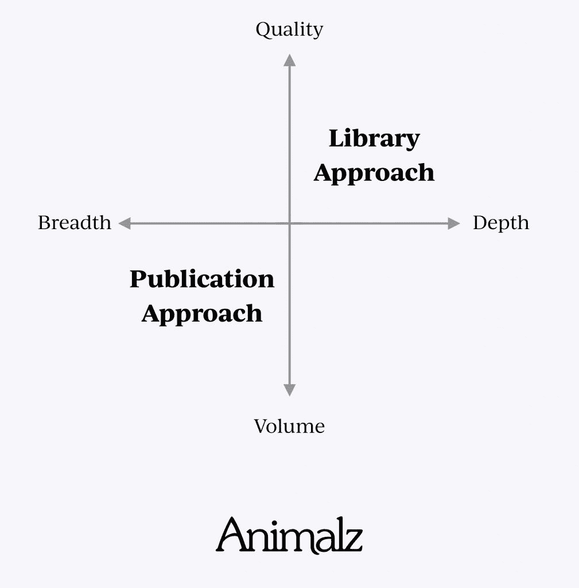
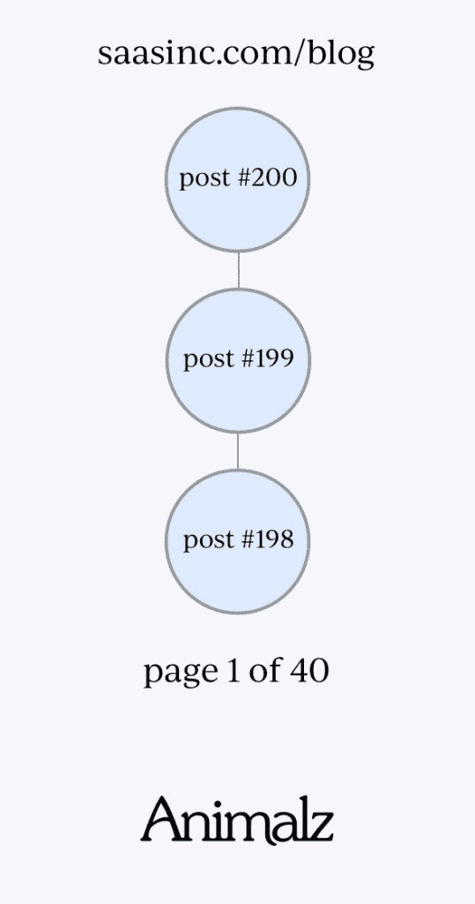
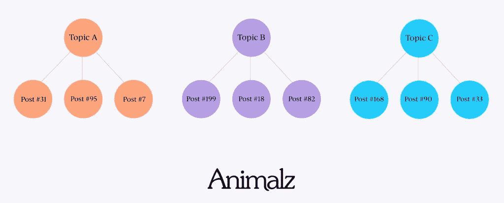
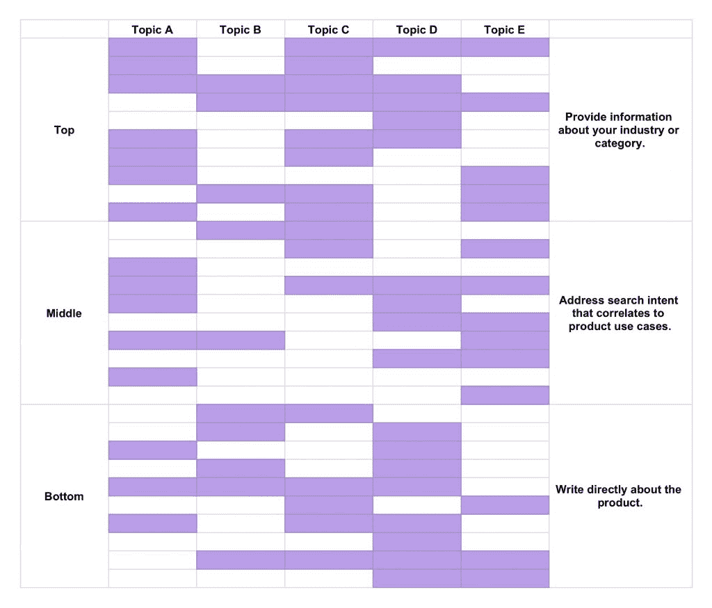
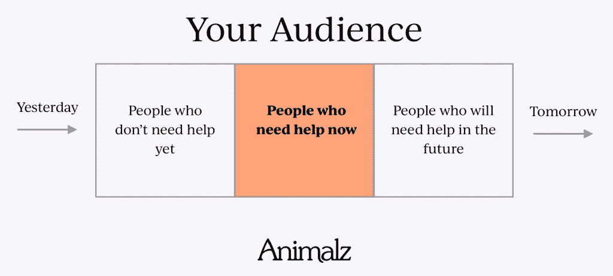

# 你的博客不是出版物

> 原文：<https://www.animalz.co/blog/library-vs-publication/?utm_source=wanqu.co&utm_campaign=Wanqu+Daily&utm_medium=website>

在这句话中，约翰总结了似乎很少有人理解的内容战略，即你必须能够负担得起自己的内容战略。Intercom 已经筹集了 2.4 亿美元，其内容团队雇佣了 9 名员工，也许最重要的是，[得到了高管团队](https://www.animalz.co/blog/grow-a-blog-the-hard-way/)的大力支持。很少有 SaaS 公司能像经营出版物一样经营他们的博客，这是一个几乎不可能复制的策略。

对于几乎所有其他 SaaS 公司，我们建议采用不同的方法。

## 出版物与图书馆，解释

最好的内容策略是优先考虑质量和深度，而不是数量和广度。你可能认为你已经这样做了——但是我鼓励你仔细看看。

当大多数内容营销人员想到博客时，他们想象的是按时间倒序排列的帖子。这是维基百科对博客的定义，也是 WordPress 等流行的内容管理系统组织内容的方式。因此，许多内容营销者的默认行为往好里说是低效，往坏里说是浪费。

很难夸大这在内容营销中的问题。以下是出版思维在实践中的表现:

*   主题是横向整合的，这意味着内容创作者涵盖了广泛的主题，而不是全面的深度。
*   帖子是按照严格的时间表发布的，所以很难为需要额外时间和精力的内容腾出时间。
*   内容是为受众服务的，因此时效性是重中之重。

这就是为什么这些事情是有问题的:

*   对读者来说，深度几乎总是比广度更有用。
*   需要大量努力的内容工作(考虑基准报告、数据分析等。)通常可以轻松获得 10 倍于帖子的结果。
*   绝大多数读者并不是你网站的常客。相反，他们寻找特定的文章来解决特定的问题。

最后一点是不良内容策略的关键驱动因素。我们查看了一些非常成功的 SaaS 博客，发现在这些网站上，只有大约 17%的访问者会再次访问。这意味着 83%的访问者是新的。你可能会对此产生负面反应，但其实这是一件好事。

你越依赖有机搜索——这是目前 SaaS 博客最好的流量来源——你就越不需要观众。“受众”这个词，就像“出版”这个词一样，是从其他行业借用过来的，两者都不适合现代内容营销的结构。试图迎合一小部分[回头客](https://www.hotjar.com/google-analytics/glossary/users)的行为——广泛的主题、严格的出版时间表和对时效性的强调——导致了非常低效的内容营销。

发布途径是一个“[一次](https://www.primary-intel.com/blog/the-one-degree-mistake/)问题。如果一架从纽约飞往洛杉矶的飞机偏离航线一度，它最终会飞到离目的地 50 英里的地方。内容策略中的小疏忽也会产生类似的影响。这个库方法是一个简单的框架，具有许多积极的意义。这个想法是你通过主题和深度来处理内容。下面是它在实践中的工作原理:

*   内容是垂直整合的，这意味着每个主题都是从漏斗的顶部到底部进行处理的。
*   有机搜索是优先的，因此常青树内容是最重要的。时间被允许用于减缓生产的内容努力。
*   内容是为需要的人在他们需要的时候制作的。

我们称之为图书馆方法，因为通过这种方式，博客成为易于访问的信息的常青目录，而不是松散相关的博客帖子的提要。

## 图书馆方法的三个原则

图书馆方法的特点是多方面的。你不一定需要从头创建一个新的内容策略，放弃你的内容管理系统或重建你的整个网站。然而，你可以从下面的原则中学习，并在不同程度上应用到你现有的策略中。

## 1.平面建筑

像出版物一样运行的网站的主要特征之一是博客主页，它以博客帖子的倒序提要为特色。这是 WordPress 的默认设置，所有营销人员都知道，[默认设置非常强大](https://www.fastcompany.com/40403706/the-subtle-power-of-default-choices)。

设想一种新的方式来呈现你的内容既昂贵又耗时，但是一些网站选择这样做。例如，lattice[最近重新设计了他们的博客](https://lattice.com/library),以(1)更容易地突出他们希望读者看到的内容，以及(2)允许读者根据主题和内容类型(博客帖子、电子书、网络研讨会等)轻松过滤内容。).他们甚至把网址改成了 lattice.com/library 的，以强化图书馆思维。

Lattice 的方法除了可用性改进之外，还有 SEO 的好处。这个网站更“扁平”——也就是说，内容可以通过更少的点击来访问——这使得人们和搜索引擎更容易找到。

但是你不必彻底检查你的网站来获得这些好处。您还可以[利用 hub 页面收集特定主题的资源](https://www.animalz.co/blog/seo-for-content-marketing/)。枢纽通常是针对顶级关键词创建的，然后链接到相关的长尾主题的帖子。您可以按任何顺序创建内容，但要以一种有组织、有层次的方式呈现，而不是以提要的方式呈现。

## 2.按主题和漏斗深度规划的内容

内容营销者对图书馆方法的一个犹豫是主题必须被多次覆盖。为了使一个图书馆完整，每个主题必须从多个角度为漏斗顶部、中部和底部的读者解决。

内容营销者有时会觉得，读者不会希望一周又一周地在博客上看到同一个话题。但这是对人们如何消费内容的曲解。大多数人在有问题要解决的时候会寻找内容(见下面的原则 3 ),甚至不会注意到最新的帖子是否都是类似的内容。

我们建议按主题和漏斗深度规划内容。当可视化时，它看起来就像一个热图，显示您已经拥有内容的区域和您需要更多内容的区域。传统编辑日历的一个问题是很难像这样可视化内容。当主题没有这样的框架时，内容创建者倾向于支持广度。这种方法有利于深度。

## 3.作为副产品的观众

要发展受众，你需要不断增加新的人，留住老的人。这是一个一直在增长的独特群体。如果你能做到这一点，这是很有用的，但它假设读者对你要说的内容有持续的兴趣，这就很难倾向于深度。大多数出版物迎合读者，因此，被迫优先考虑广度，以跟上他们的编辑日历。

你的读者可能不是不断增长的受众中的一部分，而是有问题需要解决的一群人。在他们需要答案的时候，他们搜索谷歌，找到你。你的“观众”实际上是每天不同的一群人。

这并不是说增加电子邮件列表、增加社交追随者和建立品牌不是有用的策略——它们绝对有用。但这些都是成功的内容运营的副产品，而不是主要目标。

### 战略第一

事实是，大多数内容营销者没有一个深思熟虑的战略。无论你是刚刚起步，还是已经在内容上投资多年，花点时间来制定一个有助于高效内容营销的策略。

 [Follow @Jimmy_Daly](https://twitter.com/jimmy_daly) 

Animalz 是一家为 SaaS 和科技公司提供高端内容营销解决方案的机构。

