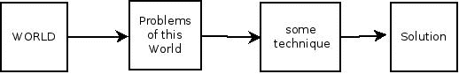

# 编程需要多少数学|我对软件的思考

> 原文：<https://lispmachine.wordpress.com/2014/12/05/how-much-math-you-need-for-programming/?utm_source=wanqu.co&utm_campaign=Wanqu+Daily&utm_medium=website>

## 编程需要多少数学知识

<small>December 5, 2014 at 10:47 am | Posted in [art](https://lispmachine.wordpress.com/category/art/), [Hacking](https://lispmachine.wordpress.com/category/hacking/), [Patterns](https://lispmachine.wordpress.com/category/patterns/), [Programming](https://lispmachine.wordpress.com/category/programming/) | [Leave a comment](https://lispmachine.wordpress.com/2014/12/05/how-much-math-you-need-for-programming/#respond)
Tags: [esr](https://lispmachine.wordpress.com/tag/esr/), [evan miller](https://lispmachine.wordpress.com/tag/evan-miller/), [gnewsense](https://lispmachine.wordpress.com/tag/gnewsense/), [GNU](https://lispmachine.wordpress.com/tag/gnu/), [Linux](https://lispmachine.wordpress.com/tag/linux/), [math](https://lispmachine.wordpress.com/tag/math/), [paul graham](https://lispmachine.wordpress.com/tag/paul-graham/), [steve yegge](https://lispmachine.wordpress.com/tag/steve-yegge/), [steven noble](https://lispmachine.wordpress.com/tag/steven-noble/), [trisquel](https://lispmachine.wordpress.com/tag/trisquel/)</small> 

每当我想学习算法时，那里使用的数学似乎是一个障碍。我承认我的数学没那么好，但也没那么差，但这种“不差”的知识水平不足以在与四大巨头的面试中竞争，当谈到他们的算法水平、涉及的时间和空间复杂性以及排序和搜索技术的比较时。我需要学习所有这些，在那次搜索中，我看到了几篇关于编程所需数学的文章。说到编程，最著名的数学支持者是史蒂夫·耶格。以下是我在编程所需的数学方面的发现:

1.  史蒂夫·萨米特关于数学的笔记
2.  史蒂夫·耶格写了两篇文章[每日数学](https://sites.google.com/site/steveyegge2/math-every-day)和[程序员数学](http://steve-yegge.blogspot.in/2006/03/math-for-programmers.html)
3.  埃里克·s·雷蒙德谈论成为一名黑客需要多少数学知识
4.  数学上的保罗·格拉厄姆
5.  埃文·米勒的文章作为[回复上面的 3 位作者](http://www.evanmiller.org/mathematical-hacker.html)
6.  史蒂文·诺布尔写了一篇文章作为对埃文·米勒计算斐波那契数列的例子的回复

如果你没有读完以上所有内容，那么你可能会错过我这篇博文的意图。按照史蒂夫·萨米特、埃里克·雷蒙德和保罗·格拉厄姆的说法，你不需要太专注于数学就能成为一名出色的程序员、黑客([维基百科定义](https://en.wikipedia.org/wiki/Hacker_%28programmer_subculture%29)和埃里克·雷蒙德关于[黑客定义](http://www.catb.org/~esr/faqs/hacker-howto.html)的文章)。史蒂文·诺布尔说你应该学一点数学，埃文·米勒似乎有点扭曲地同意他们所有人的观点。我自己开始编程只是因为热爱它。

自 2009 年以来，我主要用 C 语言进行专业编程，有时用 C++，几乎总是在 Linux 上，有时在 UNIX 上。我对编程的热情让我用许多不同的语言阅读和编写代码，我不得不学习不同的思维方式。编写代码很容易，但是按照特定语言建模的范式来思考却是一项艰难、令人畏惧且非常耗时的任务。我经历过的是:**计算机编程不是数学**。我再说一遍，计算机编程不是数学，永远也不会是。你想学计算机编程，那就学计算机编程。不要翻阅数学书籍，阅读特定新闻组上的任何内容(例如 comp.lang.c，comp.lang.lisp)。用潘这样的新闻阅读器:

[http://pan.rebelbase.com/](http://pan.rebelbase.com/)

阅读所有来自 GNU 的软件，使用 Linux 发行版专门处理日常任务(我更喜欢二进制 blob 最少的发行版)。如果你学习大量的数学是因为你想学习计算机编程，那么你会感到困惑，并朝着错误的方向前进，你将不会学到很多编程知识。

作为计算机程序员，我们写程序，但是为什么呢？我们编写程序来解决这个世界的问题。这就是电脑程序员的工作，他们解决问题。

数学家做什么呢？他试图理解自然，并把数学作为一种语言来理解。数学已经帮助解决了这个世界的许多问题。看看量子物理学吧，它是物理学的一个分支，已经彻底改变了我们关于原子的千百年来的假设，它严重依赖于数学。数学无处不在，从化学工业到社会问题，我们都使用统计学。以你日常生活的任何一部分为例，你会发现它对我的数学有多么深刻的影响。数学不仅被用作理解自然的最重要的工具，而且被用作解决世界问题的最重要的工具。这是有原因的，所有这些性质都是数学固有的。

我不擅长数学，所以我试图用我的直觉、常识、流程图和更多其他种类的图表来解决我作为程序员每天面临的问题。这种情况持续了几年，我想出了一些规则和想法，并在此基础上建立了一个解决问题的模型。建立这个模型只有一个目的:对问题和解决方案非常清楚和简单。我正在创建一个模型，你将一个问题作为输入，它将使用英语、流程图和我创建的许多其他类型的图表产生一个解决方案作为输出。这个模型有一定的假设、规则和条件，这些都非常清楚。清晰和简单是议事日程的重中之重。这是一种通用的、抽象的机制，应用于问题以获得解决方案。几个月前，在我读完所有这些数学文章后，我又看到了埃文·米勒的一篇文章，标题是[不要扼杀数学](http://www.evanmiller.org/dont-kill-math.html)，它实际上是为了回应布雷特·维克多的[扼杀数学](http://worrydream.com/KillMath/)。

这两篇文章对我打击很大。首先，Bret 试图做我几年来一直在做的事情，尽管他在制作一些东西方面比我更成功。我永远也想不出任何人都可以使用的可靠模型，而 Bret 已经做到了。我快乐吗，是的，因为我找到了我一直在寻找的东西，我准备跟随 Bret 的脚步，但我从来没有。为什么？

我从来没有想到一个可靠的模型是有原因的。我一直觉得它缺少点什么。无论我做了什么，做了多少努力，我总是觉得缺少一些最基本的东西。每当我研究薛定谔方程、麦克斯韦方程、牛顿定律、开普勒定律、测不准原理或舒尔巴经典时，我总是觉得所有这些方程都是完整的，但我的模型却不是。这两篇杀死数学和不要杀死数学的文章让我意识到什么是完整性。就是《不要扼杀数学》里提到的数学的属性。Evan 在本文中提出的问题以及他以非常简单和基本的细节进行解释的方式，结束了我对模型的寻找。数学是一种简明扼要的解决问题和理解现象的方法。这些残酷的特征是数学所固有的，就像灵魂是每个生物所固有的一样。有了数学，你可以用比不用它更短更好的方法解决问题。

这让我想到一个非常基本的问题:我为什么讨厌数学？这是我在学校和大学里学到的数学方法。我学的是死记硬背的数学，而不是真正的数学。这是学校的错，是我们教育体系的错，不是学生的错。回到最初的问题，我们是否需要数学来成为一名伟大的程序员，这是这个世界最初是如何解决它的问题的:

[T2】](https://lispmachine.files.wordpress.com/2014/12/math-1.jpg)

然后是数学，这是大多数数学家做的:

[T2】](https://lispmachine.files.wordpress.com/2014/12/math-2.jpg)

几乎所有的计算机程序员/软件工程师/开发人员都这么做:

[T2】](https://lispmachine.files.wordpress.com/2014/12/math-3.jpg)

埃文·米勒说你可以不用大量的数学知识就成为一流的黑客，我认为他是对的，这和所有其他作者的观点一致。他强调的重点是数学在解决这个世界的问题中的作用，数学在解决现实世界的问题中非常有效。作为程序员，我们解决问题，但是如果我们使用数学来解决问题，然后将编程解决方案应用到解决方案的数学模型中，那么我们可以有一些惊人的方法来提供更好的解决方案，这将使我们作为程序员的生活更容易(有点副作用):

[T2】](https://lispmachine.files.wordpress.com/2014/12/math-4.jpg)

我以下面的话结束这篇博文:

*   你不需要数学来成为一流的程序员，因为我们不直接使用数学。如果你想成为程序员，那就学习编程。计算机编程与数学非常不同，作为一名计算机程序员，你必须更多地关注如何编写更好的程序，如何以一种特定的范式(例如函数式、面向对象、泛型、过程式、逻辑、声明式等)进行思考，找到更好的方法来创建软件，你需要理解[设计模式](http://<p%20style=%22text-align:%20justify;%22>Whenever%20I%20wanted%20to%20learn%20Algorithms,%20Mathematics%20used%20there%20somehow%20seemed%20to%20be%20an%20obstacle.%20I%20admit%20my%20Math%20is%20not%20that%20good%20but%20it%20ain't%20that%20bad%20either%20but%20this%20%22ain't%20bad%22%20level%20of%20knowledge%20was%20not%20enough%20to%20compete%20in%20interviews%20with%20<a%20href=%22https://en.wikipedia.org/wiki/Big_Tech%22>the%20Big%20Four</a>%20when%20it%20comes%20to%20their%20level%20of%20Algorithms%20and%20the%20time%20and%20space%20complexities%20involved%20and%20comparisons%20of%20sorting%20and%20searching%20techniques.%20I%20needed%20to%20learn%20all%20these%20and%20in%20that%20search%20I%20came%20across%20several%20articles%20written%20on%20Mathematics%20required%20for%20programming.%20When%20it%20comes%20to%20programming,%20most%20loudly%20known%20math-proponent%20is%20Steve%20Yegge.%20Here%20is%20what%20I%20have%20found%20on%20Math%20required%20for%20programming:
%20<ol%20style=%22text-align:%20justify;%22>%20<li>Steve%20Summit%20notes%20on%20<a%20href=%22http://www.eskimo.com/~scs/cclass/mathintro/top.html%22%20target=%22_blank%22%20rel=%22noopener%22>Math</a>%20(author%20of%20brilliantly%20written%20C-FAQs)</li>%20<li>Steve%20Yegge%20who%20has%20written%20two%20articles%20<a%20href=%22https://sites.google.com/site/steveyegge2/math-every-day%22%20target=%22_blank%22%20rel=%22noopener%22>Math%20Everyday</a>%20and%20<a%20href=%22http://steve-yegge.blogspot.in/2006/03/math-for-programmers.html%22%20target=%22_blank%22%20rel=%22noopener%22>Math%20for%20Programmers</a></li>%20<li>Eric%20S.%20Raymond%20talks%20about%20<a%20href=%22http://www.catb.org/~esr/faqs/hacker-howto.html#mathematics%22%20target=%22_blank%22%20rel=%22noopener%22>how%20much%20math</a>%20you%20need%20to%20become%20a%20Hacker</li>%20<li>Paul%20Graham%20<a%20href=%22http://www.paulgraham.com/college.html%22%20target=%22_blank%22%20rel=%22noopener%22>on%20Math</a></li>%20<li>Evan%20Miller's%20article%20as%20<a%20href=%22http://www.evanmiller.org/mathematical-hacker.html%22%20target=%22_blank%22%20rel=%22noopener%22>reply%20to%203%20authors</a>%20above</li>%20<li>Steven%20Noble%20wrote%20an%20article%20as%20<a%20href=%22http://blog.noblemail.ca/2013/01/on-calculating-fibonacci-numbers-in-c.html%22%20target=%22_blank%22%20rel=%22noopener%22>reply%20to%20Evan%20Miller's%20example</a>%20of%20calculating%20fibonacci%20numbers</li>%20</ol>%20<p%20style=%22text-align:%20justify;%22>If%20you%20do%20not%20read%20all%20of%20those%20above%20then%20you%20will%20miss%20the%20intent%20of%20my%20blog%20post.%20As%20per%20Steve%20Summit,%20Eric%20Raymond%20and%20Paul%20Graham,%20you%20do%20not%20need%20to%20focus%20much%20on%20Math%20to%20become%20a%20brilliant%20programmer,%20a%20hacker%20(<a%20href=%22https://en.wikipedia.org/wiki/Hacker_%28programmer_subculture%29%22%20target=%22_blank%22%20rel=%22noopener%22>Wikipedia%20definition</a>%20and%20Eric%20Raymond's%20article%20on%20<a%20href=%22http://www.catb.org/~esr/faqs/hacker-howto.html%22%20target=%22_blank%22%20rel=%22noopener%22>definition%20of%20a%20hacker</a>).%20Steven%20Noble%20says%20you%20should%20learn%20a%20little%20bit%20of%20Math%20and%20Evan%20Miller%20somehow%20seems%20to%20agree%20with%20all%20of%20them%20with%20a%20bit%20of%20twist.%20I%20myself%20started%20programming%20just%20for%20the%20love%20of%20it.
%20<p%20style=%22text-align:%20justify;%22>Since%202009,%20I%20am%20programming%20professionally%20mostly%20in%20C,%20sometimes%20in%20C++%20and%20almost%20always%20on%20Linux%20and%20sometimes%20on%20UNIX.%20My%20passion%20for%20programming%20has%20made%20me%20read%20and%20write%20code%20in%20many%20different%20languages%20where%20I%20had%20to%20learn%20different%20ways%20of%20thinking.%20Writing%20code%20is%20easy,%20thinking%20along%20the%20lines%20of%20the%20paradigm%20on%20the%20top%20of%20which%20a%20particular%20language%20was%20modeled%20is%20a%20tough,%20daunting%20and%20very%20time%20consuming%20task.%20What%20I%20have%20experienced%20is:%20<b>Computer%20Programming%20is%20not%20Math</b>.%20Let%20me%20say%20it%20again,%20computer%20programming%20is%20not%20Math%20and%20will%20never%20be.%20You%20want%20to%20learn%20computer%20programming,%20then%20learn%20computer%20programming.%20Do%20not%20flip%20through%20Math%20books,%20read%20whatever%20is%20written%20on%20a%20particular%20newsgroup%20(comp.lang.c,%20comp.lang.lisp%20for%20example),%20read%20about%20all%20the%20software%20that%20came%20from%20GNU%20and%20use%20Linux%20distro%20exclusively%20for%20everyday%20tasks%20(I%20prefer%20a%20distro%20with%20least%20amount%20of%20binary%20blob).%20If%20you%20are%20learning%20lot%20of%20Math%20because%20you%20want%20to%20learn%20computer%20programming%20then%20you%20are%20confused%20and%20headed%20in%20the%20wrong%20direction%20and%20you%20will%20not%20learn%20much%20of%20programming.%20
%20<p%20style=%22text-align:%20justify;%22>As%20computer%20programmers,%20we%20write%20programs,%20but%20why?%20We%20write%20programs%20to%20solve%20problems%20of%20this%20world.%20That%20is%20what%20computer%20programmers%20do,%20they%20solve%20problems.
%20<p%20style=%22text-align:%20justify;%22>Now%20what%20does%20does%20a%20mathematician%20do?%20He%20tries%20to%20understand%20nature%20and%20uses%20mathematics%20as%20a%20language%20to%20do%20that.%20Mathematics%20has%20helped%20solved%20many%20problems%20of%20this%20world.%20Look%20at%20what%20Quantum%20Physics,%20a%20branch%20of%20physics%20that%20has%20literally%20changed%20our%20millennia%20old%20assumptions%20about%20atoms,%20is%20heavily%20dependent%20on%20Math.%20Math%20is%20everywhere,%20from%20chemical%20industry%20to%20societal%20problems%20we%20use%20Statistics.%20Take%20any%20part%20of%20your%20daily%20life%20and%20you%20will%20see%20how%20deeply%20it%20is%20influenced%20my%20Math.%20Math%20has%20been%20used%20as%20the%20most%20prominent%20vehicle%20not%20only%20to%20understand%20nature%20but%20also%20to%20solve%20problems%20of%20this%20world.%20There%20is%20a%20reason%20for%20this,%20all%20these%20properties%20are%20just%20inherent%20in%20Math.%20I%20was%20not%20good%20at%20Math,%20so%20I%20was%20trying%20to%20solve%20the%20problems%20I%20was%20facing%20everyday%20as%20a%20programmer%20using%20my%20intuition,%20common-sense,%20flow-charts%20and%20more%20other%20kinds%20of%20diagrams.%20This%20went%20on%20for%20few%20years%20and%20I%20came%20up%20with%20some%20rules%20and%20ideas%20on%20which%20I%20was%20building%20a%20model%20to%20solve%20problems.%20Building%20up%20this%20model%20had%20one%20aim:%20to%20be%20extremely%20clear%20and%20very%20brief%20on%20what%20the%20problem%20is%20and%20same%20for%20solution.%20I%20was%20creating%20a%20model,%20to%20which%20you%20will%20feed%20a%20problem%20as%20input%20and%20it%20will%20produce%20a%20solution%20as%20output%20using%20English%20language,%20flow%20charts%20and%20lot%20of%20other%20kinds%20of%20diagrams%20I%20created.%20This%20model%20had%20certain%20assumptions,%20rules%20and%20conditions,%20which%20again%20were%20very%20clear.%20Clarity%20and%20simplicity%20were%20high%20on%20agenda.%20It%20was%20a%20kind%20of%20a%20general,%20abstract%20mechanism%20to%20be%20applied%20to%20problems%20to%20get%20solutions.%20Now%20a%20few%20months%20back,%20after%20I%20read%20all%20these%20Math%20articles%20I%20came%20across%20one%20more%20article%20from%20Evan%20Miller%20titled%20<a%20href=%22http://www.evanmiller.org/dont-kill-math.html%22%20target=%22_blank%22%20rel=%22noopener%22>Don't%20Kill%20Math</a>%20which%20was%20actually%20written%20in%20response%20to%20<a%20href=%22http://worrydream.com/KillMath/%22%20target=%22_blank%22%20rel=%22noopener%22>Kill%20Math</a>%20by%20Bret%20Victor.
%20<p%20style=%22text-align:%20justify;%22>These%20two%20article%20hit%20me%20very%20hard.%20First,%20Bret%20was%20trying%20to%20do%20the%20same%20thing%20I%20was%20trying%20from%20few%20years,%20though%20he%20was%20more%20successful%20than%20me%20in%20producing%20something.%20I%20could%20never%20come%20up%20with%20some%20solid%20model%20which%20could%20have%20been%20used%20by%20everyone%20and%20here%20is%20Bret%20who%20has%20already%20done%20that.%20Was%20I%20happy,%20yes,%20because%20I%20found%20what%20I%20was%20looking%20for%20and%20I%20was%20ready%20to%20follow%20Bret's%20footsteps%20but%20I%20never%20did.%20Why?
%20<p%20style=%22text-align:%20justify;%22>There%20was%20a%20reason%20I%20could%20never%20come%20up%20up%20with%20a%20solid%20model.%20I%20always%20thought%20it%20lacked%20something.%20No%20matter%20what%20I%20did%20and%20how%20much%20I%20worked%20on%20it,%20I%20always%20felt%20that%20something%20very%20fundamental%20and%20basic%20is%20lacking.%20Whenever%20I%20studied%20Schrodinger%20equation,%20Maxwell's%20equation,%20Newton's%20laws,%20Kepler's%20laws,%20The%20Uncertainty%20Principle%20or%20<a%20href=%22https://en.wikipedia.org/wiki/Shulba_Sutras%22%20target=%22_blank%22%20rel=%22noopener%22>Shulba-Sutras</a>,%20I%20always%20felt%20that%20all%20those%20equations%20are%20complete%20but%20my%20model%20does%20not.%20Both%20of%20these%20articles%20Kill%20Math%20and%20Dont'%20Kill%20Math%20made%20me%20realize%20what%20is%20that%20completeness.%20It%20is%20the%20properties%20of%20Mathematics%20mentioned%20in%20Don't%20Kill%20Math.%20The%20questions%20Evan%20asked%20in%20this%20article%20and%20the%20way%20he%20has%20explained%20in%20very%20simple%20and%20basic%20details,%20concluded%20my%20search%20for%20a%20model.%20Math%20is%20a%20terse,%20succinct%20and%20concise%20method%20to%20solve%20problems%20and%20understand%20a%20phenomenon.%20These%20brutal%20characteristics%20are%20inherent%20to%20Math,%20just%20like%20soul%20is%20inherent%20to%20every%20being.%20With%20Math%20you%20can%20solve%20problems%20in%20a%20much%20shorter%20and%20better%20way%20than%20not%20using%20it.%20
%20<p%20style=%22text-align:%20justify;%22>This%20brings%20me%20to%20a%20very%20basic%20question:%20Why%20did%20I%20hate%20math?%20It%20was%20the%20way%20math%20was%20taught%20to%20me%20in%20school%20and%20college.%20I%20was%20taught%20rote-math,%20not%20real%20math.%20It%20is%20the%20fault%20of%20school,%20fault%20of%20our%20education%20system,%20not%20of%20the%20student.%20Coming%20back%20to%20the%20primary%20question%20of%20whether%20we%20need%20Math%20for%20becoming%20a%20great%20programmer,%20this%20is%20how%20tho%20world%20solved%20its%20problems%20in%20beginning:
%20<p%20style=%22text-align:%20justify;%22>
%20<p%20style=%22text-align:%20justify;%22>Then%20came%20Math%20and%20this%20is%20what%20most%20mathematicians%20did:
%20<p%20style=%22text-align:%20justify;%22>
%20<p%20style=%22text-align:%20justify;%22>And%20this%20what%20almost%20all%20computer-programmers/software-engineers/developers%20do:
%20<p%20style=%22text-align:%20justify;%22>
%20<p%20style=%22text-align:%20justify;%22>Evan%20Miller%20says%20you%20can%20become%20first%20rate%20hacker%20without%20using%20a%20lot%20of%20Math%20and%20I%20think%20he%20is%20right%20and%20that%20is%20in%20agreement%20with%20all%20other%20authors.%20The%20point%20he%20stressed%20was%20role%20of%20Math%20in%20solving%20problems%20of%20this%20world,%20that%20Math%20is%20brutally%20efficient%20in%20solving%20real%20world%20problems.%20As%20programmers,%20we%20solve%20problems,%20but%20if%20we%20solve%20problems%20using%20Math%20and%20then%20apply%20programming%20solutions%20to%20the%20mathematical%20model%20of%20the%20solution,%20then%20we%20can%20have%20some%20amazing%20ways%20of%20providing%20better%20solutions%20that%20will%20make%20our%20lives%20easier%20as%20a%20programmer%20(kind%20of%20side-effect):
%20<p%20style=%22text-align:%20justify;%22>
%20
%C2%A0
%20<p%20style=%22text-align:%20justify;%22>I%20conclude%20this%20blog-post%20with:
%20<ul>%20<li%20style=%22text-align:%20justify;%22>You%20do%20not%20need%20math%20to%20become%20a%20first-rate%20programmer%20because%20we%20do%20not%20use%20much%20of%20Math%20directly.%20If%20you%20want%20to%20become%20programmer%20then%20learn%20programming.%20Computer%20programming%20is%20very%20different%20from%20mathematics,%20and%20as%20a%20computer%20programmer%20you%20have%20to%20focus%20more%20on%20how%20to%20write%20better%20programs,%20how%20to%20think%20in%20a%20particular%20paradigm%20(e.g%20functional,%20OO,%20Generic,%20Procedural,%20logical,%20declarative%20etc),%20find%20better%20ways%20to%20create%20software,%20you%20need%20to%20understand%20design-patterns,%20not%20to%20mention%20learning%20and%20using%20C%20for%20few%20years%20will%20add%20new%20dimension%20to%20your%20thinking.%20All%20these%20are%20not%20related%20to%20math%20in%20anyway.%20These%20tools%20we%20use%20to%20solve%20problems%20of%20this%20world%20and%20they%20are%20in%20no%20way%20related%20to%20Math%20e.g%20look%20at%20the%20different%20paradigms%20on%20which%20different%20languages%20are%20created,%20you%20need%20to%20learn%20these%20first%20and%20it%20will%20take%20you%20few%20years%20before%20you%20get%20a%20grip%20at%20them%20and%20then%20you%20can%20learn%20Math%20if%20you%20want.%20Read%20<a%20href=%22https://www.gnu.org/software/emacs/manual/eintr.html%22%20target=%22_blank%22%20rel=%22noopener%22>Introduction%20to%20Progrmming%20using%20Emacs%20Lisp</a>%20by%20Roberrt%20J.%20Chassell%20to%20know%20how%20the%20problem%20of%20creating%20a%20customizable,%20self-documenting,%20ever-extensible%20real-time%20display%20text-editor%20was%20solved.%20Read%20<a%20href=%22https://www.gnu.org/software/make/manual/%22%20target=%22_blank%22%20rel=%22noopener%22>GNU%20Make%20Manual</a>%20and%20find%20out%20why%20does%20it%20need%20<a%20href=%22https://www.gnu.org/software/m4/m4.html%22%20target=%22_blank%22%20rel=%22noopener%22>M4</a>%20and%20<a%20href=%22https://www.gnu.org/software/autoconf/%22%20target=%22_blank%22%20rel=%22noopener%22>Autoconf</a>.</li>%20<li%20style=%22text-align:%20justify;%22>Math%20is%20the%20most%20widely%20used%20vehicle%20to%20understand%20the%20nature%20and%20solve%20problems%20of%20this%20world.%20We%20can%20learn%20more%20ways%20of%20solving%20problems%20by%20learning%20mathematical%20methods.%20I%20myself%20have%20started%20studying%20probability%20because%20like%20Steve%20Yegge%20said,%20once%20you%20understand%20Math%20then%20you%20can%20look%20at%20the%20problem%20and%20see%20whether%20it%20a%20probability%20problem,%20calculus%20problem%20or%20statistical%20problem%20etc.%20Math%20is%20related%20to%20the%20nature%20of%20the%20problem,%20not%20nature%20of%20software,%20software%20has%20its%20own%20methods%20and%20tools%20of%20solving%20problems,%20keep%20that%20in%20mind.</li>%20</ul>%20<p%20style=%22text-align:%20justify;%22>I%20want%20beginning%20programmers%20to%20go%20on%20right%20path.%20Learning%20Math%20when%20what%20you%20actually%20want%20to%20write%20computer%20programs%20is%20a%20wrong,%20wrong%20path%20to%20walk%20on.%20Install%20a%20Linux%20distro,%20I%20prefer%20<a%20href=%22https://trisquel.info/%22%20target=%22_blank%22%20rel=%22noopener%22>Trisquel</a>%20for%20latest%20software%20and%20<a%20href=%22http://gnewsense.org/%22%20target=%22_blank%22%20rel=%22noopener%22>gNewSense</a>%20if%20you%20want%20a%20solid%20and%20stable%20distro%20but%20with%20little%20bit%20outdated%20collection%20of%20software.%20Install%20Emacs%20using%20package%20manager%20on%20command-line%20and%20start%20reading%20<em>Introduction%20to%20Programming%20using%20Emacs%20Lisp</em>%20and%20you%20will%20get%20true%20taste%20of%20computer%20programming.%20This%20image%20shows%20you%20the%20world%20of%20computer%20programming
%20

%20<p%20style=%22text-align:%20justify;%22><em>Copyright%20%C2%A9%202014%20Arnuld%20Uttre,%20Hyderabad,%20Telangana%20-%20500017%20(INDIA)</em><br%20/>Licensed%20Under%20<a%20href=%22http://creativecommons.org/licenses/by-nd/3.0/us/%22%20target=%22_blank%22%20rel=%22noopener%22>Creative%20Commons%20Attribution-NoDerivs%203.0%20license%20(a.k.a.%20CC%20BY-ND)</a>
)，更不用说学习和使用 C 语言几年将为你的思考增加新的维度。所有这些无论如何都与数学无关。你需要先学习这些，你需要花几年时间才能掌握它们，然后如果你想的话，你可以学习数学。阅读 Roberrt J. Chassell 的[使用 Emacs Lisp 编程简介](https://www.gnu.org/software/emacs/manual/eintr.html)，了解创建一个可定制的、自我文档化的、可扩展的实时显示文本编辑器的问题是如何解决的。阅读 [GNU Make 手册](https://www.gnu.org/software/make/manual/)，找出它为什么需要 [M4](https://www.gnu.org/software/m4/m4.html) 和 [Autoconf](https://www.gnu.org/software/autoconf/) 。
*   数学是理解自然和解决世界问题最广泛使用的工具。通过学习数学方法，我们可以学到更多的解题方法。我自己已经开始学习概率，因为就像史蒂夫·耶格说的，一旦你理解了数学，你就可以看问题，看它是概率问题，微积分问题还是统计问题等等。数学与问题的性质有关，而不是软件的性质，软件有自己解决问题的方法和工具，记住这一点。

*版权所有 2014 Arnuld Uttre，Hyderabad，Telangana–500017(印度)*
根据[知识共享署名-NoDerivs 3.0 许可证(又名 CC BY-ND)](http://creativecommons.org/licenses/by-nd/3.0/us/) 获得许可

### 像这样:

像 装...

### *相关*