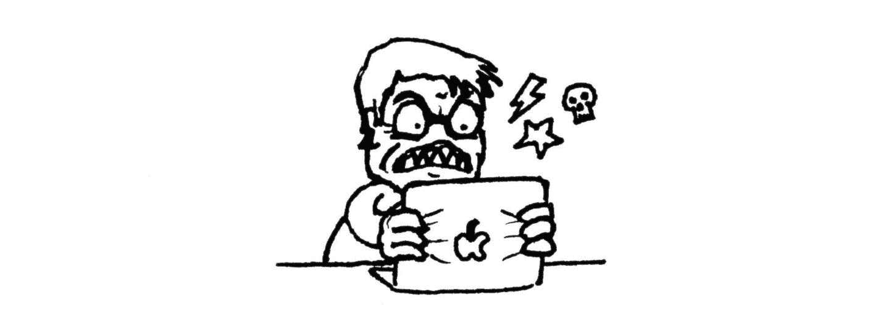
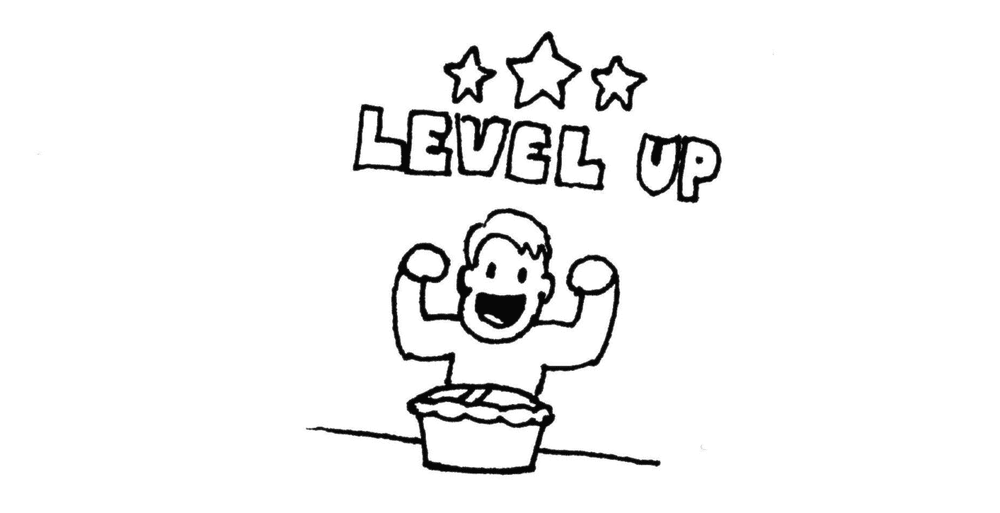

# 金钱的交易时间

> 原文：<https://nicolasbouliane.com/blog/trading-time-for-money?utm_source=wanqu.co&utm_campaign=Wanqu+Daily&utm_medium=website>


发布于<time datetime="2020-12-24 09:53:00">2020 年 12 月 24 日</time>

根据传统观点，如果你每小时挣 31 欧元，而外包一项任务的成本低于这个数字，那么你应该总是付钱给别人去做。例如，如果你的清洁工每小时收费 15 欧元，你每工作一小时就能省下 16 欧元，而不是打扫你的房子。

我经常遇到这种建议，尤其是在那些更富有、喜欢色情作品、每周工作 4 小时、热衷于创业的人群中。

我认为这个建议不太正确。

## 你的时间没有你想象的那么值钱

将时间转换成金钱需要缴纳重税。在德国，如果你获得平均收入(每年 42 421 欧元) <sup>[1](https://www.statista.com/statistics/416207/average-annual-wages-germany-y-on-y-in-euros/)</sup> ，你会损失大约四分之一的收入用于所得税 <sup>[1](http://www.parmentier.de/steuer/index.php?site=einkommensteuerrechnerjava)</sup> 。你 31 欧元/小时的工资 <sup>[1](https://www.statista.com/statistics/416207/average-annual-wages-germany-y-on-y-in-euros/) ， [2](https://clockify.me/working-hours)</sup> 税后实际价值 24 欧元/小时。

但还有更多的要考虑:健康保险(7.3%) <sup>[1](https://allaboutberlin.com/guides/german-health-insurance)</sup> ，失业保险(1.25%)，公共养老金(9.3%)和护理保险(1.775%) <sup>[1](http://www.parmentier.de/steuer/index.php?site=lohnsteuerrechnerjava)</sup> 也从你的工资中扣除。说到底，你每小时能拿 20 欧元。如果你还支付教堂税，并获得最昂贵的健康保险，你保持 19 欧元/小时。

同样，如果你平均每小时挣 31 欧元，每年平均工作 1386 小时，那么雇佣一个清洁工人每小时可以节省 4 欧元，而不是 16 欧元，他的收费是你的一半。

税收并不是唯一减少你可支配收入的东西。你也有一些不可避免的开支，即租金，食品杂货和公用事业。对于一个节俭的柏林人来说，每月分别是 550 欧元、150 欧元和 100 欧元。这是你税后工资的 35%,所以你每小时只有 12.50 欧元的可支配收入。在这一点上，我包括小数，因为它们开始变得重要。

换句话说，你必须卖掉你生命中的 72 分钟来购买你的清洁工生命中的 60 分钟，即使你赚了两倍的钱。

以下是数学爱好者的回顾:

```
hourly_disposable income = (
    (gross_income - income_tax)
    - health_insurance
    - unemployment_insurance
    - pension_insurance
    - nursing_care_insurance
    - (rent + groceries + utilities) * 12
) / hours_worked_per_year
```

请记住，这描述的是德国的现实，那里的人们工作少得多，但缴纳的税却更高。在你自己的国家，你会得到完全不同的结果。

## 外包的成本比你想象的要高

在外面吃饭经常被用作用金钱换取时间的例子。比自己做饭还快:不用购物，不用做饭，不用打扫卫生。

在柏林，花 10<sup>[1](https://allaboutberlin.com/guides/cost-of-living)</sup>就能吃到一顿丰盛的大餐。一个羊角面包、一杯咖啡和两顿正餐一天要花掉你 20 欧元。相比之下，我的杂货账单是每天 5 欧元。这是一个 450 欧元/月的差额，或者说是你 37.5 个小时的时间(见上文)，但是你可能会花那么多时间在超市和厨房之间。

然而，去餐馆，点餐，等你的食物，然后等账单也需要时间。就我个人而言，我发现每隔一天做饭比一天出去吃两次更方便。只有当我累得不想做饭的时候，在外面吃饭才有意义。

这也适用于招聘专业人士。你仍然需要时间找到一个，并与他们的时间表。我可以在大约 30 分钟内给我的摩托车换油或刹车。我把自行车放在经销店也要花同样长的时间，但我必须在上班时间去，然后等几天才能取回。

简而言之，外包工作并不总是让生活更轻松。它可以减轻你的精神负担，但通过降低开支来减少工作也是如此。

## 时间不是流动资产

实际上，你不能选择你要卖掉多少时间。如果你的费用被支付，你就不能停止工作。如果你需要更多的钱，你可以多工作，但很少是按照你自己的意愿，只是在你需要的时候。你不可能在周四晚上多卖两个小时的节目，因为你没有别的事情可做。不管需求如何，你可以持续销售的时间也是有限制的——大约每周 60 小时。

你也不能选择什么时候卖。大多数雇主只会购买你的办公时间。你不能决定上夜班，或者在冬天每周工作 80 小时，然后在夏天休假。你甚至不能决定把你没有卖出去的时间分配到哪里。你的雇主通常决定你什么时候午休，什么时候可以休假。如果你随叫随到，即使你的空闲时间也不完全属于你。

换句话说，你不会真的用在办公室的更多时间来换取打扫房间的更少时间。不管怎样，你一周要在办公室呆 40 个小时，所以你只是动用了一些固定预算。然而，如果你不雇佣清洁工，你也不花钱，那么你可以在以后买回一些时间，或者作为间隔年，或者作为提前退休。

作为一名自由职业者，你可以更好地控制你销售的时间和数量。尽管如此，你仍然受到标准合同期限、身体极限和行业周期性需求的约束。自由职业会计师可能不会在纳税季休假。自由开发者通常会找到 3 到 6 个月的合同。

简言之，时间不是流动资产。你不能轻易根据自己的需求多卖或少卖。

## 时间没有固定的值

让我们假设你的老板让你想工作多久就工作多久，只要你需要。你可以在办公室多呆一个小时，花钱请人帮你节省一个小时的清洁时间。

我会做这笔交易。对着我的电脑说脏话给我带来了快乐，但是洗碗却没有。我很乐意用几个小时的编程来换取几个小时的清洁工作。



My definition of a good time


每周工作 30 小时后，我会开始更加珍惜在办公室的时间。我宁愿在家里度过这段时间，在阳台上喝着啤酒，烤箱里放着馅饼，这样我就不会那么热衷于卖掉它。

50 小时后，我会以更高的价格出售我的时间。工作会对你的身体造成伤害，并渗透到你生活的其他方面。到那时，卑微的工作感觉像是一种释放，而不是一件苦差事。

除非你真的喜欢你的工作，否则到了一定程度，你宁愿去做别的事情，即使它的市场价值比你的职业低。

## 自己动手的潜在好处

自己动手做事情最不为人知的好处是你在过程中获得的技能和工具。每做一顿饭，你的厨艺都会变得更好，更多样化。自行车修理越来越便宜，越来越容易每一次尝试。这些技能会一直伴随着你，随着时间的推移，好处会越来越多。你可以处理越来越大的项目，结果看起来越来越好。



另一方面，外包并没有变得更好更便宜。它要么变得更好更贵，要么变得更便宜更差。这将你的生活质量与一个变量联系在一起:你的收入。你的生活方式更加依赖于你保持就业的能力，因为这是你唯一能做的事情。

除此之外，自己动手做事情是非常有益的。在自己的摩托车上扭动感觉很好。用家常菜取悦你的客人感觉很好。使用你自己做的架子感觉很好。这些是你辛勤工作的直接产物，也是你对环境控制的象征。

我还认为，它让你对你生活的世界更加欣赏。它让你透过表面看到事物。音乐家在不同的层面上欣赏音乐，同样的道理也适用于园丁、机械师、建筑师和其他各种爱好者。我对园艺初出茅庐的兴趣确实让我只见树木不见森林。

付钱给别人会剥夺你的这种快乐。在职业阶梯上攀登会带来回报，但这些对我来说总是感觉太抽象了。如果我间接地让我的公司精简一点，我会多得到 4%的可支配收入。了不起。

## 警告

有些任务不能培养有用的技能。随着时间的推移，它们不会变得更容易、更便宜或更令人愉快。杂务就是杂务，有些工作就是单调乏味。不管我有多擅长粉刷墙壁，我还是会充满激情地讨厌它。我父亲一生都在修车，他不会在冬天给车换油，因为冬天的时候车会粘满雪泥。

生命是短暂的，每周 40 小时的工作不会有任何进展，所以把你的空闲时间花在你喜欢的事情上是可以的。这是值得支付额外费用的。

即使你喜欢做某事，时机也不总是对的。我发现我的摩托车的前轮辋是弯曲的，就在我要去旅行 3 个月的时候。我已经有很多工作和旅行准备要做，所以我雇了一个机械师来做。外包让你并行解决多个问题。

在某些情况下，自己做事情的前期成本太高了。我不会在家里重铺我摩托车的气缸盖，因为工具的成本超过了我的净资产，训练有素的机械师只需 100 欧元就可以做这件事。有时候，让规模经济发挥作用会更好。

在其他情况下，运行成本太高。你所坚持的那些东西都会在你的空闲时间里逐渐消失。总的来说，他们可以吞噬你的夜晚。例如，为了每月节省几欧元，在运行自己的服务器时要三思。这些需要帮助的家伙往往在最不合适的时候需要你的关注。外包意味着有人在照顾它，并且每月给你开一次发票。

有时，风险不值得潜在的节省。学会自己做事很重要，但不要贪多嚼不烂。不要为了省几个欧元而造成几百欧元的损失。雇用专业人员，让他们做他们的工作。如果他们搞砸了，他们要负责收拾烂摊子，而不是你。

## 结论

是的，外包有它的时间和地点，但它比看起来更昂贵。有时候，自己动手做事情更好，并且在过程中获得有用的技能。这可能会提升你的自尊，让你更加欣赏高质量的工作。

