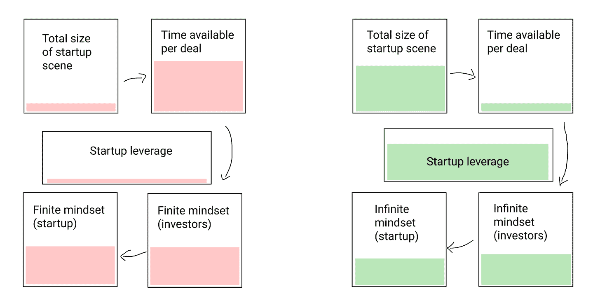

# 为什么加拿大的技术场景不起作用——欢迎来到丹麦

> 原文：<https://alexdanco.com/2021/01/11/why-the-canadian-tech-scene-doesnt-work/?utm_source=wanqu.co&utm_campaign=Wanqu+Daily&utm_medium=website>

多伦多不是下一个伟大的创业场所。滑铁卢、温哥华或加拿大的任何地方都不是。

很抱歉我不得不写下这些。我真的是。我希望它能起作用。但是，越来越多的人异口同声地宣称，“[多伦多的科技生态系统比北美其他任何地方都发展得更快](https://medium.com/@WebSummitHQ/is-toronto-the-new-silicon-valley-3b8047ce32e3)”或者“多伦多-滑铁卢走廊是[‘好人的硅谷’](https://www.technologyreview.com/2020/06/17/1003314/toronto-would-like-to-be-seen-as-the-nice-persons-silicon-valley-if-thats-not-too-much-trouble/)”老实说，这并没有准确描绘出我们在这里所建立的一切。

需要澄清的是:我并不是说加拿大没有创业公司的成功案例，也不是说这里没有优秀的天使投资人或风险投资人，或者没有事情进展顺利的个别例子。Shopify 显然做得很好，还有其他像 Lightspeed 这样的大成功故事，我们有一些非常好的计划将新的建设者带入加拿大，还有很多我钦佩的独立激励的创业公司。

这里肯定有很多东西。诚然，大公司正在这里增加技术岗位；这里的创业场景中确实有很多*活动*。但是我们没有一个真正可行的创业场景。还没有。你不能把多伦多理工学院和旧金山湾区放在一起，然后说，“这两个很相似；我们的只是更小。”加油；不是的。湾区的创业场景不断将难以置信的公司拉进现实。我们的…不会那样做。

加拿大的科技行业目前并不支持创业公司。这让他们窒息。我相信对你们中的一些人来说，坚持不这样做符合你们的职业利益，听着我尊重这一点，但我关心我们是否做对了，有人需要说出来，所以最好是我。

* * *

**天使**

没有简单的起点。创业场景是一个系统，有许多相互作用的部分:天使和 VC 的钱，其他创始人的同行集，工程人才，社会规范集；一切都取决于其他一切。但是我们必须选择一个地方开始讲述这个故事，我认为最好的切入点是谈论天使投资人。

我记得当我在 Social Capital 的时候，杰伊和我会去其他城市参观当地的创业公司和大学研究机构。每次，我们都会听到当地人重复同样的话:“我们在这里拥有如此多的科技生态系统的伟大成分。我们有来自当地大学系统的科学和硬核 R&D。我们有如此多的工程人才。而且有大量的投资资本可用。我们只是错过了一件事，那就是早期投资者。”

是啊。创业场景需要天使。如果没有快速流动的前机构资本来源，当你第一次资助一个项目时，很难实现冷启动。但你知道比没有天使投资人更糟糕的是什么吗？有*坏*天使投资人。

为了理解好天使和坏天使之间的区别，我认为快速了解一下詹姆斯·P·卡尔斯的《有限和无限游戏》会有所帮助。这本书介绍了一个简单但深刻的想法，即我们作为人参与的两种基本的“游戏”或多人游戏活动:

首先，*个有限的*游戏在*进行，目的是赢得*。无论何时，当你从事一项活动，它是确定的，有界限的，并且游戏可以通过所有参与者的共同协议来完成，那么这就是一个有限的游戏。人类的许多活动都是用有限的游戏隐喻来描述的:战争、政治、体育等等。当你在玩有限游戏时，你采取的每个行动都指向一个预先设定的目标，那就是赢。

相比之下，*无限*游戏玩*是为了继续玩*。你不会“赢得”无限的游戏；这些活动如学习、文化、社区或任何探索，既没有确定的规则，也没有预先约定的完成条件。玩游戏的目的是让新玩家加入游戏，这样他们也能玩。你永远不会“赢”，这出戏只会得到越来越多的回报。

善良的天使在玩一场无限的游戏。他们在为社区做贡献；不是为了赢得确定的东西，而是为了赢得继续参与现场的权利。他们在一个不断增长的社区中玩着不断提升自己地位的游戏，这是一件非常好的事情。他们通常能赚很多钱，这给局外人带来了令人困惑的建议:“天使投资赚钱的方法是*而不是*开始努力赚钱。”

坏天使在玩一个有限的游戏。他们试图赢得一些东西。

有两种坏天使。第一类人实际上是为了钱:他们希望在合理的时间内看到财务回报，并推动他们的创始人将他们的创业作为一种投资，就像房地产一样。第二种更微妙:他们是天使，他们这样做是为了满足感和地位，但只是在他们自己、*封闭的*同伴群体中。他们在争夺零和吹嘘的权利，而不是致力于发展社区。

坏天使大量浪费创始人的时间。他们总是要求一些东西；要么是损益表和商业计划，要么是明显是为了天使的社会利益而不是创始人的利益而建议介绍。坏天使非常关心里程碑。(稍后将详细介绍这一点。)你会在东海岸经常看到这种天使投资俱乐部或社团。加拿大也有。

好的天使对于天使和创始人之间的关系有着完全不同的态度。他们不是为了赢得什么；他们试图创造一些东西。这是一件好事，因为如果你正在创业，这正是你需要的心态。创业公司也是无限游戏。当你开始创业的时候，在接下来的十年(或任何合适的时间跨度)里，你不会“赢得”任何东西；也没有一套你同意的固定规则。*你玩是为了继续玩下去。*你的目标是成长，成长是永远做不完的。

当然，这不是经营企业的唯一方式。大多数企业可以被恰当地描述为有限博弈:你在追逐一个有限的、明确的机会；对胜利有一个清晰的概念。加拿大喜欢这类企业；可能是因为我们的经济是由银行和矿山组成的。

但是这些不是我们使用术语“创业公司”的创业公司。创业是对未来将与现在截然不同的押注，它们在上升过程中很有价值，因为它们实际上是未来成真的看涨期权。他们的创始人开始探索未来；它们的值是*不定*，不确定。有一天，它们可能会成为巨大的、资金充沛的企业；但不在你现在的地平线附近。你现在唯一的目标是成长、探索，并赢得继续成长和探索的权利。

因此，正如你可能猜到的，在好天使和坏天使之间，在有限思维和无限思维的创始人之间，存在着一种交叉催化的关系。出于显而易见的原因，每一对都相互吸引。但同样重要的是，这两种天使投资人相互排斥。如果你有足够数量的好天使，坏天使就会被排挤出去(他们将不再被邀请参与交易)。如果你有足够数量的坏天使，好天使就会离开(他们不会有任何乐趣，所以他们会去寻找不同的爱好。)

如果你有电子学或系统制图的背景，你会认出这个设置:这是一个拨动开关。它可以向任何一边断裂，但是一旦它在一边或另一边“凝固”，它将倾向于停留在那里。

那么好的天使是从哪里来的呢？好天使的可靠来源真的只有一个，那就是其他创业公司的大流动性事件。任何其他资金来源都有可能受到怀疑。但是，那些从创建或发展自己的创业公司中获得启动资金的天使们理解无限游戏，因为他们玩过这个游戏。他们想继续玩下去，因为他们喜欢，而天使投资就是这样做的。

社区中的大量退出对下一代创业公司有三个非常重要的反馈效应。首先，他们创造天使，用 FOMO 激励现有的天使(没有什么比放弃最终的独角兽更能激励你投资)。其次，他们以无限的心态激励创业公司，作为榜样。第三，他们为可能的事情设立了一个高标准，迫使社区始终考虑增长，并将所有这些知道无限、无限增长感觉的运营商放回生态系统中。

相比之下，在还没有很多大的退出的创业社区中，你不仅错过了一些好的因素，还创造了一个非常糟糕的因素，那就是全神贯注于*获得*流动性事件。这是极其危险的，加拿大的技术界已经深深陷入了这个陷阱。我们一会儿将回到这个想法。

**交易速度和创始人杠杆**

加拿大初创企业投资场景与旧金山湾区最本质的区别在于速度。这不是增量差异:它们在完全不同的时间尺度上运作。湾区的初创公司可以在 72 小时内从最初宣布他们的 pre-seed 轮到结束一轮超额认购的 SAFE notes。在加拿大，如果你能在 *3 个月*内完成一笔交易，你通常是幸运的。

交易完成的速度本身就很重要(当创始人花更多时间建设，花更少时间融资时，他们会做得更好)，它也是一个很好的指标，表明谁在创始人-投资者关系中有影响力。在旧金山湾区，很明显谁有影响力；是创始人。快速、干净地完成交易；如果一个投资者令人生厌或者不恰当地拖慢了进度，他们就不会被邀请参与交易。

这里有一个有趣的问题:在大的创业生态系统中，为什么交易比在小的创业生态系统中发生得更快，条件也更有利于创始人？很明显，在有更多投资者的生态系统中，他们必须相互竞争。但是也有更多的创业公司。为什么创业公司越多=创业公司的杠杆越大？

答案其实很简单:场景中的创业公司越多，实时发生的交易越多，你考虑任何一笔交易的时间就越少——不管有多少投资者；这完全是创业公司数量的函数。当你几乎没有时间去评估每一笔交易时，你只有时间去问:“什么是正确的。”这是一个基于创业公司条款的谈判。你只需要花时间问一下，*谁是创始人，他们发展得有多快，谁在投资。*换句话说，“你在玩无限游戏吗，你会得到跑道去做吗？”这些是应该问的问题。

相比之下，在交易较少的加拿大创业生态系统中，有更多的时间来评估任何一家创业公司或任何一笔交易。创业公司的世界是完全可知的，而且还有充足的时间，所以花在一笔交易上的时间将会增加，以填满可用的时间。如果时间充裕，交易尽职调查将很快进入确定的领域。你会找到时间问:“什么会出错。”而且你会发现很多！

这很糟糕，原因有二。这很糟糕，因为最优秀的创业公司，他们拥有最长的时间跨度，对这个世界最好奇，看起来毫无创意。相对于他们的雄心，他们肯定会取得最少的胜利，而可能出错的事情最多。矛盾的是，你也会选择增长率最快的公司，因为快速的增长率(作为一家初创公司，你可能拥有的最好的东西)并不是一个确定的成就。你总是可以从中找出漏洞，你总是可以理智地解释为什么增长率会停止。你对一个涡轮增压的增长率关注得越久，你就能找到越多的理由来解释为什么它不能持续下去。

相反，这很糟糕，因为初创公司将学会优化如何获得资金。因此，如果种子交易需要 3 个月，那么创始人将学会建立在那种显微镜下看起来不错的公司。这意味着他们将为玩确定性游戏进行优化，这样他们就可以展示不可辩驳的可定义的胜利；而不是他们应该关注的，也就是无限增长。(加拿大投资者喜欢说:“你们的增长令人印象深刻，但我们希望看到一些具体的里程碑。一旦你取得了这一明确的成就，我们就会资助你。”创业公司听。)

不幸的是，从长远来看，这不仅没有选择合适的创业公司，还削弱了创业公司自身的优势。这是一个恶性循环:越多的创业公司被选择进行确定性思维，最终就越证明风投的怀疑是正确的，而创业公司下次在谈判条款时的筹码就越少。

尽管创业生态系统的规模和交易速度看起来像连续的光谱，但实际上它们更像是在两种模式中的一种模式下运行:快速模式或慢速模式。在快速模式下，像 SF 这样的生态系统实际上优先选择那些继续做最令人印象深刻的事情的创业公司。在慢模式下，像加拿大这样的生态系统优先选择从事最确定、最可衡量的事情的初创公司。就像天使投资生态系统可以“切换”到两种模式中的任何一种，这同样适用于这里:它不是一个真正的连续体。一旦你进入这种或那种模式，强化循环就会接管。所以你属于哪一类真的很重要。

**估价和里程碑**

加拿大创业生态系统与湾区的另一个相当明显的区别是估值较低。实际上不仅仅是估值降低了。所有东西的价格都更低(包括工资，如果你在招聘入门级职位，这很有帮助，但当你试图招聘有经验的经理和高级人才时，这是一个巨大的问题)。但估值问题相当重要。

很长一段时间，加拿大的风险投资公司实际上被他们的有限合伙人禁止给出你在旧金山湾区看到的丰富的、膨胀的、“站不住脚的”估值。(你花了我们多少钱？在*那*估价？为了*这个？*)近年来，随着每个人都清楚地认识到，你实际上需要那些高估值来支持早期创业的临界密度，这种态度已经软化。但是“加拿大折扣”仍然是一个非常真实的事情。

相比之下，加拿大投资者喜欢提前计划退出。你不能责怪他们:他们理解这些大型流动性事件的价值，我们需要更多。他们知道我们错过了什么。很难夸大围绕加拿大科技的叙述有多令人担忧:“我们需要为生态系统找到更多出口。”

有一种加拿大初创企业的自卑情结在起作用，它迫使我们捍卫我们的成就:“看看我们正在做的一切！看看这些成就，看看我们的初创公司正在实现的所有这些里程碑！毫无疑问，这些里程碑累积起来就是成功。”我们需要一个故事，说我们正在路上，我们还没有这些出口，但我们正在努力；这变成了一种痴迷于里程碑的文化。

这种对里程碑的专注扼杀了创业公司。

为什么里程碑如此危险？因为当你定义明确的里程碑时，你就开始了有限的博弈:你定义并限制了创业的问题，并在里程碑完成时无意中创造了一个“赢/输”的条件。就像以前一样，当你开始考虑里程碑时，你不再问，“什么可以正确”，因为你已经定义了“正确”的界限。一旦你开始考虑里程碑，你就进入了“什么会出错”的思维模式，你实际上打破了让 VC 工作的特殊魔力。

风险投资是一项金融发明，它已经完善到可以在不同的未来购买看涨期权，而不是迄今为止明确实现的里程碑。创业的意义在于通过 J 曲线，对未来的信念进行全押。当你处于 J 曲线时，你的“里程碑”实际上无法用积极的经济观点来定义；当然不是相对于筹集的资金。

[我在](https://alexdanco.com/2020/02/28/vcs-should-play-bridge/)之前写过“风投们最大的伎俩是称之为‘估值’”，以及风投融资轮次的数字实际上并没有对正式计算的*估值进行定价*，而是对下一轮融资的折扣进行定价。成功地资助一家风投支持的公司，一直到 C 轮或其他阶段(此时，类似于实际估值的事情可能会发生)，本质上是一种“贴现上的贴现”:*我会支付这 600 万美元的种子前估值，不是因为这里有 600 万美元的有形价值，而是因为它是下一轮(20)、下一轮(50)和下一轮(180)的贴现。* VC 融资是一种被控制的泡沫。

这种方法，听起来像递归一样，是一种合法的融资创新:它让初创公司更深入地挖掘 J 曲线，反复为他们的业务提供“什么可能是正确的”的可能性。但是为了让它发挥作用，*你永远不能在任何时候正式评估已经建立的东西。如果你这样做，你戳破了泡沫。(409A 的估值是个例外，你*希望*越低越好。当然，这种巧妙的手法非常棒。当我们需要估值高的时候，它就是高的，令人向往的；相反，当我们需要估值低的时候，它就是低的，字面上的。)*

我们加拿大人对里程碑的痴迷，不知不觉地把每一个创业融资事件都变成了类似 409A 估值的东西。这和你想做的事完全相反！这是为什么加拿大创业公司的估值普遍低于美国创业公司的很大一部分原因；每当我们定义一个“里程碑”，我们就戳破了估值泡沫，然后不得不重新开始。然而，投资者群体不断被迫这样做(*尤其是早期的*；我们今天称之为 pre-seed 和 seed)，因为需要表明我们正在赢得有限的、可定义的、“可赢的”游戏。

与我们对里程碑的热爱完全一致，加拿大喜欢任何有结构的东西:加速器、孵化器、导师项目；任何看起来像“创业证书”的东西，我们都看不够。我们完全沉迷于试图将成长型创业公司的问题分解成小块，深思熟虑地定义这些小块是什么，通过它们运营一批有前途的创业公司，然后在似乎不起作用时困惑地走出来。

**非分散投资和豪华建筑**

希望现在你能看到这张图片:加拿大的创业生态系统与湾区实际运行的生态系统之间的差异不是程度上的增量差异。它们是以完全相反的模式运行的两个系统:一个运行迅速，控制机会，向前滚动估值，并为无限游戏思维的创始人进行了优化。另一种运行缓慢，排除机会，感觉有必要“捍卫”估值(从而使它们崩溃到它们字面上的里程碑价值)，并为固定、有限的游戏进行优化。

不出所料，第二个不起作用。但无论是在地方还是在国家层面，让它发挥作用都是我们的首要任务。所以我们做了显而易见的事情:我们加钱。

你可能听说过加拿大的一个政府项目叫做 SR&ED credits(“科学研究和实验发展”)，这是一个政府退税项目，旨在鼓励加拿大企业的 R&D 支出。如果你是一家老牌加拿大科技公司，比如说育碧，这个项目完全有帮助，而且据我所知，这是政府补贴技术人员就业的一个非常好的方式。

但是 SR&ED 学分对创业公司也有很大的吸引力。这是抵消你的 R&D 成本的“免费资金”，谁不想要呢？因此，加拿大有一个完整的家庭手工业，将这些钱交到创业公司手中，帮助他们最大限度地利用 SR&ED 作为技术工作的非稀释性资金。

不幸的是，SR&ED 实际上并不适合初创公司。这对他们来说是非常不健康的。

老实说，SR&ED 学分的问题并不在于它们本身，而是在于你必须说明你在用它们做什么。这似乎是一个非常良性的要求；老实说，这是非常公平的，政府发放资金的项目应该被允许询问这些钱的用途。但在实践中，一旦你拿了这笔钱，开始填写时间表，记录你的工程师们是如何度过他们的一天的，并写下你正在创造什么样的研发价值的总结，你就走上了摧毁你的创业公司和扼杀它的道路。

当创始人认为 SR&ED 是“免费的钱”时，问题就出现了。*不自由*。像任何资本一样，它也有资本成本。但是，它不是耗费你的资产，而是耗费你的时间、你的注意力，最重要的是，它耗费了你永远无法收回的东西，那就是你不确定的好奇心。

SR&ED 迫使你去玩有限游戏，因为它迫使你清楚地说明你把钱花在了什么地方。所以你必须证明，至少，你正在解决什么问题，你正在采取什么具体步骤来解决它。你进入了*问题定义的世界，*在这里，建立你的创业公司变成了严肃的工作，有正式的时间表和政府表格。

一旦你拿到了战略与经济研究的资金，你的创业中一些有意义的部分就变成了政府的工作项目。一旦你的创业项目成为政府项目，我可以非常肯定地告诉你接下来会发生什么。通过播种一个充满 T2 资助的初创企业的生态系统，加拿大政府无意中耗尽了我们初创企业的自发性和好奇心。很难从中恢复过来。

一旦你理解了 SR&ED 贷款的问题，你就可以通过类比很容易地理解加拿大政府为支持初创企业所做的几乎所有其他事情有什么问题。我们花费数亿美元在多伦多市中心建造壮观的建筑，以便“为科技产业创造空间”，然后想知道为什么这些初创公司突然痴迷于做所有错误的事情。

与此同时，我们沉迷于导师项目和其他类型的“非稀释性帮助”，没有意识到任何事情都是有成本的，包括这些关系——创始人可能付出的最大成本就是放弃一个不确定的轨迹。我是说，猜猜这些导师是谁？他们要么是建立了成功的加拿大企业的人(有限游戏！)或者，技术行业的人也可以报名参加正式的导师项目，而不是成为天使投资人。这对创业公司来说是极其昂贵的；不仅因为这些关系消耗了创始人的时间，还因为它们有益地强加了“成人监督”，剥夺了创始人让他们的公司有价值的非常不确定性。

但因为这些成本不容易说清楚，但好处可以很容易地列表和展示，我们就挤进去——当创业场景似乎没有自发地自我组织成类似湾区的东西时，我们得出结论，“嗯，创业很难，我们需要更多地支持他们。让我们给他们建更多的房子，给他们更多的资助！”

* * *

**风土人情**

所以，让我们回顾一下我们在这里谈论的所有事情，并理解加拿大的初创企业是如何陷入错误的做事方式的。

像 SR&ED 这样的项目，像 MaRS 这样的机构，以及其他善意但灾难性的支持创业生态系统的政府举措，无情地向创业场景注入资金。这笔钱被宣传为“免费”或“非稀释性”的，但实际上这是你能想象到的最昂贵的一种钱:它分散注意力，它寻求正当理由，它扼杀创造力，它把你的创业变成政府工作项目。

一旦你的创业成为政府的工作项目，即使你假装不是这样，你也永远被迫用你的时间和资源玩固定的、有限的游戏。你必须定义你正在解决什么问题，以及你正在做什么来解决它。你必须证明创造的价值。

你花*任何*时间做这件事的那一分钟，以及你创业的任何部分，随着时间的推移，它会成为越来越多创业的工作成果。一旦你开始玩固定的、明确的游戏，那就成了你所做的一切。你会成为一家*里程碑导向的*公司，而不是一家成长型公司。而且有大量的非稀释性资金和政府支持来支持和奖励这些里程碑，所以你可以玩这个游戏一段时间。你的其他创始人也会如此，这很正常。

但是，通过成为一家以里程碑为导向的公司，你已经不知不觉地破坏了你实际将风险投资资金投入工作的能力，就像加州的初创公司一样。甚至在你接受风险投资之前，通过成为一家以里程碑为导向的公司，并学习如何说话和行动，以突出这些里程碑并从中筹集资金，你会优先选择坏天使，让好天使失望。善良的天使根本不会有任何乐趣:他们不会找到他们想要玩的无限游戏，所以他们根本不会玩。因此，早期融资环境被错误类型的资金饱和了:这或许是好意，但对初创公司来说是有害的。因此，初创公司一开始步履蹒跚，可能永远不会恢复。

这让循环继续下去:这些创业公司未能充分成熟成为独角兽(你怎么能责怪它们)加剧了投资者的不安全感和对“为生态系统找到一些出口”的痴迷，重申了他们的经验，即这些投资从未产生任何实际回报，并重申了他们所有说不而不是说是的决定。生态系统被它的小思维所定义和限制。

然后，想象你想开始创业。你会在这里做吗？或者你会坐飞机去加州？

不幸的是，这个决定影响了一代又一代的创业公司。每 10 个新创始人中，2 个最有创造力的会立即离开(因为这是正确的决定)，剩下 8 个。然后，他们在这种固定思维、以里程碑为导向的环境中开始并发展他们的创业公司，并成为下 10 位创始人从滑铁卢或其他地方毕业后步入的环境。当*那批*中两位特别有创造力的创始人四处看看时，是的，他们可能也会去加利福尼亚；又一次，留下了另外 8 个。

写这篇文章有点令人失望。写我们自己陷入的这个系统性陷阱并不有趣；尤其是因为在加拿大有那么多个人很好的人，创业公司和公司都在尽最大努力做好工作。这是制度问题。

我希望加拿大的读者会意识到我们面临的问题不是什么都不缺。我们的创业场景的问题不是*缺乏*资金、创业公司、投资者、喧嚣、优秀的大学、技术人才或创造力。我们的问题实际上是积极坏事的*存在:我们所有的非稀释性(但极其昂贵！)创新学分，孵化器和创业项目的存在，里程碑式思维的偶然成本。如果我们想在加拿大建立一个真正的创业社区，我们需要放下那些拐杖，选择无限游戏。*

这也是为什么我认为加拿大任何一个城市都有潜力发展湾区级别的创业场景(当然，规模较小，但确实是真实的)，那显然是蒙特利尔。在加拿大的大城市中，蒙特利尔是唯一一个天然拥有无限游戏心态的城市。(但它*真的真的*有。蒙特利尔是一个特别的地方。)如果蒙特利尔不在魁北克，这将是一个不可阻挡的创业场景。

不管怎样，我现在就结束这个话题，但是我希望我们最终能把这个问题解决好。在科技领域之外的许多其他方面，加拿大都是一个特殊的地方。我们在加速多元文化主义的实验中取得了一些绝对不可思议的成就；在我看来，我们是世界上最美好、最自由的居住地之一；加拿大很棒，这里有很多值得骄傲的东西。但是加拿大的技术，特别是，可以做得更好。我希望如此！

* * *

*喜欢这个帖子？[每周把它收进你的收件箱](http://danco.substack.com/)注册我的每周简讯，每周日有 20，000 人欣赏。*

### 像这样:

像 装...

### *相关*

