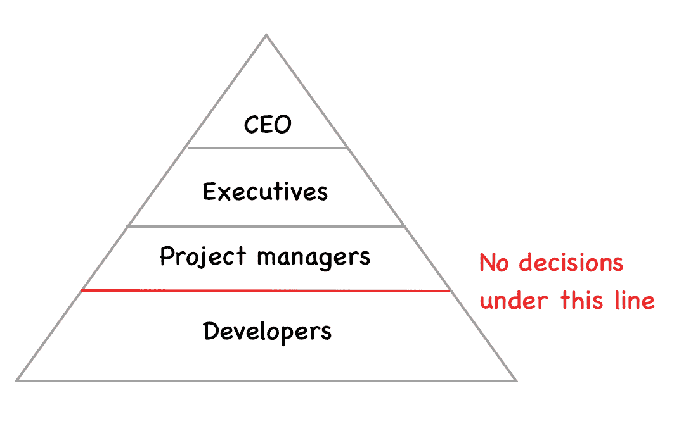
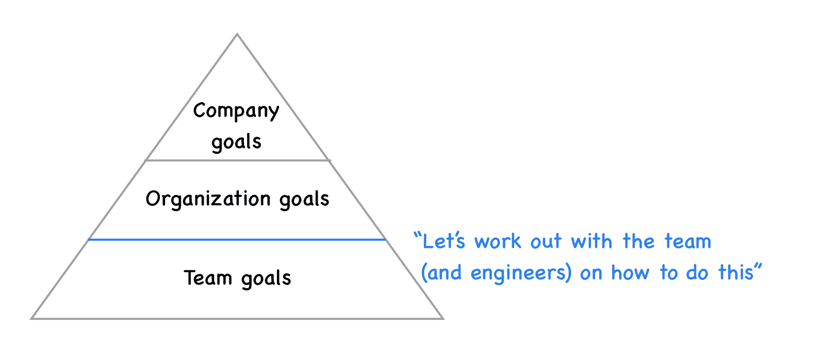
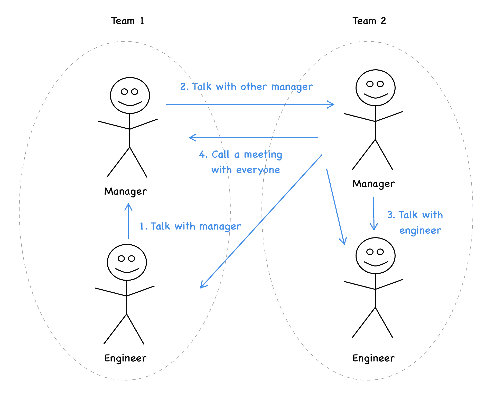
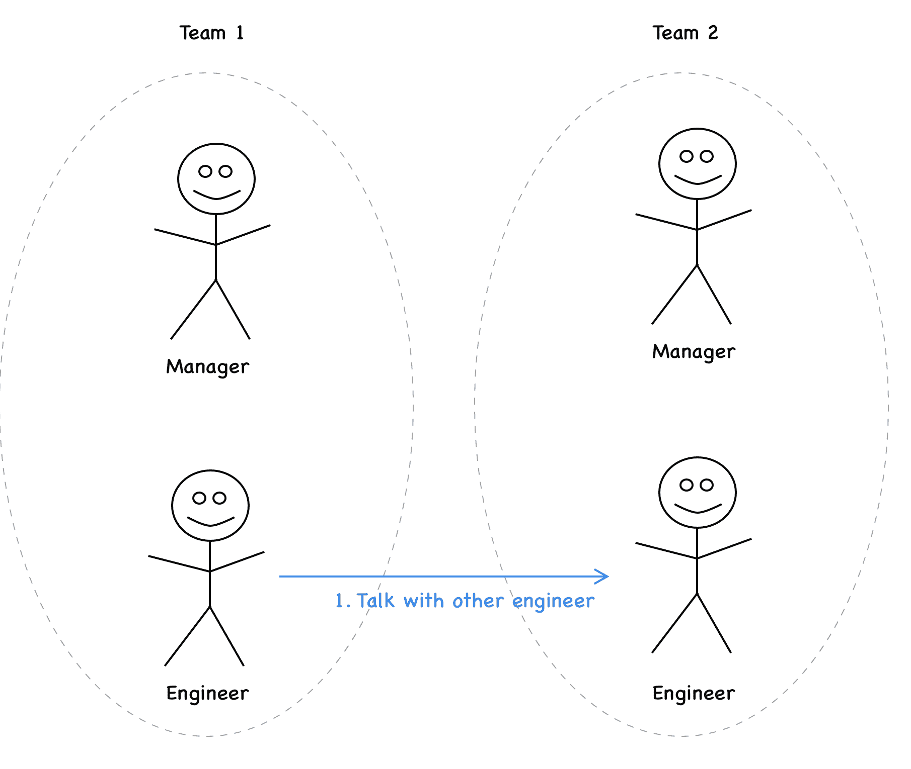
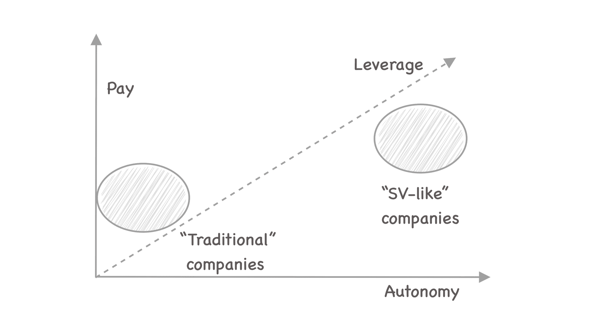
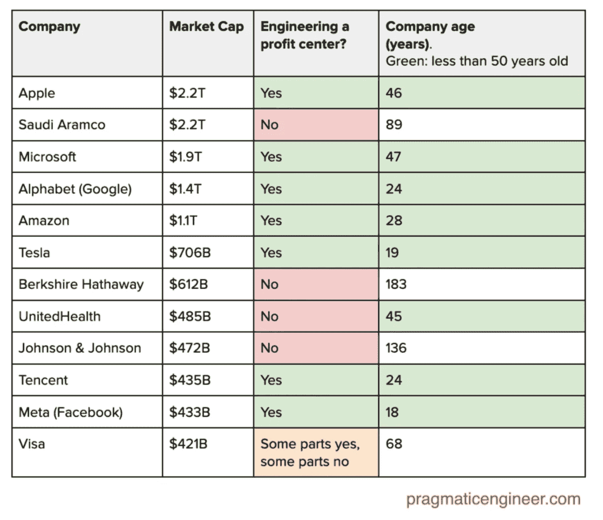

# 硅谷从软件工程师那里“得到”了传统公司所没有的东西——务实的工程师

> 原文：<https://blog.pragmaticengineer.com/what-silicon-valley-gets-right-on-software-engineers/?utm_source=wanqu.co&utm_campaign=Wanqu+Daily&utm_medium=website>

我在各种科技公司工作过:从“传统”商店和咨询公司，通过投资银行，到高增长的科技公司。我也和在创业公司、银行、汽车、大型科技公司和更多“传统”公司工作的软件工程师谈过。这种组合包含了硅谷公司和总部不在该地区的公司的健康样本。

**我注意到，硅谷公司总是“得到”一些他们的传统同行在实践中无法理解或实施的东西**——尤其是在欧洲。这些实践导致了公司层面更快的创新，工程师更好的职业发展，以及更好的“利用率”。反过来，硅谷公司也可以(也确实！)支付更高的工资，他们从同一个人身上获得更多的价值。

在本文中，我将使用术语**“类似硅谷的公司”**来指代现代公司，这些公司通过每次软件工程招聘创造高杠杆，并且传统上将总部设在硅谷——尽管许多较新的公司不再从那里起步。他们是那种在每个工程师的工作产出上可以与脸书或谷歌相媲美的公司。他们使用类似的方法，并经常能从其他“类似硅谷”的公司吸引人才。

以下是这些公司比许多其他公司“得到”更多的关键东西。

## 1.软件工程师的自主权

在“传统的”公司中，开发人员得到分配给他们的工作项目——最常见的是 JIRA 入场券。这些标签由产品经理或项目经理审查，他们有完成工作的最关键的细节。人们期待他们这样做。除非是为了澄清罚单中的某个细节，否则几乎不需要提问。

加入一家“类似 SV”的公司，你会很少看到这种情况。有项目，也有项目经理和工程经理。但是大多数情况下，工程师是被期待的(也是被鼓励的！)去搞清楚工作的“如何”，包括做出更大的决策。在一些地方，[每个项目会有一个工程师来领导它](https://blog.pragmaticengineer.com/how-to-lead-a-project-in-software-development/)，他帮助分解工作。在其他地方，工程经理或高级工程师可以做这项工作。不管怎么做，所有的工程师都被激励去关注大局，去突破自我，去解决他们看到的任何问题。

工程师采取主动是“类似 SV”的公司所庆祝的。经常可以看到工程师建议的服务和功能，或者让团队花时间偿还团队成员倡导的技术债务。管理者很少告诉工程师具体要做什么，将他们的工作分成小块，或者对他们进行微观管理。人们自我管理。

传统公司的开发人员的期望是完成分配的工作。在类似 SV 的公司里，它是为了解决业务上的问题。这是一个*巨大的*差异。它影响着任何工程师的日常生活。

在传统的公司，开发人员做他们被告知要做的事情的观念经常以等级制度的建立而告终。我曾和一家银行的人交谈过，这家银行有 6 个项目管理级别。开发商排在最后两位。允许从第三级开始做决定。基本上，做这项工作的人没有发言权。我还需要补充说这家银行正在为他们的软件部门如何工作(不工作)而努力吗？

A hierarchical view of the world. Some traditional companies still work like this.

相比之下，在一些地方，工程师被认为比任何人都更有能力解决实际问题。领导知道，与他们分享所有相关的业务环境，并给予执行的空间，这符合企业的最佳利益。

Passing context down and giving autonomy to make decisions is how efficient organizations pull ahead.

## 2.好奇的问题解决者，而不是无脑的资源

传统公司倾向于认为一个工程师花在编码上的时间是 8 小时。任何不在电脑前，不做编码的时间，通常都被认为是浪费。他们用高成本来证明这一点。我听过有人这样描述其中的道理:

> 软件工程师的工资比许多其他职能部门都高。我们需要相应地利用它们。我们不能让他们空手而归。

“类似 SV”的公司认为软件工程师是最适合解决公司问题的人。他们雇佣员工不仅是为了技术技能，也是为了沟通和解决问题的能力。他们的想法更像这样:

> 软件工程师是我们公司收入最高的人之一。这是因为他们可以通过编码和解决问题带来一些最高的杠杆作用。我们希望让他们了解业务，这样他们在做“正常”工作的同时，也能找到对业务更有影响力的机会。

在实践中，一个积极的工程师很容易产生数倍于“工厂工人”的影响力，而“工厂工人”只是被告知该做什么。在最坏的情况下，当工作规范清晰正确时，两个人的输出是一样的。然而，被鼓励去解决问题的工程师在开始工作之前，通常会停下来思考，找出产生更大影响的机会。以下是我在“类似服务提供商”的公司问一位工程师他们是否能做 X 后的几次谈话:

*   “我做了一些调查，虽然我们可以做 X，但如果我们可以通过这种不会对业务影响产生影响的功能来缩小范围，**我们可以不做任何代码更改**，只更改几个配置文件。”
*   "**我担心我们是否能推进这个项目，我认为我们应该暂停它**。我查看了我们的竞争对手正在做的事情，其中一家推出了类似的功能，但在监管机构对他们进行调查后，又撤销了它。我们是否与法律团队确认过我们是否可以发货？”
*   “我看了看我们的待办事项，Y 项目确实很相似。**如果我们将项目 X 和项目 Y 结合起来，我们可以用很少的开销运送两件东西**。
*   “我们现在可以在传统基础架构上构建这个项目，但之后我们必须迁移到新的基础架构上，这将在一个月内完成。我们能否将项目推迟一个月，直到新的基础设施准备就绪，以避免重复劳动？如果在一个月内没有强有力的商业理由推出，我真的建议我们这样做”

在一个鼓励解决问题和遵循方向的环境中，可以做出更好的决策。

## 3.内部数据、代码和文档透明

透明度在 SV 公司很重要。虽然也有例外——苹果或 Palantir 应该很注意给工程师提供尽可能少的信息——但我观察到大多数“类似 SV”的公司尽可能多地分享信息。他们这样做的方式符合 GDPR、PII 和其他适用于他们的法规。

员工——不仅仅是工程师——经常可以访问实时业务指标和数据源，以编写他们自己的查询和创建定制报告。在 Skyscanner，我们每天都会收到关于每日收入明细的每日汇总电子邮件。在优步，每周会有一份类似指标的增长简报。

随着公司的发展和上市，这些信息会发生整合。尽管如此，工程师仍然可以访问他们组织的业务数据，这些数据有助于指导他们的决策。在传统公司，这种情况并不存在。工程师得到了规范，更高层的人会知道为什么事情被决定——至少，这是想法。

## 4.对业务和业务指标的了解

在 SV 公司，每个团队成员都应该理解他们的工作影响了业务的哪个部分，以及如何影响。团队的目标很少只是发布一个功能:通过发布功能 1 减少 2%的客户流失，或者通过发布项目 x 增加预计每年 1000 万美元的收入。

我们鼓励 SV 工程师与业务的其他部分进行互动并在同事之外建立关系。在实践中，更多的高级工程师通常会这样做:从与产品经理进行一对一会谈，到参加客户研究会议。但是我看到新加入的工程师直接与商业利益相关者一起工作，没有人眨一下眼睛。

**相比之下，传统公司经常让开发者无法与业务的其他部分互动**。然而，这并不是它的呈现方式。他们会说“我们想保护我们的工程师不受干扰”。但是我听说过这样的故事，一个工程经理想要邀请团队成员参加产品展示，而产品经理拒绝了这个想法。“我们需要他们工作，我们不能分心。”是一个常见的借口。

当传统公司的工程师在团队之外建立关系时，他们经常会被告知“不够专注”、“浪费时间”或做“不关他们的事”。这种“不寻常”的活动通常会在他们的绩效评估中被记为负面。

对我来说这听起来很疯狂，公司会带走一些他们最好的问题解决者，并强迫他们进入“你只需要写代码”的盒子，但这正在发生。同样是那些试图用与代码行相关的指标来衡量工程生产率的公司，他们会奇怪[为什么他们的工程师不是以产品为中心的或者不了解产品](https://blog.pragmaticengineer.com/the-product-minded-engineer/)。

## 5.工程师对工程师的三角通信

当你是一名工程师，并对另一个团队如何做某事有疑问时，你在传统公司和“类似 SV”的公司会有不同的处理方式。

传统公司会鼓励层级沟通。这既是为了“屏蔽”工程师，也是因为这些地方的管理者更愿意做信息枢纽，不放弃对这部分的控制。下面是向另一个团队提出的问题:

Communicating in a "traditional" / hierarchical organization

“类似 SV”的公司鼓励工程师之间的交流，省去中间人。这在任何情况下都更快。在另一个团队的工程师无法提供帮助的情况下，这一过程可以退回到“传统的”经理帮助促进讨论的模式:

Communicating done (far more) efficiently

## 6.投资于不那么令人沮丧的开发者体验

2020 年的发展可能会令人沮丧。不是因为写代码——那是容易的部分！——而是周围的事物。设置相关性。部署到生产或测试环境。CI/CD。监控和警报。当你在一个只有几个人的团队中时，这些都不是什么大不了的事情。尽管如此，它们还是会时不时地出现。

然而，随着公司的发展，开发人员的体验变得更加令人沮丧。它从更小的事情开始，比如构建时间变慢，依赖性增加，或者需要跨服务进行的更改。它继续确定哪个团队拥有哪个服务，小型迁移会影响许多团队，一直到重新定义整个工程的架构。

框架和工具变化很快，工具很少能跟上。关心专注于解决问题的工程师的公司迅速建立了各种基础设施、平台和 SRE 团队，这些团队减少了开发人员的流失。

虽然雇佣只关注其他软件工程师更快工作的软件工程师听起来可能有违直觉:在许多地方，事实并非如此。这是一个巨大的回报，可以帮助这些公司更快地发展，开发者也更开心。

(这也是我非常感兴趣的一个领域，我正在验证一些创业想法——如果你对这个领域有想法，打电话给我)。

## 7.更高的杠杆率->更高的{自主权、薪酬}

任何类似 SV 的公司想要在工程师薪酬方面竞争，都需要创造高杠杆，让这些工程师带来的价值超过他们的薪酬。这种杠杆作用既可以扩大规模，也可以促进业务增长。减少浪费在不必要的沟通和工具上的时间都增加了这种优势。给工程师足够的自主权来(过度)为业务做出贡献是你保持这种优势的方法。

今天，谷歌、脸书和其他老牌公司支付高薪的原因是规模的杠杆作用。其中一家公司的工程师通常会开发出供数百万客户使用的功能。这种杠杆作用和增值是有回报的。

Higher autonomy --> higher leverage --> higher value created --> higher pay (all while the company still makes a profit)

类似 SV 的创业公司所做的是利用软件工程师来发展业务。这就是 Fog Creek software [的一名软件工程师如何为 ad classfields](https://www.inc.com/magazine/20090101/how-hard-could-it-be-thanks-or-no-thanks.html) 实现了一个价值百万美元的想法。这就是一些工程师和设计师如何推动[在脸书](https://www.newstatesman.com/science-tech/social-media/2015/10/cursed-project-short-history-facebook-button)建造 Like 按钮的。这个按钮的商业影响是以亿计的:允许脸书(重新)定向广告，并“跟踪”脸书网站之外的用户。

如果上面提到的任何人在一个“传统”的环境中工作，他们的想法会一直停留在:想法。“类似 SV”的创业公司激励工程师提出商业想法，并在他们做的时候实现它们。每个人都因此受益:有想法的人和企业。

充分利用工程师的公司将毫无困难地支付接近或高于市场最高水平的薪酬。Basecamp [是非“大技术”公司的一个很好的例子](https://m.signalvnoise.com/how-we-pay-people-at-basecamp/),它很好地利用了工程师，这意味着他们也可以支付全球范围内 SF 市场最高的基本工资，同时保持盈利。

## 技术是利润中心，而不是成本中心

看待“类 SV”公司运营方式差异的另一种方式是，它们如何将技术视为利润中心，而不是成本中心。看看截至 2022 年 7 月全球最有价值的 12 家公司，有一些趋势是显而易见的:

The world’s 12 most valuable companies as of July 2022, and whether software engineering is a profit center. Correlation or causation? I investigated [in this article](https://newsletter.pragmaticengineer.com/p/profit-centers-cost-centers).

在我的文章[科技公司的利润中心与成本中心](https://newsletter.pragmaticengineer.com/p/profit-centers-cost-centers)中，阅读更多关于我是否认为将科技视为利润中心与高于正常增长之间存在关联或因果关系的信息。

## 最大的总体差异

不同类型的公司在处理与工程师的关系上有很多不同之处。不过，最大的问题是这个。“类似 SV”的公司认为工程师是价值的创造者和创造性的问题解决者。传统公司认为他们是工厂工人。

这种思维上的分歧导致有远见的公司既能给工程师更高的薪酬，又能给他们更多的自主权。一个工厂工人有一个非常明确的附加值，你可以计划。另一方面，一个创造性的问题解决者，如果运用得当，可以带来 10 倍的价值。付给他们更多的薪水，给他们更多的自由是有意义的，因为这是你让他们贡献更多商业价值的方式。

一旦你在一个类似 SV 的环境中工作，你也很难回到“传统”的工作场所，在那里每个人都有自己明确的角色，当你走出它时，你会感到惊讶。

作为一名软件工程师，令人愉快的工作场所是你是一名问题解决者，而不是一名工厂工人。今天的你是哪一个？

*本文翻译:[CSDN 上的中国人](https://blog.csdn.net/csdnnews/article/details/112914520)T3】*

* * *

### 特色务实的工程师工作

1.  Renterra 的创始工程师。**$ 14-18 万** +股本。远程(全局)。
2.  Akamai Technologies 的高级首席软件工程师 Kubernetes 。远程(美国)。
3.  DevZero 的软件工程师。 **$150-175K** 。华盛顿西雅图。
4.  Founda Health 的高级后端开发人员。荷兰阿姆斯特丹。
5.  Vital 的高级后端工程师。**$ 7-14 万** +股本。远程。
6.  Pento 的主要后端引擎。 **120-135K** 。远程。
7.  [在 Playht 创办高级 Fullstack 工程师(JavaScript)](https://pragmatic-engineer.pallet.com/jobs/290b9214-cfa0-4df6-84d6-b6a4cfd38075) 。**$ 15-20 万** +股本。旧金山或偏远地区。
8.  Qualified.com 的软件工程师。旧金山或偏远地区。
9.  Ometria 的基础设施团队负责人。 **90-150K** 。英国或葡萄牙。
10.  [BetterUp 的全栈工程师、视频&消息](https://pragmatic-engineer.pallet.com/jobs/09f54a5f-e330-4855-87d3-07b6a9e0bfa8)。远程(美国)。
11.  BetterUp 的全栈工程师。远程(美国)。

*上述工作在[实用工程师考试](https://blog.pragmaticengineer.com/pragmatic-engineer-test/)中得分至少为 10/12。浏览更多具有优秀工程文化的高级工程师和工程领导职位，或者在[务实工程师工作论坛](https://pallet.xyz/list/pragmatic-engineer/jobs)上添加您自己的职位，并申请加入[务实工程师人才集体](https://pragmatic-engineer.pallet.com/talent)。*

想从经过审查的科技公司获得有趣的机会吗？报名参加[务实的工程师人才集体](https://pragmatic-engineer.pallet.com/talent)，获得丰厚的机会——类似下面这些，没有任何义务。你可以是公开的，也可以是匿名的，我会整理公司和个人的名单。

你是在招聘高级+工程师还是工程经理？申请加入[务实工程师人才集体](https://pragmatic-engineer.pallet.com/talent)接触世界级高级及以上工程师和工程经理/总监。每月两次接受审查，来自软件工程师(全栈、后端、移动、前端、数据、ML)和目前在大型科技公司、高增长初创公司和具有强大工程文化的地方工作的经理。[申请此处](https://pragmatic-engineer.pallet.com/talent)。

