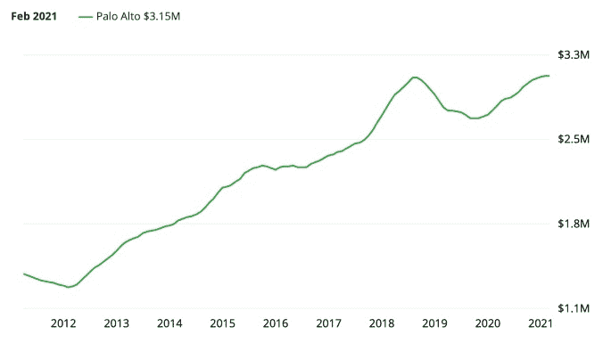

# 硅谷房价、股价和比特币(2021) |心理史学

> 原文：<https://adamnash.blog/2021/03/19/silicon-valley-home-prices-stock-prices-bitcoin-2021/?utm_source=wanqu.co&utm_campaign=Wanqu+Daily&utm_medium=website>

[T2】](https://psychohistory.files.wordpress.com/2017/06/welcometopaloalto4.jpg)

不到四年前，我写了一篇关于硅谷房价及其与股价和比特币关系的文章。这是我 2017 年以来博客上最受欢迎的帖子之一。

最初的版本将帕洛阿尔托的房价与硅谷几家最大的科技公司进行了比较，添加比特币只是为了好玩。鉴于过去几年科技股价格和比特币令人难以置信的上涨，更新最初帖子中的数据似乎是值得的。

谈论硅谷的房价总是一个敏感的话题，因为缺乏负担得起的住房仍然是一个既困难又带有浓厚政治色彩的话题。作为一个在这里长大的人，似乎显而易见的是，主要问题是当地市议会强烈抵制批准满足不断增长的需求的住房单元建设。

这篇文章不是关于这个问题的。

相反，这是从另一个角度看待房地产市场的尝试。大多数住房成本的财务估计倾向于将房价与收入进行比较，这是有道理的，因为对于大多数地方的大多数人来说，房屋的可负担性与他们可以为该房屋获得的抵押贷款规模直接相关。一般来说，买房是看收入，而不是资产。

当然，在硅谷，收入看起来有点不同，因为硅谷的许多人都在科技公司工作，大多数科技公司都以股权补偿员工。

## 帕洛阿尔托房价

我选择帕洛阿尔托作为硅谷房价的代表，因为它在历史上是硅谷科技公司的“归零地”，而且它距离所有大型科技巨头(苹果、谷歌、脸书)都相对较近。

最初的帖子是在 2012 年 6 月开始收集这些数据的，因为这大约是脸书上市的时间。在这篇文章中，我将数据集一直延伸到 2021 年 3 月。

所有房价均来源于 Zillow。所有股票价格均来自雅虎财经，反映了股息调整后的价格。所有比特币的价格都来自 Investing.com。

这是 Zillow 今天在帕洛阿尔托的样子: 

如你所见，2012 年 6 月，帕洛阿尔托的平均房价为 144 万美元。大约五年后，也就是 2017 年 6 月，平均价格上涨了 84.6%，达到 255 万美元。现在，在 2021 年 3 月，这个价格已经**上涨了 117.9%，达到 315 万美元**。

无论是从价格还是工资的变化来看，这肯定比任何正常的通胀指标都要快得多。但是，如果我们将这些涨幅与硅谷一些最大的科技公司的股票进行比较，会发生什么呢？

## 苹果公司(AAPL)

按照市值(截至 2021 年 3 月 18 日为 2.023 万亿美元)和利润第二高的(2020 年为 552.56 亿美元)来衡量，苹果是目前世界上最有价值的上市公司。得益于其出色的财务表现，苹果股票(AAPL)自 2012 年 6 月以来大幅上涨，从每股 18.79 美元(拆股调整后)上涨至 2021 年 3 月的 124.76 美元。那就是**超过 565.8%的涨幅。**

哇哦。😳

让我们来看看帕洛阿尔托以美元衡量的房价，然后再来比较一下以 AAPL 美元标价的房价。

[T2】](https://psychohistory.files.wordpress.com/2021/03/aapl-palo-alto-chart.jpg)

这张图表讲述了一个与 2017 年截然不同的故事。

从 2012 年 6 月到 2017 年 6 月的五年中，苹果股票波动很大，但在整个时间段内，几乎完全符合帕洛阿尔托房价的增长。然而，自 2017 年以来的上涨令人难以置信。

经过拆分调整后，购买一套帕洛阿尔托的普通住宅需要 76，839 股$AAPL 股票。到 2021 年 3 月，这一数字下降到只有 25，216 股。

这并不奇怪，因为帕洛阿尔托房价同期仅上涨了 117.9%，而苹果股价上涨了 564%。但从实际角度来看，这意味着，对于将一种资产(苹果股票)转换为另一种资产(帕洛阿尔托住宅)的人来说，购买普通住房变得更容易了，而不是更难了。

## Google(谷歌)

谷歌讲述了一个与 2021 年的苹果相似的故事，尽管在最初的帖子中并非如此。自 2017 年以来，苹果股票的表现明显优于谷歌，与 2012 年 6 月相比，它们的价格涨幅几乎相同。(就其本身而言，考虑到两家公司的相对年龄，这是一个令人惊讶的事实)。

截至 2021 年 3 月，谷歌的市值为 1.37 万亿美元，远远低于苹果。然而，自 2012 年 6 月以来，他们已经看到**的价格上涨了 557.3%** ，从拆分后的每股 316.80 美元上涨到 2021 年 3 月的每股 2082.22 美元。

让我们看看帕洛阿尔托的房价，以美元衡量，然后让我们看看他们的股票价格，以美元谷歌。

[T2】](https://psychohistory.files.wordpress.com/2021/03/googl-palo-alto-chart.jpg)

如果你将这张图表与苹果的相比，它讲述了一个不同的故事，但有着相似的结局。谷歌的股票显然比帕洛阿尔托房产更不稳定，但在过去十年里，它们一直在升值。

在 2012 年 6 月，购买一套帕洛阿尔托的普通住房需要 4557 股谷歌股票。到 2021 年 3 月，这一数字下降到只有 1511 股。

因此，尽管以任何历史标准衡量，帕洛阿尔托房价的涨幅都是巨大的，但在过去十年里，对于持有谷歌股票的人来说，帕洛阿尔托的房价变得更便宜了，而对于持有美元的人来说，价格变得更贵了。

## 脸书(FB)

大型科技巨头中最年轻的脸书，已经拥有世界上最大的市值之一。截至今天，脸书的市值为 7934 亿美元。自 2012 年 6 月以来，脸书股票**已经令人难以置信地上涨了 1208.2%** ，从每股 21.71 美元涨到了 2021 年 3 月的 284.01 美元。

[T2】](https://psychohistory.files.wordpress.com/2021/03/fb-palo-alto-chart.jpg)

至此，你知道这个故事如何发展了。随着超过 1200%的增长，脸书股票在 2021 年比 2012 年走得更远，即使是在帕洛阿尔托房价令人生畏的情况下。

在 2012 年 6 月，购买帕洛阿尔托的普通住宅需要 66500 股脸书股票。到 2021 年 3 月，这一数字下降到只有 11，077 股。相当不可思议。

## Bitcoin ($BTC)

虽然我意识到比特币不是硅谷的大雇主，也不是股票，但这篇文章的最初想法来自我 2017 年在 Twitter 上开的一个玩笑。

你们大多数人可能已经知道这个故事了。在过去的 12 个月里，比特币的价格涨幅高得令人难以置信，所以回顾 2012 年 6 月会有些不和谐。

2012 年 6 月，比特币的价格约为 9.40 美元。到 2021 年 3 月，已经涨到 57326.20 美元。涨幅超过了 609，753%。

[T2】](https://psychohistory.files.wordpress.com/2021/03/btc-palo-alto-chart.jpg)

以美元衡量，比特币价格的增长率如此令人难以置信，以至于近年来几乎无法阅读这张图表。

举个例子，2012 年 6 月，在帕洛阿尔托购买一套普通住宅需要大约 153，586.2 比特币。到 2021 年 3 月，这个数字已经下降到只有 54.9 个比特币。

当然，这有许多戏剧性的含义。以美元衡量，或者以帕洛阿尔托房地产这样的实物资产衡量，比特币持有者的财富大幅增加。以美元计算，帕洛阿尔托一套房子的平均价格在不到 10 年的时间里上涨了 117.9%。然而**以比特币衡量，帕洛阿尔托一套房子的均价已经下降了 99.96%** 。

早在 2012 年，投资比特币的人并不多，但硅谷的人多得不成比例。然而，即使根据最近的数据，情况也是相似的。

在 2019 年 3 月，你可以用 702.0 比特币购买帕洛阿尔托的普通房子。仅仅两年后，2021 年 3 月，帕洛的普通房屋售价为 54.9 比特币。这意味着，以比特币衡量，仅在过去两年，帕洛阿尔托的平均房价就下降了 92.2%。

## 硅谷正在经历显著的资产膨胀

这些图表并不意味着暗示直接的因果关系，但在许多方面，它们证实了硅谷的几个经济事实，这些事实在查看全国统计数据时可能并不明显。

因为硅谷的技术雇主用股权来补偿大多数员工，所以股票(和加密)市场的资产膨胀很可能会对住房市场产生一些影响。硅谷缺乏新的住房建设可能会加剧这种情况。

事实是，如果你足够幸运地拥有科技巨头之一的股票，或者如果你是比特币的投资者，那么 2021 年的房价可能会比 2012 年甚至 2020 年更便宜。

关于数据更新，最令人惊讶的是股权和加密价格与帕洛阿尔托房地产价格的明显分离。发生这种情况有许多潜在的原因。一种理论是，与股票和密码相比，房地产市场的移动相对缓慢，因此 2020 年的快速价格上涨尚未进入市场。第二个理论是，大型科技公司的薪酬一直在从股票期权转向限制性股票单位，导致员工在将股票转换为现金时持有较少的股票。第三个理论是，我们正看到 COVID 的复杂影响，因为来自股票和加密市场的意外之财可能会流入其他地方，而不是当地的房地产。

(在旧金山的人群变得过于喧闹之前，绝对没有证据表明这个周期有更多的钱流入旧金山的房地产，而不是帕洛阿尔托。)

在任何情况下，无论原因是什么，总是值得检查实际数据，看看它是否证实或违背我们的直觉。

让我们再过四年再来看看。

### 像这样:

同 装...

### *相关*